# Model stanów (maszyny stanów) — Outbound

**Projekt:** WMSAI Outbound
**Wersja:** 1.19 | **Data:** 2026-08-28 | **Autor:** Architekt Rozwiązania
**Źródło:** `proces_1_standard_fulfillment.md` v1.20, `proces_2_outbound_crossdock.md` v1.13, `proces_3_reservation_release.md` v1.2, `proces_4_physical_putback.md` v1.2
**Zakres:** stany, przejścia, zdarzenia domenowe i aktorzy dla 17 obiektów katalogu §4. Pięć obiektów bez cyklu stanów (`TUSetup`, `Carrier`, `CarrierSetup`, `Region`, `Sequence`) ujęte wyłącznie jako pozycje katalogu (master data/konfiguracja), bez maszyny stanów.
**Realizuje:** `decyzje_outbound_wms.md` §10 „Otwarte kwestie" pkt 1–2 (katalog stanów i przejść; zdarzenia biznesowe emitowane przy przejściach i aktorzy); `BACKLOG.md` B5.

## Konwencja

- **Zdarzenie domenowe** — formalna nazwa zdarzenia biznesowego emitowanego przy przejściu, `PascalCase`, jęz. angielski (`<Obiekt><CzasownikDokonanyPrzeszły>`), spójna z konwencją nazw statusów EN. Gdy kilka różnych przejść prowadzi do tego samego stanu docelowego tą samą logiką biznesową, używana jest jedna wspólna nazwa (stan źródłowy/ścieżka niesione w payloadzie, nie w nazwie); gdy ten sam stan docelowy jest osiągany różną logiką biznesową, nazwy są różne.
- **Ref** — odniesienie do kroku procesu w plikach `proces_1_standard_fulfillment.md`–`proces_4_physical_putback.md` albo do lokalnej reguły `Rn` właściwego pliku procesu, zapisywanej z prefiksem procesu (np. `P1 R41`, `P2 R7`). Wyjątki przekrojowe (dawny PROCES 5) mają swoje sekcje „Wyjątki i ścieżki alternatywne" w `proces_1` i `proces_2`.
- **„brak wprost w P1–P4"** — przejście istnieje w maszynie stanów, ale żaden numerowany krok procesu nie opisuje jego wyzwalacza. Dwa takie przypadki znalezione przy tworzeniu tego dokumentu zostały zgłoszone i zamknięte jako `BACKLOG.md` B15 — patrz „Luki zgłoszone i zamknięte" na końcu dokumentu.
- **Dojrzałość** — wszystkie statusy niniejszego dokumentu = `BUILT`; brak historii iteracyjnego domykania luk jak w Inbound.
- Diagramy `mermaid` i tabele atrybutów opisują ten sam model zachowania co pliki `proces_1`–`proces_4`; przy rozbieżności rozstrzyga plik procesu.

---

## 1. `CustomerOrder`

Nagłówek zamówienia klienta. Status nagłówka jest w krokach 3–13 wyliczany na bieżąco ze statusów `CustomerOrderLine` (Funkcja ciągła F1, `proces_1_standard_fulfillment.md` »Funkcje ciągłe (przekrojowe)«) — nie ustawiany jako osobny krok sekwencyjny, z wyjątkiem `PARTIALLY_SHIPPED` (≥1 pozycja `SHIPPED`) i `BACKORDERED` (wszystkie aktywne pozycje `BACKORDERED`).

**Początkowy:** `RECEIVED` · **Końcowe:** `REJECTED`, `CANCELLED`, `CLOSED` · **Dojrzałość:** `BUILT`

| Z | Zdarzenie/warunek | Do | Zdarzenie domenowe | Aktor | Ref |
|---|---|---|---|---|---|
| (brak) | wpływ `CustomerOrder` z systemu zewnętrznego | `RECEIVED` | `CustomerOrderReceived` | System WMS | P1, zdarzenie startowe |
| `RECEIVED` | walidacja OK | `VALIDATED` | `CustomerOrderValidated` | System WMS | P1 krok 1 |
| `RECEIVED` | walidacja negatywna | `REJECTED` | `CustomerOrderRejected` | System WMS | P1 krok 1 |
| `VALIDATED` | przyjęto do realizacji, brak blokady | `ACCEPTED` | `CustomerOrderAccepted` | System WMS | P1 krok 1 |
| `ACCEPTED` | blokada | `ON_HOLD` | `CustomerOrderHeld` | Supervisor/System WMS | P1 krok 1 |
| `ON_HOLD` | zdjęcie blokady | `ACCEPTED` | `CustomerOrderReleased` | Supervisor/System WMS | P1 krok 2 |
| `ACCEPTED` | powstał `OutboundOrder` (planowanie cykliczne, warunek pełnego `ATPReservation` dla `allowPartialShipment=false`) | `IN_FULFILLMENT` | `CustomerOrderFulfillmentStarted` | System WMS | P1 krok 2a/3 |
| `IN_FULFILLMENT` | anulowanie wszystkich aktywnych `OutboundOrder`/`OutboundOrderLine`, brak `PACKED` | `ACCEPTED` | `CustomerOrderFulfillmentReverted` | System WMS/Supervisor | P1 »Wyjątki i ścieżki alternatywne« `SHORT_ALLOCATED`/`SHORT_PICKED`, wynik „czekamy" |
| `IN_FULFILLMENT` | wszystkie aktywne `CustomerOrderLine` `BACKORDERED` | `BACKORDERED` | `CustomerOrderBackordered` | System WMS | P1 Funkcja ciągła F1 |
| `BACKORDERED` | co najmniej jedna linia odzyskuje realizację | `IN_FULFILLMENT` | `CustomerOrderFulfillmentResumed` | System WMS | P1 Funkcja ciągła F1 |
| `IN_FULFILLMENT` | część wydana | `PARTIALLY_SHIPPED` | `CustomerOrderPartiallyShipped` | System WMS | P1 krok 13 + F1 |
| `PARTIALLY_SHIPPED` | reszta wydana | `SHIPPED` | `CustomerOrderShipped` | System WMS | P1 krok 13 + F1 |
| `IN_FULFILLMENT` | całość wydana | `SHIPPED` | `CustomerOrderShipped` | System WMS | P1 krok 13 + F1 |
| `SHIPPED` | rozliczono — wszystkie kontrybuujące `OutboundOrder` `COMPLETED` | `CLOSED` | `CustomerOrderClosed` | System WMS | P1 KROK 13A (`P1 R41`) |
| `ACCEPTED`/`IN_FULFILLMENT`/`PARTIALLY_SHIPPED` | anulowanie (przed zamknięciem manifestu) | `CANCELLED` | `CustomerOrderCancelled` | Supervisor/System WMS | P1 »Wyjątki i ścieżki alternatywne« „Anulowanie ogólne" pkt 1–4 |

> **Uwaga:** jeśli po anulowaniu przy `SHORT_ALLOCATED`/`SHORT_PICKED` choć jedna `OutboundOrderLine` pozostaje `PACKED`, nagłówek **nie** wraca do `ACCEPTED` — zostaje w `IN_FULFILLMENT` z ustawionym `WARNING`.

**Atrybuty:**

| Atrybut | Typ | Opis |
|---|---|---|
| `priority` | liczba/enum (słownik magazynowy) | Wpływa na kolejność przydziału `ATPReservation` (`P1 R2`) i kolejność `PickTask` (`P1 R14`); nie odbiera istniejącej `Allocation RESERVED` (`P1 R10`). |
| `slaDeadline` | data/czas | Kryterium kolejkowania obok `priority`; kolejność parametryzowana per magazyn (`P1 R2`, `P1 R14`). |
| `allowPartialShipment` | flaga (`true`/`false`) | `false` = całość wydawana jednym kompletnym `Shipment`; zmiana `false→true` trwała, wymaga podania powodu (`P1 R6`, `P1 R47`). |
| `WARNING` | flaga + opis tekstowy | Sygnalizuje `Warehouse Supervisor` zamówienia wymagające przeglądu (`P1 R6`). |

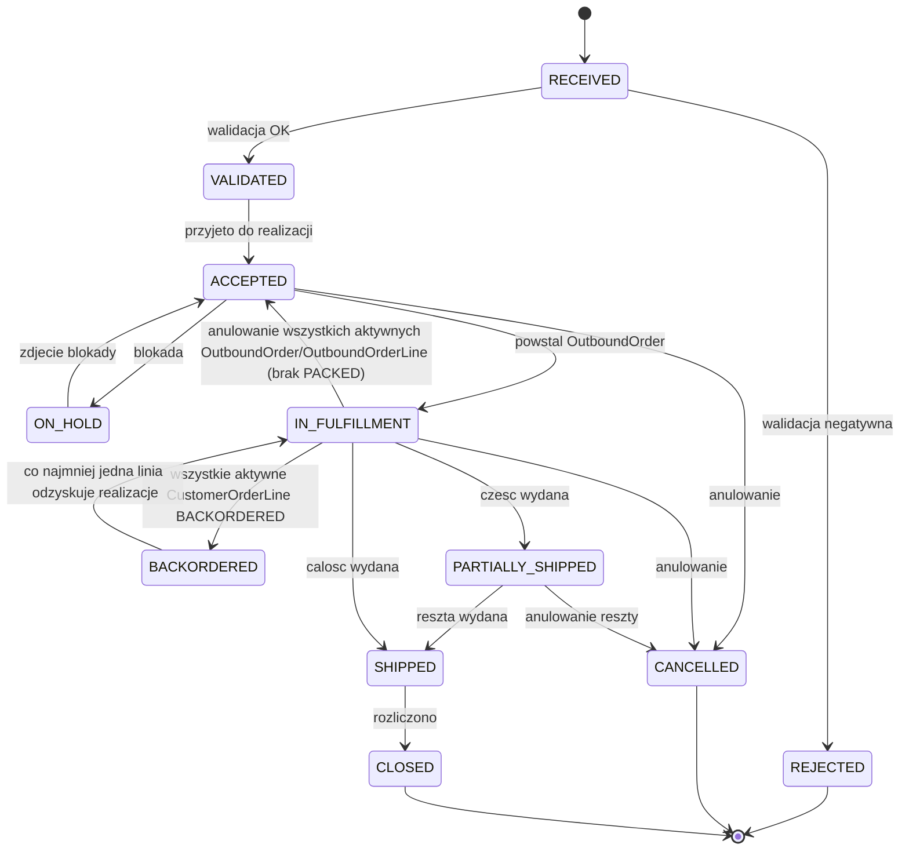

---

## 2. `CustomerOrderLine`

Pozycja `CustomerOrder`, własny cykl statusów; agregacja do nagłówka opisana w `proces_1_standard_fulfillment.md` »Funkcje ciągłe (przekrojowe)« (Funkcja ciągła F1).

**Początkowy:** `OPEN` · **Końcowe:** `FULFILLED`, `CANCELLED` · **Dojrzałość:** `BUILT`

| Z | Zdarzenie/warunek | Do | Zdarzenie domenowe | Aktor | Ref |
|---|---|---|---|---|---|
| (brak) | zamówienie wpływa z pozycjami | `OPEN` | `CustomerOrderLineOpened` | System WMS | P1, zdarzenie startowe |
| `OPEN` | przypisano do `OutboundOrderLine` (planowanie) | `PLANNED` | `CustomerOrderLinePlanned` | System WMS | P1 krok 3 |
| `PLANNED` | część wydana | `PARTIALLY_FULFILLED` | `CustomerOrderLinePartiallyFulfilled` | System WMS | P1 krok 13 |
| `PLANNED`/`PARTIALLY_FULFILLED` | całość/reszta wydana | `FULFILLED` | `CustomerOrderLineFulfilled` | System WMS | P1 krok 13 |
| `OPEN` | brak zapasu (`ATPReservation = 0`) | `BACKORDERED` | `CustomerOrderLineBackordered` | System WMS | P1 krok 1a |
| `BACKORDERED` | zapas dostępny albo `CrossDockPickTask` wygenerowany | `PLANNED` | `CustomerOrderLineFulfillmentResumed` | System WMS | P1 krok 3–4 / P2 KROK 1 |
| `PLANNED` | niedobór (`SHORT_ALLOCATED`/`SHORT_PICKED`) albo brak/`DAMAGED`/`TU` pusta w cross-dockingu | `BACKORDERED` | `CustomerOrderLineShortfallDetected` | System WMS | P1 »Wyjątki i ścieżki alternatywne« / P2 KROK 2 |
| `BACKORDERED` | anulowanie ogólne | `CANCELLED` | `CustomerOrderLineCancelled` | System WMS/Supervisor | P1 »Wyjątki i ścieżki alternatywne« „Anulowanie ogólne" |
| `PLANNED` | wycofanie linii-siostry, bez własnego niedoboru | `OPEN` | `CustomerOrderLineReverted` | System WMS | P1 »Wyjątki i ścieżki alternatywne« `SHORT_ALLOCATED`/`SHORT_PICKED`, wynik „czekamy" (linie-siostry) |
| `PARTIALLY_FULFILLED` | anulowanie reszty | `CANCELLED` | `CustomerOrderLineCancelled` | System WMS/Supervisor | P1 »Wyjątki i ścieżki alternatywne« „Anulowanie ogólne" pkt 4 |
| `OPEN`/`PLANNED` | anulowanie | `CANCELLED` | `CustomerOrderLineCancelled` | System WMS/Supervisor | P1 »Wyjątki i ścieżki alternatywne« „Anulowanie ogólne" pkt 1–3 |

**Atrybuty:**

| Atrybut | Typ | Opis |
|---|---|---|
| `Quantity` | liczba | Ilość zamówiona na tej linii. |
| `ATPReservation` | liczba | Miękka rezerwacja `ATP`, ustawiana przy `CustomerOrder ACCEPTED` (`P1 R1`, `P1 R11`, `P1 R12`). |
| `crossDockEligibleQty` | liczba (wyliczana) | Ilość kwalifikowalna do cross-dockingu; wyliczana przy generowaniu `CrossDockPickTask` (`P2 R6`). |

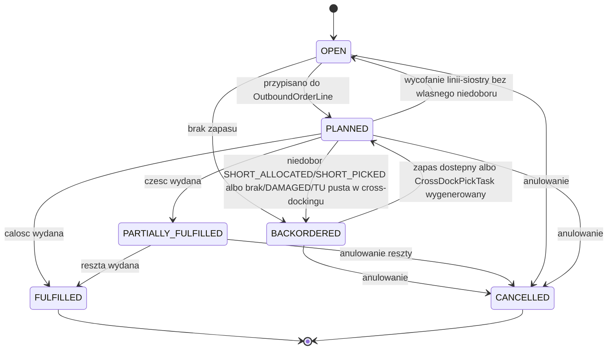

---

## 3. `OutboundOrder`

Nagłówek grupujący `OutboundOrderLine` do wspólnej alokacji/kompletacji/pakowania. `fulfillmentChannel` (`STANDARD`/`CROSSDOCK`) ustawiany przy tworzeniu, niezmienny (`P2 R5`). Źródło `priority` i `slaDeadline` zależy od kanału: dla `STANDARD` są agregatem najpilniejszej wartości spośród grupowanych `CustomerOrder` (`P1 R9`), a dla `CROSSDOCK` są dziedziczone z macierzystego `CustomerOrder`, przy ścisłych warunkach grupowania (`P2 R43`). Stan `ON_HOLD` nie istnieje na `OutboundOrder` — wstrzymanie realizacji jest modelowane wyłącznie na poziomie `CustomerOrder` (§1).

**Początkowy:** `CREATED` · **Końcowe:** `COMPLETED`, `CANCELLED` · **Dojrzałość:** `BUILT`

| Z | Zdarzenie/warunek | Do | Zdarzenie domenowe | Aktor | Ref |
|---|---|---|---|---|---|
| (brak) | grupowanie/podział `CustomerOrderLine` | `CREATED` | `OutboundOrderCreated` | System WMS | P1 krok 3 |
| `CREATED` | start alokacji | `ALLOCATION_IN_PROGRESS` | `OutboundOrderAllocationStarted` | System WMS | P1 krok 4 |
| `ALLOCATION_IN_PROGRESS`/`SHORT_ALLOCATED` | pełna rezerwacja / uzupełniono | `ALLOCATED` | `OutboundOrderAllocated` | System WMS | P1 krok 4 |
| `ALLOCATION_IN_PROGRESS` | niepełna rezerwacja | `SHORT_ALLOCATED` | `OutboundOrderShortAllocated` | System WMS | P1 krok 4 |
| `SHORT_ALLOCATED` | polityka/decyzja Supervisor: anulowanie | `CANCELLED` | `OutboundOrderCancelled` | System WMS/Supervisor | P1 »Wyjątki i ścieżki alternatywne« `SHORT_ALLOCATED`, wynik „anulowanie" |
| `ALLOCATED` | utworzono `PickTask` | `PICKING_IN_PROGRESS` | `OutboundOrderPickingStarted` | System WMS | P1 krok 5 |
| `PICKING_IN_PROGRESS` | wszystkie `PickTask` zakończone (agregat, §5) | `PICKED` | `OutboundOrderPicked` | System WMS | P1 krok 6 |
| `PICKING_IN_PROGRESS` | wszystkie `OutboundOrderLine` anulowane, żadna `PACKED` | `CANCELLED` | `OutboundOrderCancelled` | System WMS | P1 »Wyjątki i ścieżki alternatywne« `SHORT_PICKED`, wynik „czekamy"; §3 tego dokumentu |
| `PICKED` | start pakowania | `PACKING_IN_PROGRESS` | `OutboundOrderPackingStarted` | System WMS | P1 krok 8–9 |
| `CREATED` | cross-dock: pierwszy `CrossDockPickTask` `IN_PROGRESS` | `PACKING_IN_PROGRESS` | `OutboundOrderCrossDockPackingStarted` | System WMS | P2 KROK 2 (`P2 R8`) |
| `PACKING_IN_PROGRESS` | Packing `TU` gotowe (agregat) | `PACKED` | `OutboundOrderPacked` | System WMS | P1 krok 9 |
| `PACKING_IN_PROGRESS` | cross-dock: wszystkie `OutboundOrderLine` `CANCELLED` (niedobór/`DAMAGED` przy `allowPartialShipment = false` — `P2 R14`/`P2 R15`; `TU` pusta przed pobraniem — `P2 R18`), żadna `PACKED` | `CANCELLED` | `OutboundOrderCancelled` | System WMS | P2 KROK 2 (`P2 R37`) |
| `PACKED` | wszystkie linie i `TU` spakowane | `READY_FOR_DISPATCH` | `OutboundOrderReadyForDispatch` | System WMS | P1 krok 9 (`P1 R27`) |
| `READY_FOR_DISPATCH` | fizyczne przekazanie po zamknięciu manifestu | `DISPATCHED` | `OutboundOrderDispatched` | Dispatcher/Carrier | P1 krok 13 |
| `DISPATCHED` | wydanie potwierdzone — każdy `Shipment` zawierający Outbound `TU` tego `OutboundOrder` należy do `CarrierManifest` w stanie `CONFIRMED` (`P1 R70`) | `COMPLETED` | `OutboundOrderCompleted` | Dispatcher | P1 krok 13 (`P1 R70`); §10 tego dokumentu `CarrierManifest` `HANDED_OVER→CONFIRMED` |
| `CREATED`/`ALLOCATED` | anulowanie | `CANCELLED` | `OutboundOrderCancelled` | System WMS/Supervisor | P1 »Wyjątki i ścieżki alternatywne« „Anulowanie ogólne" pkt 1 |

> **Uwaga:** przejście `PICKING_IN_PROGRESS→PICKING_IN_PROGRESS` (nowy `PickTask` po `SHORT_PICKED`) to pętla w tym samym stanie, nie zmiana stanu — pominięta w tabeli (bez formalnego zdarzenia domenowego na poziomie nagłówka; zdarzenie istnieje na poziomie `PickTask`, patrz §6).

**Atrybuty:**

| Atrybut | Typ | Opis |
|---|---|---|
| `fulfillmentChannel` | enum (`STANDARD`/`CROSSDOCK`) | Ustawiany przy tworzeniu, niezmienny (`P2 R5`). |
| `priority` | wyliczane (agregat) | Najpilniejsza wartość spośród agregowanych `CustomerOrder` (`P1 R9`). |
| `slaDeadline` | wyliczane (agregat) | Jak wyżej (`P1 R9`). |

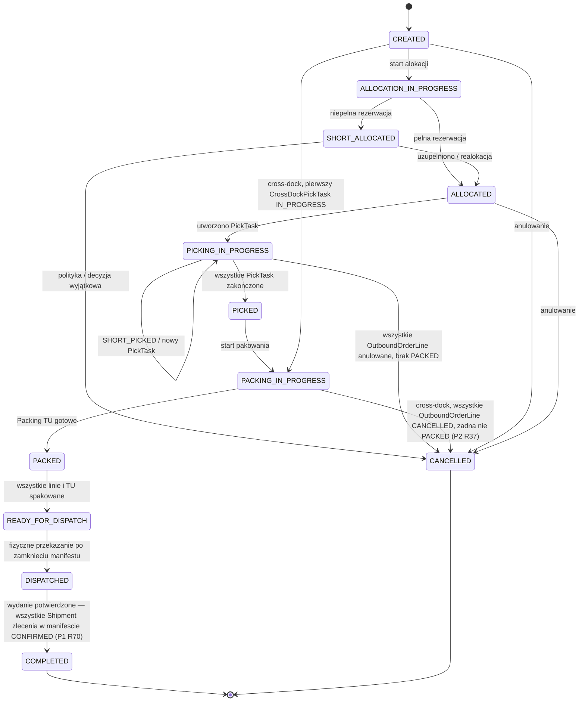

---

## 4. `OutboundOrderLine`

Odzwierciedla część `CustomerOrderLine` w realizacji; nośnik alokacji i kompletacji. `CANCELLED` osiągalny z każdego stanu nieterminalnego poza `SHIPPED` (granica = zamknięcie `CarrierManifest`, `P1 R40`, `P1 R50`).

**Początkowy:** `CREATED` · **Końcowe:** `SHIPPED`, `CANCELLED` · **Dojrzałość:** `BUILT`

| Z | Zdarzenie/warunek | Do | Zdarzenie domenowe | Aktor | Ref |
|---|---|---|---|---|---|
| (brak) | powstaje przy planowaniu `OutboundOrder` | `CREATED` | `OutboundOrderLineCreated` | System WMS | P1 krok 3 |
| `CREATED`/`SHORT_ALLOCATED` | `Allocation RESERVED` / uzupełniono | `ALLOCATED` | `OutboundOrderLineAllocated` | System WMS | P1 krok 4 |
| `CREATED` | częściowa rezerwacja | `SHORT_ALLOCATED` | `OutboundOrderLineShortAllocated` | System WMS | P1 krok 4 |
| `ALLOCATED` | `PickTask` utworzony | `PICKING` | `OutboundOrderLinePickingStarted` | System WMS | P1 krok 5 |
| `PICKING` | pobrano pełną ilość | `PICKED` | `OutboundOrderLinePicked` | Picker/System WMS | P1 krok 6 |
| `PICKING` | pobrano mniej | `SHORT_PICKED` | `OutboundOrderLineShortPicked` | Picker/System WMS | P1 krok 6 / P1 »Wyjątki i ścieżki alternatywne« |
| `PICKED` | brak/uszkodzenie wykryte przy pakowaniu (policzona ilość < `pickedQty` albo `DAMAGED`) | `SHORT_PICKED` | `OutboundOrderLineShortfallDetectedAtPacking` | System WMS/Packer | P1 krok 8 („repack by SKU") / P1 »Wyjątki i ścieżki alternatywne« |
| `SHORT_PICKED` | realokacja, nowy `PickTask` | `PICKING` | `OutboundOrderLineReallocated` | System WMS | P1 »Wyjątki i ścieżki alternatywne« `SHORT_PICKED` |
| `PICKED` | konsolidacja w Packing `TU` | `PACKED` | `OutboundOrderLinePacked` | Packer albo automatycznie System WMS, gdy `TU.directPackDeclared = true` i progi wydania spełnione (`P1 R17`) | P1 krok 9 (standard) / krok 6a/7 (`P1 R17`, ścieżka bezpośrednia) |
| `CREATED` | cross-dock: `CrossDockPickTask`→`IN_PROGRESS` | `PICKING` | `OutboundOrderLineCrossDockPickingStarted` | Packer | P2 KROK 2 |
| `PICKING` | cross-dock: rozliczenie ilościowe linii zamknięte — ilość potwierdzona przez jej jedyny `CrossDockPickTask` (`P2 R30`) zrównoważyła `OutboundOrderLine.requiredQty`; niezależnie od stanu docelowej Outbound `TU` | `PACKED` | `OutboundOrderLinePacked` | System WMS/Packer | P2 KROK 3 (`P2 R30`) |
| `PICKING` | cross-dock: brak/`DAMAGED` wykryte przy pobraniu (`P2 R11`/`P2 R12`), gdy rozstrzygnięcie prowadzi do anulowania linii przy `allowPartialShipment = false` (`P2 R14`/`P2 R15`) | `CANCELLED` | `OutboundOrderLineCrossDockShortfallCancelled` | System WMS/Packer | P2 KROK 2 |
| `PACKED` | `Shipment` wydany — wszystkie Outbound `TU` wnoszące ilość tej linii w manifestach `CONFIRMED` (`P1 R72`) | `SHIPPED` | `OutboundOrderLineShipped` | System WMS | P1 krok 13 (`P1 R72`) |
| `CREATED`/`SHORT_ALLOCATED`/`ALLOCATED` | anulowanie (przed pobraniem) | `CANCELLED` | `OutboundOrderLineCancelled` | System WMS | P3 |
| `PICKING`/`SHORT_PICKED`/`PICKED` | anulowanie (put-back, jeśli `pickedQty>0`) | `CANCELLED` | `OutboundOrderLineCancelled` | System WMS | P4 / P1 »Wyjątki i ścieżki alternatywne« „Anulowanie ogólne" pkt 1–3 |
| `PACKED` | anulowanie po zapakowaniu (zgoda Supervisor) | `CANCELLED` | `OutboundOrderLineCancelled` | System WMS/Supervisor | P1 »Wyjątki i ścieżki alternatywne« „Anulowanie ogólne" pkt 4 |

**Atrybuty:**

| Atrybut | Typ | Opis |
|---|---|---|
| `pickedQty` | liczba | Ilość faktycznie pobrana; rozstrzyga, czy anulowanie wymaga `PutBackTask` (`P3 R8`, `P4 R5`). |
| `requiredQty` | liczba | Ilość wymagana tej linii — ilość docelowa obowiązująca, nie historyczna; kardynalność 1. Ustawiana przy planowaniu `OutboundOrder` dla kanału `STANDARD` (`P1` KROK 3) albo przy generowaniu `CrossDockPickTask` dla kanału `CROSSDOCK` (`P2 R30`). |

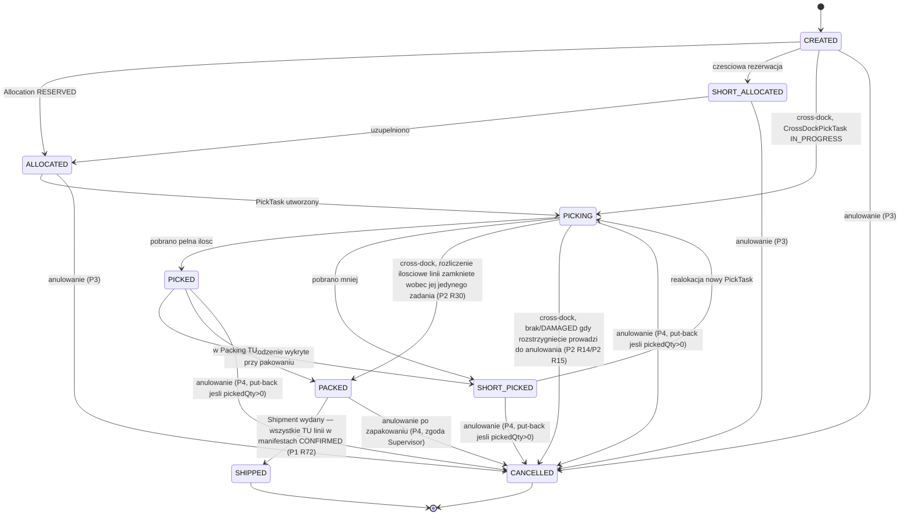

---

## 5. `Allocation`

Rezerwacja zapasu dla `OutboundOrderLine`. Ilość faktycznie zablokowana to `reservedQty`: przy pełnej rezerwacji, czyli przy wejściu w `RESERVED` i `CONFIRMED`, równa się `requiredQty` powiązanej `OutboundOrderLine`; w `SHORT` jest od niej mniejsza; w `CONFIRMED` maleje o każdą rozliczoną ilość przy częściowym wydaniu, więc może spełniać `0 < reservedQty < requiredQty` (`P1 R71`, `P1 R72`).

**Początkowy:** `PENDING` · **Końcowe:** `CONSUMED`, `RELEASED` · **Dojrzałość:** `BUILT`

| Z | Zdarzenie/warunek | Do | Zdarzenie domenowe | Aktor | Ref |
|---|---|---|---|---|---|
| (brak) | powstaje z `OutboundOrderLine` w alokacji | `PENDING` | `AllocationCreated` | System WMS | P1 krok 4 |
| `PENDING`/`SHORT` | zapas `AVAILABLE` / uzupełniono | `RESERVED` | `AllocationReserved` | System WMS | P1 krok 4 |
| `PENDING` | brak pełnej ilości | `SHORT` | `AllocationShortReserved` | System WMS | P1 krok 4 / P1 »Wyjątki i ścieżki alternatywne« `SHORT_ALLOCATED` |
| `RESERVED` | pobranie potwierdzone (`PickTask COMPLETED`/`SHORT_PICKED`, skan `TU` i ilość) | `CONFIRMED` | `AllocationConfirmed` | System WMS | P1 krok 6 |
| `CONFIRMED` | wydanie — `reservedQty` osiągnęło `0`, linia w `SHIPPED` (`P1 R72`) | `CONSUMED` | `AllocationConsumed` | System WMS | P1 krok 13 (`P1 R72`) |
| `CONFIRMED` | anulowanie zatwierdzone po pobraniu | `RELEASED` | `AllocationReleased` | System WMS | P4 KROK 2–3 |
| `RESERVED` | zwolnienie (bez pobrania) | `RELEASED` | `AllocationReleased` | System WMS/Supervisor | P3 KROK 2 |
| `SHORT` | polityka utrzymania rezerwacji (auto-zwolnienie) | `RELEASED` | `AllocationReleased` | System WMS | P1 »Wyjątki i ścieżki alternatywne« `SHORT_ALLOCATED` |

**Atrybuty:**

| Atrybut | Typ | Opis |
|---|---|---|
| `reservedQty` | liczba | Ilość zapasu faktycznie zablokowana przez tę alokację: `0` w `PENDING`, `RELEASED` i `CONSUMED`; ilość częściowa w `SHORT`; `OutboundOrderLine.requiredQty` przy wejściu w `RESERVED` i `CONFIRMED`, a w `CONFIRMED` pomniejszana o każdą wydaną ilość, aż osiągnie `0` przy przejściu do `CONSUMED` (`P1 R71`, `P1 R72`). Samo `requiredQty` nie zmienia się przy wydaniach. |

Poza tym wyłącznie referencje do `OutboundOrderLine`/`Inventory` i status. Zapas uznaje się za zajęty tylko w stanach `SHORT`, `RESERVED` i `CONFIRMED`, w wysokości `reservedQty` (`P1 R71`).

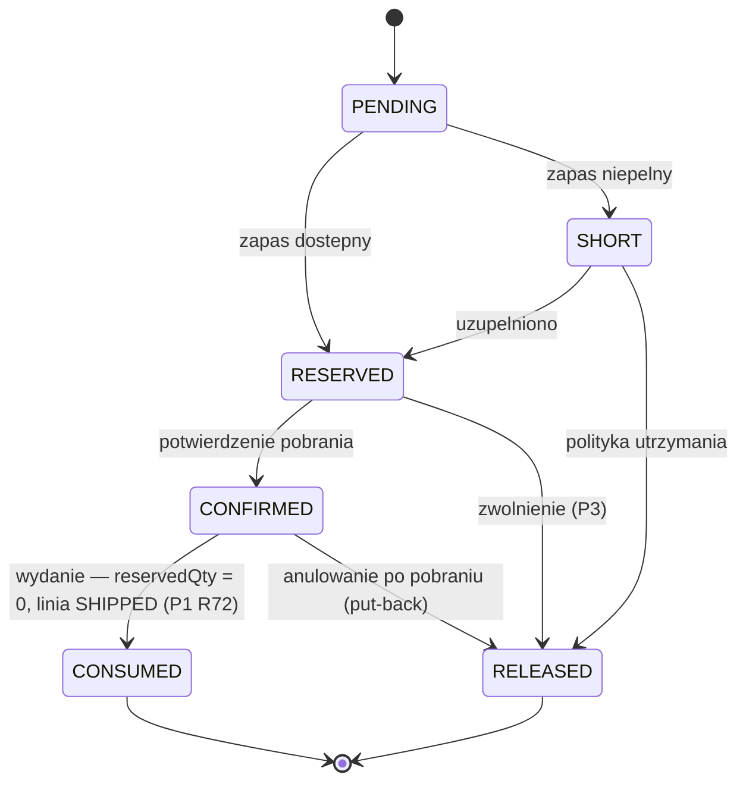

---

## 6. `PickTask`

Zadanie kompletacji. `SHORT_PICKED` kończy zadanie; realokacja tworzy nowy `PickTask` (osobny obiekt), nie wznawia starego.

**Początkowy:** `CREATED` · **Końcowe:** `COMPLETED`, `SHORT_PICKED`, `CANCELLED` · **Dojrzałość:** `BUILT`

| Z | Zdarzenie/warunek | Do | Zdarzenie domenowe | Aktor | Ref |
|---|---|---|---|---|---|
| (brak) | utworzenie zadania | `CREATED` | `PickTaskCreated` | System WMS | P1 krok 5 |
| `CREATED` | przydział operatorowi zalogowanemu do modułu zbierania, ze zgodną strefą, bez aktywnego zadania | `ASSIGNED` | `PickTaskAssigned` | System WMS | P1 krok 5, `P1 R54` |
| `ASSIGNED` | skan Picking `TU` przed odłożeniem | `IN_PROGRESS` | `PickTaskStarted` | Picker | P1 krok 6 |
| `IN_PROGRESS` | pobrano pełną ilość, niezależnie od liczby użytych Picking `TU` | `COMPLETED` | `PickTaskCompleted` | Picker/System WMS | P1 krok 6 |
| `IN_PROGRESS` | pobrano mniej niż zlecono | `SHORT_PICKED` | `PickTaskShortPicked` | Picker | P1 krok 6 / P1 »Wyjątki i ścieżki alternatywne« `SHORT_PICKED` |
| `ASSIGNED`/`IN_PROGRESS` | zwolnienie `Allocation` w toku pobrania, zanim WO potwierdził odłożenie do `TU` | `CANCELLED` | `PickTaskCancelled` | System WMS | P3, wyjątek |

**Atrybuty:**

| Atrybut | Typ | Opis |
|---|---|---|
| `priority` (dziedziczony) | liczba/enum | `PickTask` z realokacji po `SHORT_PICKED` dziedziczy priorytet zadania pierwotnego (P1 krok 5, `P1 R14`). |
| `zone` | referencja | Strefa, której dotyczy zadanie; podstawa dopasowania do strefy wskazanej przez operatora przy wejściu do modułu zbierania (`P1 R13`, `P1 R54`). |

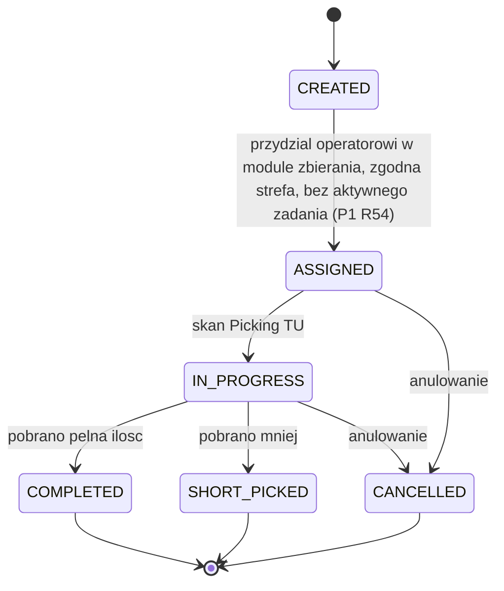

---

## 7. Outbound `TU` (role `PickContainer` i `PackUnit`)

Jeden cykl Outbound `TU`; role `PickContainer`/`PackUnit` to funkcje w procesie, nie osobne obiekty. Przy cross-dockingu (P2) powstaje w momencie pierwszego odłożenia `SKU` przy rozsortowaniu (P2 KROK 2, `P2 R7`), pomija `IN_PICKING`/`READY_TO_PACK`/`PACK_QUALIFIED`.

**Początkowy:** `CREATED` · **Końcowe:** `DISPATCHED`, `CANCELLED`, `VOIDED`, `REPACKED` · **Dojrzałość:** `BUILT`

| Z | Zdarzenie/warunek | Do | Zdarzenie domenowe | Aktor | Ref |
|---|---|---|---|---|---|
| (brak) | utworzenie: standard (pierwszy skan `PickContainer`, także jako kontynuacja trwającego `PickTask` po zamknięciu poprzedniej `TU` w `PICK_FULL` — `P1 R67`) albo cross-dock (pierwsze odłożenie `SKU` przy rozsortowaniu, także gdy poprzednia docelowa `TU` została zamknięta albo anulowana w trakcie trwania zadania — `P2 R40`) | `CREATED` | `TUCreated` | Picker/System WMS (standard) / Packer (cross-dock) | P1 krok 5–6 (standard, `P1 R67`) / P2 KROK 2 (cross-dock, `P2 R7`, `P2 R40`) |
| `CREATED` | skan przy kompletacji, rola `PickContainer` | `IN_PICKING` | `TUPickingStarted` | Picker | P1 krok 6 |
| `CREATED` | cross-dock: `TU` zapełniona fizycznie w trakcie aktywnego `CrossDockPickTask`, zamknięcie skanem RF | `PACKING_SEALED` | `TUPackingSealed` | Packer | P2 KROK 2 (`P2 R10`) |
| `CREATED` | cross-dock: `slaDeadline` osiągnięty (albo miniony) i żaden aktywny ani zaplanowany `CrossDockPickTask` nie wskazuje już tej `TU` jako celu | `PACKING_SEALED` | `TUPackingSealed` | System WMS | P2 KROK 3 (`P2 R10`) |
| `IN_PICKING` | osiągnięcie limitu masy `TUSetup.maxWeight` | `PICK_FULL` | `TUPickFull` | System WMS | P1 krok 6 |
| `IN_PICKING`/`PICK_FULL` | decyzja operatora o zamknięciu `TU`; zakończenie `PickTask` samo w sobie nie zamyka `TU` | `READY_TO_PACK` | `TUReadyToPack` | System WMS/Picker | P1 krok 6, `P1 R55` |
| `READY_TO_PACK` | spełnia progi wydania | `PACK_QUALIFIED` | `TUPackQualified` | Packer (sugestia System WMS) albo automatycznie System WMS, gdy `directPackDeclared = true` (`P1 R17`) | P1 krok 6a/7 |
| `READY_TO_PACK` | nie spełnia warunków, przepakowanie | `REPACKED` | `TURepacked` | Packer | P1 krok 7–8 |
| `PACK_QUALIFIED` | rola `PackUnit` zamknięta | `PACKING_SEALED` | `TUPackingSealed` | Packer albo automatycznie System WMS, gdy `directPackDeclared = true` (`P1 R17`) | P1 krok 6a/7 |
| `PACKING_SEALED` | wpięcie do jednego `Shipment` | `IN_SHIPMENT` | `TUAssignedToShipment` | Packer/System WMS | P1 krok 9 |
| `IN_SHIPMENT` | wydanie | `DISPATCHED` | `TUDispatched` | System WMS | P1 krok 13 |
| `CREATED` | cross-dock: put-back pełnej potwierdzonej ilości przed `PACKING_SEALED` i brak jakiejkolwiek innej potwierdzonej pozycji, przy jednoczesnym braku aktywnego lub zaplanowanego `CrossDockPickTask` wskazującego tę `TU` jako cel; nie czeka na `slaDeadline` | `CANCELLED` | `TUCancelled` | System WMS | P2 KROK 3 (`P2 R34`) |
| `PACKING_SEALED` | wycofanie z `Shipment` po zapakowaniu | `VOIDED` | `TUVoided` | Supervisor | P4 KROK 1 (`P4 R1`) |

**Atrybuty:**

| Atrybut | Typ | Opis |
|---|---|---|
| `TU_NUMBER` | tekst | Wymagany, unikalny per magazyn wśród aktywnych Outbound `TU`; zachowany przy przejściu `PickContainer→PackUnit`. `TU_NUMBER`, który nie jest `SSCC`, zawiera wyłącznie znaki alfanumeryczne bez znaków specjalnych, ma maksymalnie 20 znaków i jest kodowany w symbolice Code 128 (`P1 R53`). |
| `SSCC` | tekst (opcjonalny) | `TU_NUMBER ≠ SSCC`; w cross-dockingu 1:1 dziedziczony razem z `TU_NUMBER`, gdy `TU_NUMBER` źródłowej Inbound `TU` jest poprawnym SSCC GS1 (`P2 R7`). |
| `tuSetupCode` | referencja | Wskazuje `TUSetup`. |
| `directPackDeclared` | bool | Deklaracja Pickera przy pierwszym skanie (`CREATED→IN_PICKING`) o zbieraniu bezpośrednio do Outbound `TU`; domyślnie `false`; wiążąca i nieodwracalna dla całej `TU`, przez wszystkie jej `PickTask`. Kolejna Picking `TU` tego samego `PickTask`, utworzona po `PICK_FULL`, dziedziczy tę deklarację bez ponownego pytania operatora (`P1 R16`, `P1 R67`, P1 krok 6/6a). |

```mermaid
stateDiagram-v2
 [*] --> CREATED
 CREATED --> IN_PICKING: rola PickContainer, skan
 CREATED --> PACKING_SEALED: cross-dock, TU pelna (Packer) albo slaDeadline + brak dalszych zadan (System WMS) (P2 R10)
 IN_PICKING --> PICK_FULL: limit masy
 IN_PICKING --> READY_TO_PACK: decyzja operatora o zamknieciu TU; zakonczenie PickTask samo nie zamyka (P1 R55)
 PICK_FULL --> READY_TO_PACK: decyzja operatora o zamknieciu TU (P1 R55)
 READY_TO_PACK --> PACK_QUALIFIED: spelnia progi wydania
 READY_TO_PACK --> REPACKED: przepakowanie do innych TU
 PACK_QUALIFIED --> PACKING_SEALED: rola PackUnit zamknieta
 REPACKED --> [*]
 PACKING_SEALED --> IN_SHIPMENT: wpiete do Shipment
 IN_SHIPMENT --> DISPATCHED: wydanie
 CREATED --> CANCELLED: put-back / VOID (P2: pelny odzysk PutBackTask i brak zadan wskazujacych TU, P2 R34)
 PACKING_SEALED --> VOIDED: wycofanie z Shipment
 DISPATCHED --> [*]
 CANCELLED --> [*]
 VOIDED --> [*]
```

---

## 8. `TUSetup`

**Nie dotyczy (brak cyklu stanów).** Zamknięty słownik typów `TU` i obiekt konfiguracyjny — określa wydawalność Outbound `TU`, egzekwowany limit masy, kubaturę nośnika używaną przy doborze przewoźnika, sposób użycia w procesie i regułę numeracji.

**Atrybuty:**

| Atrybut | Typ | Opis |
|---|---|---|
| `tuSetupCode` | tekst (klucz) | Kod typu `TU`, unikalny w słowniku. |
| `externalIssuable` | bool | Czy Outbound `TU` tego typu może zostać wydana na zewnątrz. |
| `maxWeight` | liczba | Maksymalna masa `TU` tego typu. |
| `maxVolume` | liczba | Kubatura nośnika wynikająca z typu opakowania, podawana do doboru przewoźnika (`P1 R30`); nie jest egzekwowana jako limit pakowania. |
| `processUsage` | enum: `EXTERNAL` | Sposób użycia `TU` w procesie. `EXTERNAL` oznacza rolę nośnika zewnętrznego i jest jedyną zdefiniowaną wartością enuma w tej wersji; enum pozostaje otwarty, a pozostałe wartości nie są ustalane. System WMS rozpoznaje pochodzenie zewnętrzne `TU` wyłącznie po `processUsage` typu wskazanego przez jej `tuSetupCode`, nigdy po `TU_NUMBER`. |
| `outbound_tu_number_standard` | enum: `GS1`/`OWN` | Standard numeracji `TU_NUMBER` dla `TU` tworzonych wewnętrznie. |
| `numberFormatMask` | tekst | Maska numeracji (np. `PAL[00000000000]`). |
| `sequenceCode` | referencja | Kod `Sequence` używanej do generowania `TU_NUMBER`. |
| `minIssueWeight` | liczba | Dolny próg masy, od którego `TU` tego typu spełnia progi wydania bez przepakowania (`P1 R64`). |
| `minIssueVolume` | liczba | Dolny, bezwzględny próg objętości zawartości, od którego `TU` tego typu spełnia progi wydania bez przepakowania (`P1 R64`). |

Rozpoznanie pochodzenia nie korzysta z `TU_NUMBER`, ponieważ `P2 R7` dopuszcza zarówno dziedziczenie `TU_NUMBER`/`SSCC` ze źródła, jak i nadanie nowego numeru z `Sequence`.

**Zastosowalność atrybutów dla typu zewnętrznego:**

| Atrybut | Typ zewnętrzny |
|---|---|
| `tuSetupCode` | wymagany |
| `externalIssuable` | wymagany, `true` |
| `processUsage` | wymagany, wartość `EXTERNAL` |
| `maxWeight` | nie dotyczy — atrybut bez wartości |
| `maxVolume` | nie dotyczy — atrybut bez wartości |
| `minIssueWeight` | nie dotyczy — atrybut bez wartości |
| `minIssueVolume` | nie dotyczy — atrybut bez wartości |
| `outbound_tu_number_standard` | nie dotyczy — atrybut bez wartości |
| `numberFormatMask` | nie dotyczy — atrybut bez wartości |
| `sequenceCode` | nie dotyczy — atrybut bez wartości |

„Nie dotyczy” oznacza brak wartości — nigdy `0`, nigdy wartość graniczna i nigdy wartość zastępcza. Dla typu zewnętrznego żadna reguła nie odczytuje `maxWeight`, `maxVolume`, `minIssueWeight` ani `minIssueVolume`, ponieważ pierwsza gałąź `P1 R64` rozstrzyga wcześniej. Brak `maxVolume` uniemożliwia `P1 R30` dopasowanie przedziału objętości, dlatego `Shipment` trafia na ręczny wybór przewoźnika zgodnie z `P1 R51`.

**Nota o numeracji:** `outbound_tu_number_standard`, `numberFormatMask` i `sequenceCode` nie mają zastosowania do roli nośnika zewnętrznego i pozostają dla niej bez wartości; katalog nie wyprowadza z tego żadnego twierdzenia o rolach innych typów. Obowiązuje wyłącznie kierunek `processUsage = EXTERNAL` ⇒ brak numeru z `Sequence`. Jeżeli konkretna ścieżka `P2 R7` wymaga `Sequence`, nie może korzystać z `TUSetup` o `processUsage = EXTERNAL`. Katalog nie rozstrzyga, jaki inny `TUSetup` zostanie wtedy użyty ani jak odbywa się wybór typu; jest to zakres follow-upu F-03.

---

## 9. `Shipment`

Grupuje Packing `TU` zgodne wg klienta/adresu/priorytetu/identycznego `slaDeadline`. `IN_TRANSIT`/`DELIVERED` — informacyjne, poza granicą WMS, nie sterują procesem i **nie mają formalnych zdarzeń domenowych** (pochodzą z systemu przewoźnika).

**Początkowy:** `CREATED` · **Końcowe:** `HANDED_TO_CARRIER`, `CANCELLED` · **Dojrzałość:** `BUILT`

| Z | Zdarzenie/warunek | Do | Zdarzenie domenowe | Aktor | Ref |
|---|---|---|---|---|---|
| (brak) | powstaje po przygotowaniu pierwszej Packing `TU` | `CREATED` | `ShipmentCreated` | Packer/System WMS | P1 krok 9 |
| `CREATED` | zamknięcie grupowania `TU` (`P1 R28`) | `READY_FOR_DISPATCH` | `ShipmentReadyForDispatch` | System WMS | P1 krok 9 |
| `READY_FOR_DISPATCH` | wybór przewoźnika (reguły dają wynik) | `CARRIER_SELECTED` | `ShipmentCarrierSelected` | System WMS | P1 krok 10 |
| `READY_FOR_DISPATCH` | transport własny, wskazany wcześniej | `OWN_TRANSPORT` | `ShipmentOwnTransportAssigned` | Dispatcher | P1 krok 10 |
| `READY_FOR_DISPATCH` | brak wyniku reguł | `CARRIER_PENDING` | `ShipmentCarrierPending` | System WMS | P1 krok 10 |
| `CARRIER_PENDING` | ręczny wybór przewoźnika | `CARRIER_SELECTED` | `ShipmentCarrierSelected` | Warehouse Supervisor | P1 krok 10 |
| `CARRIER_SELECTED` | etykieta (wydruk WMS, bez zewnętrznego API) | `LABEL_GENERATED` | `ShipmentLabelGenerated` | System WMS | P1 krok 11 |
| `LABEL_GENERATED`/`OWN_TRANSPORT` | zgłoszenie gotowości wydania do ERP | `POSTING_PENDING` | `ShipmentPostingRequested` | System WMS | P1 krok 11a |
| `POSTING_PENDING` | potwierdzenie ERP (`POST`) | `POSTED` | `ShipmentPosted` | System WMS/ERP | P1 krok 11a |
| `POSTING_PENDING` | jawne odrzucenie ERP | `POSTING_ERROR` | `ShipmentPostingRejected` | System WMS/ERP | P1 krok 11a |
| `POSTED` | dodanie do manifestu (jeden `Shipment` → jeden manifest) | `IN_MANIFEST` | `ShipmentAddedToManifest` | Dispatcher | P1 krok 12 |
| `POSTING_ERROR` | ponowna próba (decyzja Supervisor) | `POSTING_PENDING` | `ShipmentPostingRetried` | System WMS/Supervisor | P1 krok 11a (`P1 R37`) |
| `POSTING_ERROR` | rezygnacja Supervisor | `CANCELLED` | `ShipmentCancelled` | System WMS/Supervisor | P1 krok 11a |
| `IN_MANIFEST` | fizyczne przekazanie po zamknięciu manifestu | `HANDED_TO_CARRIER` | `ShipmentHandedToCarrier` | Dispatcher/Carrier | P1 krok 13 / §10 tego dokumentu `CLOSED→HANDED_OVER` |
| `CREATED`/`READY_FOR_DISPATCH`/`CARRIER_SELECTED`/`OWN_TRANSPORT`/`CARRIER_PENDING`/`LABEL_GENERATED` | anulowanie (przed `POSTING_PENDING`) | `CANCELLED` | `ShipmentCancelled` | System WMS/Supervisor | P1 »Wyjątki i ścieżki alternatywne« „Anulowanie ogólne" pkt 4 |

**Atrybuty:**

| Atrybut | Typ | Opis |
|---|---|---|
| `selectedCarrier` | referencja (`Carrier`) | Ustawiany przy `CARRIER_SELECTED`, automatycznie albo ręcznie przez Supervisor. |

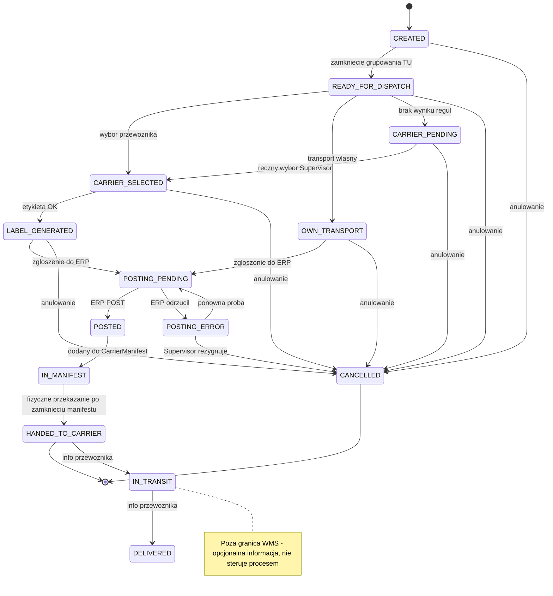

---

## 10. `CarrierManifest`

W v1 jeden obiekt (rozdział `CarrierManifest`/`Load` odrzucony). Zamknięcie nieodwracalne — granica anulowania.

**Początkowy:** `OPEN` · **Końcowe:** `CONFIRMED` · **Dojrzałość:** `BUILT`

| Z | Zdarzenie/warunek | Do | Zdarzenie domenowe | Aktor | Ref |
|---|---|---|---|---|---|
| (brak) | otwarcie manifestu | `OPEN` | `CarrierManifestOpened` | Dispatcher | P1 krok 12 |
| `OPEN` | zamknięcie, gotowość do przekazania | `CLOSED` | `CarrierManifestClosed` | Dispatcher | P1 krok 12 |
| `CLOSED` | przekazanie (odbiór przewoźnika/kurs własny) | `HANDED_OVER` | `CarrierManifestHandedOver` | Dispatcher/Carrier | P1 krok 13 |
| `HANDED_OVER` | potwierdzenie wydania z magazynu | `CONFIRMED` | `CarrierManifestConfirmed` | Dispatcher | P1 krok 13 |

**Atrybuty:** brak dodatkowych nazwanych atrybutów poza statusem i referencjami do `Shipment`.

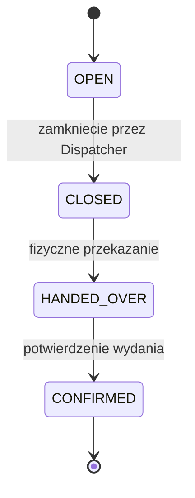

---

## 11. `Inventory` (zakres Outbound)

Tylko przejścia istotne dla Outbound. Wyłącznie zapas z flagą `ATP` może być rezerwowany/alokowany. Statusy tej sekcji należą do kanonu Outbound i nie są walidowane względem `model_stanow.md` (Inbound).

**Początkowy:** `AVAILABLE` · **Końcowe:** `SHIPPED` · **Dojrzałość:** `BUILT`

| Z | Zdarzenie/warunek | Do | Zdarzenie domenowe | Aktor | Ref |
|---|---|---|---|---|---|
| (brak) | zapas przyjęty (Inbound `POSTED`/GR) | `AVAILABLE` | `InventoryMadeAvailable` | — | poza zakresem Outbound (Inbound `model_stanow.md`) |
| `AVAILABLE` | `Allocation RESERVED`, flaga `ATP` | `RESERVED` | `InventoryReserved` | System WMS | P1 krok 4 |
| `RESERVED` | zwolnienie bez pobrania | `AVAILABLE` | `InventoryReleased` | System WMS | P3 KROK 2 |
| `RESERVED` | pobranie do Picking `TU` | `PICKED` | `InventoryPicked` | Picker | P1 krok 6 |
| `PICKED` | fizyczny put-back | `AVAILABLE` | `InventoryPutBack` | Operator | P4 KROK 5 |
| `PICKED` | wydanie (zamknięty manifest) | `SHIPPED` | `InventoryShipped` | System WMS | P1 krok 13 |

**Atrybuty:**

| Atrybut | Typ | Opis |
|---|---|---|
| flaga `ATP`/`non-ATP` | enum | Wyłącznie `ATP` może być rezerwowany/alokowany; `non-ATP` = zapas przed Inbound `POSTED` i zapas w strefie jakości (`P1 R52`). |

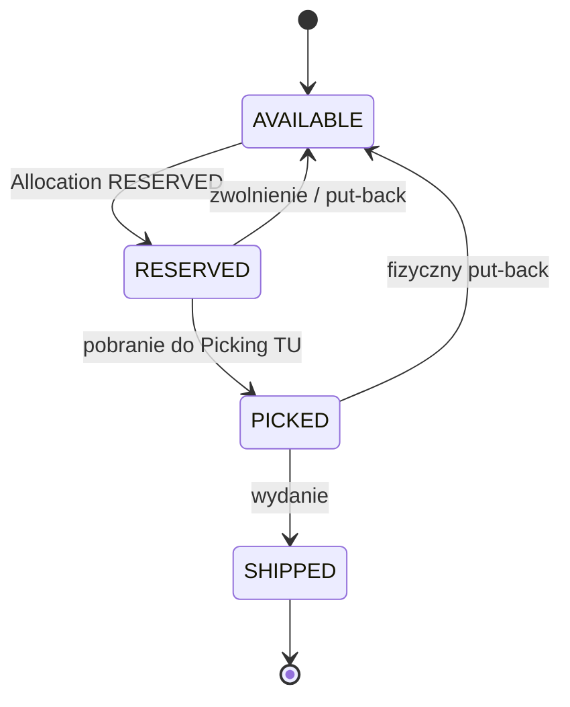

---

## 12. `PutBackTask`

Modeluje fizyczne odłożenie towaru po anulowaniu rezerwacji już pobranej. Pętla `LOCATION_VALIDATION↔IN_PROGRESS` świadomie bez limitu prób i bez automatycznej eskalacji.

**Początkowy:** `CREATED` · **Końcowe:** `COMPLETED` · **Dojrzałość:** `BUILT`

| Z | Zdarzenie/warunek | Do | Zdarzenie domenowe | Aktor | Ref |
|---|---|---|---|---|---|
| (brak) | utworzenie zadania po anulowaniu rezerwacji już pobranej | `CREATED` | `PutBackTaskCreated` | System WMS | P4 KROK 3 |
| `CREATED` | przydział operatorowi zalogowanemu do modułu zwrotów, bez aktywnego zadania | `ASSIGNED` | `PutBackTaskAssigned` | System WMS | P4 KROK 3, `P4 R9` |
| `ASSIGNED` | rozpoczęto odkładanie | `IN_PROGRESS` | `PutBackTaskStarted` | Operator | P4 KROK 4 |
| `IN_PROGRESS` | wskazano lokalizację (system proponuje lub operator wskazuje) | `LOCATION_VALIDATION` | `PutBackTaskLocationSubmitted` | Operator/System WMS | P4 KROK 4 |
| `LOCATION_VALIDATION` | lokalizacja odrzucona | `IN_PROGRESS` | `PutBackTaskLocationRejected` | System WMS | P4 KROK 4 |
| `LOCATION_VALIDATION` | lokalizacja zwalidowana, odłożenie | `COMPLETED` | `PutBackTaskCompleted` | Operator | P4 KROK 5 |

**Atrybuty:** brak dodatkowych nazwanych atrybutów poza referencją do anulowanej pozycji i statusem.

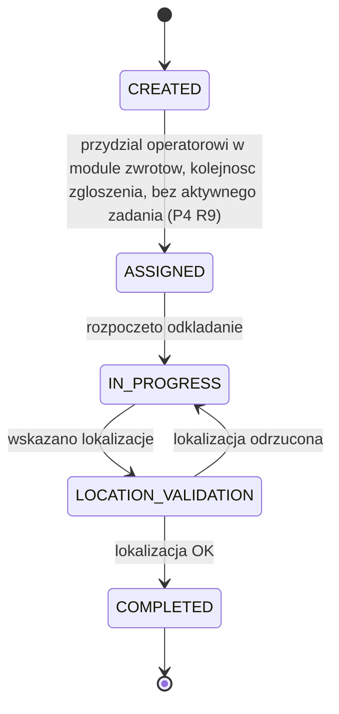

---

## 13. `CrossDockPickTask`

Modeluje pobranie i rozsortowanie `SKU` z Inbound `TU` w strefie cross-dock. Wzorowane na `PutBackTask`, bez walidacji lokalizacji.

**Początkowy:** `CREATED` · **Końcowe:** `COMPLETED`, `CANCELLED` · **Dojrzałość:** `BUILT`

| Z | Zdarzenie/warunek | Do | Zdarzenie domenowe | Aktor | Ref |
|---|---|---|---|---|---|
| (brak) | generowanie zadania z `CustomerOrderLine BACKORDERED` | `CREATED` | `CrossDockPickTaskCreated` | System WMS | P2 KROK 1 |
| `CREATED` | przydział operatorowi zalogowanemu do modułu crossdockingu, bez aktywnego zadania | `ASSIGNED` | `CrossDockPickTaskAssigned` | System WMS | P2 KROK 2, `P2 R39` |
| `ASSIGNED` | rozpoczęto pobieranie (skan pierwszego SKU) | `IN_PROGRESS` | `CrossDockPickTaskStarted` | Packer | P2 KROK 2 |
| `IN_PROGRESS` | zakończenie (Packer inicjuje) | `COMPLETED` | `CrossDockPickTaskCompleted` | Packer/System WMS | P2 KROK 3 |
| `ASSIGNED` | `TU` pusta przed pobraniem | `CANCELLED` | `CrossDockPickTaskCancelled` | System WMS | P2 KROK 2 |

**Atrybuty:**

| Atrybut | Typ | Opis |
|---|---|---|
| `sourceInboundTU` | referencja | Źródłowa Inbound `TU`. |
| `SKU` | referencja | Pozycja towarowa rozsortowywana przez to zadanie. |
| `plannedQty` | liczba | Ilość zarezerwowana ze źródłowej `TU`/SKU do potwierdzenia (`P2 R29`). |
| `confirmedQty` | liczba | Ilość faktycznie potwierdzona po rozsortowaniu. |
| `damagedQty` | liczba | Ilość `SKU` wykryta jako `DAMAGED` podczas pobrania (`P2 R13`), odłożona na `QC`; nie wchodzi do `confirmedQty`. |
| `targetOutboundOrderLine` | referencja | Docelowa `OutboundOrderLine`. |
| `grAcceptanceStatus` | enum: `GR_PENDING`/`GR_ACCEPTED`/`GR_REJECTED` | Wynik akceptacji ERP rozliczenia GR crossdockowego dla `sourceInboundTU`; ten sam wynik stosuje się do każdego powiązanego zadania w systemie, niezależnie od `Shipment` (`P2 R31`). |

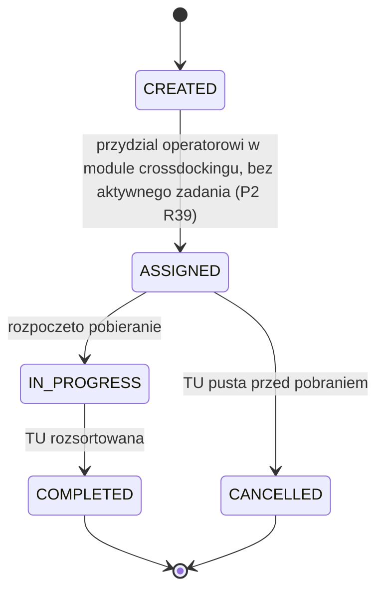

---

## 14. `Carrier`

**Nie dotyczy (brak cyklu stanów).** Obiekt master data — formalny słownik przewoźników.

**Atrybuty:**

| Atrybut | Typ | Opis |
|---|---|---|
| `priority` | liczba (unikalna w słowniku) | Ostateczny tie-break przy dopasowaniu `CarrierSetup` (`P1 R32`). |

---

## 15. `CarrierSetup`

**Nie dotyczy (brak cyklu stanów).** Obiekt konfiguracyjny łączący `Carrier`, `Region` i przedziały wagi/objętości; jeden `Carrier` może mieć wiele `CarrierSetup`.

**Atrybuty:**

| Atrybut | Typ | Opis |
|---|---|---|
| `minWeight`/`maxWeight` | liczba | Przedział wagi dopasowywany do największej bieżącej masy Packing `TU` `Shipment`, wyliczanej z zawartości (`P1 R63`, `P1 R30`). |
| `minVolume`/`maxVolume` | liczba | Przedział objętości dopasowywany do największej `TUSetup.maxVolume` spośród typów Packing `TU` `Shipment`, czyli największej kubatury nośnika (`P1 R30`, `P1 R31`). |

---

## 16. `Region`

**Nie dotyczy (brak cyklu stanów).** Obiekt konfiguracyjny reprezentujący obszar dostawy; niezależny od `Zone`. Katalog atrybutów otwarty do wyboru implementacji.

---

## 17. `Sequence`

**Nie dotyczy (brak cyklu stanów).** Uniwersalny, systemowy licznik niezależny od `TUSetup`; wiele `TUSetup` może wskazywać tę samą `Sequence`.

**Atrybuty:**

| Atrybut | Typ | Opis |
|---|---|---|
| `sequenceId` | identyfikator systemowy | Niezmienny identyfikator. |
| `sequenceCode` | tekst (unikalny) | Kod, do którego odwołuje się `TUSetup.sequenceCode`. |
| `name` | tekst | Nazwa `Sequence`. |
| `nextFreeNumber` | liczba | Kolejny wolny numer licznika. |

---

## Luki zgłoszone i zamknięte (`BACKLOG.md` B15)

Granularna rekonstrukcja „Ref" (odniesienie do kroku procesu P1–P5) dla każdego przejścia ujawniła 2026-08-18 dwa przejścia bez wyzwalacza opisanego wprost w §3 propozycja_procesow_outbound.md v1.27 — zgłoszone jako `BACKLOG.md` B15 i zamknięte tego samego dnia decyzją Darka:

1. **`CustomerOrder SHIPPED→CLOSED`** — rozstrzygnięte `DEC-L33`: wyliczane automatycznie, gdy wszystkie kontrybuujące `OutboundOrder` osiągną `COMPLETED` (nowy krok P1 13a, `R85`). Patrz §1, wiersz `SHIPPED→CLOSED`.
2. **`OutboundOrder PICKING_IN_PROGRESS↔ON_HOLD`** — rozstrzygnięte `DEC-L34`: stan `ON_HOLD` usunięty z `OutboundOrder` jako nieużywany artefakt bez pokrycia biznesowego (weryfikacja wsteczna §3/§5/§7/§9/B1–B14 nie znalazła wyzwalacza). Patrz §3.

---

## Słownik statusów — zestawienie zbiorcze

> Kanon EN. Dojrzałość: wszystkie statusy = `BUILT`. Enumy per-obiekt. Źródło prawdy nazw statusów = ten plik (dla obiektów z cyklem stanów), w zgodzie z plikami `proces_1_standard_fulfillment.md`–`proces_4_physical_putback.md`.

### `CustomerOrder`
| EN (kanon) | Znaczenie | Typ | Dojrzałość |
|---|---|---|---|
| `RECEIVED` | Wpłynęło z systemu zewnętrznego | początkowy | BUILT |
| `VALIDATED` | Walidacja pozytywna | pośredni | BUILT |
| `REJECTED` | Walidacja negatywna | końcowy | BUILT |
| `ACCEPTED` | Przyjęto do realizacji, brak blokady | pośredni | BUILT |
| `ON_HOLD` | Blokada, pomijane w planowaniu | pośredni | BUILT |
| `IN_FULFILLMENT` | Powstał `OutboundOrder`, realizacja w toku | pośredni | BUILT |
| `BACKORDERED` | Wszystkie aktywne pozycje bez zapasu | pośredni | BUILT |
| `PARTIALLY_SHIPPED` | Co najmniej jedna pozycja wydana | pośredni | BUILT |
| `SHIPPED` | Całość wydana | pośredni | BUILT |
| `CLOSED` | Rozliczono | końcowy | BUILT |
| `CANCELLED` | Anulowane | końcowy | BUILT |

### `CustomerOrderLine`
| EN (kanon) | Znaczenie | Typ | Dojrzałość |
|---|---|---|---|
| `OPEN` | Bez przypisania do `OutboundOrderLine` | początkowy | BUILT |
| `PLANNED` | Przypisana do `OutboundOrderLine` | pośredni | BUILT |
| `PARTIALLY_FULFILLED` | Część wydana | pośredni | BUILT |
| `FULFILLED` | Całość wydana | końcowy | BUILT |
| `BACKORDERED` | Brak zapasu/niedobór | pośredni | BUILT |
| `CANCELLED` | Anulowana | końcowy | BUILT |

### `OutboundOrder`
| EN (kanon) | Znaczenie | Typ | Dojrzałość |
|---|---|---|---|
| `CREATED` | Powstał przez grupowanie/podział `CustomerOrderLine` | początkowy | BUILT |
| `ALLOCATION_IN_PROGRESS` | Alokacja w toku | pośredni | BUILT |
| `ALLOCATED` | Pełna rezerwacja | pośredni | BUILT |
| `SHORT_ALLOCATED` | Niepełna rezerwacja | pośredni | BUILT |
| `PICKING_IN_PROGRESS` | Kompletacja w toku | pośredni | BUILT |
| `PICKED` | Wszystkie `PickTask` zakończone | pośredni | BUILT |
| `PACKING_IN_PROGRESS` | Pakowanie w toku | pośredni | BUILT |
| `PACKED` | Packing `TU` gotowe (pełny agregat) | pośredni | BUILT |
| `READY_FOR_DISPATCH` | Gotowy do wydania | pośredni | BUILT |
| `DISPATCHED` | Fizycznie przekazany | pośredni | BUILT |
| `COMPLETED` | Wydanie potwierdzone | końcowy | BUILT |
| `CANCELLED` | Anulowany | końcowy | BUILT |

### `OutboundOrderLine`
| EN (kanon) | Znaczenie | Typ | Dojrzałość |
|---|---|---|---|
| `CREATED` | Powstała przy planowaniu | początkowy | BUILT |
| `ALLOCATED` | `Allocation RESERVED` | pośredni | BUILT |
| `SHORT_ALLOCATED` | Częściowa rezerwacja | pośredni | BUILT |
| `PICKING` | `PickTask` utworzony / rozsortowanie cross-dock w toku | pośredni | BUILT |
| `PICKED` | Pobrano pełną ilość | pośredni | BUILT |
| `SHORT_PICKED` | Pobrano mniej / brak wykryty przy pakowaniu | pośredni | BUILT |
| `PACKED` | W Packing `TU` | pośredni | BUILT |
| `SHIPPED` | `Shipment` wydany | końcowy | BUILT |
| `CANCELLED` | Anulowana | końcowy | BUILT |

### `Allocation`
| EN (kanon) | Znaczenie | Typ | Dojrzałość |
|---|---|---|---|
| `PENDING` | Oczekuje na wynik rezerwacji | początkowy | BUILT |
| `RESERVED` | Zapas zarezerwowany | pośredni | BUILT |
| `SHORT` | Rezerwacja niepełna | pośredni | BUILT |
| `CONFIRMED` | Pobranie potwierdzone | pośredni | BUILT |
| `CONSUMED` | Wydane | końcowy | BUILT |
| `RELEASED` | Zwolnione | końcowy | BUILT |

### `PickTask`
| EN (kanon) | Znaczenie | Typ | Dojrzałość |
|---|---|---|---|
| `CREATED` | Utworzone | początkowy | BUILT |
| `ASSIGNED` | Przypisany operator | pośredni | BUILT |
| `IN_PROGRESS` | Skan Picking `TU` wykonany | pośredni | BUILT |
| `COMPLETED` | Pełna ilość pobrana | końcowy | BUILT |
| `SHORT_PICKED` | Pobrano mniej | końcowy | BUILT |
| `CANCELLED` | Anulowane | końcowy | BUILT |

### Outbound `TU`
| EN (kanon) | Znaczenie | Typ | Dojrzałość |
|---|---|---|---|
| `CREATED` | Utworzona (standard lub cross-dock) | początkowy | BUILT |
| `IN_PICKING` | Rola `PickContainer`, kompletacja w toku | pośredni | BUILT |
| `PICK_FULL` | Limit masy osiągnięty | pośredni | BUILT |
| `READY_TO_PACK` | Kompletacja zakończona | pośredni | BUILT |
| `PACK_QUALIFIED` | Spełnia progi wydania | pośredni | BUILT |
| `REPACKED` | Przepakowana do innych `TU` | końcowy | BUILT |
| `PACKING_SEALED` | Rola `PackUnit` zamknięta | pośredni | BUILT |
| `IN_SHIPMENT` | Wpięta do `Shipment` | pośredni | BUILT |
| `DISPATCHED` | Wydana | końcowy | BUILT |
| `CANCELLED` | Odzyskana w pełni przed zapakowaniem (cross-dock) | końcowy | BUILT |
| `VOIDED` | Wycofana z `Shipment` po zapakowaniu | końcowy | BUILT |

### `Shipment`
| EN (kanon) | Znaczenie | Typ | Dojrzałość |
|---|---|---|---|
| `CREATED` | Powstał po pierwszej Packing `TU` | początkowy | BUILT |
| `READY_FOR_DISPATCH` | Grupowanie `TU` zamknięte | pośredni | BUILT |
| `CARRIER_SELECTED` | Przewoźnik wybrany | pośredni | BUILT |
| `OWN_TRANSPORT` | Transport własny | pośredni | BUILT |
| `CARRIER_PENDING` | Brak wyniku reguł doboru przewoźnika | pośredni | BUILT |
| `LABEL_GENERATED` | Etykieta wydrukowana | pośredni | BUILT |
| `POSTING_PENDING` | Zgłoszono do ERP, oczekuje odpowiedzi | pośredni | BUILT |
| `POSTED` | ERP potwierdził | pośredni | BUILT |
| `POSTING_ERROR` | ERP odrzucił | pośredni | BUILT |
| `IN_MANIFEST` | Dodany do `CarrierManifest` | pośredni | BUILT |
| `HANDED_TO_CARRIER` | Fizycznie przekazany | końcowy | BUILT |
| `CANCELLED` | Anulowany | końcowy | BUILT |
| `IN_TRANSIT`/`DELIVERED` | Informacyjne, poza granicą WMS | informacyjny (brak zdarzenia domenowego) | — |

### `CarrierManifest`
| EN (kanon) | Znaczenie | Typ | Dojrzałość |
|---|---|---|---|
| `OPEN` | Otwarty | początkowy | BUILT |
| `CLOSED` | Zamknięty (nieodwracalnie) | pośredni | BUILT |
| `HANDED_OVER` | Fizycznie przekazany | pośredni | BUILT |
| `CONFIRMED` | Wydanie potwierdzone | końcowy | BUILT |

### `Inventory` (Outbound)
| EN (kanon) | Znaczenie | Typ | Dojrzałość |
|---|---|---|---|
| `AVAILABLE` | Dostępny (`ATP`) | początkowy | BUILT |
| `RESERVED` | Zarezerwowany | pośredni | BUILT |
| `PICKED` | Pobrany fizycznie | pośredni | BUILT |
| `SHIPPED` | Wydany | końcowy | BUILT |

### `PutBackTask`
| EN (kanon) | Znaczenie | Typ | Dojrzałość |
|---|---|---|---|
| `CREATED` | Utworzone | początkowy | BUILT |
| `ASSIGNED` | Przypisany operator | pośredni | BUILT |
| `IN_PROGRESS` | Odkładanie rozpoczęte | pośredni | BUILT |
| `LOCATION_VALIDATION` | Lokalizacja w walidacji | pośredni | BUILT |
| `COMPLETED` | Odłożone | końcowy | BUILT |

### `CrossDockPickTask`
| EN (kanon) | Znaczenie | Typ | Dojrzałość |
|---|---|---|---|
| `CREATED` | Wygenerowane | początkowy | BUILT |
| `ASSIGNED` | Przypisany operator | pośredni | BUILT |
| `IN_PROGRESS` | Pobieranie rozpoczęte | pośredni | BUILT |
| `COMPLETED` | `TU` rozsortowana | końcowy | BUILT |
| `CANCELLED` | `TU` pusta przed pobraniem | końcowy | BUILT |

---

## Historia zmian

- **2026-08-28 (v1.19):** opis atrybutu `TU.directPackDeclared` uzupełniony o dziedziczenie deklaracji przez kolejną Picking `TU` tego samego `PickTask` (`P1 R16`, `P1 R67`). Bez zmian w tabelach przejść i diagramach. Źródło zaktualizowane do `proces_1_standard_fulfillment.md` v1.20.
- **2026-08-28 (v1.18):** ujednolicono semantykę `reservedQty` z `P1 R72`: opis obiektu i wiersz atrybutu w §5 mówiły, że w `RESERVED` i `CONFIRMED` `reservedQty` równa się `requiredQty` przez cały czas trwania stanu, co jest nieprawdziwe po częściowym wydaniu. Równość obowiązuje przy wejściu w stan; w `CONFIRMED` wartość maleje o każdą rozliczoną ilość i osiąga `0` dopiero przy przejściu do `CONSUMED`. Bez zmian w tabeli przejść, diagramach i `P1 R71`/`P1 R72`.
- **2026-08-28 (v1.17):** guardy `OutboundOrderLine PACKED→SHIPPED` (§4) i `Allocation CONFIRMED→CONSUMED` (§5) uzupełnione o warunek pełnego wydania wszystkich Outbound `TU` wnoszących ilość linii (`P1 R72`); etykiety krawędzi zaktualizowane. Rozliczenie `Inventory` pozostaje ilościowe, przy każdym manifeście. Źródło zaktualizowane do `proces_1_standard_fulfillment.md` v1.19.
- **2026-08-28 (v1.16):** `Allocation` otrzymała atrybut `reservedQty` oraz jawny wkład każdego z sześciu stanów do ilości zajętej; usunięto zdanie o tożsamości ilości rezerwacji z `requiredQty`, nieprawdziwe dla `SHORT`. Zamknięcie `BACKLOG.md` B20 w części dotyczącej `Allocation` (`P1 R71`). Źródło zaktualizowane do `proces_1_standard_fulfillment.md` v1.18.
- **2026-08-28 (v1.15):** wiersz `OutboundOrder DISPATCHED→COMPLETED` otrzymał guard `P1 R70` — zakończenie zlecenia wymaga potwierdzenia wszystkich jego `Shipment`, nie pojedynczego manifestu. Etykieta krawędzi w diagramie zaktualizowana. Przywrócenie invariantu zgubionego przy migracji B16 (archiwalne `SP4`). Źródło zaktualizowane do `proces_1_standard_fulfillment.md` v1.16.
- **2026-08-27 (v1.14):** `OutboundOrderLine` otrzymała atrybut `requiredQty` — obowiązującą ilość docelową o kardynalności 1, ustawianą przy tworzeniu linii w kanale `STANDARD` albo `CROSSDOCK`. Przepięto na niego warunek `PICKING → PACKED` dla cross-dockingu oraz opis ilości rezerwacji `Allocation`; `Allocation` nie otrzymała własnego atrybutu ilości.
- **2026-08-27 (v1.13):** w §8 zdefiniowano jedyną bieżącą wartość otwartego enuma `TUSetup.processUsage` — `EXTERNAL` — oraz pełną tabelę zastosowalności dziesięciu atrybutów dla typu zewnętrznego. Zapisano rozpoznanie wyłącznie przez typ wskazany w `TU.tuSetupCode`, pierwszeństwo `P1 R64`, skutek braku `maxVolume` dla `P1 R30`/`P1 R51` i jednokierunkową zasadę numeracji. Archiwalny człon **R28** dotyczący masy oraz wymiarów deklarowanych w ASN został świadomie zastąpiony; `DEC-Q4` go nie przywraca.
- **2026-08-27 (v1.12):** opis `OutboundOrder` w §3 uzupełniono o źródło `priority` i `slaDeadline` dla obu kanałów: agregat najpilniejszej wartości dla `STANDARD` (`P1 R9`) oraz dziedziczenie z macierzystego `CustomerOrder` dla `CROSSDOCK` (`P2 R43`). Bez zmian tabeli przejść i maszyny stanów.
- **2026-08-27 (v1.11):** odtworzono kontynuację tego samego `PickTask` do kolejnej Picking `TU` po osiągnięciu `PICK_FULL` (`P1 R67`). W §6 zakończenie zadania zależy od pobrania pełnej ilości niezależnie od liczby użytych `TU`; w §7 tworzenie `TU` obejmuje kontynuację trwającego zadania po zamknięciu poprzedniej jednostki. Opis `directPackDeclared` pozostaje bez zmian.
- **2026-08-27 (v1.10):** wyzwalacz `PICK_FULL` w tabeli przejść, diagramie §7 i Słowniku statusów ograniczono do egzekwowanego limitu masy; przejście do `READY_TO_PACK` pozostawiono wyłącznie decyzji operatora zgodnie z `P1 R55`. W katalogach `TUSetup` i `CarrierSetup` rozdzielono egzekwowany górny limit masy od nieegzekwowanej kubatury nośnika używanej przy doborze przewoźnika. Bez dodawania, usuwania ani przenumerowania stanów.
- **2026-08-27 (v1.9):** atrybut udziałowy `TUSetup.minIssueVolumeUtilization` zastąpiono bezwzględnym progiem objętości zawartości `TUSetup.minIssueVolume`; typ zmieniono z „liczba (udział)” na „liczba”. Wyzwalacz `READY_TO_PACK → PACK_QUALIFIED` oraz opis stanu `PACK_QUALIFIED` pozostają „spełnia progi wydania” — nadal poprawnie odwołują się do pełnego warunku `P1 R64`. Nagłówek „Źródło” zaktualizowano do `proces_1_standard_fulfillment.md` v1.10.
- **2026-08-24 (v1.8):** `TUSetup` otrzymał dwa dolne progi wydawalności — `minIssueWeight` i `minIssueVolumeUtilization` — dotąd nieobecne w modelu mimo że proces odwoływał się do progów wydania. Ujednolicono nazewnictwo z „warunków wydania" na „progi wydania" w tabeli przejść `OutboundOrderLine`, diagramie Outbound `TU` i słowniku statusów. Istniejące `maxWeight`/`maxVolume` pozostają górnymi limitami i nie zmieniają znaczenia.
- **2026-08-24 (v1.7):** opis atrybutu przedziału wagi `CarrierSetup` wskazywał dotąd `maxWeight` Packing `TU`, czyli udźwig typu opakowania; przepięty na bieżącą masę wyliczaną z zawartości, zgodnie z decyzją właściciela z 2026-08-24 i nową regułą `P1 R63`. Przedział objętości bez zmian — nadal odnosi się do objętości typu opakowania.
- **Bez zmiany wersji (2026-08-24):** aktualizacja nagłówka „Źródło" — `proces_2_outbound_crossdock.md` v1.7 → v1.9. Bez zmian merytorycznych.
- **2026-08-23 (v1.6):** synchronizacja diagramów `mermaid` z tabelami przejść — sześć krawędzi opisywało stan sprzed ostatnich zmian reguł, mimo że odpowiadające im wiersze tabel były już poprawne. `OutboundOrderLine PICKING→PACKED` w §4: „rozsortowanie potwierdzone" → rozliczenie ilościowe wobec jedynego zadania linii (`P2 R30`); wiersz tabeli poprawiono w v1.5, krawędź została pominięta. `TU IN_PICKING→READY_TO_PACK` i `PICK_FULL→READY_TO_PACK` w §7: „kompletacja zakonczona"/„zamkniecie kompletacji" → decyzja operatora o zamknięciu `TU`, z jawnym zaznaczeniem, że zakończenie `PickTask` samo w sobie jej nie zamyka (`P1 R55`) — dotychczasowe brzmienie mówiło wprost to, czemu `P1 R55` przeczy. `CREATED→ASSIGNED` w §6 `PickTask`, §12 `PutBackTask` i §13 `CrossDockPickTask`: lakoniczne „przypisano operatora" → przydział przez wejście do właściwego modułu terminala RF (`P1 R54`, `P4 R9`, `P2 R39`), zgodnie z wycofaniem konceptu puli operatorów. Bez zmian w tabelach przejść, atrybutach i stanach — wyłącznie doprowadzenie diagramów do zgodności z konwencją „diagramy i tabele opisują ten sam model zachowania".
- **Bez zmiany wersji (2026-08-23, korekta metryki):** nagłówek „Źródło" — `proces_4_physical_putback.md` v1.1 → v1.2. Plik procesowy został podniesiony do 1.2 przy wprowadzeniu `P4 R9` (podejmowanie `PutBackTask` przez moduł zwrotów RF), ale odsyłacz w tym nagłówku za nim nie nadążył. Wyłącznie korekta numeru — treść `P4 R9` jest w pełni propagowana (`FR-P4-05`, `TC-100`, wiersz `P4 R9` w macierzy pokrycia), więc żaden stan, przejście ani atrybut się nie zmienia.
- **Bez zmiany wersji (2026-08-23):** aktualizacja nagłówka „Źródło" — `proces_2_outbound_crossdock.md` v1.6 → v1.7 po uzupełnieniu składników ilości rezydualnej w `P2 R21`. Bez zmian w stanach, przejściach i atrybutach — ten dokument nie posługuje się terminem „ilość rezydualna".
- **2026-08-23 (v1.5):** domknięcie pozycji V3-CD-02 i uzupełnienie luk propagacji z poprzedniej rundy. Guard `Outbound TU CREATED→CANCELLED` w §7 (tabela i diagram) uzupełniony o warunek braku aktywnego/zaplanowanego `CrossDockPickTask` wskazującego tę `TU` jako cel, z jawnym zaznaczeniem, że anulowanie nie czeka na `slaDeadline` (zamierzona asymetria wobec `P2 R10`). Wiersz tworzenia Outbound `TU` w §7 uzupełniony o tworzenie na żądanie w trakcie trwającego zadania (`P2 R40`). Guard `OutboundOrderLine PICKING→PACKED` w §4 doprecyzowany — dotychczasowe „rozsortowanie potwierdzone" nie oddawało warunku z prozy procesu (rozliczenie ilościowe wobec jedynego `CrossDockPickTask` linii, `P2 R30`), przez co warunek `PACKED` istniał w całym korpusie wyłącznie w jednym zdaniu `proces_2`. Opis atrybutu `TU_NUMBER` uzupełniony o format (Code 128, alfanumeryczny, maks. 20 znaków) — `P1 R53` została rozszerzona wcześniej, ale ten wiersz jej nie nadążył. Nagłówek „Źródło" zaktualizowany (`proces_1` → v1.4, `proces_2` → v1.6) — był nieaktualny od dłuższego czasu. Ujednolicono zapis odniesień `P2 krok` → `P2 KROK` w całym pliku poza „Historią zmian".
- **2026-08-23** — Zasady podejmowania zadań magazynowych (`BACKLOG.md` B10): zaktualizowano wyzwalacze przejść `CREATED → ASSIGNED` dla `PickTask`, `CrossDockPickTask`, `PutBackTask` (przydział przez wejście do modułu RF, nie konfigurację); dodano atrybut `zone` do `PickTask`; doprecyzowano `directPackDeclared` (wiąże `TU`, nie `PickTask`) i wyzwalacz `TU IN_PICKING/PICK_FULL → READY_TO_PACK` (decyzja operatora albo limit, nie automatyczne zamknięcie przy `PickTask COMPLETED`). Szczegóły w `proces_1_standard_fulfillment.md` v1.4, `proces_2_outbound_crossdock.md` v1.5, `proces_4_physical_putback.md` v1.2.
- **2026-08-22 (v1.4):** partia 2/5 domknięcia audytu V3-CD. Dwa wyzwalacze `Outbound TU CREATED→PACKING_SEALED` w §7 zaktualizowane: wyzwalacz System WMS rozszerzony o warunek `slaDeadline` (osiągnięty/miniony), zgodnie z nowym `P2 R10` (`proces_2_outbound_crossdock.md` v1.3) — zapobiega przedwczesnemu zamknięciu Outbound `TU` przy towarze cross-dockowym nadchodzącym kolejnymi dostawami Inbound tego samego adresu. Diagram §7 zaktualizowany analogicznie. Naprawiono pięć martwych odsyłaczy do zarchiwizowanego katalogu globalnego reguł: `R66`/`R67` w diagramie §4 (`OutboundOrderLine`) → `P2 R11`/`P2 R12` (już poprawnie cytowane w tabeli przejść tej samej sekcji); `SP20` w §3 → `P2 R8`; `SP19` w §3 → `P2 R5`; `SP8` w §3 (`OutboundOrder PACKED→READY_FOR_DISPATCH`) → `P1 R27`; `SP8` w §9 (`Shipment CREATED→READY_FOR_DISPATCH`, inna reguła pod tym samym martwym kodem) → `P1 R28`. Nagłówek: odsyłacz źródłowy do `proces_2_outbound_crossdock.md` zaktualizowany z v1.2 na v1.3. Dodatkowo (znalezione przy weryfikacji): drugie wystąpienie `R66`/`R67` w diagramie §3 (`OutboundOrder`, nie tylko §4) → `P2 R11`/`P2 R12`; sąsiadujący wiersz tabeli §3 zaktualizowany z `P2 R18` na `P2 R37`, bo po partii 1 ogólne kryterium anulowania `OutboundOrder` (wszystkie linie `CANCELLED`, brak `PACKED`) przeniosło się do `P2 R37`. Domknięcie partii po pełnej weryfikacji odsyłaczy: wiersz tworzenia Outbound `TU` w §7 poprawiony w gałęzi cross-dockowej — aktor `Picker/System WMS` → `Packer`, Ref `P2 krok 1` → `P2 KROK 2` zgodnie z `P2 R7` (pozycja audytu V3-CD-05), analogicznie doprecyzowane zdanie wstępne §7; atrybucja reguł anulowania linii cross-dockowej w §3 i §4 poprawiona z `P2 R11`/`P2 R12` (wykrycie braku/`DAMAGED`) na `P2 R14`/`P2 R15` (anulowanie), z zaznaczeniem, że przy `allowPartialShipment = true` linia przechodzi do `PACKED`, nie do `CANCELLED`.
- **Bez zmiany wersji (2026-08-22)** — usunięto ostatni aktywny odsyłacz do zarchiwizowanego dokumentu analitycznego z wprowadzenia do „Słownika statusów"; pozostałe wystąpienia są wyłącznie w „Historii zmian" i w „Lukach zgłoszonych i zamkniętych".
- **2026-08-22 (v1.3):** domknięcie migracji źródeł prawdy po archiwizacji dokumentu analitycznego. Wszystkie odsyłacze w kolumnie „Ref" i w opisach atrybutów przepięte z globalnej numeracji reguł i sekcji dokumentu analitycznego na lokalną numerację reguł oraz kroków plików `proces_1`–`proces_4` (format `P1 R41`, `P2 R7`). Usunięto odwołania wsteczne do kodów decyzji z opisów obiektów i stanów; kody pozostają wyłącznie w „Historii zmian" i w „Lukach zgłoszonych i zamkniętych". Wiersz `Outbound TU CREATED→PACKING_SEALED` w §7 rozbity na dwa wyzwalacze — zamknięcie pełnej `TU` przez Packera w trakcie aktywnego zadania oraz zamknięcie przez System WMS, gdy żadne zadanie nie wskazuje już tej `TU` jako celu. Odsyłacze do sekcji dawnego PROCESU 5 wskazują teraz sekcje „Wyjątki i ścieżki alternatywne" w `proces_1`/`proces_2`. Nagłówek dokumentu wskazuje pliki procesowe jako źródło.
- **2026-08-18 (v1.2):** nowa ścieżka kompletacji z pominięciem Packera — decyzja Darka (`DEC-L35`, `R86`). Outbound `TU`: dodano atrybut `directPackDeclared` (bool, domyślnie `false`); wiersze przejść `READY_TO_PACK→PACK_QUALIFIED` i `PACK_QUALIFIED→PACKING_SEALED` zaktualizowane w kolumnie Aktor (Packer albo automatycznie System WMS, gdy `directPackDeclared = true`) i Ref (`P1 krok 6a/7`). `OutboundOrderLine`: wiersz `PICKED→PACKED` zaktualizowany analogicznie (Aktor, Ref z dwiema ścieżkami: standard krok 9 / bezpośrednia krok 6a/7). Bez zmian w diagramach stanów (żadnych nowych stanów/krawędzi — zmienia się wyłącznie aktor i moment wykonania istniejącej oceny „warunki wydania"). Źródło zaktualizowane do propozycja_procesow_outbound.md v1.29.
- **2026-08-18 (v1.1):** zamknięcie `BACKLOG.md` B15. `CustomerOrder`: wiersz `SHIPPED→CLOSED` uzupełniony o realny Ref (`P1 krok 13a`, `R85`) — wyzwalacz rozstrzygnięty decyzją Darka (`DEC-L33`): rozliczenie wyliczane automatycznie, gdy wszystkie kontrybuujące `OutboundOrder` osiągną `COMPLETED`. `OutboundOrder`: usunięto stan `ON_HOLD` i obie krawędzie `PICKING_IN_PROGRESS↔ON_HOLD` (diagram, tabela przejść, słownik zbiorczy) — decyzja Darka (`DEC-L34`): artefakt roboczy bez wyzwalacza opisanego w jakimkolwiek kroku procesu ani wcześniejszej decyzji. Sekcja „Luki ujawnione przez tę analizę" przemianowana na „Luki zgłoszone i zamknięte" z odniesieniami do obu decyzji. Źródło zaktualizowane do propozycja_procesow_outbound.md v1.28.
- **2026-08-18 (v1.0):** utworzenie dokumentu — realizacja `BACKLOG.md` B5 i `decyzje_outbound_wms.md` §10 pkt 1–2. Katalog stanów i przejść dla 17 obiektów §4 propozycja_procesow_outbound.md v1.27, rozszerzony o formalne zdarzenia domenowe (`PascalCase` EN) i odniesienia do kroków procesu P1–P5 (§3). Format kolumn tabel przejść i sekcja „Słownik statusów — zestawienie zbiorcze" ujednolicone ze standardem Inbound (`model_stanow.md`) na podstawie porównania obu dokumentów i decyzji właściciela (2026-08-18): zdarzenia domenowe zachowane wyłącznie dla Outbound (różnica zakresu uzasadniona `decyzje_outbound_wms.md` §10 pkt 2); struktura kolumn `Z | Zdarzenie/warunek | Do | Zdarzenie domenowe | Aktor | Ref` dopasowana do wzorca Inbound; kolumna `Dojrzałość` dodana (wszystkie statusy `BUILT`); sekcja zbiorczego słownika statusów dodana. §4 propozycja_procesow_outbound.md pozostawione bez zmian (diagramy/tabele przeniesione tu bez modyfikacji merytorycznej). Ujawniono i zgłoszono do `BACKLOG.md` dwie luki dokumentacyjne (patrz „Luki ujawnione przez tę analizę"): `CustomerOrder SHIPPED→CLOSED` i `OutboundOrder PICKING_IN_PROGRESS↔ON_HOLD` bez opisanego kroku procesu w §3.
