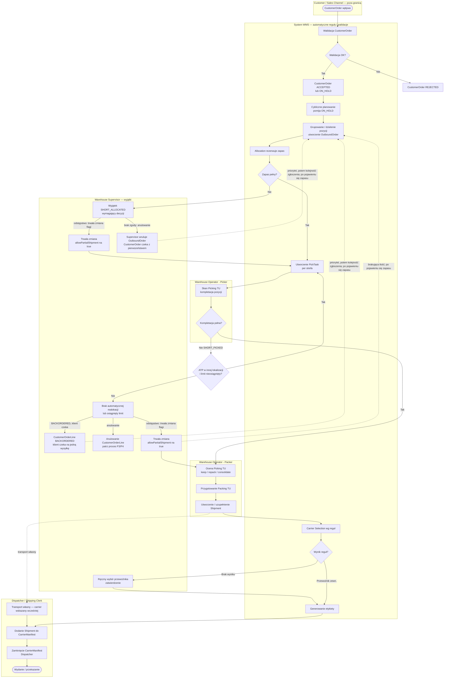
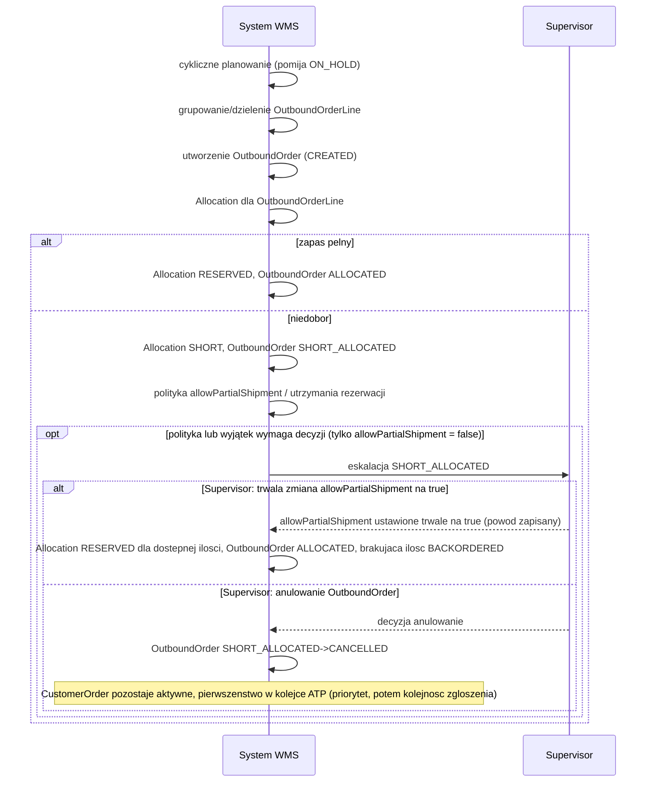
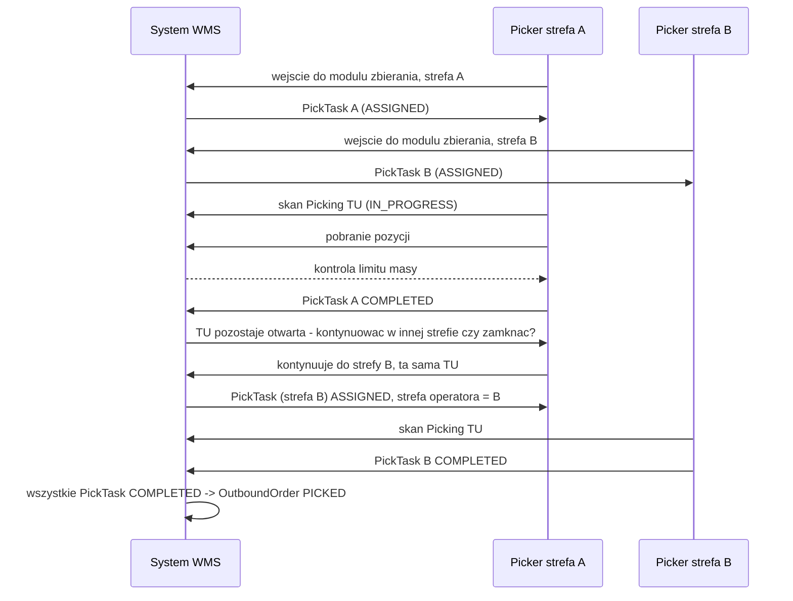
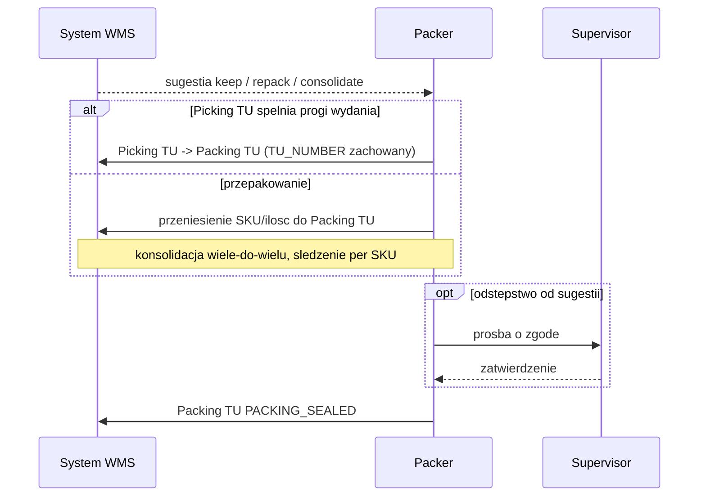
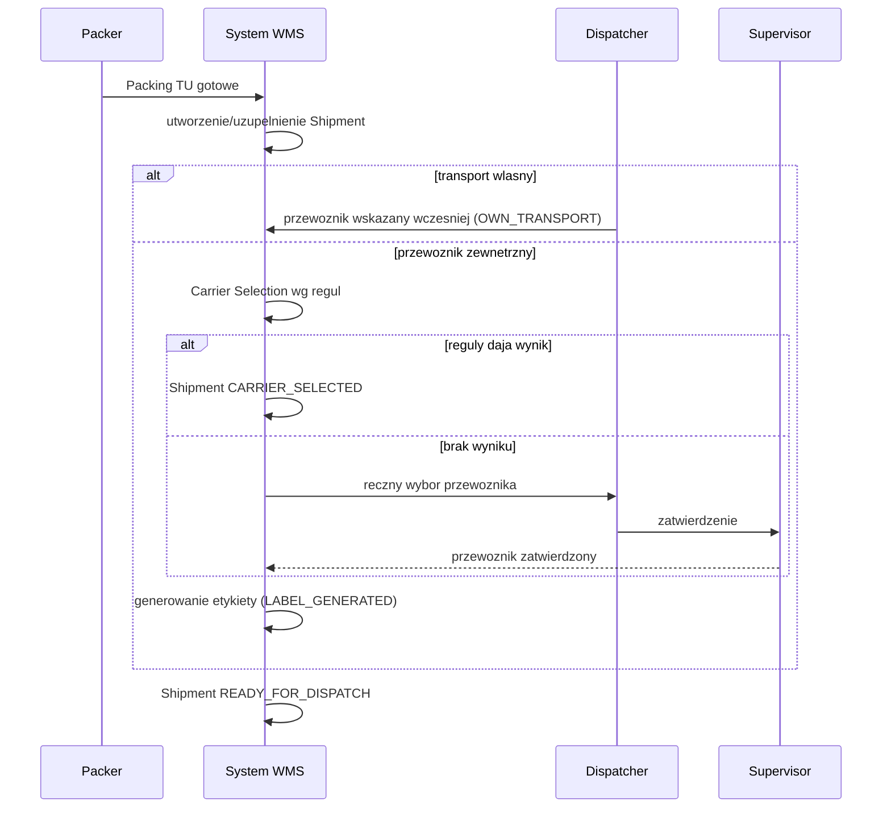
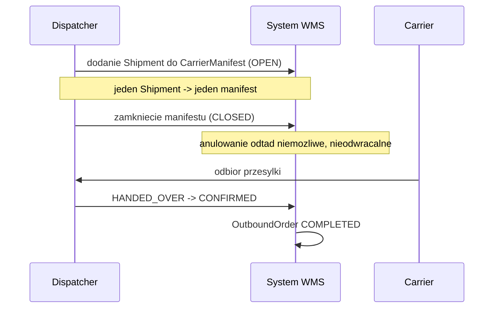

# PROCES 1: STANDARD_FULFILLMENT

**Projekt:** WMSAI Outbound
**Wersja:** 1.20 | **Data:** 2026-08-28 | **Autor:** Analityk Biznesowy
**Geneza:** dokument powstał przez rozwinięcie zarchiwizowanego `propozycja_procesow_outbound.md` v1.29 §3.1 (Standardowy Outbound) i §3.5 (Obsługa wyjątków przekrojowych, część dot. P1) do formatu krok-po-kroku zgodnego z `SZABLON_PROCESU.md`. Zarchiwizowany dokument jest materiałem historycznym, nie źródłem prawdy — źródłem prawdy jest ten plik (`DEC-A14`).
**Poprzedni proces:** system zewnętrzny OMS/ERP (poza WMS) — wpływ `CustomerOrder`
**Następny proces:** brak w WMS — fizyczny odbiór przez przewoźnika/transport własny, poza granicą systemu. Outbound Crossdock (PROCES 2) jest alternatywnym źródłem Outbound `TU` dla tego samego `Shipment`/`CarrierManifest` (krok 9 i dalej wspólne).
**Zakres dokumentu:** opis procesu biznesowego realizacji standardowego zamówienia klienta, od walidacji do fizycznego wydania. Katalog stanów, przejść i zdarzeń domenowych jest utrzymywany w `model_stanow_outbound.md` (źródło prawdy nazw statusów) — ten dokument opisuje zachowanie, nie definiuje nowych stanów.

---

## Cel procesu

Zrealizować `CustomerOrder` od przyjęcia i walidacji, przez miękką i twardą rezerwację zapasu, kompletację, pakowanie, dobór przewoźnika i zgłoszenie do ERP, aż po zamknięcie manifestu przewoźnika i fizyczne wydanie. Proces obsługuje standardową ścieżkę realizacji z zapasu składowanego (w odróżnieniu od Outbound Crossdock, PROCES 2, gdzie towar nie trafia do składowania) oraz — zgodnie z **R16**–**R17** — alternatywną, skróconą ścieżkę pakowania wykonywaną przez Pickera bezpośrednio przy kompletacji.

## Diagram głównego przebiegu

Diagram pokazuje główny przebieg standardowego Outbound. Odpowiedzialność aktorów ujęto w podgrafach (swimlane logiczny). Rozgałęzienia wyjątkowe prowadzą do obsługi opisanej w sekcji „Wyjątki i ścieżki alternatywne" tego pliku. Diagram nie odwzorowuje pełnej semantyki BPMN (bramki, zdarzenia pośrednie) — dopełnia go opis pod diagramem oraz sekwencje w sekcji 6.

**Odpowiedzialność aktorów pod diagramem:**

- Walidacja, planowanie cykliczne, tworzenie `OutboundOrder`, `Allocation`, tworzenie `PickTask`, kontrola limitu masy `TU`, Carrier Selection wg reguł i generowanie etykiety — **System WMS** (automatycznie).
- Skan Picking `TU` i kompletacja — **Picker**.
- Ocena Picking `TU`, pakowanie/konsolidacja, tworzenie/uzupełnianie `Shipment` — **Packer**.
- `CarrierManifest` (dodanie `Shipment`, zamknięcie, wydanie), obsługa transportu własnego — **Dispatcher**.
- `SHORT_ALLOCATED` i `SHORT_PICKED` są najpierw obsługiwane automatycznie. **Warehouse Supervisor** rozstrzyga tylko skonfigurowaną gałąź polityki, brak możliwości automatycznej realokacji, osiągnięcie limitu oraz decyzje wpływające na klienta.

Wynik decyzji Supervisora po SHORT_ALLOCATED (trwała zmiana allowPartialShipment / anulowanie OutboundOrder z zachowaniem pierwszeństwa CustomerOrder) i po SHORT_PICKED (BACKORDERED / anulowanie / trwała zmiana allowPartialShipment) opisano szczegółowo w sekcji „Wyjątki i ścieżki alternatywne" tego pliku (**R42**–**R43** dla `SHORT_ALLOCATED`, **R44**–**R47** dla `SHORT_PICKED`) oraz w diagramach sekwencji §6.1 i §6.3. Kolejność dostępu do przyszłego zapasu dla oczekujących CustomerOrder: priorytet, a przy remisie — kolejność zgłoszenia (mechanizm w opracowaniu, patrz BACKLOG B3a).

Etap „transport własny" (A17) omija Carrier Selection — przewoźnik jest wskazany wcześniej (**KROK 10**). Outbound Crossdock (P2) wpina się do przebiegu na poziomie generowania `CrossDockPickTask` i `OutboundOrderLine`; Outbound `TU` powstaje przy pierwszym odłożonym `SKU` przy rozsortowaniu (`model_stanow_outbound.md` §7; `proces_2_outbound_crossdock.md` **KROK 2**, `P2 R7`), a następnie wchodzi do `Shipment`; pełny opis w `proces_2_outbound_crossdock.md`.

---

## Uczestnicy

- **Picker (Warehouse Operator)** — kompletacja towaru do Picking `TU` (krok 6), opcjonalna deklaracja trybu zbierania bezpośrednio do Outbound `TU` (krok 6a).
- **Packer (Warehouse Operator)** — ocena i przygotowanie Packing `TU` (krok 7–8), gdy nie zadziałała ścieżka bezpośrednia z kroku 6a/7; grupowanie `TU` w `Shipment` (krok 9).
- **Dispatcher** — wskazanie transportu własnego (krok 10, wariant), otwarcie i zamknięcie `CarrierManifest` (krok 12), fizyczne przekazanie przesyłki (krok 13).
- **Warehouse Supervisor** — decyzje eskalacyjne: blokada/zdjęcie blokady `CustomerOrder` (krok 1), ręczny wybór przewoźnika przy braku wyniku reguł (krok 10), zatwierdzenie odstępstw od sugestii Packera (krok 7), rozstrzyganie wyjątków `SHORT_ALLOCATED`/`SHORT_PICKED`/anulowań (sekcja „Wyjątki i ścieżki alternatywne”), ponowienie lub rezygnacja przy `POSTING_ERROR` (krok 11a).
- **System WMS** — automatyzacja: walidacja, miękka i twarda rezerwacja, tworzenie `OutboundOrder`/`PickTask`, ocena progów wydania Picking `TU` (w tym automatyczne wykonanie ścieżki bezpośredniej, **R17**), wybór przewoźnika wg `CarrierSetup`, generowanie etykiety, bramka zgłoszenia do ERP, wyliczanie statusów zagregowanych.
- **Customer, Carrier** — poza granicą WMS (źródło zamówienia i odbiorca przesyłki).

## Zdarzenie startowe

Wpływ `CustomerOrder` z systemu zewnętrznego (OMS/ERP).

## Przebieg procesu

---

### KROK 1 — Walidacja `CustomerOrder`
**[System WMS]**

- `CustomerOrder` wpływa z systemu zewnętrznego z pozycjami; nagłówek otrzymuje `RECEIVED`, każda pozycja otrzymuje `CustomerOrderLine` w `OPEN`.
- System WMS wykonuje walidację nagłówka.

◇ **Czy walidacja zakończyła się wynikiem pozytywnym?**

**Ścieżka A — TAK → [System WMS]**
- `CustomerOrder` przechodzi `RECEIVED → VALIDATED`, następnie `VALIDATED → ACCEPTED`, o ile zamówienie nie ma blokady (Ścieżka C) → przejście do **KROK 1A**.

**Ścieżka B — NIE (walidacja negatywna) → [System WMS]**
- `CustomerOrder` przechodzi `RECEIVED → REJECTED` — stan końcowy, koniec procesu dla tego zamówienia.

**Ścieżka C — zamówienie ma blokadę → [System WMS / Warehouse Supervisor]**
- Po `ACCEPTED` `CustomerOrder` przechodzi `ACCEPTED → ON_HOLD`; pomijane w cyklicznym planowaniu (**KROK 2**) do zdjęcia blokady przez `Warehouse Supervisor` lub System WMS (`ON_HOLD → ACCEPTED`), po czym zamówienie wraca do kolejki planowania.

---

### KROK 1A — Miękka rezerwacja `ATPReservation`
**[System WMS]**

- Gdy `CustomerOrder` osiąga `ACCEPTED`, każda jego `CustomerOrderLine` dostaje `ATPReservation` — ilość liczona z `Inventory.AVAILABLE` (zapas z flagą `ATP`) pomniejszonego o sumę już aktywnych `ATPReservation` na tym SKU, bez ponownego odejmowania `Allocation` (jej efekt jest już ujęty w `AVAILABLE`).
- Jeśli dostępność wynosi 0, linia dostaje `ATPReservation = 0` i czeka w kolejce; `CustomerOrderLine` przechodzi `OPEN → BACKORDERED` (**R1**).
- Kolejność przydziału dla oczekujących linii na tym samym SKU jest parametrem magazynu: domyślnie wyłącznie kolejność zgłoszenia; warianty z `priority`/`slaDeadline` jako remisem to konfigurowalne odstępstwo (**R2**).
- Kolejka jest przeliczana przy każdym zaksięgowaniu Inbound `TU` zawierającego dany SKU (wszystkie warianty) oraz — tylko w wariantach z `priority`/`slaDeadline` — przy każdym nowym `CustomerOrder ACCEPTED`; nigdy nie narusza już istniejącej `Allocation RESERVED` (**R3**).
- „Zaksięgowanie Inbound `TU`” oznacza tu konkretnie zdarzenie potwierdzone przez ERP (`POST` na ASN), nie sam fizyczny odbiór towaru na magazynie (**R4**).

---

### KROK 2 — Cykliczne planowanie realizacji
**[System WMS]**

- System WMS cyklicznie przegląda `CustomerOrder ACCEPTED` do dalszej realizacji.
- Pomija `CustomerOrder.ON_HOLD` (**R5**). Po zdjęciu `ON_HOLD` zamówienie wraca do kolejki planowania.
- Przejście do **KROK 2A**.

---

### KROK 2A — Warunek dla `allowPartialShipment = false`
**[System WMS]**

◇ **Czy każda `CustomerOrderLine` tego `CustomerOrder` jest w pełni pokryta — `ATPReservation` powiększone o ilość już spakowaną w dowolnym kanale (**R6**)?** — warunek dotyczy wyłącznie `allowPartialShipment = false`.

**Ścieżka A — TAK (albo `allowPartialShipment = true`) → [System WMS]**
- Dla `allowPartialShipment = true` warunek nie obowiązuje — planowanie przechodzi dalej normalnie, z częściową rezerwacją tam, gdzie to konieczne (patrz **KROK 4**).
- Przejście do **KROK 3**.

**Ścieżka B — NIE (`allowPartialShipment = false`, brak pełnej rezerwacji) → [System WMS]**
- `CustomerOrder` zostaje w `ACCEPTED`, System WMS ustawia `WARNING` (opis: „oczekuje na pełną rezerwację ATP”).
- `WARNING` znika w dwóch przypadkach: ręcznie, gdy `Warehouse Supervisor` ustawi flagę na `false`, albo automatycznie, gdy przyczyna faktycznie ustanie. Ręczne zdjęcie flagi nie zmienia zachowania biznesowego — jeżeli przyczyna nadal istnieje, kolejny przebieg cyklicznego planowania ustawia `WARNING` ponownie (**R61**).
- Standardowy `OutboundOrder` nie powstaje w tym przebiegu (**R6**). Dopiero gdy wszystkie linie razem osiągną pełne pokrycie, kolejny przebieg cyklicznego planowania tworzy `OutboundOrder` dla ilości niepokrytej; przy pełnym pokryciu cross-dockiem nie powstaje wcale.

---

### KROK 3 — Utworzenie `OutboundOrder`
**[System WMS]**

- System WMS tworzy `OutboundOrder` przez grupowanie lub dzielenie `OutboundOrderLine`, przed `Allocation`; `CustomerOrderLine` przechodzi `OPEN → PLANNED`. Jedna `CustomerOrderLine` może zostać podzielona między wiele `OutboundOrderLine` (**R59**).
- Grupowanie dopuszczalne przy zgodnym kliencie, adresie dostawy, priorytecie, `slaDeadline` w tolerancji per magazyn i braku `allowPartialShipment = false` (**R7**).
- Dla `allowPartialShipment = false` powstaje dokładnie jeden `OutboundOrder`, bez agregacji innych `CustomerOrder` (**R8**).
- `OutboundOrder` powstaje w `CREATED`, `fulfillmentChannel = STANDARD` (niezmienny od utworzenia), `priority`/`slaDeadline` wyliczone jako agregat najpilniejszej wartości spośród agregowanych `CustomerOrder` (**R9**).
- Gdy `OutboundOrder` powstał (a dla `allowPartialShipment = false` — dopiero po spełnieniu warunku **KROK 2A**), `CustomerOrder` przechodzi `ACCEPTED → IN_FULFILLMENT`.

---

### KROK 4 — `Allocation`
**[System WMS]**

- System WMS uruchamia `OutboundOrder CREATED → ALLOCATION_IN_PROGRESS` i tworzy `Allocation` (`PENDING`) dla każdej `OutboundOrderLine`, rezerwując wyłącznie kwalifikowany zapas `ATP`.
- Priorytet działa tylko na zapas niezarezerwowany (**R10**).
- W miarę powstawania rzeczywistej `Allocation RESERVED`, odpowiadająca ilość jest odejmowana z `ATPReservation` tej `CustomerOrderLine` (przejście z rezerwacji miękkiej na twardą, utrzymywane przez `PICKING`/`PICKED`/`PACKED` aż do `SHIPPED`) (**R11**).
- `Warehouse Supervisor` może ręcznie zmniejszyć lub usunąć `ATPReservation` bez zmiany statusu `CustomerOrder` i bez podania powodu (**R12**).

◇ **Czy `Allocation` pokrywa pełną wymaganą ilość `OutboundOrderLine`?**

**Ścieżka A — TAK → [System WMS]**
- `Allocation PENDING → RESERVED`, `OutboundOrderLine CREATED → ALLOCATED`.
- Gdy wszystkie linie `OutboundOrder` osiągną `ALLOCATED`: `OutboundOrder ALLOCATION_IN_PROGRESS → ALLOCATED` → przejście do **KROK 5**.

**Ścieżka B — NIE (niepełna rezerwacja) → [System WMS]**
- `Allocation PENDING → SHORT`, `OutboundOrderLine CREATED → SHORT_ALLOCATED`, `OutboundOrder ALLOCATION_IN_PROGRESS → SHORT_ALLOCATED`.
- `Allocation.reservedQty` przyjmuje ilość faktycznie zarezerwowaną: pełne `requiredQty` przy `RESERVED`, mniej przy `SHORT`. Zapas blokują wyłącznie stany `SHORT`, `RESERVED` i `CONFIRMED` (**R71**).
- Automatyczna ścieżka według `allowPartialShipment` i polityki magazynu — patrz **„Wyjątki i ścieżki alternatywne” → `SHORT_ALLOCATED`**.

---

### KROK 5 — Utworzenie `PickTask`
**[System WMS]**

- Dla `OutboundOrder ALLOCATED` System WMS tworzy `PickTask` w statusie `CREATED`, osobno dla każdej strefy objętej zamówieniem (**R13**); `OutboundOrderLine ALLOCATED → PICKING`, `OutboundOrder ALLOCATED → PICKING_IN_PROGRESS`.
- `PickTask` czeka w `CREATED` — nie jest przypisywany do operatora w momencie utworzenia. Przydział następuje dopiero wtedy, gdy zgłosi się operator spełniający warunki (**R54**).
- Kolejność wykonywania wielu `PickTask` przez `Warehouse Operator` jest parametrem magazynu: domyślnie `slaDeadline` → `priority` jako remis; alternatywnie `priority` → `slaDeadline` jako remis; remis na obu kryteriach rozstrzyga kolejność zgłoszenia `PickTask` (**R14**).

---

### KROK 6 — Kompletacja
**[Picker]**

- Picker skanuje Picking `TU` przed odłożeniem towaru (`PickTask ASSIGNED → IN_PROGRESS`; `TU` — jeśli jeszcze nie istniała — powstaje w `CREATED`, następnie `CREATED → IN_PICKING`).
- `TU_NUMBER` nadawany przy utworzeniu Outbound `TU` jest wymagany i unikalny per magazyn wśród aktywnych, nieterminalnych Outbound `TU`; `SSCC` jest opcjonalny i nie musi być równy `TU_NUMBER` (**R53**).
- System WMS blokuje przekroczenie limitu masy `TU`: bieżąca masa liczona z zawartości (**R63**) wobec `TUSetup.maxWeight` — po osiągnięciu limitu `TU IN_PICKING → PICK_FULL` (**R15**). Bieżąca objętość zawartości `TU` jest wyliczana zgodnie z **R63**, lecz służy wyłącznie ocenie progów wydania (**R64**); nie jest warunkiem blokady zapełnienia (**R15**) ani limitów przepakowania (**R20**), a do doboru przewoźnika trafia `TUSetup.maxVolume` jako kubatura nośnika (**R30**).
- 🔁 Gdy Picking `TU` osiągnie `PICK_FULL`, a w `PickTask` pozostaje jeszcze ilość do pobrania, Picker zamyka pełną `TU` (`PICK_FULL → READY_TO_PACK`) i skanuje kolejną Picking `TU`. System WMS tworzy ją w `CREATED`, przy pierwszym skanie wiąże z tym samym `PickTask` i wykonuje `CREATED → IN_PICKING`; `PickTask` zachowuje tożsamość i pozostaje `IN_PROGRESS`. Kolejna `TU` dziedziczy `directPackDeclared` poprzedniej `TU` tego samego `PickTask`, bez ponownego pytania, zgodnie z **R16**. Jest to normalny krok procesu, nie eskalacja, `SHORT_PICKED` ani zakończenie zadania (**R67**).
- Strategia przypisania Picking `TU` jest parametrem konfiguracyjnym magazynu i ma dwa warianty: osobna Picking `TU` dla każdego zadania albo strefy, albo wspólna Picking `TU` przechodząca przez kolejne zadania tego samego `OutboundOrder` (**R62**).

◇ **Czy pobrano pełną zleconą ilość?**

**Ścieżka A — TAK → [Picker / System WMS]**
- `PickTask IN_PROGRESS → COMPLETED`; `OutboundOrderLine PICKING → PICKED`; `Allocation RESERVED → CONFIRMED` (potwierdzenie pobrania: skan `TU` i ilość).
- Zakończenie `PickTask` nie zamyka Picking `TU` — `TU` pozostaje `IN_PICKING` do decyzji operatora (**R55**) albo do osiągnięcia limitu masy (`PICK_FULL`, **R15**). Dopiero wtedy `TU IN_PICKING`/`PICK_FULL → READY_TO_PACK`.
- Gdy wszystkie `PickTask` `OutboundOrder` są `COMPLETED`: `OutboundOrder PICKING_IN_PROGRESS → PICKED`.
- Przejście do **KROK 6A**.

**Ścieżka B — NIE (pobrano mniej) → [Picker]**
- `PickTask IN_PROGRESS → SHORT_PICKED`; `OutboundOrderLine PICKING → SHORT_PICKED`.
- Dalej wg **„Wyjątki i ścieżki alternatywne” → `SHORT_PICKED`**.

---

### KROK 6A — Deklaracja trybu zbierania
**[Picker]**

- Przy pierwszym skanie Picking `TU` dla danego `PickTask` (`TU CREATED → IN_PICKING`, **KROK 6**) Picker może opcjonalnie zadeklarować zbieranie bezpośrednio do Outbound `TU` — `TU.directPackDeclared = true` (`model_stanow_outbound.md` §7) — zamiast domyślnego trybu (`directPackDeclared = false`).
- Deklaracja jest wiążąca dla całego zadania i **nieodwracalna** po rozpoczęciu kompletacji (**R16**).
- Deklaracja nie zmienia przebiegu **KROK 6** — wpływa wyłącznie na to, kto i kiedy wykonuje ocenę w **KROK 7**.
- Przejście do **KROK 7**.

---

### KROK 7 — Ocena Picking `TU`
**[System WMS / Packer]**

◇ **Czy `TU.directPackDeclared = true`?**

**Ścieżka A — TAK, i `TU` po zakończeniu kompletacji spełnia progi wydania → [System WMS]**
- System WMS automatycznie zamyka rolę `PackUnit`: `TU READY_TO_PACK → PACK_QUALIFIED → PACKING_SEALED`.
- Powiązana `OutboundOrderLine PICKED → PACKED` — bez udziału Packera (**R17**).
- Przejście do **KROK 9** (Packing `TU` gotowa — **KROK 8** pominięty dla tej `TU`).

**Ścieżka B — TAK, ale `TU` **nie** spełnia progów wydania → [System WMS]**
- System WMS kieruje `TU` do standardowej oceny Packera — dokładnie tak samo jak dla `TU` bez deklaracji (Ścieżka C).
- Przejście do **KROK 8**.

**Ścieżka C — `directPackDeclared = false` (tryb domyślny) → [Packer]**
- System WMS sugeruje ocenę na podstawie spełnienia progów wydania; Packer decyduje: keep / repack / consolidate.
- Odstępstwo od sugestii Systemu WMS wymaga zgody `Warehouse Supervisor` (**R18**).
- Jeśli `TU` spełnia progi wydania i Packer wybiera „keep”: `TU READY_TO_PACK → PACK_QUALIFIED → PACKING_SEALED`, `OutboundOrderLine PICKED → PACKED` — przejście do **KROK 9**.
- Jeśli Packer wybiera repack/consolidate: `TU READY_TO_PACK → REPACKED` (stan końcowy dla tej `TU` jako `PickContainer`) — przejście do **KROK 8**.
- **Wymuszenie wydawalności.** Dla `TU` na typie innym niż typ o roli nośnika zewnętrznego (**R68**) `Warehouse Operator` może zamknąć `TU`, która nie osiągnęła dolnych progów masy ani objętości, i wydać ją bez przepakowania wyłącznie wtedy, gdy jej typ ma `TUSetup.externalIssuable = true` oraz spełniony jest co najmniej jeden z dwóch warunków: `TU` jest ostatnią dla swojego `OutboundOrder` albo zbliża się `slaDeadline`. Decyzja należy do operatora i wymaga zapisania powodu. Wymuszenie znosi wyłącznie dolne progi; przy `TUSetup.externalIssuable = false` zapieczętowanie i wydanie są zablokowane, a jedyną drogą jest przepakowanie na typ wydawalny zgodnie z **R66**. Ma to szczególne znaczenie przy `directPackDeclared = true`, gdzie Packer nie uczestniczy w ocenie (**R65**). Dla `TU` na typie zewnętrznym wymuszenie nie jest wymagane, ponieważ wydawalność wynika z pierwszej gałęzi **R64**.

---

### KROK 8 — Przygotowanie Packing `TU`
**[Packer]**

- Jeśli Picking `TU` spełnia progi wydania (**KROK 7**, Ścieżka C „keep”) — pełni rolę Packing `TU`, zachowuje `TU_NUMBER` (**R19**).
- Inaczej przepakowanie do jednego lub wielu Packing `TU`; konsolidacja wiele-do-wielu śledzona per SKU/ilość. Wersja 1 nie nakłada ograniczeń zgodności towaru przy takim łączeniu (kategoria, temperatura itd.) — dopuszczalne wspólne pakowanie dowolnych SKU, pod warunkiem spełnienia limitu masy `TUSetup.maxWeight` (**R20**).
- Jedno Packing `TU` może zawierać pozycje z wielu `OutboundOrder` wyłącznie wtedy, gdy ich źródłowe `CustomerOrder` mają tego samego klienta, ten sam adres dostawy, zgodny priorytet i zgodny termin dostawy; wszystkie pozycje jednego Packing `TU` muszą należeć do jednego `Shipment`. Warunek jest sprawdzany przy przepakowaniu, nie dopiero przy grupowaniu Packing `TU` w `Shipment` (**R60**).
- Nośnik docelowy przepakowania musi być typu wydawalnego na zewnątrz (`TUSetup.externalIssuable`); Packing `TU` powstała przez przepakowanie do typu niewydawalnego nie może zostać zapieczętowana (**R66**).
- Dwa tryby przepakowania, konfigurowalne per magazyn (administrator może wyłączyć jeden z nich dla całego magazynu, wymuszając drugi, albo zostawić wybór Packerowi dla każdej `TU`):

◇ **Tryb przepakowania?**

**Ścieżka A — „repack all” → [Packer]**
- Bez kontroli ilościowej; Packer przenosi zawartość bez skanowania/liczenia poszczególnych SKU, ryzyko rozbieżności świadomie akceptowane (tak jak przy „keep”, **KROK 7**).

**Ścieżka B — „repack by SKU” → [Packer]**
- Kontrola ilościowa per SKU (opisana niżej).
- Packer samodzielnie decyduje, które SKU z źródłowego Picking `TU` przepakowuje i w jakiej kolejności — System WMS nie kieruje/nie wskazuje konkretnego SKU do pobrania na tym etapie (wersja 1) (**R21**).
- Dla każdego SKU, które Packer zdecyduje się przepakować: skan kodu + podanie ilości; System WMS porównuje z `pickedQty` tej pozycji (zarejestrowanym przez pierwotny `PickTask`).

  ◇ **Wynik porównania ilości?**

  **Ilość zgodna** — pozycja trafia do Packing `TU`.

  **Ilość mniejsza niż `pickedQty` (możliwy brak podczas liczenia)** — System WMS nie rejestruje braku automatycznie; Packer wybiera:
  - **Odłożyć decyzję** — zostawić pozycję nierozliczoną, przejść do kolejnego SKU; może wrócić do niej później (przed zakończeniem przepakowania `TU`) i doliczyć/przepakować pozostałą ilość, jeśli ją odnajdzie.
  - **Zgłosić brak** — dopiero po (1) ponownym sprawdzeniu zawartości `TU` względem tego SKU i (2) jawnym potwierdzeniu zgłoszenia braku przez Packera. Dopiero to potwierdzenie uruchamia mechanizm: System WMS koryguje `pickedQty` do faktycznie potwierdzonej ilości, `OutboundOrderLine PICKED → SHORT_PICKED` dla brakującej części, dalej automatyczna realokacja/eskalacja jak dla `SHORT_PICKED` przy kompletacji (patrz **„Wyjątki i ścieżki alternatywne” → `SHORT_PICKED`**), bez blokady lokalizacji źródłowej (**R22**).

  **Towar uszkodzony** — nie może zostać przepakowany do Packing `TU`. Packer zgłasza SKU jako `DAMAGED`; System WMS każe odłożyć go na wyznaczone miejsce `QC` (Quality Control). Dla tej ilości uruchamia się dokładnie ten sam mechanizm co dla braku stwierdzonego podczas liczenia (`OutboundOrderLine PICKED → SHORT_PICKED`, realokacja/eskalacja, bez blokady lokalizacji); dodatkowo zdarzenie oznaczone jest jako `DAMAGED` (nie ogólny brak) w rejestrze niezgodności do wyjaśnienia (**R23**).

  **SKU nieoczekiwane w tej `TU`** (nadwyżka ilości ponad zawartość zapisaną w WMS dla tej `TU`, albo zupełnie inny/nieprzypisany kod — jednakowe traktowanie) — System WMS informuje Packera, że pozycja nie należy do tej `TU`; Packer odkłada ją na `QC`, do wyjaśnienia w ramach przyszłych procesów Inventory Management. Nie uruchamia mechanizmu braku (**R24**).

- **Zakończenie przepakowania źródłowej `TU`.** Packer inicjuje zakończenie. System WMS sprawdza, czy wszystkie systemowo oczekiwane SKU tej `TU` (wg `pickedQty`) zostały rozliczone — trafiły do Packing `TU`, na `QC`, albo zostały już zgłoszone jako brak.

  ◇ **Czy wszystkie oczekiwane SKU zostały rozliczone?**

  **TAK → [System WMS]** — przejście do **KROK 9**.

  **NIE → [Packer]** — wybór:
  - **Kontynuuj** — powrót do przepakowywania źródłowej `TU` (zbyt wczesna próba zakończenia).
  - **Zgłoś brak** — dopiero po (1) ponownym sprawdzeniu zawartości `TU` i (2) jawnym potwierdzeniu zgłoszenia braku, Packer zgłasza pozostałą, nierozliczoną ilość jako brak (brak stwierdzony przy zakończeniu); ten sam mechanizm `SHORT_PICKED` jak wyżej (**R25**).

---

### KROK 9 — Utworzenie/uzupełnienie `Shipment`
**[Packer / System WMS]**

- `Shipment` powstaje po przygotowaniu pierwszej Packing `TU` (`Shipment CREATED`); grupuje kolejne gotowe Packing `TU` zgodne wg klienta, adresu dostawy, priorytetu i **identycznego** `slaDeadline` (bez tolerancji — w odróżnieniu od grupowania `CustomerOrder → OutboundOrder` w **KROK 3**, gdzie tolerancja per magazyn jest dopuszczalna) (**R26**).
- Jedno Packing `TU` należy do dokładnie jednego `Shipment`.
- `allowPartialShipment = false` na `CustomerOrder` oznacza, że całe zamówienie jest wydawane jednym kompletnym `Shipment`; brak choć jednej wymaganej pozycji blokuje wydanie całości. Jeden `Shipment` może zawierać wiele Packing `TU` tego zamówienia. Obietnica obowiązuje niezależnie od tego, iloma `OutboundOrder` i iloma kanałami zamówienie zostało obsłużone (**R57**).
- Packing `TU` zamówienia z `allowPartialShipment = false` nie jest wpinana do żadnego `Shipment`, dopóki każda `CustomerOrderLine` tego `CustomerOrder` nie spełnia jednego z dwóch rozłącznych warunków: (A) **LINIA NIEAKTYWNA** — została skutecznie anulowana albo skorygowana przez `Warehouse Supervisor` zgodnie z **R46** i nie należy już do ilości wymaganej; nie blokuje guardu i nie podlega warunkowi (B); albo (B) **LINIA AKTYWNA** — suma `requiredQty` tych jej `OutboundOrderLine`, które osiągnęły `PACKED` albo dalej i nie są `CANCELLED`, równa się `CustomerOrderLine.Quantity` obowiązującej po ewentualnej korekcie, niezależnie od kanału. Sam status linii nie wystarcza: `PLANNED` powstaje przy przypisaniu do `OutboundOrderLine` (`model_stanow_outbound.md` §2), a `P2 R6` liczy `crossDockEligibleQty` jako min(`sourceEligibleQty`, `demandEligibleQty`), więc linia może być `PLANNED` przy pokryciu częściowym. Do czasu spełnienia warunku `TU` pozostaje w `PACKING_SEALED`. Automatyczne zamknięcie `Shipment` po upłynięciu `slaDeadline` nie dotyczy takich `TU`, ponieważ nie należą one jeszcze do żadnego `Shipment`. Po `CarrierManifest.CLOSED` nie ma powrotu (**R58**).
- `TU PACKING_SEALED → IN_SHIPMENT` (wpięcie do `Shipment`).
- `OutboundOrder` osiąga `PACKED`, gdy wszystkie jego `OutboundOrderLine` i wszystkie ich `TU` są spakowane (pełny agregat, analogicznie do `PICKED` w **KROK 6**); z `PACKED` przechodzi natychmiast w `READY_FOR_DISPATCH` — sygnał dla `Shipment` (**R27**).
- `Shipment` zamyka grupowanie `TU` i sam osiąga `READY_FOR_DISPATCH` (`Shipment CREATED → READY_FOR_DISPATCH`):
  - (a) gdy wszystkie kontrybuujące do niego `OutboundOrder` osiągnęły własny `READY_FOR_DISPATCH`, albo
  - (b) automatycznie po upłynięciu wspólnego `slaDeadline` tych `OutboundOrder`, niezależnie czy wszystkie zdążyły się spakować (**R28**).
- Packing `TU`, które nie były gotowe przed (b), nie wchodzą do tego `Shipment` — gdy staną się gotowe, tworzą nowy `Shipment` wg tej samej zasady grupowania. `TU` wpięte wcześniej pozostają w zamykanym `Shipment`, więc `OutboundOrder` z częścią `TU` gotową przed terminem i częścią po nim kontrybuuje do dwóch `Shipment` (**R29**, **R70**).

---

### KROK 10 — Carrier Selection
**[System WMS / Warehouse Supervisor / Dispatcher]**

- Carrier Selection uruchamia się dopiero po osiągnięciu przez `Shipment` `READY_FOR_DISPATCH` (**KROK 9**) — dopiero wtedy zbiór Packing `TU` jest zamknięty, a do dopasowania trafia największa bieżąca masa Packing `TU`, liczona z zawartości zgodnie z **R63**, oraz największa `TUSetup.maxVolume` spośród ich typów jako kubatura nośnika (**R30**).
- Wybór przewoźnika zewnętrznego jest automatyczny, wg konfiguracji `CarrierSetup` — nie reguł zakodowanych na stałe. Każdy `CarrierSetup` łączy `Carrier`, `Region` (obszar dostawy, dowolnie definiowany per magazyn — kod pocztowy, zakres, grupa województw; niezależny od `Zone` magazynowej) oraz przedział wagi (`minWeight`–`maxWeight`) i przedział objętości (`minVolume`–`maxVolume`); jeden `Carrier` może mieć wiele `CarrierSetup` (**R31**).
- System WMS wyznacza dla `Shipment` największą bieżącą masę spośród wszystkich jego Packing `TU` (**R63**) oraz największą `TUSetup.maxVolume` spośród typów tych `TU`, po czym szuka `CarrierSetup`, którego `Region` odpowiada adresowi dostawy, przedział wagi obejmuje wyznaczoną masę, a przedział objętości — wyznaczoną objętość typu.

◇ **Wynik dopasowania `CarrierSetup`?**

**Ścieżka A — dokładnie jeden pasujący `CarrierSetup` → [System WMS]**
- `Shipment READY_FOR_DISPATCH → CARRIER_SELECTED`.

**Ścieżka B — więcej niż jeden pasujący `CarrierSetup` dla tego samego `Region` → [System WMS]**
- Rozstrzyga kolejno: najwęższy przedział objętości, potem najwęższy przedział wagi, potem `Carrier.priority` (unikalna wartość w słowniku przewoźników — rozstrzyga zawsze jednoznacznie) (**R32**).
- `Shipment READY_FOR_DISPATCH → CARRIER_SELECTED`.

**Ścieżka C — brak dopasowania → [System WMS / Warehouse Supervisor]**
- `Shipment READY_FOR_DISPATCH → CARRIER_PENDING`.
- Ręczny wybór `Warehouse Supervisor`: `Shipment CARRIER_PENDING → CARRIER_SELECTED`.

**Ścieżka D — transport własny, wskazany wcześniej → [Dispatcher]**
- `Shipment READY_FOR_DISPATCH → OWN_TRANSPORT`; ten wariant pomija dalsze podkroki wyboru przewoźnika.

- Niezależnie od ścieżki: `Warehouse Supervisor` może zawsze zmienić wynik (automatyczny lub ręczny) bez podania powodu (**R33**).

---

### KROK 11 — Generowanie etykiety
**[System WMS]**

- Po zatwierdzeniu przewoźnika (`Shipment CARRIER_SELECTED`) System WMS generuje etykietę: `Shipment CARRIER_SELECTED → LABEL_GENERATED`.
- Wydruk na podstawie już posiadanych danych (dane Packing `TU`, opis `Carrier`, adres dostawy), bez wywołania zewnętrznego API przewoźnika i bez kroku potwierdzenia/zgody po jego stronie; brak technicznego trybu awarii generowania etykiety oraz brak elektronicznego odrzucenia przesyłki w wersji 1 (**R34**).
- Problem z załadunkiem ujawniony przed `CarrierManifest.CLOSED` → `Warehouse Supervisor` ręcznie zmienia `Carrier`, bez ponownego druku etykiety; po `CarrierManifest.CLOSED` zmiana `Carrier` jest niemożliwa (**R35**).
- Transport własny (`OWN_TRANSPORT`) pomija ten krok.

---

### KROK 11A — Zgłoszenie gotowości wydania do ERP
**[System WMS / ERP / Warehouse Supervisor]**

- Każdy `Shipment` — niezależnie od tego, czy zawiera pierwotnie zamówioną ilość, czy skorygowaną (patrz **„Wyjątki i ścieżki alternatywne”**, wynik „anulowanie” dla `SHORT_PICKED`) — musi zostać zgłoszony do ERP jako gotowy do wydania, zanim zostanie dodany do `CarrierManifest` (**R36**).
- `Shipment LABEL_GENERATED`/`OWN_TRANSPORT → POSTING_PENDING`.

◇ **Odpowiedź ERP?**

**Ścieżka A — potwierdzenie (`POST`) → [System WMS / ERP]**
- `Shipment POSTING_PENDING → POSTED`. Dopiero teraz można dodać `Shipment` do manifestu (**KROK 12**).

**Ścieżka B — jawne odrzucenie → [System WMS / ERP]**
- `Shipment POSTING_PENDING → POSTING_ERROR`. Eskalacja do `Warehouse Supervisor`.
- ERP zwraca ustrukturyzowany powód odrzucenia, pozwalający Systemowi WMS odróżnić awarię techniczną komunikacji od niezgodności zawartości. Przy niezgodności zawartości przyczyna leży po jednej z dwóch stron:
  - (a) po stronie ERP (np. brak ceny towaru, rozjazd stanu `ATP` między WMS a ERP) — retry z niezmienioną treścią kończy się sukcesem po naprawie w ERP, bez żadnej zmiany danych po stronie WMS;
  - (b) po stronie WMS (błędne dane na `CustomerOrder`/`Shipment`) — wymaga korekty przed ponowieniem: `Warehouse Supervisor` koryguje ręcznie, albo poprawka przychodzi z OMS/ERP przez webservice.
- W obu przypadkach ponowienie zgłoszenia jest osobną, ręczną decyzją `Warehouse Supervisor` (`Shipment POSTING_ERROR → POSTING_PENDING`, **R37**); skuteczna naprawa kończy się potwierdzeniem `POSTED` w ERP.
- Fizyczna zawartość spakowanej `TU` i stan `OutboundOrderLine PACKED` nie są ruszane w żadnym z wariantów.
- `Warehouse Supervisor` może też zrezygnować: `Shipment POSTING_ERROR → CANCELLED`.
- Brak odpowiedzi (timeout) jest incydentem technicznym poza tym procesem, bez zdefiniowanej ścieżki w tym dokumencie.

**Uzasadnienie umieszczenia bramki właśnie tutaj, przed dodaniem do manifestu, a nie później:** ERP jest zleceniodawcą, WMS wykonawcą — gdyby `Shipment` mógł trafić do manifestu i zostać wydany, zanim ERP go zaksięgował, WMS wysłałby coś, czego ERP nie ma w swoich księgach, co w relacji ERP↔WMS wygląda jak brak/rozbieżność po stronie WMS. Od chwili wejścia w `POSTING_PENDING` anulowanie `Shipment` przez WMS nie jest już możliwe (**R38**); ewentualna korekta po tym momencie to zwykły zwrot towaru (Return Receipt, poza zakresem tego dokumentu).

---

### KROK 12 — `CarrierManifest`
**[Dispatcher]**

- Dispatcher otwiera `CarrierManifest` (`OPEN`) i dodaje `Shipment POSTED`: `Shipment POSTED → IN_MANIFEST`.
- Jeden `Shipment` w jednym manifeście (**R39**).
- Dispatcher zamyka manifest: `CarrierManifest OPEN → CLOSED` — zamknięcie nieodwracalne, granica anulowania i zmiany `Carrier` (**R40**).

---

### KROK 13 — Wydanie
**[Dispatcher / Carrier]**

- Fizyczne przekazanie przewoźnikowi lub transportowi własnemu: `CarrierManifest CLOSED → HANDED_OVER`; `Shipment IN_MANIFEST → HANDED_TO_CARRIER`; `TU IN_SHIPMENT → DISPATCHED`; `OutboundOrder READY_FOR_DISPATCH → DISPATCHED`.
- Dispatcher potwierdza wydanie z magazynu: `CarrierManifest HANDED_OVER → CONFIRMED`.
- Potwierdzenie manifestu rozlicza `Inventory PICKED → SHIPPED` dla ilości znajdującej się w Outbound `TU` tego manifestu i pomniejsza o tę ilość `Allocation.reservedQty` (**R72**).
- `OutboundOrderLine PACKED → SHIPPED` oraz `Allocation CONFIRMED → CONSUMED` następują dopiero wtedy, gdy każda Outbound `TU` wnosząca ilość tej linii należy do `Shipment` z manifestem w stanie `CONFIRMED`; wcześniejsze manifesty zostawiają linię w `PACKED`, a alokację w `CONFIRMED` (**R72**).
- `OutboundOrder DISPATCHED → COMPLETED` dopiero wtedy, gdy każdy `Shipment` zawierający choćby jedną Outbound `TU` tego zlecenia należy do `CarrierManifest` w stanie `CONFIRMED`; potwierdzenie części z nich zostawia zlecenie w `DISPATCHED` (**R70**).
- Agregacja poziomu `CustomerOrderLine`: `PLANNED`/`PARTIALLY_FULFILLED → PARTIALLY_FULFILLED`/`FULFILLED` w zależności od tego, czy cała ilość linii została wydana.
- Agregacja poziomu `CustomerOrder` — patrz **Funkcja ciągła F1**.
- Przejście do **KROK 13A**.

---

### KROK 13A — Rozliczenie `CustomerOrder`
**[System WMS]**

- Wyliczane automatycznie, analogicznie do zależności `OutboundOrder.COMPLETED` od `CarrierManifest.HANDED_OVER → CONFIRMED` (**KROK 13**): gdy `CustomerOrder` osiągnął `SHIPPED` (Funkcja ciągła F1) i każdy `OutboundOrder`, który wniósł choć jedną wydaną `OutboundOrderLine` do tego `CustomerOrder`, osiągnął `COMPLETED`, nagłówek przechodzi `SHIPPED → CLOSED` (**R41**).
- `CLOSED` jest stanem końcowym `CustomerOrder` — brak dalszych skutków.

---

## Zdarzenie końcowe

Zamknięty `CarrierManifest` (`CONFIRMED`) i fizyczne przekazanie przesyłki przewoźnikowi lub transportowi własnemu; `OutboundOrder → COMPLETED`; `OutboundOrderLine → SHIPPED`; `CustomerOrderLine → FULFILLED`/`PARTIALLY_FULFILLED`; `CustomerOrder → SHIPPED`, docelowo `CLOSED` po rozliczeniu wszystkich kontrybuujących `OutboundOrder` (**KROK 13A**).

---

## Diagram sekwencji

### 6.1 Cykliczne planowanie, grupowanie i alokacja

### 6.2 Wielostrefowa kompletacja (wiele `PickTask` i Picking `TU`)

### 6.3 `SHORT_PICKED`, blokada lokalizacji, realokacja

```mermaid
sequenceDiagram
    participant WMS as System WMS
    participant PK as Picker
    participant SUP as Supervisor
    PK->>WMS: pobrano mniej niz zlecono
    WMS->>WMS: PickTask SHORT_PICKED (zakonczony)
    WMS->>WMS: blokada lokalizacji do kontroli zapasu
    WMS->>WMS: efektywny limit: klient != null, inaczej magazyn
    alt ATP w innej niezablokowanej lokalizacji i limit nieosiagniety
        WMS->>WMS: nowy PickTask (dziedziczy priorytet)
        WMS->>WMS: nowy PickTask CREATED, czeka na operatora w strefie
    else brak zapasu lub limit osiagniety
        WMS->>SUP: eskalacja SHORT_PICKED
        alt Supervisor: BACKORDERED, klient czeka
            SUP-->>WMS: decyzja BACKORDERED
            WMS->>WMS: PutBackTask dla ilosci PICKED (patrz P4)
            WMS->>WMS: CustomerOrderLine PLANNED->BACKORDERED
            Note over WMS: spakowana ilosc (PACKED) zostaje w strefie konsolidacji
        else Supervisor: anulowanie
            SUP-->>WMS: decyzja anulowanie
            WMS->>WMS: OutboundOrderLine CANCELLED, PutBackTask dla ilosci PICKED (patrz P4)
        else Supervisor: odstepstwo - trwala zmiana flagi
            SUP-->>WMS: allowPartialShipment ustawione trwale na true (powod zapisany)
            WMS->>WMS: PutBackTask dla pobranej ilosci brakujacej czesci (jesli byla)
            WMS->>WMS: dostepna ilosc kontynuuje pakowanie, wydawana jako osobna wysylka
        end
    end
```

### 6.4 Pakowanie i konsolidacja wiele-do-wielu

### 6.5 Tworzenie `Shipment`, Carrier Selection i etykieta

### 6.6 `CarrierManifest` — utworzenie, zamknięcie, wydanie

## Obiekty danych

| Obiekt | Kluczowe pola | Status(y) |
|---|---|---|
| `CustomerOrder` | `priority`, `slaDeadline`, `allowPartialShipment`, `WARNING` | `RECEIVED → VALIDATED → ACCEPTED` (⇄ `ON_HOLD`) `→ IN_FULFILLMENT` (⇄ `BACKORDERED`) `→ PARTIALLY_SHIPPED → SHIPPED → CLOSED`; końcowe alternatywne: `REJECTED`, `CANCELLED` |
| `CustomerOrderLine` | `Quantity`, `ATPReservation`, `crossDockEligibleQty` | `OPEN` (⇄ `BACKORDERED`) `→ PLANNED → PARTIALLY_FULFILLED → FULFILLED`; końcowe alternatywne: `CANCELLED` |
| `OutboundOrder` | `fulfillmentChannel`, `priority`, `slaDeadline` (agregat) | `CREATED → ALLOCATION_IN_PROGRESS` (⇄ `SHORT_ALLOCATED`) `→ ALLOCATED → PICKING_IN_PROGRESS → PICKED → PACKING_IN_PROGRESS → PACKED → READY_FOR_DISPATCH → DISPATCHED → COMPLETED`; końcowe alternatywne: `CANCELLED` |
| `OutboundOrderLine` | `pickedQty`, `requiredQty` | `CREATED` (⇄ `SHORT_ALLOCATED`) `→ ALLOCATED → PICKING` (⇄ `SHORT_PICKED`) `→ PICKED → PACKED → SHIPPED`; końcowe alternatywne: `CANCELLED` |
| `Allocation` | referencja `OutboundOrderLine`/`Inventory`, `reservedQty` | `PENDING` (⇄ `SHORT`) `→ RESERVED → CONFIRMED → CONSUMED`; końcowe alternatywne: `RELEASED` |
| `PickTask` | `priority` (dziedziczony), `zone` | `CREATED → ASSIGNED → IN_PROGRESS → COMPLETED`; końcowe alternatywne: `SHORT_PICKED`, `CANCELLED` |
| Outbound `TU` (`PickContainer`/`PackUnit`) | `TU_NUMBER`, `SSCC`, `tuSetupCode`, `directPackDeclared` | `CREATED → IN_PICKING → PICK_FULL → READY_TO_PACK → PACK_QUALIFIED → PACKING_SEALED → IN_SHIPMENT → DISPATCHED`; końcowe alternatywne: `REPACKED`, `CANCELLED`, `VOIDED` |
| `Shipment` | `selectedCarrier` | `CREATED → READY_FOR_DISPATCH → CARRIER_SELECTED`/`OWN_TRANSPORT`/`CARRIER_PENDING → LABEL_GENERATED → POSTING_PENDING → POSTED → IN_MANIFEST → HANDED_TO_CARRIER`; końcowe alternatywne: `CANCELLED`; informacyjne poza WMS: `IN_TRANSIT`, `DELIVERED` |
| `CarrierManifest` | referencje do `Shipment` | `OPEN → CLOSED → HANDED_OVER → CONFIRMED` |
| `Inventory` (zakres Outbound) | — | `AVAILABLE → RESERVED → PICKED → SHIPPED`; alternatywnie `PICKED → AVAILABLE` (fizyczny put-back, PROCES 4) |
| `TUSetup` | `maxWeight`, `maxVolume`, `externalIssuable`, `processUsage` | brak cyklu stanów — słownik konfiguracyjny |
| `CarrierSetup` | `Region`, `minWeight`–`maxWeight`, `minVolume`–`maxVolume` | brak cyklu stanów — słownik konfiguracyjny |
| `Carrier` | `priority` | brak cyklu stanów — słownik |

---

## Wyjątki i ścieżki alternatywne (PROCES 5 — Obsługa wyjątków przekrojowych)

Ta sekcja realizuje PROCES 5 — wyjątki przekrojowe wspólne dla procesów Outbound, bez własnego pliku procesu — `SHORT_ALLOCATED`, `SHORT_PICKED`, `ON_HOLD`, anulowanie, oczekiwanie na komplet zamówienia, brak wyniku Carrier Selection, błąd etykiety; patrz też `proces_2_outbound_crossdock.md` dla pozostałej części.

| Warunek | Zachowanie | Skutek |
|---|---|---|
| `SHORT_ALLOCATED` — niedobór przy alokacji (**KROK 4**), `allowPartialShipment = false` | Rzadki przypadek: priorytetowa kolejka odebrała część miękkiej rezerwacji między osiągnięciem pełnego `ATPReservation` a utworzeniem rzeczywistej `Allocation`. Eskalacja do `Warehouse Supervisor`: (1) trwała zmiana `allowPartialShipment` na `true` — dostępna ilość `ALLOCATED`, brakująca `BACKORDERED`, proces kontynuuje; (2) anulowanie `OutboundOrder → CANCELLED`, każda objęta nim `Allocation → RELEASED`, ilość wraca do `ATPReservation` właściwej `CustomerOrderLine` | Linia, która przegrała wyścig o rezerwację, `→ BACKORDERED`; pozostałe linie tego samego `OutboundOrder` (bez własnego problemu) `→ OPEN`; `CustomerOrder` wraca `IN_FULFILLMENT → ACCEPTED` z `WARNING`, czeka jako całość na pełną rezerwację (**R42**) |
| `SHORT_ALLOCATED`, `allowPartialShipment = true` | Warunek pełnej rezerwacji nie obowiązuje: istniejący `OutboundOrder` obejmuje ilość możliwą do realizacji | Brak pozostaje `BACKORDERED`; kolejny `OutboundOrder` powstaje dopiero po pojawieniu się zapasu (**R43**) |
| `SHORT_PICKED` — niedobór przy kompletacji (**KROK 6**) | `PickTask` kończy się w `SHORT_PICKED` i blokuje lokalizację. System WMS wyznacza efektywny `maxAutomaticShortPickReallocations` (klient, gdy ≠ `null`; inaczej magazyn, domyślnie `1`) i automatycznie tworzy nowy `PickTask`, gdy istnieje kwalifikowany zapas `ATP` w niezablokowanej lokalizacji i limit nie został osiągnięty. Licznik dotyczy `OutboundOrderLine` + brakującej ilości. Brak zapasu, osiągnięcie limitu lub decyzja wpływająca na klienta → eskalacja do `Warehouse Supervisor` | Do czasu rozliczenia przypadku `OutboundOrder` nie przechodzi do pakowania (**R44**) |
| `SHORT_PICKED`, `allowPartialShipment = false`, wynik „czekamy” (`BACKORDERED`) | `Warehouse Supervisor` decyduje trzymać się pierwotnego życzenia klienta. `OutboundOrderLine` krótko pobranej linii `→ CANCELLED`; `Allocation → RELEASED`; do `ATPReservation` wraca `Allocation` pomniejszona o potwierdzoną ilość brakującą. Wszystkie pozostałe linie tego samego `CustomerOrder` w `ALLOCATED`/`PICKED` (nie `PACKED`) cofane tym samym torem automatycznie — `OutboundOrderLine → CANCELLED`, `Allocation → RELEASED`, pełny zwrot `ATPReservation`, `PutBackTask` dla pobranego (PROCES 4); te linie `→ OPEN`. Linie już `PACKED` nie są ruszane, zostają w strefie konsolidacji, `CustomerOrderLine` zostaje w `PLANNED` | Krótko pobrana linia `→ BACKORDERED`; `CustomerOrder` wraca `IN_FULFILLMENT → ACCEPTED` z `WARNING` **wyłącznie**, jeśli żadna `OutboundOrderLine` tego zamówienia nie pozostała `PACKED` — inaczej zostaje w `IN_FULFILLMENT` z `WARNING`. Jeśli po cofnięciu żadna `OutboundOrderLine OutboundOrder` nie pozostała `PACKED`, sam `OutboundOrder → CANCELLED`; jeśli choć jedna pozostała `PACKED`, `OutboundOrder` trwa dalej wyłącznie dla tej części (**R45**) |
| `SHORT_PICKED`, `allowPartialShipment = false`, wynik „anulowanie” | Samo anulowanie `OutboundOrderLine` nie wystarcza — `allowPartialShipment = false` żyje na `CustomerOrderLine`/`CustomerOrder`. Jedynym skutecznym rozwiązaniem jest edycja ilości na `CustomerOrderLine` przez `Warehouse Supervisor`: pełna pierwotna ilość anulowana (`OutboundOrderLine → CANCELLED`, `Allocation → RELEASED`, `ATPReservation → 0`, `PutBackTask` dla pobranego) albo korekta do ilości faktycznie pobranej (bez `PutBackTask`, zamówienie zrealizowane w okrojonej formie) | Rozróżnienie od korekty sprzedaży rozwiązuje bramka zgłoszenia do ERP (**KROK 11A**) (**R46**) |
| `SHORT_PICKED`, `allowPartialShipment = false`, wynik „trwała zmiana `allowPartialShipment` na `true`” | `Warehouse Supervisor` uzgodnił z klientem częściową realizację. `OutboundOrderLine` brakującej części `→ CANCELLED`, dostępna ilość jedzie dalej jako osobna wysyłka | Od tej chwili każdy przyszły niedobór na tym `CustomerOrder` obsługiwany automatycznie jak przy `allowPartialShipment = true`, bez ponownego angażowania Supervisora (**R47**) |
| Brak/uszkodzenie towaru wykryte podczas pakowania (**KROK 8**, „repack by SKU”) | Ten sam mechanizm co `SHORT_PICKED` przy kompletacji, wyzwalany podczas liczenia SKU albo przy zakończeniu przepakowania `TU` | Bez blokady lokalizacji źródłowej — patrz wiersze `SHORT_PICKED` wyżej (**R48**) |
| `CustomerOrder.ON_HOLD` (**KROK 1**, Ścieżka C) | Pomijane w cyklicznym planowaniu (**KROK 2**) | Po zdjęciu blokady wraca do kolejki planowania (**R49**) |
| Anulowanie ogólne (niezwiązane z niedoborem) — żądanie anulowania `CustomerOrder`/`CustomerOrderLine`, zgłoszone przez OMS/ERP (webservice) albo ręcznie przez `Warehouse Supervisor` | Anulowanie całego `CustomerOrder` możliwe wyłącznie, gdy każda jego `CustomerOrderLine` spełnia warunek niżej; jeśli choć jedna nie spełnia, System WMS odrzuca żądanie całości ze wskazaniem blokujących linii. Dla pojedynczej linii, wg statusu powiązanej `OutboundOrderLine`: (1) `CREATED`/`ALLOCATED`/`SHORT_ALLOCATED` — `→ CANCELLED`, `Allocation → RELEASED`, `Inventory → AVAILABLE`, `ATPReservation → 0`; (2) `PICKING` — anulowanie `PickTask`, ewentualny zwrot towaru na lokalizację źródłową (bez formalnego `PutBackTask`), `OutboundOrderLine → CANCELLED`, `Allocation → RELEASED`, `ATPReservation` wraca w pełni; (3) `PICKED`/`SHORT_PICKED` — wstrzymanie pakowania, `PutBackTask` (PROCES 4), `OutboundOrderLine → CANCELLED`, `Allocation → RELEASED` natychmiast (niezależnie od zakończenia `PutBackTask`), `ATPReservation` wraca w pełnej pobranej ilości; (4) `PACKED` — dozwolone wyłącznie przed `Shipment POSTING_PENDING`, wymaga zgody `Warehouse Supervisor`: wycofanie z `Shipment`, `OutboundOrderLine → CANCELLED`, `Allocation → RELEASED`, `PutBackTask`, `ATPReservation` wraca | `CustomerOrderLine → CANCELLED`; granica ogólna: po `CarrierManifest.CLOSED` żadne z powyższych nie jest możliwe (**R50**) |
| Brak wyniku Carrier Selection (**KROK 10**) | Decyzja `Warehouse Supervisor`; dla `TU` na typie o roli nośnika zewnętrznego (**R68**), którego `TUSetup.maxVolume` nie ma wartości, ręczny wybór `Dispatcher` + zatwierdzenie `Warehouse Supervisor` | Etykieta dopiero po zatwierdzeniu przewoźnika (**KROK 11**) (**R51**) |
| Błąd etykiety / odrzucenie przez przewoźnika | **Nie dotyczy w wersji 1** — etykieta to wydruk WMS bez zewnętrznego API i bez kroku zgody przewoźnika; brak trybu awarii lub elektronicznego odrzucenia. Realny odpowiednik: problem z załadunkiem przed `CarrierManifest.CLOSED` → ręczna zmiana `Carrier` przez `Warehouse Supervisor`, bez ponownego druku etykiety | — (**R35**, patrz **KROK 11**) |
| `allowPartialShipment = false`, część `CustomerOrderLine` zamówienia nie spełnia ani (A), ani (B) z `R58`, a inne linie tego samego `CustomerOrder` mają już `OutboundOrderLine` w `PACKED` | Packing `TU` linii spakowanych pozostają w `PACKING_SEALED` w strefie konsolidacji i nie wchodzą do żadnego `Shipment`; `OutboundOrder` nie jest z tego tytułu anulowany; System WMS nie uwalnia automatycznie linii pozostałych do osobnej realizacji. Wyjście z oczekiwania daje wyłącznie skompletowanie zamówienia albo istniejąca ścieżka `Warehouse Supervisor` (**R46**, **R47**). W odróżnieniu od P5 E12/E13, które opisują niedobór i `DAMAGED` przy `allowPartialShipment`, ten wyjątek opisuje oczekiwanie skompletowanego fragmentu przed utworzeniem `Shipment`, nie niedobór. | Zamówienie czeka jako całość; `TU` nie są ruszane; granica: po `CarrierManifest.CLOSED` nie ma powrotu (**R58**) |

---

## Reguły biznesowe

- **R1** — Gdy dostępność `ATP` dla `CustomerOrderLine` wynosi 0 przy `ACCEPTED`, linia dostaje `ATPReservation = 0` i przechodzi w `BACKORDERED`, czekając w kolejce.
- **R2** — Kolejność przydziału `ATPReservation` dla oczekujących linii na tym samym SKU jest parametrem magazynu: domyślnie kolejność zgłoszenia; warianty z `priority`/`slaDeadline` jako remisem są konfigurowalnym odstępstwem.
- **R3** — Kolejka `ATPReservation` jest przeliczana przy każdym zaksięgowaniu Inbound `TU` danego SKU oraz — tylko w wariantach z priorytetem — przy każdym nowym `CustomerOrder ACCEPTED`; nigdy nie narusza istniejącej `Allocation RESERVED`.
- **R4** — „Zaksięgowanie Inbound `TU`” oznacza zdarzenie potwierdzone przez ERP (`POST` na ASN), nie fizyczny odbiór towaru.
- **R5** — Cykliczne planowanie realizacji pomija `CustomerOrder.ON_HOLD`.
- **R6** — Dla `allowPartialShipment = false` standardowy `OutboundOrder` nie powstaje, dopóki każda `CustomerOrderLine` tego `CustomerOrder` nie jest w pełni pokryta. Pokrycie linii = jej `ATPReservation` powiększone o sumę `requiredQty` tych jej `OutboundOrderLine`, które osiągnęły `PACKED` albo dalej i nie są `CANCELLED`, niezależnie od kanału — ta sama miara co w **R58**. Standardowy `OutboundOrder` obejmuje wyłącznie ilość niepokrytą; przy pełnym pokryciu cross-dockiem nie powstaje wcale. Do czasu pełnego pokrycia `CustomerOrder` zostaje w `ACCEPTED` z `WARNING`.
- **R7** — Grupowanie `CustomerOrderLine` w jeden `OutboundOrder` dopuszczalne przy zgodnym kliencie, adresie dostawy, priorytecie, `slaDeadline` w tolerancji per magazyn i braku `allowPartialShipment = false`.
- **R8** — Dla `allowPartialShipment = false` powstaje dokładnie jeden `OutboundOrder`, bez agregacji innych `CustomerOrder`.
- **R9** — `OutboundOrder.priority`/`slaDeadline` są agregatem najpilniejszej wartości spośród grupowanych `CustomerOrder`; `fulfillmentChannel` ustawiany przy tworzeniu, niezmienny.
- **R10** — Priorytet przy `Allocation` działa tylko na zapas jeszcze niezarezerwowany. Po utworzeniu `PickTask` nie następuje realokacja.
- **R11** — W miarę powstawania `Allocation RESERVED` odpowiadająca ilość jest odejmowana z `ATPReservation` tej `CustomerOrderLine`; rezerwacja twarda utrzymywana przez `PICKING`/`PICKED`/`PACKED` aż do `SHIPPED`.
- **R12** — `Warehouse Supervisor` może ręcznie zmniejszyć lub usunąć `ATPReservation` bez zmiany statusu `CustomerOrder` i bez podania powodu.
- **R13** — Jeden `OutboundOrder` może dać wiele `PickTask` dla różnych stref; każdy `PickTask` dotyczy dokładnie jednej strefy (`zone`) i jest wykonywany przez jednego operatora.
- **R14** — Kolejność wykonywania wielu `PickTask` przez operatora jest parametrem magazynu (`slaDeadline`→`priority` albo odwrotnie, jako remis); ostateczny remis rozstrzyga kolejność zgłoszenia `PickTask`.
- **R15** — System WMS blokuje przekroczenie limitu masy Picking `TU` — bieżąca masa (**R63**) wobec `TUSetup.maxWeight`; po osiągnięciu limitu `TU → PICK_FULL`. Objętość nie jest warunkiem tej blokady; o zapełnieniu objętościowym decyduje operator, zamykając `TU`.
- **R16** — Deklaracja `directPackDeclared = true` przy pierwszym skanie Picking `TU` jest wiążąca dla całej tej `TU` i nieodwracalna po rozpoczęciu kompletacji; obowiązuje także wtedy, gdy `TU` zbiera towar z kolejnych `PickTask` w innych strefach. Operator nie jest o nią pytany ponownie. Kolejna Picking `TU` tego samego `PickTask`, utworzona po `PICK_FULL` (**R67**), dziedziczy `directPackDeclared` poprzedniej `TU`; operator nie jest pytany ponownie także przy niej.
- **R17** — Gdy `directPackDeclared = true` i `TU` po zakończeniu kompletacji spełnia progi wydania, System WMS automatycznie wykonuje `TU READY_TO_PACK → PACK_QUALIFIED → PACKING_SEALED` i `OutboundOrderLine PICKED → PACKED`, bez udziału Packera.
- **R18** — Odstępstwo od sugestii Systemu WMS przy ocenie Picking `TU` przez Packera wymaga zgody `Warehouse Supervisor`.
- **R19** — Picking `TU` spełniająca progi wydania pełni rolę Packing `TU` i zachowuje `TU_NUMBER`.
- **R20** — Konsolidacja wielu SKU w jednym Packing `TU` (przepakowanie/„repack all”/„repack by SKU”) nie ma w wersji 1 ograniczeń zgodności towaru (kategoria, temperatura), pod warunkiem zmieszczenia się w limitach `TUSetup`.
- **R21** — W trybie „repack by SKU” Packer samodzielnie decyduje, które SKU przepakowuje i w jakiej kolejności; System WMS nie wskazuje konkretnego SKU.
- **R22** — Ilość mniejsza niż `pickedQty` wykryta przy przepakowaniu wymaga (1) ponownego sprawdzenia zawartości `TU` i (2) jawnego potwierdzenia zgłoszenia braku przez Packera, zanim uruchomi się mechanizm `SHORT_PICKED`.
- **R23** — Towar uszkodzony przy przepakowaniu jest kierowany na `QC` i oznaczony `DAMAGED` w rejestrze niezgodności, z tym samym mechanizmem `SHORT_PICKED` co dla braku.
- **R24** — SKU nieoczekiwane w `TU` (nadwyżka albo obcy kod) trafia na `QC` do wyjaśnienia; nie uruchamia mechanizmu braku.
- **R25** — Zakończenie przepakowania `TU` wymaga rozliczenia wszystkich systemowo oczekiwanych SKU (Packing `TU`, `QC` albo zgłoszony brak); niekompletne rozliczenie kieruje z powrotem do kontynuacji albo zgłoszenia braku.
- **R26** — Grupowanie Packing `TU` w `Shipment` wymaga zgodnego klienta, adresu dostawy, priorytetu i **identycznego** `slaDeadline` (bez tolerancji, w odróżnieniu od grupowania `OutboundOrder`).
- **R27** — `OutboundOrder` osiąga `PACKED`, gdy wszystkie jego `OutboundOrderLine` i wszystkie ich `TU` są spakowane (pełny agregat); natychmiast przechodzi dalej w `READY_FOR_DISPATCH`.
- **R28** — `Shipment` osiąga `READY_FOR_DISPATCH`, gdy wszystkie kontrybuujące `OutboundOrder` osiągnęły własny `READY_FOR_DISPATCH`, albo automatycznie po upłynięciu wspólnego `slaDeadline`, niezależnie od kompletności spakowania.
- **R29** — Packing `TU`, które nie były gotowe przed zamknięciem grupowania `Shipment` przez `slaDeadline`, nie wchodzą do tego `Shipment`; gdy staną się gotowe, tworzą nowy `Shipment` wg tej samej zasady grupowania. `TU` wpięte przed zamknięciem pozostają w nim — nie ma powrotu `IN_SHIPMENT → PACKING_SEALED`. `OutboundOrder`, którego część Packing `TU` była gotowa przed zamknięciem, a część później, kontrybuuje w efekcie do więcej niż jednego `Shipment` (**R70**).
- **R30** — Carrier Selection uruchamia się dopiero po `Shipment READY_FOR_DISPATCH`, gdy zbiór Packing `TU` jest zamknięty. Do dopasowania idzie największa bieżąca masa spośród Packing `TU` `Shipment` (**R63**) oraz największa `TUSetup.maxVolume` spośród ich typów.
- **R31** — Każdy `CarrierSetup` łączy `Carrier`, `Region` i przedziały wagi/objętości; jeden `Carrier` może mieć wiele `CarrierSetup`.
- **R32** — Gdy pasuje więcej niż jeden `CarrierSetup` dla tego samego `Region`, rozstrzyga kolejno: najwęższy przedział objętości, potem najwęższy przedział wagi, potem unikalny `Carrier.priority`.
- **R33** — `Warehouse Supervisor` może zawsze zmienić wynik Carrier Selection (automatyczny lub ręczny) bez podania powodu.
- **R34** — Etykieta jest wydrukiem WMS bez wywołania zewnętrznego API przewoźnika i bez kroku zgody po jego stronie; brak technicznego trybu awarii i elektronicznego odrzucenia w wersji 1.
- **R35** — Problem z załadunkiem ujawniony przed `CarrierManifest.CLOSED` skutkuje ręczną zmianą `Carrier` przez `Warehouse Supervisor` bez ponownego druku etykiety; po `CLOSED` zmiana `Carrier` jest niemożliwa.
- **R36** — Każdy `Shipment` musi zostać zgłoszony do ERP jako gotowy do wydania (`POSTING_PENDING → POSTED`), zanim zostanie dodany do `CarrierManifest`.
- **R37** — Ponowienie zgłoszenia do ERP po `POSTING_ERROR` jest osobną, ręczną decyzją `Warehouse Supervisor`.
- **R38** — Od chwili wejścia `Shipment` w `POSTING_PENDING` anulowanie przez WMS nie jest już możliwe; korekta po tym momencie to zwrot towaru (Return Receipt), nie cofnięcie zgłoszenia.
- **R39** — Jeden `Shipment` trafia do dokładnie jednego `CarrierManifest`.
- **R40** — Zamknięcie `CarrierManifest` (`CLOSED`) przez `Dispatcher` jest nieodwracalne i stanowi granicę anulowania oraz zmiany `Carrier`.
- **R41** — `CustomerOrder` przechodzi `SHIPPED → CLOSED`, gdy osiągnął `SHIPPED` i każdy `OutboundOrder`, który wniósł choć jedną wydaną `OutboundOrderLine`, osiągnął `COMPLETED`.
- **R42** — Przy `SHORT_ALLOCATED` i `allowPartialShipment = false`, decyzja Supervisora „anulowanie” zwraca `Allocation` do `ATPReservation`, z linią przegraną w `BACKORDERED`, a pozostałymi liniami tego `OutboundOrder` w `OPEN`.
- **R43** — Przy `SHORT_ALLOCATED` i `allowPartialShipment = true` warunek pełnej rezerwacji nie obowiązuje; brak pozostaje `BACKORDERED` do pojawienia się zapasu.
- **R44** — Przy `SHORT_PICKED` System WMS automatycznie tworzy nowy `PickTask` do wyczerpania efektywnego limitu realokacji (`maxAutomaticShortPickReallocations`, per klient albo per magazyn); przekroczenie limitu lub brak zapasu eskaluje do `Warehouse Supervisor`.
- **R45** — Wynik „czekamy” przy `SHORT_PICKED` (`allowPartialShipment = false`) cofa automatycznie wszystkie linie tego samego `CustomerOrder` w `ALLOCATED`/`PICKED` (nie `PACKED`) tym samym torem co linię z niedoborem; linie `PACKED` nie są ruszane.
- **R46** — Wynik „anulowanie” przy `SHORT_PICKED` (`allowPartialShipment = false`) wymaga edycji `CustomerOrderLine.Quantity` przez `Warehouse Supervisor` — samo anulowanie `OutboundOrderLine` nie zmienia `CustomerOrderLine.Quantity`. Korekta do ilości faktycznie pobranej zmienia razem z `CustomerOrderLine.Quantity` także `requiredQty` tej `OutboundOrderLine`, zgodnie z **R69**.
- **R47** — Wynik „trwała zmiana `allowPartialShipment` na `true`” przy `SHORT_PICKED` powoduje, że każdy przyszły niedobór na tym `CustomerOrder` jest obsługiwany automatycznie, bez ponownego angażowania Supervisora. Trwała zmiana wymaga podania powodu przez `Warehouse Supervisor` i nie wpływa na inne obecne ani przyszłe `CustomerOrder` tego klienta ani na parametry magazynu.
- **R48** — Brak/uszkodzenie towaru wykryte podczas pakowania (**KROK 8**) korzysta z tego samego mechanizmu `SHORT_PICKED` co przy kompletacji, bez blokady lokalizacji źródłowej.
- **R49** — `CustomerOrder.ON_HOLD` pomijane w cyklicznym planowaniu; po zdjęciu blokady wraca do kolejki.
- **R50** — Anulowanie ogólne (niezwiązane z niedoborem) całego `CustomerOrder` wymaga, aby każda jego `CustomerOrderLine` spełniała warunek anulowania dla swojego statusu; granica ogólna — po `CarrierManifest.CLOSED` żadne anulowanie nie jest możliwe.
- **R51** — Brak wyniku Carrier Selection eskaluje do `Warehouse Supervisor`; dla `TU` na typie o roli nośnika zewnętrznego (**R68**), którego `TUSetup.maxVolume` nie ma wartości, wymaga ręcznego wyboru `Dispatcher` i zatwierdzenia Supervisora.
- **R52** — `Allocation` może rezerwować wyłącznie zapas z flagą `ATP`; zapas non-ATP jest niealokowalny i niererezerwowalny przez Outbound.
- **R53** — `TU_NUMBER` Outbound `TU` jest wymagany i unikalny per magazyn wśród aktywnych (nieterminalnych) Outbound `TU`; `SSCC` jest opcjonalny, a `TU_NUMBER` nie musi być równy `SSCC`. `TU_NUMBER` jest zachowywany przy przejściu roli `PickContainer → PackUnit`. `TU_NUMBER`, który nie jest `SSCC`, zawiera wyłącznie znaki alfanumeryczne bez znaków specjalnych, ma maksymalnie 20 znaków i jest kodowany w symbolice Code 128.
- **R54** — `Warehouse Operator` wybiera na terminalu RF moduł zbierania i wskazuje jedną strefę, w której zamierza pracować. System WMS przydziela mu (`PickTask CREATED → ASSIGNED`) kolejny `PickTask` tej strefy według kolejności z **R14**, gdy operator nie ma aktywnego zadania magazynowego żadnego typu. Przydział nie wymaga konfiguracji ani udziału `Warehouse Supervisor`.
- **R55** — Po zakończeniu `PickTask` terminal RF przedstawia operatorowi wybór: zamknąć Picking `TU` i pobrać kolejne zadanie w bieżącej strefie, albo kontynuować ten sam `OutboundOrder` w innej strefie, zbierając do wciąż otwartej `TU`. Wybór kontynuacji przydziela operatorowi wskazany `PickTask` tego `OutboundOrder` niezależnie od kolejności z **R14** i niezależnie od bieżącej strefy operatora; strefa operatora staje się strefą tego zadania.
- **R56** — Operator nie może opuścić modułu pracy z aktywnym zadaniem — musi je zakończyć. System WMS nie przydziela zadania operatorowi, który ma już aktywne zadanie magazynowe jakiegokolwiek typu.
- **R57** — `allowPartialShipment = false` oznacza, że całe `CustomerOrder` jest wydawane jednym kompletnym `Shipment`; brak choć jednej wymaganej pozycji blokuje wydanie całości. Jeden `Shipment` może zawierać wiele Packing `TU` tego zamówienia. Obietnica obowiązuje niezależnie od tego, iloma `OutboundOrder` i iloma kanałami zamówienie zostało obsłużone.
- **R58** — Packing `TU` zamówienia z `allowPartialShipment = false` nie jest wpinana do żadnego `Shipment`, dopóki każda `CustomerOrderLine` tego `CustomerOrder` nie spełnia jednego z dwóch rozłącznych warunków: (A) **LINIA NIEAKTYWNA** — została skutecznie anulowana albo skorygowana przez `Warehouse Supervisor` zgodnie z **R46** i nie należy już do ilości wymaganej; nie blokuje guardu i nie podlega warunkowi (B); albo (B) **LINIA AKTYWNA** — suma `requiredQty` tych jej `OutboundOrderLine`, które osiągnęły `PACKED` albo dalej i nie są `CANCELLED`, równa się `CustomerOrderLine.Quantity` obowiązującej po ewentualnej korekcie, niezależnie od kanału. Sam status linii nie wystarcza: `PLANNED` powstaje przy przypisaniu do `OutboundOrderLine` (`model_stanow_outbound.md` §2), a `P2 R6` liczy `crossDockEligibleQty` jako min(`sourceEligibleQty`, `demandEligibleQty`), więc linia może być `PLANNED` przy pokryciu częściowym. Do czasu spełnienia warunku `TU` pozostaje w `PACKING_SEALED`. Automatyczne zamknięcie `Shipment` po upłynięciu `slaDeadline` nie dotyczy takich `TU`, ponieważ nie należą one jeszcze do żadnego `Shipment`. Po `CarrierManifest.CLOSED` nie ma powrotu.
- **R59** — Jedna `CustomerOrderLine` może zostać podzielona między wiele `OutboundOrderLine`.
- **R60** — Jedno Packing `TU` może zawierać pozycje z wielu `OutboundOrder` wyłącznie przy tym samym kliencie, tym samym adresie dostawy, zgodnym priorytecie i zgodnym terminie dostawy źródłowych `CustomerOrder`; wszystkie pozycje jednego Packing `TU` muszą należeć do jednego `Shipment`. Warunek sprawdzany przy przepakowaniu, nie przy grupowaniu w `Shipment`.
- **R61** — `WARNING` na `CustomerOrder` znika ręcznie (decyzja `Warehouse Supervisor`) albo automatycznie po ustaniu przyczyny. Ręczne zdjęcie nie zmienia zachowania biznesowego: jeżeli przyczyna trwa, kolejny przebieg cyklicznego planowania ustawia flagę ponownie.
- **R62** — Strategia przypisania Picking `TU` jest parametrem konfiguracyjnym magazynu i ma dwa warianty: osobna Picking `TU` per zadanie albo strefa, albo wspólna Picking `TU` przechodząca przez kolejne zadania tego samego `OutboundOrder`.
- **R63** — Bieżąca masa `TU` jest wyliczana jako suma po wszystkich `SKU` w tej `TU` iloczynów wagi jednostkowej `SKU` i liczby sztuk. Bieżąca objętość zawartości `TU` jest wyliczana analogicznie, z objętości jednostkowej `SKU`, i służy wyłącznie ocenie progów wydania (**R64**). Waga i objętość jednostkowa pochodzą z kartoteki towarowej magazynu, będącej master data poza zakresem procesów Outbound. Objętość zawartości nie jest warunkiem blokady zapełnienia (**R15**) ani limitów przepakowania (**R20**), a do doboru przewoźnika idzie `TUSetup.maxVolume` jako kubatura nośnika (**R30**).
- **R64** — System WMS ocenia progi wydania w następującej kolejności: (1) `TU` na typie o roli nośnika zewnętrznego (**R68**) spełnia progi wydania z definicji; dolne progi nie są dla niej ewaluowane, a `TUSetup.minIssueWeight` i `TUSetup.minIssueVolume` nie są dla tego typu odczytywane. (2) Dla typów pozostałych: `TU` spełnia progi wydania, gdy jej typ jest oznaczony jako wydawalny na zewnątrz (`TUSetup.externalIssuable = true`) oraz osiągnięty jest co najmniej jeden z dwóch dolnych progów tego typu: bieżąca masa osiągnęła `TUSetup.minIssueWeight` albo bieżąca objętość zawartości (**R63**) osiągnęła `TUSetup.minIssueVolume`.
- **R65** — `Warehouse Operator` może zamknąć `TU`, której typ ma `TUSetup.externalIssuable = true`, ale która nie osiągnęła dolnych progów masy ani objętości, i wymusić jej wydawalność bez przepakowania, gdy jest ona ostatnią `TU` dla swojego `OutboundOrder` albo zbliża się `slaDeadline`. Wymuszenie jest własną decyzją operatora, wymaga zapisania powodu i znosi wyłącznie dolne progi `TUSetup.minIssueWeight` oraz `TUSetup.minIssueVolume`; nie znosi warunku `TUSetup.externalIssuable = true`. `TU` na typie z `TUSetup.externalIssuable = false` nie może zostać zapieczętowana ani wydana także tą drogą — jedynym wyjściem jest przepakowanie na typ wydawalny zgodnie z **R66**. Reguła dotyczy w szczególności `TU` z `directPackDeclared = true`, gdzie Packer nie uczestniczy w ocenie. Reguła dotyczy wyłącznie typów innych niż typ o roli nośnika zewnętrznego (**R68**); dla `TU` na typie zewnętrznym nie jest wymagana, ponieważ wydawalność wynika z pierwszej gałęzi **R64**.
- **R66** — Packing `TU` powstała przez przepakowanie może zostać zapieczętowana wyłącznie wtedy, gdy jej typ jest oznaczony jako wydawalny na zewnątrz (`TUSetup.externalIssuable`). Warunek jest niezależny od progów wydania (**R64**), które dotyczą `TU` zachowywanej bez przepakowania — przepakowanie do właściwego typu zastępuje ocenę progów.
- **R67** — Gdy Picking `TU` osiągnie `PICK_FULL` przed pobraniem pełnej ilości `PickTask`, Picker zamyka ją (`PICK_FULL → READY_TO_PACK`) i skanuje kolejną Picking `TU`; System WMS tworzy kolejną `TU` w `CREATED`, przy pierwszym skanie wiąże ją z tym samym `PickTask` i wykonuje `CREATED → IN_PICKING`. Ten sam `PickTask` zachowuje tożsamość i pozostaje `IN_PROGRESS` aż do pobrania pełnej ilości. Kolejna `TU` dziedziczy `directPackDeclared` po poprzedniej `TU` tego samego `PickTask`, bez ponownego pytania (**R16**). Jest to normalny krok procesu, nie eskalacja, `SHORT_PICKED` ani zakończenie zadania.
- **R68** — Outbound `TU` pochodzenia zewnętrznego to `TU` na typie o roli nośnika zewnętrznego (`TUSetup.processUsage = EXTERNAL`). System WMS rozpoznaje pochodzenie zewnętrzne wyłącznie po `processUsage` typu wskazanego przez `TU.tuSetupCode`, nigdy po `TU_NUMBER` ani po dodatkowej fladze. Magazyn konfiguruje dokładnie jeden taki `TUSetup`. Dla tego typu `TUSetup.externalIssuable = true`.
- **R69** — `OutboundOrderLine.requiredQty` jest ustawiany przy powstaniu linii jako obowiązująca ilość docelowa: w kanale `STANDARD` podczas planowania `OutboundOrder` (**KROK 3**), a w kanale `CROSSDOCK` podczas generowania `CrossDockPickTask` (`P2 R30`). `requiredQty` zmienia się wyłącznie razem z korektą `CustomerOrderLine.Quantity` w **R46** i w gałęzi korekty `P2 R15`. Żadna inna ścieżka go nie zmienia; nie istnieje automatyczna aktualizacja.
- **R70** — `OutboundOrder` przechodzi `DISPATCHED → COMPLETED` dopiero wtedy, gdy każdy `Shipment` zawierający choćby jedną Outbound `TU` tego `OutboundOrder` należy do `CarrierManifest` w stanie `CONFIRMED`. Potwierdzenie manifestu obejmującego tylko część tych `Shipment` przenosi zlecenie do `DISPATCHED` i tam je zostawia; kolejność potwierdzania manifestów nie ma znaczenia. Zlecenie może mieć Packing `TU` w więcej niż jednym `Shipment`, gdy część z nich została zapieczętowana po automatycznym zamknięciu grupowania przez `slaDeadline` (**R28**, **R29**).
- **R71** — `Allocation` ma własny atrybut `reservedQty` — ilość zapasu faktycznie zablokowaną przez tę alokację. Powstaje jako `0` w `PENDING`; przy `PENDING → SHORT` przyjmuje ilość faktycznie zarezerwowaną, mniejszą od `OutboundOrderLine.requiredQty`; przy przejściu do `RESERVED` równa się pełnemu `requiredQty` i nie zmienia się przy `RESERVED → CONFIRMED`. Przy `→ RELEASED` i `→ CONSUMED` wraca do `0`. Zapas jest zajęty przez alokację wtedy i tylko wtedy, gdy jest ona w `SHORT`, `RESERVED` albo `CONFIRMED`, w wysokości `reservedQty`; `PENDING`, `RELEASED` i `CONSUMED` nie wnoszą nic. Przy częściowym wydaniu `reservedQty` maleje o wydaną ilość, zanim alokacja osiągnie `CONSUMED` (**R72**).
- **R72** — `OutboundOrderLine` przechodzi `PACKED → SHIPPED` dopiero wtedy, gdy każda Outbound `TU` wnosząca ilość tej linii należy do `Shipment`, którego `CarrierManifest` osiągnął `CONFIRMED`. Potwierdzenie manifestu obejmującego tylko część tych `TU` rozlicza `Inventory PICKED → SHIPPED` wyłącznie dla ilości znajdującej się w `TU` tego manifestu i pomniejsza o nią `Allocation.reservedQty`, pozostawiając linię w `PACKED`, a jej `Allocation` w `CONFIRMED`. `Allocation CONFIRMED → CONSUMED` następuje razem z osiągnięciem `SHIPPED` przez jej `OutboundOrderLine`, gdy `reservedQty` osiąga `0`. Kolejność potwierdzania manifestów nie ma znaczenia. Linia może mieć Outbound `TU` w więcej niż jednym `Shipment` z tego samego powodu co zlecenie w **R70** — część `TU` zapieczętowano po automatycznym zamknięciu grupowania przez `slaDeadline` (**R28**, **R29**).

## Funkcje ciągłe (przekrojowe)

### FUNKCJA CIĄGŁA F1 — Agregacja statusu pozycja→nagłówek (`CustomerOrder`)
**[System WMS]**

Przez cały przebieg **KROK 3–13** status nagłówka `CustomerOrder` jest wyliczany na bieżąco ze statusów jego `CustomerOrderLine`, nie ustawiany jako osobny krok sekwencyjny: nagłówek = status najmniej zaawansowanej aktywnej pozycji, z dwoma wyjątkami.

- Gdy choć jedna pozycja osiągnęła `SHIPPED` (**KROK 13**), nagłówek przechodzi w `PARTIALLY_SHIPPED`, niezależnie od stanu pozostałych pozycji.
- Nagłówek przechodzi w `BACKORDERED` wyłącznie, gdy **wszystkie** aktywne pozycje są `BACKORDERED` — dla pojedynczej linii z niedoborem przy pozostałych w toku nagłówek zostaje w swoim bieżącym statusie realizacji z ustawionym `WARNING` zamiast przechodzić w `BACKORDERED`.

Dotyczy zwłaszcza `allowPartialShipment = true`, gdzie kolejne `OutboundOrder`/`Shipment` mogą powstawać w osobnych przebiegach (**KROK 3**) — każdy przebieg przelicza nagłówek od nowa wg tej samej zasady.

`OutboundOrder` nie potrzebuje tej funkcji: jego agregacja jest już w pełni pokryta przejściami własnej maszyny stanów (`model_stanow_outbound.md` §3) — nie ma stanu `BACKORDERED` ani stanu pośredniego „częściowo wydany”.

## Powiązanie z procesami sąsiednimi

- **Poprzedni:** system zewnętrzny OMS/ERP — przekazuje `CustomerOrder` z pozycjami (poza granicą WMS, brak formalnego stanu przed `RECEIVED`).
- **Następny:** brak procesu WMS następującego wprost — fizyczny odbiór przez przewoźnika/transport własny jest poza granicą systemu. Outbound Crossdock (PROCES 2) jest alternatywnym, równoległym źródłem Outbound `TU` zasilających ten sam `Shipment`/`CarrierManifest` od **KROK 9** w dół; Zwolnienie rezerwacji przed pobraniem (PROCES 3) i Fizyczny put-back (PROCES 4) obsługują anulowanie odpowiednio przed i po fizycznym pobraniu towaru w tym procesie.

## Historia zmian

- **1.20 (2026-08-28)** — Zamknięcie `BACKLOG.md` B21 i B23. **R6**: bramka `KROKU 2A` pyta o pełne pokrycie linii, a nie o samo `ATPReservation` — linia pokryta cross-dockiem nie tworzy już blokady, a standardowy `OutboundOrder` obejmuje wyłącznie ilość niepokrytą. **R16**, **R67** i proza `KROKU 6`: kolejna Picking `TU` tego samego `PickTask` dziedziczy `directPackDeclared`, zamiast pytać operatora drugi raz w środku jednego zadania. Nie przybywa żadna reguła.
- **1.19 (2026-08-28)** — Nowa **R72** domyka rozliczenie wieloetapowe na poziomie pozycji: `OutboundOrderLine` i jej `Allocation` pozostają nieterminalne, dopóki nie zostaną wydane wszystkie Outbound `TU` wnoszące ilość tej linii. `Inventory` rozlicza się nadal ilościowo, przy każdym manifeście. **KROK 13** rozdzielony; **R71** uzupełniona o pomniejszanie częściowe `reservedQty`. **R70** bez zmian.
- **1.18 (2026-08-28)** — Zamknięcie `BACKLOG.md` B20 w części dotyczącej `Allocation`: nowa **R71** wprowadza atrybut `reservedQty` i rozstrzyga wkład wszystkich sześciu stanów alokacji do ilości zajętej. Uzupełniono **KROK 4** i katalog „Obiekty danych". Wzór `P2 R6` bez zmian — jego poprawka należy do B22.
- **1.17 (2026-08-28)** — Redakcja **R29** i odpowiadającego punktu **KROKU 9**: podmiotem reguły jest Packing `TU`, nie `OutboundOrder`. Dotychczasowe brzmienie („`OutboundOrder`… nie wchodzą do tego `Shipment`") sugerowało wykluczanie na poziomie zlecenia, niewykonalne przy wpinaniu `TU` pojedynczo i braku krawędzi `IN_SHIPMENT → PACKING_SEALED`. Bez zmiany zachowania — reguła opisuje teraz mechanikę, którą **R70** już zakłada.
- **1.16 (2026-08-28)** — Przywrócono invariant zgubiony przy migracji B16 (archiwalne `SP4`): nowa **R70** wymaga potwierdzenia wszystkich `Shipment` zlecenia, zanim `OutboundOrder` osiągnie `COMPLETED`. **KROK 13** rozdzielono na dwa punkty i zawężono rozliczenie `OutboundOrderLine`/`Allocation`/`Inventory` do linii wydanych danym manifestem. Zachowanie przypadku jednego `Shipment` na zlecenie bez zmian.
- **1.15 (2026-08-28)** — WP-09: guard **R58** przepisano z poziomu `OutboundOrder` na poziom `CustomerOrder`, z rozłącznymi warunkami (A) dla linii nieaktywnej i (B) dla linii aktywnej oraz porównaniem sumy `OutboundOrderLine.requiredQty` do `CustomerOrderLine.Quantity` operatorem równości, niezależnie od kanału. **R57** uzupełniono o niezależność obietnicy od liczby `OutboundOrder` i kanałów. Dodano jeden wiersz wyjątku P5 E17 i oczekiwanie na komplet zamówienia do wstępu sekcji. Guard blokuje wyjście zamówienia w częściach, ale nie uwalnia linii pozostałych do realizacji — zamówienie z `allowPartialShipment = false` i linią pokrytą częściowo czeka. Jest to zgodne z archiwalnym SP11/R5 i bezpieczniejsze od poprzedniego stanu, ale stanowi realną zmianę zachowania operacyjnego.
- **1.14 (2026-08-27)** — Nowa **R69** definiuje cykl życia `OutboundOrderLine.requiredQty`: ustawienie przy powstaniu linii, zmianę wyłącznie razem z nadzorowaną korektą `CustomerOrderLine.Quantity` w **R46** albo `P2 R15` oraz zakaz automatycznej aktualizacji. Katalog „Obiekty danych” uzupełniono o atrybut; **R27** i **R59** pozostają bez zmian, ponieważ nie odwołują się do tego atrybutu.
- **1.13 (2026-08-27)** — Zdefiniowano typ nośnika zewnętrznego przez `TUSetup.processUsage = EXTERNAL` (nowa **R68**), dodano gałąź pierwszeństwa w **R64**, wyłączono tę ścieżkę z ręcznego wymuszenia **R65** i powiązano ręczny dobór przewoźnika w **R51** z brakiem `TUSetup.maxVolume`. Archiwalny człon **R28** dotyczący masy oraz wymiarów deklarowanych w ASN został świadomie zastąpiony; `DEC-Q4` go nie przywraca.
- **1.12 (2026-08-27)** — Odtworzono zgubiony przy migracji człon archiwalnej reguły R14: nowa **R67** i pętla w **KROKU 6** pozwalają kontynuować ten sam `PickTask` do kolejnej Picking `TU` po osiągnięciu `PICK_FULL`; pierwsza `TU` przechodzi do `READY_TO_PACK`, a kolejna jest tworzona i wiązana z trwającym zadaniem przy pierwszym skanie. Zakres **R16** pozostaje bez zmian — każda kolejna `TU` otrzymuje własną deklarację `directPackDeclared`.
- **1.11 (2026-08-27)** — KROK 10 doprowadzono do zgodności z **R30** i **R63**: Carrier Selection korzysta z największej bieżącej masy Packing `TU` liczonej z zawartości oraz z największej kubatury nośnika wynikającej z typu `TU`; usunięto błędne twierdzenie, że oba parametry są liczone z kompletu. Bez dodawania, usuwania ani przenumerowania reguł.
- **1.10 (2026-08-27)** — Zmiana **R64**: dolny próg wykorzystania objętości zastąpiono bezwzględnym progiem objętości zawartości `TUSetup.minIssueVolume`; usunięto zależność od `TUSetup.maxVolume` i zastąpiono atrybut `TUSetup.minIssueVolumeUtilization`. Zmiana **R65** i KROKU 7: wymuszenie operatora znosi wyłącznie dolne progi masy i objętości; `TUSetup.externalIssuable = false` pozostaje blokadą absolutną, a jedyną drogą jest przepakowanie na typ wydawalny zgodnie z **R66**. Bez nowych, usuniętych ani przenumerowanych reguł.
- **1.9 (2026-08-27)** — Domknięcie propagacji zmiany sposobu traktowania objętości zawartości `TU`: poprawiono sprzeczne zdanie w **KROKU 6**, opis odpowiedzialności Systemu WMS i tekst diagramu sekwencji §6.2. Objętość zawartości jest wyliczana zgodnie z **R63** i służy wyłącznie ocenie progów wydania (**R64**); blokada `PICK_FULL` pozostaje oparta wyłącznie na masie (**R15**), objętość nie jest limitem przepakowania (**R20**), a Carrier Selection używa `TUSetup.maxVolume` jako kubatury nośnika (**R30**). Bez dodawania, usuwania ani przenumerowania reguł.
- **1.8 (2026-08-24)** — Nowa **R66**: nośnik docelowy przepakowania musi być typu wydawalnego na zewnątrz, inaczej Packing `TU` nie może zostać zapieczętowana. Warunek stanowił drugi człon pierwotnej reguły spójności zamknięcia Packing `TU`, obok progów wydania, i nie został przeniesiony przy migracji — w efekcie przepakowanie do typu niewydawalnego nie było niczym blokowane. Progi wydania (**R64**) pozostają bez zmian i dotyczą `TU` zachowywanej bez przepakowania; **R66** jest wobec nich alternatywą, nie dodatkowym warunkiem.
- **1.7 (2026-08-24)** — Definicja progów wydania, dotąd nieobecna w korpusie mimo kilkunastu odwołań do tego pojęcia. Nowa **R64**: `TU` spełnia progi wydania, gdy jej typ jest wydawalny na zewnątrz oraz osiągnęła dolny próg masy albo dolny próg wykorzystania objętości swojego typu. Nowa **R65**: operator może zamknąć i wydać `TU` poniżej progów bez przepakowania, gdy jest ostatnią dla zamówienia albo zbliża się termin — z zapisaniem powodu, co ma szczególne znaczenie na ścieżce bez udziału Packera. **R63** rozszerzona o wyliczanie bieżącej objętości zawartości, używanej wyłącznie do oceny progu wydania; blokada zapełnienia, limity przepakowania i dobór przewoźnika pozostają bez zmian. Ujednolicono nazewnictwo: dotychczasowe „warunki wydania" zastąpione konsekwentnie przez „progi wydania".
- **1.6 (2026-08-24)** — Sposób wyliczania masy `TU` i konsekwencje dla dwóch warunków, które dotąd traktowały masę i objętość jednakowo. Nowa **R63** zapisuje, że bieżąca masa `TU` jest sumą iloczynów wagi jednostkowej `SKU` i liczby sztuk, a waga jednostkowa pochodzi z kartoteki towarowej magazynu, będącej master data poza zakresem Outbound; objętość zawartości nie jest wyliczana. W konsekwencji **R15** i **R20** tracą warunek objętościowy — o zapełnieniu objętościowym decyduje operator, zamykając `TU` — a **R30** dopasowuje przewoźnika do masy policzonej z zawartości zamiast do udźwigu typu opakowania. `TUSetup.maxWeight` zachowuje jedno znaczenie: granica, powyżej której nie wolno pakować.
- **1.5 (2026-08-24)** — Uzupełnienie prozy procesu o zachowania, które po migracji istniały wyłącznie w rejestrze decyzji, oraz guard rozstrzygnięty przez właściciela. Sześć nowych reguł lokalnych. Pięć z nich przenosi obowiązującą treść z rejestru decyzji do warstwy normatywnej: podział pozycji zamówienia klienta między wiele pozycji zlecenia, warunek wspólnego pakowania pozycji z różnych zleceń, pełny cykl życia flagi ostrzeżenia na zamówieniu klienta, dwa warianty strategii przypisania jednostki kompletacyjnej oraz zasada wydania całości jednym kompletnym `Shipment`. Szósta wprowadza rozstrzygnięcie właściciela z 2026-08-24: jednostka pakowa zamówienia bez zgody na wysyłkę częściową nie wchodzi do `Shipment` przed pełnym spakowaniem zlecenia, dzięki czemu automatyczne zamknięcie po terminie nie może wydać takiego zamówienia w częściach. Zamknięcie po terminie pozostaje bez zmian dla pozostałych zamówień.
- **1.4 (2026-08-23)** — Zasady podejmowania zadań magazynowych po wycofaniu konceptu puli operatorów (decyzja właściciela produktu, `BACKLOG.md` B10): `PickTask` powstaje w `CREATED` i czeka na operatora zamiast rodzić się przypisanym (**KROK 5**); operator wybiera moduł zbierania i strefę na terminalu RF, System WMS przydziela kolejne zadanie (nowa **R54**); operator bez aktywnego zadania żadnego typu nie może opuścić modułu (nowa **R56**). Picking `TU` przestaje być związana z jednym `PickTask` — zakończenie zadania nie zamyka jej automatycznie, operator wybiera kontynuację w innej strefie do tej samej `TU` albo zamknięcie (**KROK 6**, nowa **R55**); `directPackDeclared` (**R16**) przepięty z `PickTask` na `TU`, obowiązuje przez wszystkie jej zadania. **R13** doprecyzowane o atrybut `zone`. Diagramy A8, §6.2, §6.3 zaktualizowane. Uzasadnienie pełne w `decyzje_outbound_wms.md` `DEC-L42`/`DEC-L43`.
- **1.3 (2026-08-22)** — Naprawa luki kompletności migracji (nie luka spójności): reguła `R82` z globalnego katalogu `propozycja_procesow_outbound.md` §7 nigdy nie została przeniesiona do żadnego pliku procesowego — format `TU_NUMBER` (Code 128, alfanumeryczny, maksymalnie 20 znaków) dopisany do istniejącej **R53** (ten sam koncept — tożsamość `TU_NUMBER` — nie nowa reguła).
- **Bez zmiany wersji (2026-08-22)** — partia 3/5 domknięcia audytu V3-CD, czyszczenie odsyłaczy bez zmian merytorycznych: nagłówek metryki „Źródło" przeredagowany na „Geneza" (zarchiwizowany dokument jako materiał historyczny, nie źródło prawdy, `DEC-A14`); dwa martwe `R86` → **R16**–**R17** i **R17** (lokalna numeracja tego pliku kończy się na `R53`); odsyłacze „sekcja 3.5" → sekcja „Wyjątki i ścieżki alternatywne" tego pliku; trzy błędne numery reguł w opisie pod diagramem (`R6`, `R39`, `R40` — istniejące lokalnie, ale dotyczące czego innego) → **R42**–**R43** i **R44**–**R47**; `D-7.2` → **KROK 10**; „sekcja 3.2" → `proces_2_outbound_crossdock.md`; `§4.3 model_stanow_outbound.md` → `model_stanow_outbound.md` §3; krok tworzenia Outbound `TU` w cross-dockingu poprawiony z `P2 krok 1` na `P2 KROK 2` (`P2 R7`), spójnie z partią 2.
- **1.2 (2026-08-22)** — Nowa `R53`: tożsamość i unikalność `TU_NUMBER` Outbound `TU` wśród jednostek aktywnych — reguła nie miała dotąd odpowiednika w żadnym pliku procesowym. Poprawiono dwa odsyłacze do `model_stanow_outbound.md` (§4.7 na §7).
- **Bez zmiany wersji (2026-08-22)** — redakcyjna konsolidacja P5 w sekcji „Wyjątki i ścieżki alternatywne (PROCES 5 — Obsługa wyjątków przekrojowych)”, bez osobnego pliku i bez zmiany numeracji `Rn`.
- **1.1 (2026-08-22)** — uzupełnienie R47/R10, nowa R52; domknięcie luk SP12/SP13/SP15 przy archiwizacji `propozycja_procesow_outbound.md` (B16). Przeniesiono diagram głównego przebiegu (§2) i diagramy sekwencji §6.1–§6.6 z `propozycja_procesow_outbound.md` (B16).
- **1.0 (2026-08-18)** — Wersja bazowa. Rozwinięcie `propozycja_procesow_outbound.md` v1.29 §3.1 (kroki 1–13a) i części §3.5 dotyczącej P1 do formatu krok-po-kroku zgodnego z `SZABLON_PROCESU.md`, z lokalną numeracją `R1`–`R51`. Realizacja `BACKLOG.md` B5.
