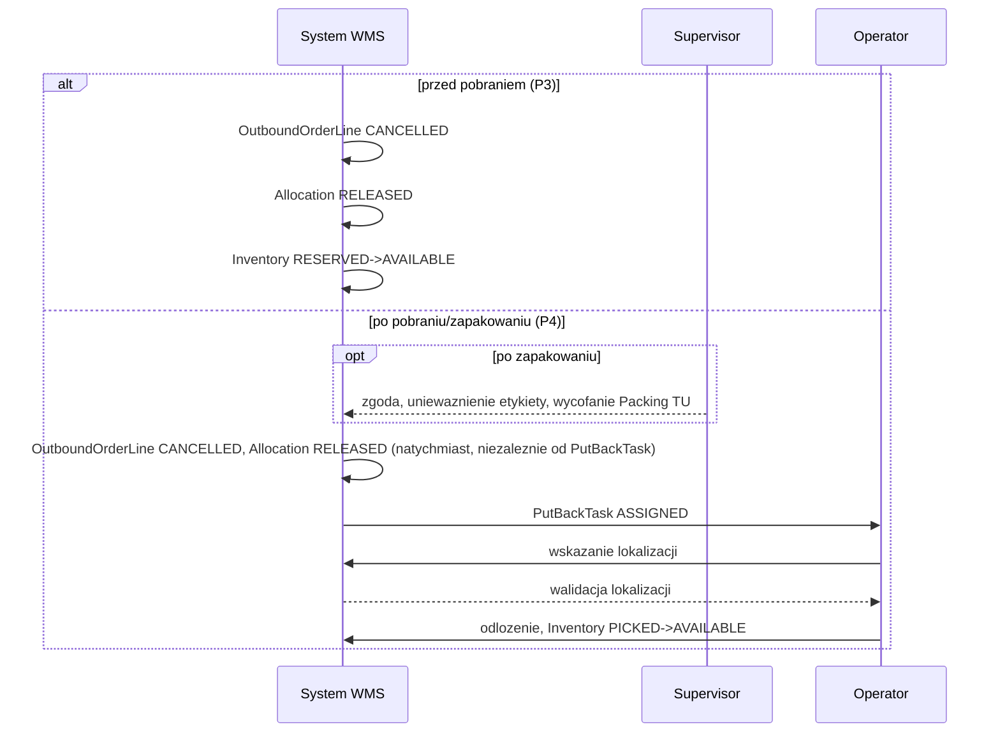

# PROCES 3: RESERVATION_RELEASE

**Projekt:** WMSAI Outbound
**Wersja:** 1.2 | **Data:** 2026-08-24 | **Autor:** Analityk Biznesowy
**Geneza:** dokument powstał przez rozwinięcie zarchiwizowanego `propozycja_procesow_outbound.md` v1.30 §3.3 (Zwolnienie rezerwacji przed fizycznym pobraniem) do formatu krok-po-kroku zgodnego z `SZABLON_PROCESU.md`. Zarchiwizowany dokument jest materiałem historycznym, nie źródłem prawdy — źródłem prawdy jest ten plik (`DEC-A14`).
**Poprzedni proces:** PROCES 1 (Standard Fulfillment) — żądanie anulowania przed rozpoczęciem fizycznej kompletacji, albo auto-zwolnienie wg polityki utrzymania rezerwacji.
**Następny proces:** brak — zdarzenie końcowe zamyka ścieżkę anulowania bez pracy fizycznej. Fizyczny put-back (PROCES 4) przejmuje wyłącznie część już pobraną w wyjątku opisanym niżej (**KROK 2**, Ścieżka B).
**Zakres dokumentu:** opis procesu biznesowego anulowania realizacji, gdy towar był zarezerwowany, ale nie pobrany — bez żadnej pracy fizycznej operatora. Katalog stanów, przejść i zdarzeń domenowych jest utrzymywany w `model_stanow_outbound.md` — ten dokument opisuje zachowanie, nie definiuje nowych stanów.

---

## Cel procesu

Anulować realizację `OutboundOrder`/`OutboundOrderLine`, gdy towar był zarezerwowany (`Allocation RESERVED`), ale fizyczna kompletacja jeszcze się nie rozpoczęła — najtańszy wariant anulowania, bez żadnego zaangażowania operatora magazynowego. Proces obejmuje też auto-zwolnienie rezerwacji wynikające z polityki magazynu (np. wygaśnięcie priorytetu utrzymania rezerwacji), nie tylko żądania jawne.

## Uczestnicy

- **System WMS** — weryfikacja braku fizycznej kompletacji, zwolnienie `Allocation`, aktualizacja statusów, auto-zwolnienie wg polityki.
- **Warehouse Supervisor** — udział wyłącznie, jeśli polityka magazynu tego wymaga (np. akceptacja żądania anulowania pochodzącego z zewnątrz); nie jest wymagany dla auto-zwolnienia.

## Zdarzenie startowe

Żądanie anulowania `OutboundOrder`/`OutboundOrderLine` przed fizycznym pobraniem, albo auto-zwolnienie wg polityki utrzymania rezerwacji.

## Przebieg procesu

---

### KROK 1 — Weryfikacja braku fizycznej kompletacji
**[System WMS]**

- System WMS sprawdza, czy dla danej `OutboundOrderLine` rozpoczęto już fizyczną kompletację — czyli czy nastąpiło potwierdzone pobranie do Picking `TU` (skan `TU` i ilość, PROCES 1 **KROK 6**).

◇ **Czy fizyczna kompletacja została już rozpoczęta?**

**Ścieżka A — NIE (towar wyłącznie zarezerwowany, `Allocation RESERVED`, brak pobrania) → [System WMS]**
- Przejście do **KROK 2**.

**Ścieżka B — TAK, ale w oknie między pobraniem fizycznym a jego potwierdzeniem → [System WMS]**
- Patrz **„Wyjątki i ścieżki alternatywne" → „pobranie fizycznie rozpoczęte przed zwolnieniem"**.

**Ścieżka C — TAK, kompletacja formalnie potwierdzona (`OutboundOrderLine PICKING`/`SHORT_PICKED`/`PICKED`/`PACKED`) → [System WMS]**
- Ten proces nie ma zastosowania — anulowanie tej pozycji przechodzi do Fizycznego put-back (PROCES 4).

---

### KROK 2 — Zwolnienie `Allocation`
**[System WMS]**

- `Allocation RESERVED → RELEASED` (**R1**).
- Zapas wraca `Inventory RESERVED → AVAILABLE` (**R2**).

---

### KROK 3 — Aktualizacja statusów `OutboundOrderLine`/`OutboundOrder`
**[System WMS]**

- `OutboundOrderLine` (`CREATED`/`SHORT_ALLOCATED`/`ALLOCATED`) przechodzi w `CANCELLED` (**R3**).
- Ilość objęta zwolnioną `Allocation` wraca do `ATPReservation` właściwej `CustomerOrderLine`.

◇ **Jaka jest przyczyna anulowania?**

**Ścieżka A — niedobór (`SHORT_ALLOCATED`, decyzja Supervisora „czekamy"/eskalacja) → [System WMS]**
- Część niezrealizowana przechodzi `CustomerOrderLine → BACKORDERED` — patrz PROCES 1 „Wyjątki i ścieżki alternatywne" (**R4**).

**Ścieżka B — anulowanie ogólne (niezwiązane z niedoborem) → [System WMS]**
- `CustomerOrderLine → CANCELLED` — patrz PROCES 1 „Wyjątki i ścieżki alternatywne", „Anulowanie ogólne" (**R5**).

---

### KROK 4 — Auto-zwolnienie wg polityki
**[System WMS]**

- Gdy zwolnienie wynika z automatycznej polityki utrzymania rezerwacji magazynu (nie z jawnego żądania anulowania), System WMS wykonuje **KROK 1**–**KROK 3** bez angażowania `Warehouse Supervisor` — powiadomienie nie jest wymagane (**R6**).
- Polityka utrzymywania częściowej rezerwacji jest parametrem konfiguracyjnym magazynu i ma trzy warianty: utrzymanie rezerwacji, automatyczne zwolnienie po określonym czasie albo skierowanie sprawy do decyzji `Warehouse Supervisor` (**R9**).
- Czas utrzymania częściowej rezerwacji nie zależy od `priority` ani od `slaDeadline` `CustomerOrder` (**R10**).

---

## Zdarzenie końcowe

Brak aktywnej `Allocation` dla danej pozycji; zapas ponownie `AVAILABLE`; brak jakiejkolwiek pracy fizycznej operatora.

---

## Diagram sekwencji

> diagram współdzielony z `proces_4_physical_putback.md`.

### 6.7 Zwolnienie rezerwacji i fizyczny put-back

## Obiekty danych

| Obiekt | Kluczowe pola | Status(y) |
|---|---|---|
| `Allocation` | referencja `OutboundOrderLine`/`Inventory` | `RESERVED → RELEASED` |
| `Inventory` (zakres Outbound) | — | `RESERVED → AVAILABLE` |
| `OutboundOrderLine` | `pickedQty` (pozostaje `0`) | `CREATED`/`SHORT_ALLOCATED`/`ALLOCATED → CANCELLED` |
| `CustomerOrderLine` | `ATPReservation` | odzyskana ilość; `→ BACKORDERED` (niedobór) albo `→ CANCELLED` (anulowanie ogólne) |
| `PickTask` | — | `ASSIGNED`/`IN_PROGRESS → CANCELLED` — wyłącznie w wyjątku „pobranie fizycznie rozpoczęte przed zwolnieniem" |

---

## Wyjątki i ścieżki alternatywne

| Warunek | Zachowanie | Skutek |
|---|---|---|
| Pobranie fizycznie rozpoczęte przed zwolnieniem — między potwierdzeniem pobrania z lokalizacji (skan adresu i `SKU`) a potwierdzeniem odłożenia do Picking `TU` (skan `TU` i ilość) `Allocation` pozostaje `RESERVED` — operator mógł już fizycznie zabrać towar z lokalizacji, zanim system to zarejestrował | Jeśli w tym oknie nastąpi zwolnienie `Allocation` (`RESERVED → RELEASED`): (1) System WMS anuluje powiązany `PickTask` (`ASSIGNED`/`IN_PROGRESS → CANCELLED`); (2) wysyła operatorowi na RF polecenie odłożenia pobranego `SKU` z powrotem na lokalizację źródłową, jeśli `SKU` trafiło już fizycznie do Picking `TU`, zanim ilość została potwierdzona | To **nie jest** formalny `PutBackTask` (PROCES 4) — towar wraca dokładnie na lokalizację, z której został wzięty, bez wyboru i walidacji nowej lokalizacji (**R7**) |
| Część `OutboundOrderLine` już formalnie pobrana (kompletacja potwierdzona) | Ten proces nie obejmuje pobranej części | Anulowanie pobranej części przechodzi do Fizycznego put-back (PROCES 4) — patrz **KROK 1**, Ścieżka C (**R8**) |

---

## Reguły biznesowe

- **R1** — Zwolnienie rezerwacji przed fizycznym pobraniem przenosi `Allocation RESERVED → RELEASED`.
- **R2** — Zwolnienie `Allocation` zwraca powiązany zapas `Inventory RESERVED → AVAILABLE`.
- **R3** — `OutboundOrderLine` w `CREATED`/`SHORT_ALLOCATED`/`ALLOCATED` przechodzi w `CANCELLED` przy zwolnieniu rezerwacji przed pobraniem.
- **R4** — Gdy przyczyną jest niedobór (`SHORT_ALLOCATED`), niezrealizowana część `CustomerOrderLine` przechodzi w `BACKORDERED`.
- **R5** — Gdy przyczyną jest anulowanie ogólne (niezwiązane z niedoborem), `CustomerOrderLine` przechodzi w `CANCELLED`.
- **R6** — Auto-zwolnienie rezerwacji wg polityki magazynu nie wymaga powiadomienia `Warehouse Supervisor`.
- **R7** — Jeśli zwolnienie `Allocation` nastąpi w oknie między fizycznym pobraniem z lokalizacji a jego potwierdzeniem w systemie, System WMS anuluje `PickTask` i poleca operatorowi zwrot towaru na lokalizację źródłową — bez formalnego `PutBackTask`.
- **R8** — Ten proces nie obejmuje pozycji z formalnie potwierdzoną kompletacją (`PICKING`/`SHORT_PICKED`/`PICKED`/`PACKED`) — dla nich właściwy jest Fizyczny put-back (PROCES 4).
- **R9** — Polityka utrzymywania częściowej rezerwacji jest parametrem konfiguracyjnym magazynu i ma trzy warianty: utrzymanie rezerwacji, automatyczne zwolnienie po określonym czasie albo skierowanie sprawy do decyzji `Warehouse Supervisor`.
- **R10** — Czas utrzymania częściowej rezerwacji nie zależy od `priority` ani od `slaDeadline` `CustomerOrder`.

## Powiązanie z procesami sąsiednimi

- **Poprzedni:** PROCES 1 (Standard Fulfillment) — żądanie anulowania przed rozpoczęciem fizycznej kompletacji, przekazane w dowolnym statusie `OutboundOrderLine` sprzed `PICKING` (`CREATED`/`SHORT_ALLOCATED`/`ALLOCATED`).
- **Następny:** brak dla ilości objętej tym procesem (zapas wraca `AVAILABLE`, dostępny dla dowolnej przyszłej realizacji — PROCES 1 **KROK 1A**/**KROK 4**). Fizyczny put-back (PROCES 4) przejmuje wyłącznie ilość już pobraną w wyjątku „pobranie fizycznie rozpoczęte przed zwolnieniem".

## Historia zmian

- **1.2 (2026-08-24)** — Przeniesienie do warstwy normatywnej pełnej polityki utrzymywania częściowej rezerwacji, która po migracji istniała wyłącznie w rejestrze decyzji: trzy konfigurowalne warianty oraz niezależność czasu utrzymania od priorytetu i terminu realizacji. Dotychczasowa reguła o braku obowiązku powiadamiania Supervisora pozostaje bez zmian.
- **Bez zmiany wersji (2026-08-22)** — partia 3/5 domknięcia audytu V3-CD: nagłówek metryki „Źródło" przeredagowany na „Geneza" (zarchiwizowany `propozycja_procesow_outbound.md` jako materiał historyczny, nie źródło prawdy, `DEC-A14`). Bez zmian merytorycznych.
- **1.1 (2026-08-22)** — Przeniesiono współdzielony z `proces_4_physical_putback.md` diagram sekwencji §6.7 z `propozycja_procesow_outbound.md` przy archiwizacji B16.
- **1.0 (2026-08-18)** — Wersja bazowa. Rozwinięcie `propozycja_procesow_outbound.md` v1.30 §3.3 (kroki 1–4 i wyjątek) do formatu krok-po-kroku zgodnego z `SZABLON_PROCESU.md`, z lokalną numeracją `R1`–`R8`. Uzupełnienie `BACKLOG.md` B5 na życzenie Darka (P3 dostaje własny plik, w odróżnieniu od pierwotnie zawężonego zakresu do P1/P2/P4).
