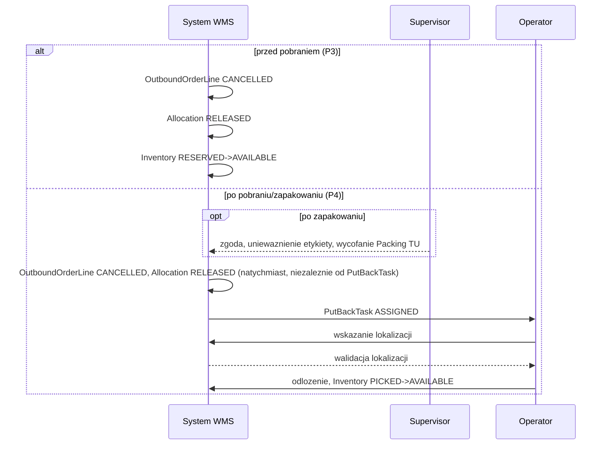

# PROCES 4: PHYSICAL_PUTBACK

**Projekt:** WMSAI Outbound
**Wersja:** 1.2 | **Data:** 2026-08-23 | **Autor:** Analityk Biznesowy
**Geneza:** dokument powstał przez rozwinięcie zarchiwizowanego `propozycja_procesow_outbound.md` v1.29 §3.4 (Fizyczny put-back po kompletacji lub pakowaniu) i §3.5 (część dot. P4/anulowania) do formatu krok-po-kroku zgodnego z `SZABLON_PROCESU.md`. Zarchiwizowany dokument jest materiałem historycznym, nie źródłem prawdy — źródłem prawdy jest ten plik (`DEC-A14`).
**Poprzedni proces:** PROCES 1 (Standard Fulfillment) — anulowanie po fizycznym pobraniu do Picking `TU` lub po zapakowaniu do Packing `TU`; Outbound Crossdock (PROCES 2) — anulowanie cross-dockowej `OutboundOrderLine` po `PACKED`. Zwolnienie rezerwacji przed pobraniem (PROCES 3) — poprzedza ten proces, gdy anulowanie następuje **przed** fizycznym pobraniem (wtedy PROCES 4 nie jest wyzwalany).
**Następny proces:** brak — zdarzenie końcowe tego procesu zamyka ścieżkę anulowania; towar wraca do standardowego zapasu (`Inventory AVAILABLE`), dostępny dla dowolnej przyszłej realizacji.
**Zakres dokumentu:** opis procesu biznesowego fizycznego zwrotu pobranego lub zapakowanego towaru do dostępnego zapasu po zatwierdzonym anulowaniu. Katalog stanów, przejść i zdarzeń domenowych jest utrzymywany w `model_stanow_outbound.md` — ten dokument opisuje zachowanie, nie definiuje nowych stanów.

---

## Cel procesu

Zwrócić fizycznie pobrany lub zapakowany towar do dostępnego zapasu po zatwierdzonym anulowaniu `CustomerOrderLine`/`OutboundOrderLine` — niezależnie od tego, czy anulowanie wynika z niedoboru (`SHORT_ALLOCATED`/`SHORT_PICKED`) czy z anulowania ogólnego. Proces rozdziela natychmiastowy skutek logiczny anulowania (zmiana statusów, zwrot rezerwacji) od jego fizycznego dopełnienia (operator faktycznie odkłada towar), które może nastąpić później.

## Uczestnicy

- **Warehouse Operator** — wejście do modułu zwrotów na terminalu RF, otrzymanie zadania (krok 3, **R9**); fizyczne odłożenie towaru na wskazaną lub zaproponowaną lokalizację (krok 3–4).
- **Warehouse Supervisor** — zgoda na anulowanie po zapakowaniu (krok 1, gdy dotyczy); może obejmować unieważnienie etykiety i wycofanie Packing `TU` z `Shipment`.
- **System WMS** — natychmiastowa aktualizacja statusów logicznych (krok 2), utworzenie `PutBackTask` (krok 3), propozycja/walidacja lokalizacji docelowej (krok 4), aktualizacja `Inventory` po zakończeniu (krok 5).

## Zdarzenie startowe

Zatwierdzone anulowanie `CustomerOrderLine`/`OutboundOrderLine`, gdy towar został już fizycznie pobrany do Picking `TU` (`PICKING`/`SHORT_PICKED`/`PICKED`) lub zapakowany do Packing `TU` (`PACKED`) — niezależnie od tego, czy przyczyną było `SHORT_ALLOCATED`/`SHORT_PICKED` (PROCES 1 „Wyjątki i ścieżki alternatywne"), anulowanie ogólne (tamże), czy anulowanie cross-dockowej `OutboundOrderLine` po `PACKED` (PROCES 2 „Wyjątki i ścieżki alternatywne").

## Przebieg procesu

---

### KROK 1 — Zgoda na anulowanie po zapakowaniu
**[Warehouse Supervisor]**

◇ **Czy anulowanie dotyczy `OutboundOrderLine` już `PACKED`?**

**Ścieżka A — TAK → [Warehouse Supervisor]**
- Wymagana zgoda `Warehouse Supervisor` (**R1**); może obejmować unieważnienie etykiety i wycofanie Packing `TU` z `Shipment`.
- Dozwolone wyłącznie, dopóki powiązany `Shipment` nie wszedł w `POSTING_PENDING` — od tego momentu ta ścieżka anulowania jest zamknięta, obsługa wyłącznie jako zwrot towaru po wydaniu (Return Receipt, poza zakresem tego dokumentu) (**R2**).
- Przejście do **KROK 2**.

**Ścieżka B — NIE (`PICKING`/`SHORT_PICKED`/`PICKED`, nie `PACKED`) → [System WMS]**
- Bez wymogu zgody Supervisora — przejście wprost do **KROK 2**.

---

### KROK 2 — Natychmiastowa aktualizacja statusów logicznych
**[System WMS]**

- Natychmiast po zatwierdzeniu anulowania powiązanej `CustomerOrderLine` (która sama przechodzi w `CANCELLED`): `OutboundOrderLine → CANCELLED`, `Allocation CONFIRMED → RELEASED` (dla cross-dockingu: brak `Allocation`, krok pomijany — patrz `proces_2_outbound_crossdock.md` **R19**), a ilość objęta tą `Allocation` wraca do `ATPReservation` tej `CustomerOrderLine` (**R3**).
- Te przejścia **nie czekają** na fizyczne odłożenie towaru (**R4**) — logiczny skutek anulowania jest natychmiastowy, fizyczne dopełnienie następuje w **KROK 3**–**KROK 5**.
- Jeśli anulowanie dotyczyło `PACKED` (**KROK 1**, Ścieżka A): System WMS wycofuje Packing `TU` z `Shipment` (jeśli dotyczy) po uzyskanej zgodzie.
- Przejście do **KROK 3**.

---

### KROK 3 — Utworzenie `PutBackTask`
**[System WMS]**

◇ **Czy `pickedQty > 0`?**

**Ścieżka A — TAK → [System WMS]**
- System WMS tworzy osobne zadanie fizycznego put-back dla operatora, dla ilości pobranej: `PutBackTask CREATED` (**R5**); zadanie czeka na operatora i zostaje przydzielone zgodnie z **R9**.
- Przejście do **KROK 4**.

**Ścieżka B — NIE (`pickedQty = 0`) → [System WMS]**
- Brak fizycznej ilości do zwrotu — proces kończy się na **KROK 2** dla tej pozycji; `PutBackTask` nie powstaje.

---

### KROK 4 — Wskazanie i walidacja lokalizacji docelowej
**[Warehouse Operator / System WMS]**

- Operator rozpoczyna odkładanie: `PutBackTask ASSIGNED → IN_PROGRESS`.
- Lokalizacja docelowa jest proponowana przez System WMS lub wskazywana przez operatora: `PutBackTask IN_PROGRESS → LOCATION_VALIDATION` — i musi przejść walidację WMS (**R6**).

◇ **Czy wskazana lokalizacja przeszła walidację?**

**Ścieżka A — TAK → [System WMS]**
- Przejście do **KROK 5**.

**Ścieżka B — NIE (lokalizacja odrzucona) → [System WMS]**
- `PutBackTask LOCATION_VALIDATION → IN_PROGRESS` — powrót do wskazania lokalizacji; operator wskazuje kolejną lokalizację albo korzysta z rekomendacji systemu.
- 🔁 Pętla `IN_PROGRESS ↔ LOCATION_VALIDATION` **nie ma limitu prób ani automatycznej eskalacji** (**R7**); rekomendacja Systemu WMS pozostaje stale dostępna operatorowi.

---

### KROK 5 — Fizyczne odłożenie
**[Warehouse Operator]**

- Po zwalidowaniu lokalizacji operator fizycznie odkłada towar: `PutBackTask LOCATION_VALIDATION → COMPLETED` (stan końcowy `PutBackTask`).
- `Inventory PICKED → AVAILABLE` (**R8**) — towar wraca do standardowego, dostępnego zapasu (`ATP`), na równi z dowolnym innym zapasem tej lokalizacji.

---

## Zdarzenie końcowe

Dwa zdarzenia końcowe tego procesu, o różnym momencie wystąpienia:

- **(a) Natychmiast po zatwierdzeniu anulowania (KROK 2):** `OutboundOrderLine → CANCELLED`, `Allocation → RELEASED`, `ATPReservation` zwrócona.
- **(b) Po zakończeniu `PutBackTask` (KROK 5):** towar fizycznie na zwalidowanej lokalizacji, `Inventory → AVAILABLE`.

Ilość dostępna od (b) jest zwykłym zapasem `AVAILABLE` — nigdy nie wraca do statusów Inbound (`IN_PUTAWAY` itd.), niezależnie od tego, czy pierwotnie pochodziła ze standardowej realizacji czy z cross-dockingu.

---

## Diagram sekwencji

> diagram współdzielony z `proces_3_reservation_release.md`.

### 6.7 Zwolnienie rezerwacji i fizyczny put-back

## Obiekty danych

| Obiekt | Kluczowe pola | Status(y) |
|---|---|---|
| `PutBackTask` | referencja do anulowanej pozycji | `CREATED → ASSIGNED → IN_PROGRESS → LOCATION_VALIDATION → COMPLETED`; pętla `IN_PROGRESS ↔ LOCATION_VALIDATION` bez limitu |
| `OutboundOrderLine` | `pickedQty` | `PICKING`/`SHORT_PICKED`/`PICKED`/`PACKED → CANCELLED` (natychmiast, **KROK 2**) |
| `CustomerOrderLine` | `ATPReservation` | `→ CANCELLED`; `ATPReservation` odzyskana w pełnej pobranej ilości |
| `Allocation` | — | `CONFIRMED → RELEASED` (natychmiast, **KROK 2**); nie dotyczy cross-dockingu (`Allocation` nie istnieje) |
| `Inventory` (zakres Outbound) | — | `PICKED → AVAILABLE` (**KROK 5**, po zakończeniu `PutBackTask`) |
| Outbound `TU` (`PackUnit`) | `TU_NUMBER` | Wycofanie z `Shipment`, gdy anulowanie dotyczyło `PACKED` (**KROK 1**, Ścieżka A) — poza formalnym cyklem stanów `TU` (operacja na powiązaniu z `Shipment`, nie na statusie `TU`) |

---

## Wyjątki i ścieżki alternatywne

| Warunek | Zachowanie | Skutek |
|---|---|---|
| Anulowanie `OutboundOrderLine PACKED` po wejściu powiązanego `Shipment` w `POSTING_PENDING` | **Niedozwolone** w ramach tego procesu | Jedyna ścieżka: zwrot towaru po wydaniu (Return Receipt, poza zakresem tego dokumentu) (**R2**) |
| Brak zwalidowanej lokalizacji przy odkładaniu (**KROK 4**) | Pętla `IN_PROGRESS → LOCATION_VALIDATION → IN_PROGRESS`, bez limitu prób ani automatycznej eskalacji; rekomendacja Systemu WMS stale dostępna | Operator kontynuuje próby wskazania lokalizacji do skutku (**R7**) |
| `pickedQty = 0` w momencie anulowania (**KROK 3**, Ścieżka B) | `PutBackTask` nie powstaje — nie ma nic do fizycznego zwrotu | Proces kończy się na aktualizacji statusów logicznych (**KROK 2**) |
| Granica ogólna — po zamknięciu `CarrierManifest` | Anulowanie i put-back są niemożliwe | Zgodnie z granicą opisaną w PROCES 1 „Wyjątki i ścieżki alternatywne" (anulowanie ogólne) |

---

## Reguły biznesowe

- **R1** — Anulowanie `OutboundOrderLine` już `PACKED` wymaga zgody `Warehouse Supervisor`; może obejmować unieważnienie etykiety i wycofanie Packing `TU` z `Shipment`.
- **R2** — Anulowanie po zapakowaniu jest dozwolone wyłącznie, dopóki powiązany `Shipment` nie wszedł w `POSTING_PENDING`; od tego momentu jedyną ścieżką jest zwrot towaru po wydaniu (Return Receipt), poza zakresem tego procesu.
- **R3** — Zatwierdzenie anulowania `CustomerOrderLine` natychmiast przenosi `OutboundOrderLine → CANCELLED` i `Allocation → RELEASED`, zwracając ilość do `ATPReservation` tej `CustomerOrderLine`.
- **R4** — Aktualizacja statusów logicznych anulowania (**KROK 2**) nie czeka na fizyczne odłożenie towaru — te dwa skutki są rozdzielone w czasie.
- **R5** — Gdy `pickedQty > 0`, System WMS tworzy osobne zadanie `PutBackTask` dla operatora, dla ilości pobranej.
- **R6** — Lokalizacja docelowa put-back jest proponowana przez System WMS lub wskazywana przez operatora i musi przejść walidację WMS przed odłożeniem.
- **R7** — Pętla `IN_PROGRESS ↔ LOCATION_VALIDATION` przy odrzuceniu lokalizacji nie ma limitu prób ani automatycznej eskalacji; rekomendacja Systemu WMS pozostaje stale dostępna operatorowi.
- **R8** — Po zakończeniu `PutBackTask` (fizyczne odłożenie) `Inventory` przechodzi `PICKED → AVAILABLE`, stając się zwykłym, dostępnym zapasem.
- **R9** — `Warehouse Operator` wybiera na terminalu RF moduł zwrotów. System WMS przydziela mu kolejny `PutBackTask` w kolejności zgłoszenia zadań, gdy operator nie ma aktywnego zadania magazynowego żadnego typu. Moduł nie ma wskazania strefy, a `PutBackTask` nie niesie `priority` ani `slaDeadline` — pozycja, której dotyczy, jest już anulowana.

## Powiązanie z procesami sąsiednimi

- **Poprzedni:** PROCES 1 (Standard Fulfillment) — anulowanie po pobraniu do Picking `TU` lub po zapakowaniu do Packing `TU` (patrz PROCES 1 „Wyjątki i ścieżki alternatywne"); Outbound Crossdock (PROCES 2) — anulowanie cross-dockowej `OutboundOrderLine` po `PACKED`. Zwolnienie rezerwacji przed pobraniem (PROCES 3) obsługuje anulowanie **przed** fizycznym pobraniem — w tym wariancie PROCES 4 nie jest wyzwalany.
- **Następny:** brak — towar wraca do `Inventory AVAILABLE`, dostępny dla dowolnej przyszłej realizacji (PROCES 1 **KROK 1A**/**KROK 4** albo Outbound Crossdock **KROK 1**).

## Historia zmian

- **1.2 (2026-08-23)** — Zasady podejmowania zadań magazynowych (`BACKLOG.md` B10): nowa **R9** — operator wybiera moduł zwrotów na terminalu RF, System WMS przydziela kolejny `PutBackTask` w kolejności zgłoszenia, bez wskazania strefy. Zaktualizowano sekcję „Uczestnicy" i **KROK 3**. Uzasadnienie pełne w `decyzje_outbound_wms.md` `DEC-L45`.
- **Bez zmiany wersji (2026-08-22)** — partia 3/5 domknięcia audytu V3-CD: nagłówek metryki „Źródło" przeredagowany na „Geneza" (zarchiwizowany `propozycja_procesow_outbound.md` jako materiał historyczny, nie źródło prawdy, `DEC-A14`). Bez zmian merytorycznych.
- **1.1 (2026-08-22)** — Przeniesiono współdzielony z `proces_3_reservation_release.md` diagram sekwencji §6.7 z `propozycja_procesow_outbound.md` przy archiwizacji B16.
- **1.0 (2026-08-18)** — Wersja bazowa. Rozwinięcie `propozycja_procesow_outbound.md` v1.29 §3.4 (kroki 1–5) i części §3.5 dotyczącej P4/anulowania do formatu krok-po-kroku zgodnego z `SZABLON_PROCESU.md`, z lokalną numeracją `R1`–`R8`. Realizacja `BACKLOG.md` B5.
