# State model (state machines) — Outbound

**Project:** WMSAI Outbound  
**Version:** 1.19 | **Date:** 2026-08-28 | **Author:** Solution Architect  
**Source:** `proces_1_standard_fulfillment.md` v1.20, `proces_2_outbound_crossdock.md` v1.13, `proces_3_reservation_release.md` v1.2, `proces_4_physical_putback.md` v1.2  
**Scope:** states, transitions, domain events and actors for the 17 objects in the §4 catalog. Five objects without a state lifecycle (`TUSetup`, `Carrier`, `CarrierSetup`, `Region`, `Sequence`) are included only as catalog entries (master data/configuration), without state machines.  
**Implements:** `decyzje_outbound_wms.md` §10 “Open issues” items 1–2 (catalog of states and transitions; business events emitted on transitions and actors); `BACKLOG.md` B5.

## Convention

- **Domain event** — formal name of the business event emitted on a transition, `PascalCase`, English (`<Object><CompletedPastVerb>`), consistent with the EN status naming convention. When several different transitions lead to the same target state through the same business logic, one common name is used (source state/path is carried in the payload, not in the name); when the same target state is reached through different business logic, different names are used.
- **Ref** — reference to a process step in `proces_1_standard_fulfillment.md`–`proces_4_physical_putback.md` or to local rule `Rn` of the relevant process file, written with the process prefix (for example `P1 R41`, `P2 R7`). Cross-cutting exceptions (former PROCESS 5) have their “Exceptions and alternative paths” sections in `proces_1` and `proces_2`.
- **“not explicit in P1–P4”** — the transition exists in the state machine, but no numbered process step describes its trigger. Two such cases found while creating this document were reported and closed as `BACKLOG.md` B15 — see “Gaps reported and closed” at the end of the document.
- **Maturity** — all statuses in this document = `BUILT`; there is no history of iterative gap closure like in Inbound.
- `mermaid` diagrams and attribute tables describe the same behavior model as `proces_1`–`proces_4`; if inconsistent, the process file decides.

---

## 1. `CustomerOrder`

Customer-order header. In steps 3–13 the header status is continuously calculated from `CustomerOrderLine` statuses (Continuous Function F1, `proces_1_standard_fulfillment.md` »Continuous functions (cross-cutting)«) — it is not set as a separate sequential step, except for `PARTIALLY_SHIPPED` (≥1 line `SHIPPED`) and `BACKORDERED` (all active lines `BACKORDERED`).

**Initial:** `RECEIVED` · **Terminal:** `REJECTED`, `CANCELLED`, `CLOSED` · **Maturity:** `BUILT`

| From | Event/condition | To | Domain event | Actor | Ref |
|---|---|---|---|---|---|
| (none) | `CustomerOrder` arrives from an external system | `RECEIVED` | `CustomerOrderReceived` | System WMS | P1, start event |
| `RECEIVED` | validation OK | `VALIDATED` | `CustomerOrderValidated` | System WMS | P1 step 1 |
| `RECEIVED` | validation negative | `REJECTED` | `CustomerOrderRejected` | System WMS | P1 step 1 |
| `VALIDATED` | accepted for fulfillment, no hold | `ACCEPTED` | `CustomerOrderAccepted` | System WMS | P1 step 1 |
| `ACCEPTED` | hold | `ON_HOLD` | `CustomerOrderHeld` | Supervisor/System WMS | P1 step 1 |
| `ON_HOLD` | hold removed | `ACCEPTED` | `CustomerOrderReleased` | Supervisor/System WMS | P1 step 2 |
| `ACCEPTED` | `OutboundOrder` created (cyclic planning, full-coverage condition for `allowPartialShipment=false`) | `IN_FULFILLMENT` | `CustomerOrderFulfillmentStarted` | System WMS | P1 step 2a/3 |
| `IN_FULFILLMENT` | all active `OutboundOrder`/`OutboundOrderLine` cancelled, no `PACKED` | `ACCEPTED` | `CustomerOrderFulfillmentReverted` | System WMS/Supervisor | P1 »Exceptions and alternative paths« `SHORT_ALLOCATED`/`SHORT_PICKED`, “wait” result |
| `IN_FULFILLMENT` | all active `CustomerOrderLine` `BACKORDERED` | `BACKORDERED` | `CustomerOrderBackordered` | System WMS | P1 Continuous Function F1 |
| `BACKORDERED` | at least one line resumes fulfillment | `IN_FULFILLMENT` | `CustomerOrderFulfillmentResumed` | System WMS | P1 Continuous Function F1 |
| `IN_FULFILLMENT` | part dispatched | `PARTIALLY_SHIPPED` | `CustomerOrderPartiallyShipped` | System WMS | P1 step 13 + F1 |
| `PARTIALLY_SHIPPED` | remainder dispatched | `SHIPPED` | `CustomerOrderShipped` | System WMS | P1 step 13 + F1 |
| `IN_FULFILLMENT` | all dispatched | `SHIPPED` | `CustomerOrderShipped` | System WMS | P1 step 13 + F1 |
| `SHIPPED` | settled — all contributing `OutboundOrder` `COMPLETED` | `CLOSED` | `CustomerOrderClosed` | System WMS | P1 STEP 13A (`P1 R41`) |
| `ACCEPTED`/`IN_FULFILLMENT`/`PARTIALLY_SHIPPED` | cancellation (before manifest closure) | `CANCELLED` | `CustomerOrderCancelled` | Supervisor/System WMS | P1 »Exceptions and alternative paths« “General cancellation” items 1–4 |

> **Note:** if, after cancellation due to `SHORT_ALLOCATED`/`SHORT_PICKED`, at least one `OutboundOrderLine` remains `PACKED`, the header **does not** return to `ACCEPTED` — it remains `IN_FULFILLMENT` with `WARNING` set.

**Attributes:**

| Attribute | Type | Description |
|---|---|---|
| `priority` | number/enum (warehouse dictionary) | Affects `ATPReservation` assignment order (`P1 R2`) and `PickTask` order (`P1 R14`); does not take away an existing `Allocation RESERVED` (`P1 R10`). |
| `slaDeadline` | date/time | Queue criterion alongside `priority`; ordering parameterized per warehouse (`P1 R2`, `P1 R14`). |
| `allowPartialShipment` | flag (`true`/`false`) | `false` = all issued in one complete `Shipment`; `false→true` change is permanent and requires a reason (`P1 R6`, `P1 R47`). |
| `WARNING` | flag + text description | Signals orders requiring review to `Warehouse Supervisor` (`P1 R6`). |

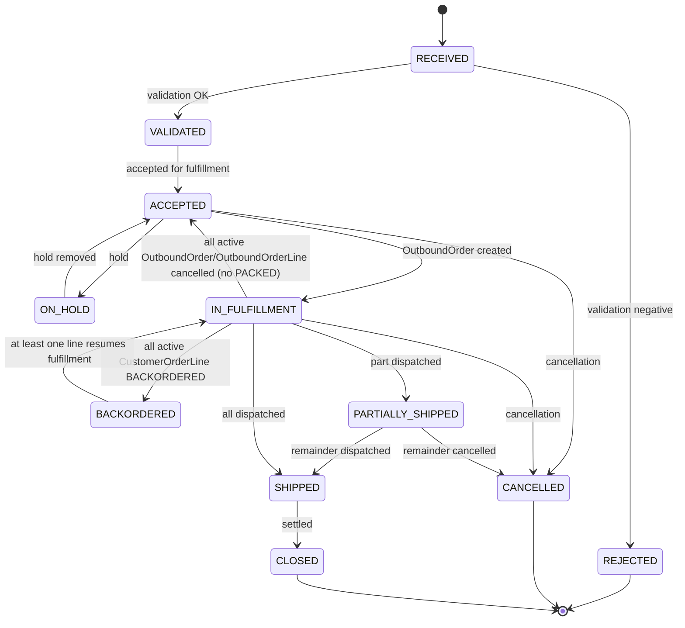

---

## 2. `CustomerOrderLine`

A `CustomerOrder` line with its own status lifecycle; aggregation to the header is described in `proces_1_standard_fulfillment.md` »Continuous functions (cross-cutting)« (Continuous Function F1).

**Initial:** `OPEN` · **Terminal:** `FULFILLED`, `CANCELLED` · **Maturity:** `BUILT`

| From | Event/condition | To | Domain event | Actor | Ref |
|---|---|---|---|---|---|
| (none) | order arrives with lines | `OPEN` | `CustomerOrderLineOpened` | System WMS | P1, start event |
| `OPEN` | assigned to `OutboundOrderLine` (planning) | `PLANNED` | `CustomerOrderLinePlanned` | System WMS | P1 step 3 |
| `PLANNED` | part dispatched | `PARTIALLY_FULFILLED` | `CustomerOrderLinePartiallyFulfilled` | System WMS | P1 step 13 |
| `PLANNED`/`PARTIALLY_FULFILLED` | all/remainder dispatched | `FULFILLED` | `CustomerOrderLineFulfilled` | System WMS | P1 step 13 |
| `OPEN` | no stock (`ATPReservation = 0`) | `BACKORDERED` | `CustomerOrderLineBackordered` | System WMS | P1 step 1a |
| `BACKORDERED` | stock available or `CrossDockPickTask` generated | `PLANNED` | `CustomerOrderLineFulfillmentResumed` | System WMS | P1 step 3–4 / P2 STEP 1 |
| `PLANNED` | shortage (`SHORT_ALLOCATED`/`SHORT_PICKED`) or missing/`DAMAGED`/empty `TU` in cross-docking | `BACKORDERED` | `CustomerOrderLineShortfallDetected` | System WMS | P1 »Exceptions and alternative paths« / P2 STEP 2 |
| `BACKORDERED` | general cancellation | `CANCELLED` | `CustomerOrderLineCancelled` | System WMS/Supervisor | P1 »Exceptions and alternative paths« “General cancellation” |
| `PLANNED` | sibling line withdrawn, no own shortage | `OPEN` | `CustomerOrderLineReverted` | System WMS | P1 »Exceptions and alternative paths« `SHORT_ALLOCATED`/`SHORT_PICKED`, “wait” result (sibling lines) |
| `PARTIALLY_FULFILLED` | remainder cancelled | `CANCELLED` | `CustomerOrderLineCancelled` | System WMS/Supervisor | P1 »Exceptions and alternative paths« “General cancellation” item 4 |
| `OPEN`/`PLANNED` | cancellation | `CANCELLED` | `CustomerOrderLineCancelled` | System WMS/Supervisor | P1 »Exceptions and alternative paths« “General cancellation” items 1–3 |

**Attributes:**

| Attribute | Type | Description |
|---|---|---|
| `Quantity` | number | Quantity ordered on this line. |
| `ATPReservation` | number | Soft `ATP` reservation, set when `CustomerOrder ACCEPTED` (`P1 R1`, `P1 R11`, `P1 R12`). |
| `crossDockEligibleQty` | number (calculated) | Quantity eligible for cross-docking; calculated when `CrossDockPickTask` is generated (`P2 R6`). |

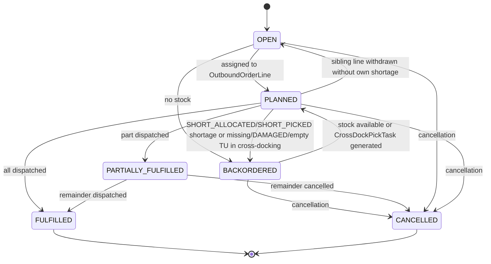

---

## 3. `OutboundOrder`

Header grouping `OutboundOrderLine` for common allocation/picking/packing. `fulfillmentChannel` (`STANDARD`/`CROSSDOCK`) is set at creation and immutable (`P2 R5`). The source of `priority` and `slaDeadline` depends on the channel: for `STANDARD` they are the aggregate of the most urgent value among grouped `CustomerOrder` (`P1 R9`), while for `CROSSDOCK` they are inherited from the parent `CustomerOrder`, under strict grouping conditions (`P2 R43`). `ON_HOLD` does not exist on `OutboundOrder` — fulfillment hold is modeled only at `CustomerOrder` level (§1).

**Initial:** `CREATED` · **Terminal:** `COMPLETED`, `CANCELLED` · **Maturity:** `BUILT`

| From | Event/condition | To | Domain event | Actor | Ref |
|---|---|---|---|---|---|
| (none) | grouping/splitting `CustomerOrderLine` | `CREATED` | `OutboundOrderCreated` | System WMS | P1 step 3 |
| `CREATED` | allocation starts | `ALLOCATION_IN_PROGRESS` | `OutboundOrderAllocationStarted` | System WMS | P1 step 4 |
| `ALLOCATION_IN_PROGRESS`/`SHORT_ALLOCATED` | full reservation / replenished | `ALLOCATED` | `OutboundOrderAllocated` | System WMS | P1 step 4 |
| `ALLOCATION_IN_PROGRESS` | incomplete reservation | `SHORT_ALLOCATED` | `OutboundOrderShortAllocated` | System WMS | P1 step 4 |
| `SHORT_ALLOCATED` | policy/Supervisor decision: cancel | `CANCELLED` | `OutboundOrderCancelled` | System WMS/Supervisor | P1 »Exceptions and alternative paths« `SHORT_ALLOCATED`, “cancel” result |
| `ALLOCATED` | `PickTask` created | `PICKING_IN_PROGRESS` | `OutboundOrderPickingStarted` | System WMS | P1 step 5 |
| `PICKING_IN_PROGRESS` | all `PickTask` completed (aggregate, §5) | `PICKED` | `OutboundOrderPicked` | System WMS | P1 step 6 |
| `PICKING_IN_PROGRESS` | all `OutboundOrderLine` cancelled, none `PACKED` | `CANCELLED` | `OutboundOrderCancelled` | System WMS | P1 »Exceptions and alternative paths« `SHORT_PICKED`, “wait” result; §3 of this document |
| `PICKED` | packing starts | `PACKING_IN_PROGRESS` | `OutboundOrderPackingStarted` | System WMS | P1 step 8–9 |
| `CREATED` | cross-dock: first `CrossDockPickTask` `IN_PROGRESS` | `PACKING_IN_PROGRESS` | `OutboundOrderCrossDockPackingStarted` | System WMS | P2 STEP 2 (`P2 R8`) |
| `PACKING_IN_PROGRESS` | Packing `TU` ready (aggregate) | `PACKED` | `OutboundOrderPacked` | System WMS | P1 step 9 |
| `PACKING_IN_PROGRESS` | cross-dock: all `OutboundOrderLine` `CANCELLED` (shortage/`DAMAGED` with `allowPartialShipment = false` — `P2 R14`/`P2 R15`; `TU` empty before picking — `P2 R18`), none `PACKED` | `CANCELLED` | `OutboundOrderCancelled` | System WMS | P2 STEP 2 (`P2 R37`) |
| `PACKED` | all lines and `TU` packed | `READY_FOR_DISPATCH` | `OutboundOrderReadyForDispatch` | System WMS | P1 step 9 (`P1 R27`) |
| `READY_FOR_DISPATCH` | physical handover after manifest closure | `DISPATCHED` | `OutboundOrderDispatched` | Dispatcher/Carrier | P1 step 13 |
| `DISPATCHED` | dispatch confirmed — every `Shipment` containing Outbound `TU` of this `OutboundOrder` belongs to a `CarrierManifest` in `CONFIRMED` (`P1 R70`) | `COMPLETED` | `OutboundOrderCompleted` | Dispatcher | P1 step 13 (`P1 R70`); §10 of this document `CarrierManifest` `HANDED_OVER→CONFIRMED` |
| `CREATED`/`ALLOCATED` | cancellation | `CANCELLED` | `OutboundOrderCancelled` | System WMS/Supervisor | P1 »Exceptions and alternative paths« “General cancellation” item 1 |

> **Note:** transition `PICKING_IN_PROGRESS→PICKING_IN_PROGRESS` (new `PickTask` after `SHORT_PICKED`) is a loop in the same state, not a state change — omitted from the table (no formal header-level domain event; the event exists at `PickTask` level, see §6).

**Attributes:**

| Attribute | Type | Description |
|---|---|---|
| `fulfillmentChannel` | enum (`STANDARD`/`CROSSDOCK`) | Set at creation, immutable (`P2 R5`). |
| `priority` | calculated (aggregate) | Most urgent value among aggregated `CustomerOrder` (`P1 R9`). |
| `slaDeadline` | calculated (aggregate) | As above (`P1 R9`). |

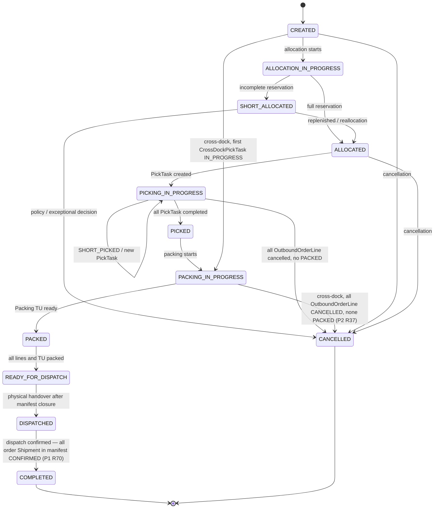

---

## 4. `OutboundOrderLine`

Represents a portion of `CustomerOrderLine` in fulfillment; carrier of allocation and picking. `CANCELLED` is reachable from every nonterminal state except `SHIPPED` (boundary = `CarrierManifest` closure, `P1 R40`, `P1 R50`).

**Initial:** `CREATED` · **Terminal:** `SHIPPED`, `CANCELLED` · **Maturity:** `BUILT`

| From | Event/condition | To | Domain event | Actor | Ref |
|---|---|---|---|---|---|
| (none) | created during `OutboundOrder` planning | `CREATED` | `OutboundOrderLineCreated` | System WMS | P1 step 3 |
| `CREATED`/`SHORT_ALLOCATED` | `Allocation RESERVED` / replenished | `ALLOCATED` | `OutboundOrderLineAllocated` | System WMS | P1 step 4 |
| `CREATED` | partial reservation | `SHORT_ALLOCATED` | `OutboundOrderLineShortAllocated` | System WMS | P1 step 4 |
| `ALLOCATED` | `PickTask` created | `PICKING` | `OutboundOrderLinePickingStarted` | System WMS | P1 step 5 |
| `PICKING` | full quantity picked | `PICKED` | `OutboundOrderLinePicked` | Picker/System WMS | P1 step 6 |
| `PICKING` | less picked | `SHORT_PICKED` | `OutboundOrderLineShortPicked` | Picker/System WMS | P1 step 6 / P1 »Exceptions and alternative paths« |
| `PICKED` | missing/damage detected during packing (counted quantity < `pickedQty` or `DAMAGED`) | `SHORT_PICKED` | `OutboundOrderLineShortfallDetectedAtPacking` | System WMS/Packer | P1 step 8 (“repack by SKU”) / P1 »Exceptions and alternative paths« |
| `SHORT_PICKED` | reallocation, new `PickTask` | `PICKING` | `OutboundOrderLineReallocated` | System WMS | P1 »Exceptions and alternative paths« `SHORT_PICKED` |
| `PICKED` | consolidated into Packing `TU` | `PACKED` | `OutboundOrderLinePacked` | Packer or automatically System WMS when `TU.directPackDeclared = true` and issue thresholds are met (`P1 R17`) | P1 step 9 (standard) / step 6a/7 (`P1 R17`, direct path) |
| `CREATED` | cross-dock: `CrossDockPickTask`→`IN_PROGRESS` | `PICKING` | `OutboundOrderLineCrossDockPickingStarted` | Packer | P2 STEP 2 |
| `PICKING` | cross-dock: quantitative settlement of the line is closed — quantity confirmed by its single `CrossDockPickTask` (`P2 R30`) equals `OutboundOrderLine.requiredQty`; independently of target Outbound `TU` state | `PACKED` | `OutboundOrderLinePacked` | System WMS/Packer | P2 STEP 3 (`P2 R30`) |
| `PICKING` | cross-dock: missing/`DAMAGED` detected during picking (`P2 R11`/`P2 R12`) when resolution leads to line cancellation with `allowPartialShipment = false` (`P2 R14`/`P2 R15`) | `CANCELLED` | `OutboundOrderLineCrossDockShortfallCancelled` | System WMS/Packer | P2 STEP 2 |
| `PACKED` | `Shipment` dispatched — all Outbound `TU` contributing quantity of this line are in `CONFIRMED` manifests (`P1 R72`) | `SHIPPED` | `OutboundOrderLineShipped` | System WMS | P1 step 13 (`P1 R72`) |
| `CREATED`/`SHORT_ALLOCATED`/`ALLOCATED` | cancellation (before picking) | `CANCELLED` | `OutboundOrderLineCancelled` | System WMS | P3 |
| `PICKING`/`SHORT_PICKED`/`PICKED` | cancellation (put-back if `pickedQty>0`) | `CANCELLED` | `OutboundOrderLineCancelled` | System WMS | P4 / P1 »Exceptions and alternative paths« “General cancellation” items 1–3 |
| `PACKED` | cancellation after packing (Supervisor approval) | `CANCELLED` | `OutboundOrderLineCancelled` | System WMS/Supervisor | P1 »Exceptions and alternative paths« “General cancellation” item 4 |

**Attributes:**

| Attribute | Type | Description |
|---|---|---|
| `pickedQty` | number | Quantity actually picked; determines whether cancellation requires `PutBackTask` (`P3 R8`, `P4 R5`). |
| `requiredQty` | number | Required quantity of this line — current target quantity, not historical; cardinality 1. Set during `OutboundOrder` planning for `STANDARD` channel (P1 STEP 3) or when `CrossDockPickTask` is generated for `CROSSDOCK` channel (`P2 R30`). |

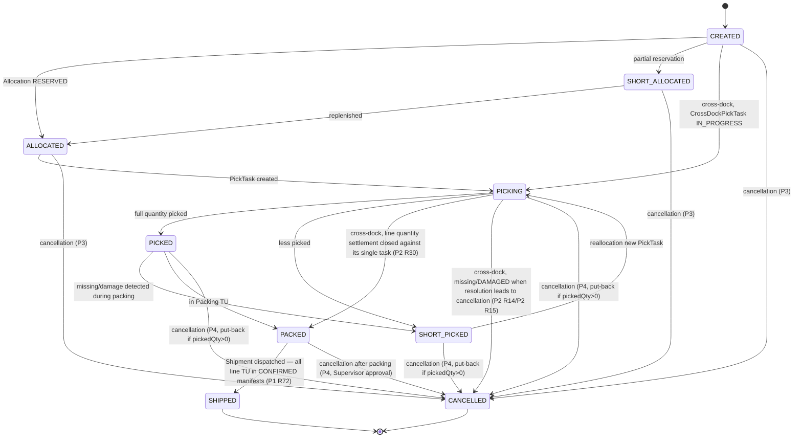

---

## 5. `Allocation`

Stock reservation for an `OutboundOrderLine`. The quantity actually blocked is `reservedQty`: at full reservation, meaning on entry to `RESERVED` and `CONFIRMED`, it equals `requiredQty` of the related `OutboundOrderLine`; in `SHORT` it is lower; in `CONFIRMED` it decreases by every quantity settled during partial dispatch, so it may satisfy `0 < reservedQty < requiredQty` (`P1 R71`, `P1 R72`).

**Initial:** `PENDING` · **Terminal:** `CONSUMED`, `RELEASED` · **Maturity:** `BUILT`

| From | Event/condition | To | Domain event | Actor | Ref |
|---|---|---|---|---|---|
| (none) | created from `OutboundOrderLine` during allocation | `PENDING` | `AllocationCreated` | System WMS | P1 step 4 |
| `PENDING`/`SHORT` | `AVAILABLE` stock / replenished | `RESERVED` | `AllocationReserved` | System WMS | P1 step 4 |
| `PENDING` | full quantity unavailable | `SHORT` | `AllocationShortReserved` | System WMS | P1 step 4 / P1 »Exceptions and alternative paths« `SHORT_ALLOCATED` |
| `RESERVED` | pick confirmed (`PickTask COMPLETED`/`SHORT_PICKED`, `TU` and quantity scan) | `CONFIRMED` | `AllocationConfirmed` | System WMS | P1 step 6 |
| `CONFIRMED` | dispatch — `reservedQty` reached `0`, line is `SHIPPED` (`P1 R72`) | `CONSUMED` | `AllocationConsumed` | System WMS | P1 step 13 (`P1 R72`) |
| `CONFIRMED` | cancellation approved after picking | `RELEASED` | `AllocationReleased` | System WMS | P4 STEP 2–3 |
| `RESERVED` | release (without picking) | `RELEASED` | `AllocationReleased` | System WMS/Supervisor | P3 STEP 2 |
| `SHORT` | reservation-retention policy (automatic release) | `RELEASED` | `AllocationReleased` | System WMS | P1 »Exceptions and alternative paths« `SHORT_ALLOCATED` |

**Attributes:**

| Attribute | Type | Description |
|---|---|---|
| `reservedQty` | number | Quantity of stock actually blocked by this allocation: `0` in `PENDING`, `RELEASED` and `CONSUMED`; partial quantity in `SHORT`; `OutboundOrderLine.requiredQty` on entry to `RESERVED` and `CONFIRMED`, then reduced in `CONFIRMED` by each dispatched quantity until it reaches `0` on transition to `CONSUMED` (`P1 R71`, `P1 R72`). `requiredQty` itself does not change on dispatch. |

Otherwise only references to `OutboundOrderLine`/`Inventory` and status. Stock is considered occupied only in `SHORT`, `RESERVED` and `CONFIRMED`, in the amount of `reservedQty` (`P1 R71`).

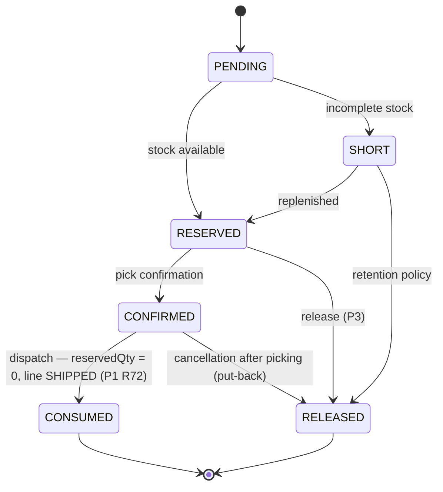

---

## 6. `PickTask`

Picking task. `SHORT_PICKED` ends the task; reallocation creates a new `PickTask` (separate object), it does not resume the old one.

**Initial:** `CREATED` · **Terminal:** `COMPLETED`, `SHORT_PICKED`, `CANCELLED` · **Maturity:** `BUILT`

| From | Event/condition | To | Domain event | Actor | Ref |
|---|---|---|---|---|---|
| (none) | task creation | `CREATED` | `PickTaskCreated` | System WMS | P1 step 5 |
| `CREATED` | assignment to operator logged into picking module, matching zone, no active task | `ASSIGNED` | `PickTaskAssigned` | System WMS | P1 step 5, `P1 R54` |
| `ASSIGNED` | Picking `TU` scan before placement | `IN_PROGRESS` | `PickTaskStarted` | Picker | P1 step 6 |
| `IN_PROGRESS` | full quantity picked, regardless of number of Picking `TU` used | `COMPLETED` | `PickTaskCompleted` | Picker/System WMS | P1 step 6 |
| `IN_PROGRESS` | less than ordered picked | `SHORT_PICKED` | `PickTaskShortPicked` | Picker | P1 step 6 / P1 »Exceptions and alternative paths« `SHORT_PICKED` |
| `ASSIGNED`/`IN_PROGRESS` | `Allocation` released during physical removal before WO confirmed placement into `TU` | `CANCELLED` | `PickTaskCancelled` | System WMS | P3, exception |

**Attributes:**

| Attribute | Type | Description |
|---|---|---|
| `priority` (inherited) | number/enum | `PickTask` created by reallocation after `SHORT_PICKED` inherits the priority of the source task (P1 step 5, `P1 R14`). |
| `zone` | reference | Zone covered by the task; basis for matching the zone selected by the operator when entering the picking module (`P1 R13`, `P1 R54`). |

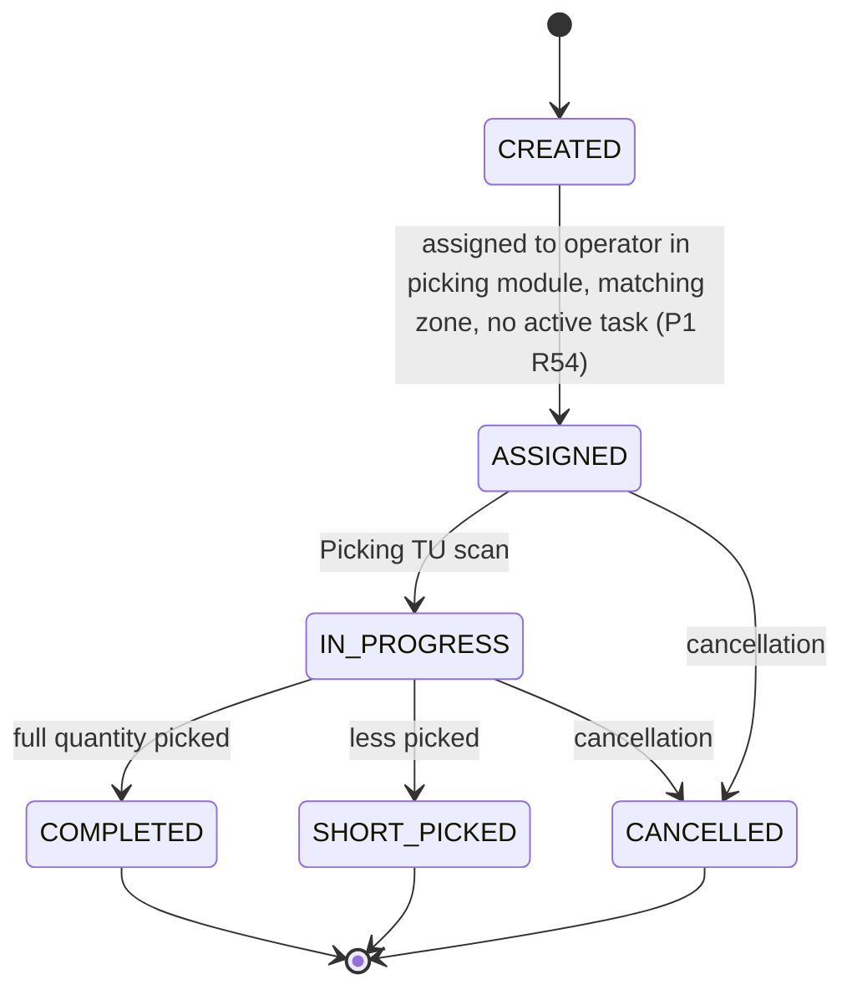

---

## 7. Outbound `TU` (roles `PickContainer` and `PackUnit`)

One Outbound `TU` lifecycle; `PickContainer`/`PackUnit` roles are process functions, not separate objects. In cross-docking (P2) it is created on the first `SKU` placement during sorting (P2 STEP 2, `P2 R7`), skipping `IN_PICKING`/`READY_TO_PACK`/`PACK_QUALIFIED`.

**Initial:** `CREATED` · **Terminal:** `DISPATCHED`, `CANCELLED`, `VOIDED`, `REPACKED` · **Maturity:** `BUILT`

| From | Event/condition | To | Domain event | Actor | Ref |
|---|---|---|---|---|---|
| (none) | creation: standard (first `PickContainer` scan, including continuation of an ongoing `PickTask` after previous `TU` was closed at `PICK_FULL` — `P1 R67`) or cross-dock (first `SKU` placement during sorting, including when previous target `TU` was closed or cancelled while the task continues — `P2 R40`) | `CREATED` | `TUCreated` | Picker/System WMS (standard) / Packer (cross-dock) | P1 step 5–6 (standard, `P1 R67`) / P2 STEP 2 (cross-dock, `P2 R7`, `P2 R40`) |
| `CREATED` | scan during picking, role `PickContainer` | `IN_PICKING` | `TUPickingStarted` | Picker | P1 step 6 |
| `CREATED` | cross-dock: `TU` physically filled during active `CrossDockPickTask`, closed by RF scan | `PACKING_SEALED` | `TUPackingSealed` | Packer | P2 STEP 2 (`P2 R10`) |
| `CREATED` | cross-dock: `slaDeadline` reached (or passed) and no active or planned `CrossDockPickTask` points to this `TU` as target | `PACKING_SEALED` | `TUPackingSealed` | System WMS | P2 STEP 3 (`P2 R10`) |
| `IN_PICKING` | `TUSetup.maxWeight` reached | `PICK_FULL` | `TUPickFull` | System WMS | P1 step 6 |
| `IN_PICKING`/`PICK_FULL` | operator decides to close `TU`; `PickTask` completion by itself does not close `TU` | `READY_TO_PACK` | `TUReadyToPack` | System WMS/Picker | P1 step 6, `P1 R55` |
| `READY_TO_PACK` | meets issue thresholds | `PACK_QUALIFIED` | `TUPackQualified` | Packer (System WMS suggestion) or automatically System WMS when `directPackDeclared = true` (`P1 R17`) | P1 step 6a/7 |
| `READY_TO_PACK` | conditions not met, repacking | `REPACKED` | `TURepacked` | Packer | P1 step 7–8 |
| `PACK_QUALIFIED` | `PackUnit` role closed | `PACKING_SEALED` | `TUPackingSealed` | Packer or automatically System WMS when `directPackDeclared = true` (`P1 R17`) | P1 step 6a/7 |
| `PACKING_SEALED` | attached to one `Shipment` | `IN_SHIPMENT` | `TUAssignedToShipment` | Packer/System WMS | P1 step 9 |
| `IN_SHIPMENT` | dispatch | `DISPATCHED` | `TUDispatched` | System WMS | P1 step 13 |
| `CREATED` | cross-dock: put-back of the full confirmed quantity before `PACKING_SEALED` and no other confirmed line, while no active or planned `CrossDockPickTask` points to this `TU` as target; does not wait for `slaDeadline` | `CANCELLED` | `TUCancelled` | System WMS | P2 STEP 3 (`P2 R34`) |
| `PACKING_SEALED` | removal from `Shipment` after packing | `VOIDED` | `TUVoided` | Supervisor | P4 STEP 1 (`P4 R1`) |

**Attributes:**

| Attribute | Type | Description |
|---|---|---|
| `TU_NUMBER` | text | Required, unique per warehouse among active Outbound `TU`; retained on `PickContainer→PackUnit`. A `TU_NUMBER` that is not `SSCC` contains only alphanumeric characters without special characters, has a maximum of 20 characters and is encoded using Code 128 symbology (`P1 R53`). |
| `SSCC` | text (optional) | `TU_NUMBER ≠ SSCC`; in 1:1 cross-docking inherited together with `TU_NUMBER` when source Inbound `TU` `TU_NUMBER` is a valid GS1 SSCC (`P2 R7`). |
| `tuSetupCode` | reference | Points to `TUSetup`. |
| `directPackDeclared` | bool | Picker declaration at first scan (`CREATED→IN_PICKING`) to pick directly into Outbound `TU`; default `false`; binding and irreversible for the entire `TU`, across all its `PickTask`. A subsequent Picking `TU` in the same `PickTask`, created after `PICK_FULL`, inherits this declaration without asking the operator again (`P1 R16`, `P1 R67`, P1 step 6/6a). |

```mermaid
stateDiagram-v2
 [*] --> CREATED
 CREATED --> IN_PICKING: PickContainer role, scan
 CREATED --> PACKING_SEALED: cross-dock, TU full (Packer) or slaDeadline + no further tasks (System WMS) (P2 R10)
 IN_PICKING --> PICK_FULL: weight limit
 IN_PICKING --> READY_TO_PACK: operator decision to close TU; PickTask completion alone does not close it (P1 R55)
 PICK_FULL --> READY_TO_PACK: operator decision to close TU (P1 R55)
 READY_TO_PACK --> PACK_QUALIFIED: meets issue thresholds
 READY_TO_PACK --> REPACKED: repacked to other TU
 PACK_QUALIFIED --> PACKING_SEALED: PackUnit role closed
 REPACKED --> [*]
 PACKING_SEALED --> IN_SHIPMENT: attached to Shipment
 IN_SHIPMENT --> DISPATCHED: dispatch
 CREATED --> CANCELLED: put-back / VOID (P2: full PutBackTask recovery and no tasks pointing to TU, P2 R34)
 PACKING_SEALED --> VOIDED: removed from Shipment
 DISPATCHED --> [*]
 CANCELLED --> [*]
 VOIDED --> [*]
```

---

## 8. `TUSetup`

**Not applicable (no state lifecycle).** Closed dictionary of `TU` types and configuration object — defines Outbound `TU` external issuability, enforced weight limit, carrier-selection package volume, process usage and numbering rule.

**Attributes:**

| Attribute | Type | Description |
|---|---|---|
| `tuSetupCode` | text (key) | `TU` type code, unique in the dictionary. |
| `externalIssuable` | bool | Whether an Outbound `TU` of this type may be issued externally. |
| `maxWeight` | number | Maximum mass of a `TU` of this type. |
| `maxVolume` | number | Package volume resulting from packaging type, passed to carrier selection (`P1 R30`); not enforced as a packing limit. |
| `processUsage` | enum: `EXTERNAL` | How the `TU` is used in the process. `EXTERNAL` means an externally-originated carrier role and is the only enum value defined in this version; the enum remains open and other values are not decided. System WMS identifies external origin of a `TU` only by `processUsage` of the type referenced by its `tuSetupCode`, never by `TU_NUMBER`. |
| `outbound_tu_number_standard` | enum: `GS1`/`OWN` | `TU_NUMBER` numbering standard for internally created `TU`. |
| `numberFormatMask` | text | Numbering mask (for example `PAL[00000000000]`). |
| `sequenceCode` | reference | Code of `Sequence` used to generate `TU_NUMBER`. |
| `minIssueWeight` | number | Lower weight threshold from which a `TU` of this type meets issue thresholds without repacking (`P1 R64`). |
| `minIssueVolume` | number | Lower absolute contents-volume threshold from which a `TU` of this type meets issue thresholds without repacking (`P1 R64`). |

Origin identification does not use `TU_NUMBER`, because `P2 R7` allows both inheritance of `TU_NUMBER`/`SSCC` from the source and assignment of a new number from `Sequence`.

**Attribute applicability for the external type:**

| Attribute | External type |
|---|---|
| `tuSetupCode` | required |
| `externalIssuable` | required, `true` |
| `processUsage` | required, value `EXTERNAL` |
| `maxWeight` | not applicable — attribute without value |
| `maxVolume` | not applicable — attribute without value |
| `minIssueWeight` | not applicable — attribute without value |
| `minIssueVolume` | not applicable — attribute without value |
| `outbound_tu_number_standard` | not applicable — attribute without value |
| `numberFormatMask` | not applicable — attribute without value |
| `sequenceCode` | not applicable — attribute without value |

“Not applicable” means no value — never `0`, never a boundary value, and never a substitute value. For the external type, no rule reads `maxWeight`, `maxVolume`, `minIssueWeight` or `minIssueVolume`, because the first branch of `P1 R64` resolves earlier. Absence of `maxVolume` prevents `P1 R30` from matching a volume interval, therefore `Shipment` goes to manual carrier selection according to `P1 R51`.

**Numbering note:** `outbound_tu_number_standard`, `numberFormatMask` and `sequenceCode` do not apply to the external-carrier role and remain without values for it; the catalog derives no statement from this about roles of other types. Only the direction `processUsage = EXTERNAL` ⇒ no number from `Sequence` applies. If a concrete `P2 R7` path requires `Sequence`, it cannot use a `TUSetup` with `processUsage = EXTERNAL`. The catalog does not decide which other `TUSetup` is then used or how type selection works; this is follow-up F-03 scope.

---

## 9. `Shipment`

Groups Packing `TU` compatible by customer/address/priority/identical `slaDeadline`. `IN_TRANSIT`/`DELIVERED` are informational, outside the WMS boundary, do not drive the process and **have no formal domain events** (they come from the carrier system).

**Initial:** `CREATED` · **Terminal:** `HANDED_TO_CARRIER`, `CANCELLED` · **Maturity:** `BUILT`

| From | Event/condition | To | Domain event | Actor | Ref |
|---|---|---|---|---|---|
| (none) | created after first Packing `TU` is prepared | `CREATED` | `ShipmentCreated` | Packer/System WMS | P1 step 9 |
| `CREATED` | `TU` grouping closes (`P1 R28`) | `READY_FOR_DISPATCH` | `ShipmentReadyForDispatch` | System WMS | P1 step 9 |
| `READY_FOR_DISPATCH` | carrier selection (rules return result) | `CARRIER_SELECTED` | `ShipmentCarrierSelected` | System WMS | P1 step 10 |
| `READY_FOR_DISPATCH` | own transport, indicated earlier | `OWN_TRANSPORT` | `ShipmentOwnTransportAssigned` | Dispatcher | P1 step 10 |
| `READY_FOR_DISPATCH` | rules return no result | `CARRIER_PENDING` | `ShipmentCarrierPending` | System WMS | P1 step 10 |
| `CARRIER_PENDING` | manual carrier selection | `CARRIER_SELECTED` | `ShipmentCarrierSelected` | Warehouse Supervisor | P1 step 10 |
| `CARRIER_SELECTED` | label (WMS printout, no external API) | `LABEL_GENERATED` | `ShipmentLabelGenerated` | System WMS | P1 step 11 |
| `LABEL_GENERATED`/`OWN_TRANSPORT` | report dispatch readiness to ERP | `POSTING_PENDING` | `ShipmentPostingRequested` | System WMS | P1 step 11a |
| `POSTING_PENDING` | ERP confirmation (`POST`) | `POSTED` | `ShipmentPosted` | System WMS/ERP | P1 step 11a |
| `POSTING_PENDING` | explicit ERP rejection | `POSTING_ERROR` | `ShipmentPostingRejected` | System WMS/ERP | P1 step 11a |
| `POSTED` | added to manifest (one `Shipment` → one manifest) | `IN_MANIFEST` | `ShipmentAddedToManifest` | Dispatcher | P1 step 12 |
| `POSTING_ERROR` | retry (Supervisor decision) | `POSTING_PENDING` | `ShipmentPostingRetried` | System WMS/Supervisor | P1 step 11a (`P1 R37`) |
| `POSTING_ERROR` | Supervisor gives up | `CANCELLED` | `ShipmentCancelled` | System WMS/Supervisor | P1 step 11a |
| `IN_MANIFEST` | physical handover after manifest closure | `HANDED_TO_CARRIER` | `ShipmentHandedToCarrier` | Dispatcher/Carrier | P1 step 13 / §10 of this document `CLOSED→HANDED_OVER` |
| `CREATED`/`READY_FOR_DISPATCH`/`CARRIER_SELECTED`/`OWN_TRANSPORT`/`CARRIER_PENDING`/`LABEL_GENERATED` | cancellation (before `POSTING_PENDING`) | `CANCELLED` | `ShipmentCancelled` | System WMS/Supervisor | P1 »Exceptions and alternative paths« “General cancellation” item 4 |

**Attributes:**

| Attribute | Type | Description |
|---|---|---|
| `selectedCarrier` | reference (`Carrier`) | Set at `CARRIER_SELECTED`, automatically or manually by Supervisor. |

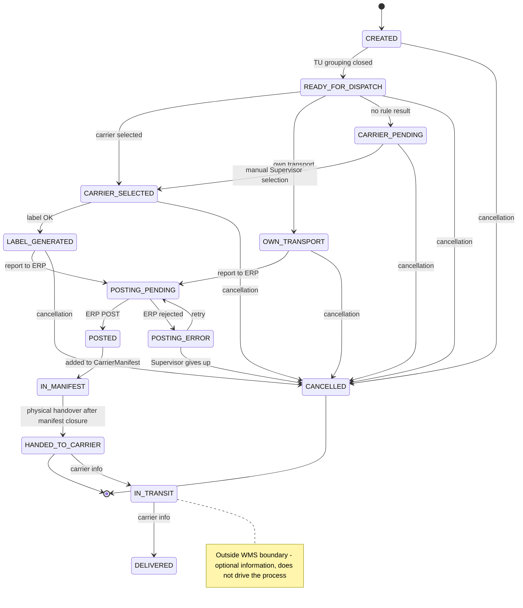

---

## 10. `CarrierManifest`

In v1 one object (`CarrierManifest`/`Load` split rejected). Closure is irreversible — cancellation boundary.

**Initial:** `OPEN` · **Terminal:** `CONFIRMED` · **Maturity:** `BUILT`

| From | Event/condition | To | Domain event | Actor | Ref |
|---|---|---|---|---|---|
| (none) | manifest opened | `OPEN` | `CarrierManifestOpened` | Dispatcher | P1 step 12 |
| `OPEN` | closure, ready for handover | `CLOSED` | `CarrierManifestClosed` | Dispatcher | P1 step 12 |
| `CLOSED` | handover (carrier pickup/own run) | `HANDED_OVER` | `CarrierManifestHandedOver` | Dispatcher/Carrier | P1 step 13 |
| `HANDED_OVER` | warehouse dispatch confirmation | `CONFIRMED` | `CarrierManifestConfirmed` | Dispatcher | P1 step 13 |

**Attributes:** no additional named attributes beyond status and references to `Shipment`.

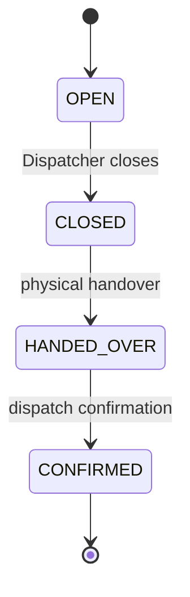

---

## 11. `Inventory` (Outbound scope)

Only transitions relevant to Outbound. Only stock with `ATP` flag may be reserved/allocated. Statuses in this section belong to Outbound canon and are not validated against `model_stanow.md` (Inbound).

**Initial:** `AVAILABLE` · **Terminal:** `SHIPPED` · **Maturity:** `BUILT`

| From | Event/condition | To | Domain event | Actor | Ref |
|---|---|---|---|---|---|
| (none) | stock received (Inbound `POSTED`/GR) | `AVAILABLE` | `InventoryMadeAvailable` | — | outside Outbound scope (Inbound `model_stanow.md`) |
| `AVAILABLE` | `Allocation RESERVED`, `ATP` flag | `RESERVED` | `InventoryReserved` | System WMS | P1 step 4 |
| `RESERVED` | release without picking | `AVAILABLE` | `InventoryReleased` | System WMS | P3 STEP 2 |
| `RESERVED` | picked into Picking `TU` | `PICKED` | `InventoryPicked` | Picker | P1 step 6 |
| `PICKED` | physical put-back | `AVAILABLE` | `InventoryPutBack` | Operator | P4 STEP 5 |
| `PICKED` | dispatch (closed manifest) | `SHIPPED` | `InventoryShipped` | System WMS | P1 step 13 |

**Attributes:**

| Attribute | Type | Description |
|---|---|---|
| `ATP`/`non-ATP` flag | enum | Only `ATP` may be reserved/allocated; `non-ATP` = stock before Inbound `POSTED` and stock in quality area (`P1 R52`). |

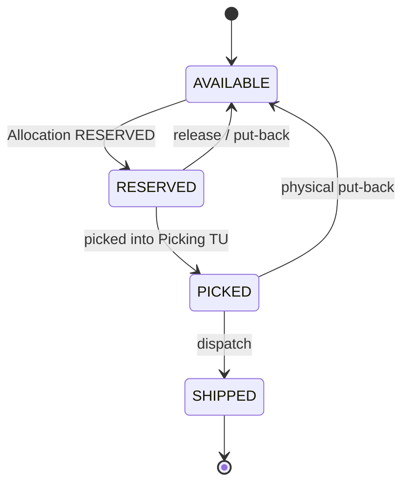

---

## 12. `PutBackTask`

Models physical put-away of goods after cancellation of a reservation already picked. The `LOCATION_VALIDATION↔IN_PROGRESS` loop intentionally has no attempt limit and no automatic escalation.

**Initial:** `CREATED` · **Terminal:** `COMPLETED` · **Maturity:** `BUILT`

| From | Event/condition | To | Domain event | Actor | Ref |
|---|---|---|---|---|---|
| (none) | task created after cancellation of an already-picked reservation | `CREATED` | `PutBackTaskCreated` | System WMS | P4 STEP 3 |
| `CREATED` | assigned to operator logged into returns module, no active task | `ASSIGNED` | `PutBackTaskAssigned` | System WMS | P4 STEP 3, `P4 R9` |
| `ASSIGNED` | put-away started | `IN_PROGRESS` | `PutBackTaskStarted` | Operator | P4 STEP 4 |
| `IN_PROGRESS` | location indicated (system proposes or operator indicates) | `LOCATION_VALIDATION` | `PutBackTaskLocationSubmitted` | Operator/System WMS | P4 STEP 4 |
| `LOCATION_VALIDATION` | location rejected | `IN_PROGRESS` | `PutBackTaskLocationRejected` | System WMS | P4 STEP 4 |
| `LOCATION_VALIDATION` | location validated, put-away | `COMPLETED` | `PutBackTaskCompleted` | Operator | P4 STEP 5 |

**Attributes:** no additional named attributes beyond reference to the cancelled line and status.

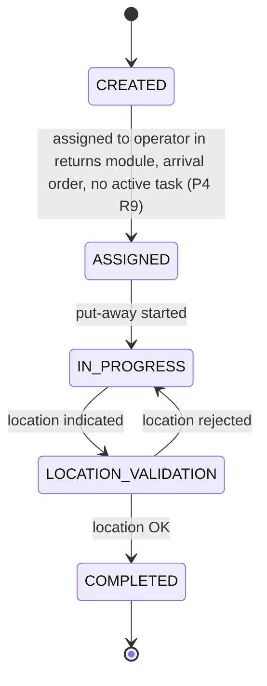

---

## 13. `CrossDockPickTask`

Models picking and sorting `SKU` from an Inbound `TU` in the cross-dock area. Modeled after `PutBackTask`, without location validation.

**Initial:** `CREATED` · **Terminal:** `COMPLETED`, `CANCELLED` · **Maturity:** `BUILT`

| From | Event/condition | To | Domain event | Actor | Ref |
|---|---|---|---|---|---|
| (none) | task generated from `CustomerOrderLine BACKORDERED` | `CREATED` | `CrossDockPickTaskCreated` | System WMS | P2 STEP 1 |
| `CREATED` | assigned to operator logged into cross-docking module, no active task | `ASSIGNED` | `CrossDockPickTaskAssigned` | System WMS | P2 STEP 2, `P2 R39` |
| `ASSIGNED` | picking begins (first SKU scan) | `IN_PROGRESS` | `CrossDockPickTaskStarted` | Packer | P2 STEP 2 |
| `IN_PROGRESS` | completion (initiated by Packer) | `COMPLETED` | `CrossDockPickTaskCompleted` | Packer/System WMS | P2 STEP 3 |
| `ASSIGNED` | `TU` empty before picking | `CANCELLED` | `CrossDockPickTaskCancelled` | System WMS | P2 STEP 2 |

**Attributes:**

| Attribute | Type | Description |
|---|---|---|
| `sourceInboundTU` | reference | Source Inbound `TU`. |
| `SKU` | reference | Item sorted by this task. |
| `plannedQty` | number | Quantity reserved from source `TU`/SKU for confirmation (`P2 R29`). |
| `confirmedQty` | number | Quantity actually confirmed after sorting. |
| `damagedQty` | number | `SKU` quantity detected as `DAMAGED` during picking (`P2 R13`), placed in `QC`; excluded from `confirmedQty`. |
| `targetOutboundOrderLine` | reference | Target `OutboundOrderLine`. |
| `grAcceptanceStatus` | enum: `GR_PENDING`/`GR_ACCEPTED`/`GR_REJECTED` | ERP acceptance result for cross-dock GR settlement of `sourceInboundTU`; the same result applies to every related task in the system, independently of `Shipment` (`P2 R31`). |

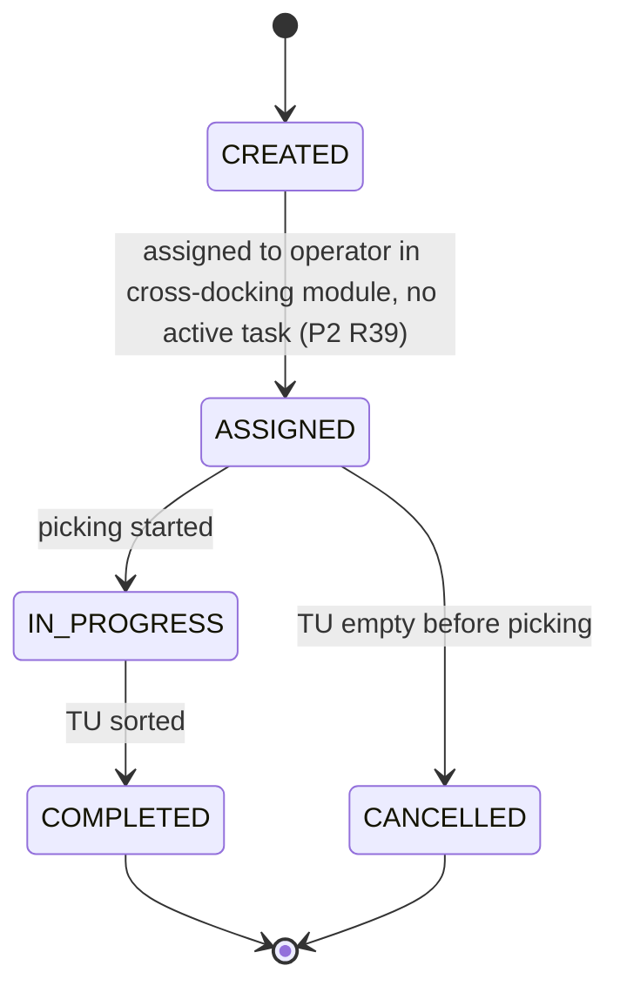

---

## 14. `Carrier`

**Not applicable (no state lifecycle).** Master-data object — formal carrier dictionary.

**Attributes:**

| Attribute | Type | Description |
|---|---|---|
| `priority` | number (unique in dictionary) | Final tie-break when matching `CarrierSetup` (`P1 R32`). |

---

## 15. `CarrierSetup`

**Not applicable (no state lifecycle).** Configuration object linking `Carrier`, `Region` and weight/volume intervals; one `Carrier` may have many `CarrierSetup`.

**Attributes:**

| Attribute | Type | Description |
|---|---|---|
| `minWeight`/`maxWeight` | number | Weight interval matched against the highest current mass of a `Shipment` Packing `TU`, calculated from contents (`P1 R63`, `P1 R30`). |
| `minVolume`/`maxVolume` | number | Volume interval matched against the highest `TUSetup.maxVolume` among `Shipment` Packing `TU` types, i.e. the largest carrier volume (`P1 R30`, `P1 R31`). |

---

## 16. `Region`

**Not applicable (no state lifecycle).** Configuration object representing a delivery area; independent of `Zone`. Attribute catalog remains open for implementation choice.

---

## 17. `Sequence`

**Not applicable (no state lifecycle).** Universal system counter independent of `TUSetup`; many `TUSetup` may reference the same `Sequence`.

**Attributes:**

| Attribute | Type | Description |
|---|---|---|
| `sequenceId` | system identifier | Immutable identifier. |
| `sequenceCode` | text (unique) | Code referenced by `TUSetup.sequenceCode`. |
| `name` | text | `Sequence` name. |
| `nextFreeNumber` | number | Next free counter number. |

---

## Gaps reported and closed (`BACKLOG.md` B15)

Granular reconstruction of “Ref” (reference to P1–P5 process step) for every transition revealed on 2026-08-18 two transitions without a trigger described explicitly in §3 of `propozycja_procesow_outbound.md` v1.27 — reported as `BACKLOG.md` B15 and closed the same day by Darek’s decision:

1. **`CustomerOrder SHIPPED→CLOSED`** — resolved by `DEC-L33`: calculated automatically when all contributing `OutboundOrder` reach `COMPLETED` (new P1 step 13a, `R85`). See §1, row `SHIPPED→CLOSED`.
2. **`OutboundOrder PICKING_IN_PROGRESS↔ON_HOLD`** — resolved by `DEC-L34`: `ON_HOLD` removed from `OutboundOrder` as an unused artifact without business coverage (backward review §3/§5/§7/§9/B1–B14 found no trigger). See §3.

---

## Status dictionary — consolidated view

> EN canon. Maturity: all statuses = `BUILT`. Enums per object. Source of truth for status names = this file (for objects with state lifecycle), consistent with `proces_1_standard_fulfillment.md`–`proces_4_physical_putback.md`.

### `CustomerOrder`
| EN (canon) | Meaning | Type | Maturity |
|---|---|---|---|
| `RECEIVED` | Arrived from external system | initial | BUILT |
| `VALIDATED` | Positive validation | intermediate | BUILT |
| `REJECTED` | Negative validation | terminal | BUILT |
| `ACCEPTED` | Accepted for fulfillment, no hold | intermediate | BUILT |
| `ON_HOLD` | Hold, skipped in planning | intermediate | BUILT |
| `IN_FULFILLMENT` | `OutboundOrder` exists, fulfillment in progress | intermediate | BUILT |
| `BACKORDERED` | All active lines without stock | intermediate | BUILT |
| `PARTIALLY_SHIPPED` | At least one line dispatched | intermediate | BUILT |
| `SHIPPED` | All dispatched | intermediate | BUILT |
| `CLOSED` | Settled | terminal | BUILT |
| `CANCELLED` | Cancelled | terminal | BUILT |

### `CustomerOrderLine`
| EN (canon) | Meaning | Type | Maturity |
|---|---|---|---|
| `OPEN` | Not assigned to `OutboundOrderLine` | initial | BUILT |
| `PLANNED` | Assigned to `OutboundOrderLine` | intermediate | BUILT |
| `PARTIALLY_FULFILLED` | Part dispatched | intermediate | BUILT |
| `FULFILLED` | All dispatched | terminal | BUILT |
| `BACKORDERED` | No stock/shortage | intermediate | BUILT |
| `CANCELLED` | Cancelled | terminal | BUILT |

### `OutboundOrder`
| EN (canon) | Meaning | Type | Maturity |
|---|---|---|---|
| `CREATED` | Created by grouping/splitting `CustomerOrderLine` | initial | BUILT |
| `ALLOCATION_IN_PROGRESS` | Allocation in progress | intermediate | BUILT |
| `ALLOCATED` | Full reservation | intermediate | BUILT |
| `SHORT_ALLOCATED` | Incomplete reservation | intermediate | BUILT |
| `PICKING_IN_PROGRESS` | Picking in progress | intermediate | BUILT |
| `PICKED` | All `PickTask` completed | intermediate | BUILT |
| `PACKING_IN_PROGRESS` | Packing in progress | intermediate | BUILT |
| `PACKED` | Packing `TU` ready (full aggregate) | intermediate | BUILT |
| `READY_FOR_DISPATCH` | Ready for dispatch | intermediate | BUILT |
| `DISPATCHED` | Physically handed over | intermediate | BUILT |
| `COMPLETED` | Dispatch confirmed | terminal | BUILT |
| `CANCELLED` | Cancelled | terminal | BUILT |

### `OutboundOrderLine`
| EN (canon) | Meaning | Type | Maturity |
|---|---|---|---|
| `CREATED` | Created during planning | initial | BUILT |
| `ALLOCATED` | `Allocation RESERVED` | intermediate | BUILT |
| `SHORT_ALLOCATED` | Partial reservation | intermediate | BUILT |
| `PICKING` | `PickTask` created / cross-dock sorting in progress | intermediate | BUILT |
| `PICKED` | Full quantity picked | intermediate | BUILT |
| `SHORT_PICKED` | Less picked / missing detected during packing | intermediate | BUILT |
| `PACKED` | In Packing `TU` | intermediate | BUILT |
| `SHIPPED` | `Shipment` dispatched | terminal | BUILT |
| `CANCELLED` | Cancelled | terminal | BUILT |

### `Allocation`
| EN (canon) | Meaning | Type | Maturity |
|---|---|---|---|
| `PENDING` | Awaiting reservation result | initial | BUILT |
| `RESERVED` | Stock reserved | intermediate | BUILT |
| `SHORT` | Reservation incomplete | intermediate | BUILT |
| `CONFIRMED` | Pick confirmed | intermediate | BUILT |
| `CONSUMED` | Dispatched | terminal | BUILT |
| `RELEASED` | Released | terminal | BUILT |

### `PickTask`
| EN (canon) | Meaning | Type | Maturity |
|---|---|---|---|
| `CREATED` | Created | initial | BUILT |
| `ASSIGNED` | Operator assigned | intermediate | BUILT |
| `IN_PROGRESS` | Picking `TU` scan completed | intermediate | BUILT |
| `COMPLETED` | Full quantity picked | terminal | BUILT |
| `SHORT_PICKED` | Less picked | terminal | BUILT |
| `CANCELLED` | Cancelled | terminal | BUILT |

### Outbound `TU`
| EN (canon) | Meaning | Type | Maturity |
|---|---|---|---|
| `CREATED` | Created (standard or cross-dock) | initial | BUILT |
| `IN_PICKING` | `PickContainer` role, picking in progress | intermediate | BUILT |
| `PICK_FULL` | Weight limit reached | intermediate | BUILT |
| `READY_TO_PACK` | Picking completed | intermediate | BUILT |
| `PACK_QUALIFIED` | Meets issue thresholds | intermediate | BUILT |
| `REPACKED` | Repacked into other `TU` | terminal | BUILT |
| `PACKING_SEALED` | `PackUnit` role closed | intermediate | BUILT |
| `IN_SHIPMENT` | Attached to `Shipment` | intermediate | BUILT |
| `DISPATCHED` | Dispatched | terminal | BUILT |
| `CANCELLED` | Fully recovered before packing (cross-dock) | terminal | BUILT |
| `VOIDED` | Removed from `Shipment` after packing | terminal | BUILT |

### `Shipment`
| EN (canon) | Meaning | Type | Maturity |
|---|---|---|---|
| `CREATED` | Created after first Packing `TU` | initial | BUILT |
| `READY_FOR_DISPATCH` | `TU` grouping closed | intermediate | BUILT |
| `CARRIER_SELECTED` | Carrier selected | intermediate | BUILT |
| `OWN_TRANSPORT` | Own transport | intermediate | BUILT |
| `CARRIER_PENDING` | No carrier-selection rule result | intermediate | BUILT |
| `LABEL_GENERATED` | Label printed | intermediate | BUILT |
| `POSTING_PENDING` | Reported to ERP, awaiting response | intermediate | BUILT |
| `POSTED` | ERP confirmed | intermediate | BUILT |
| `POSTING_ERROR` | ERP rejected | intermediate | BUILT |
| `IN_MANIFEST` | Added to `CarrierManifest` | intermediate | BUILT |
| `HANDED_TO_CARRIER` | Physically handed over | terminal | BUILT |
| `CANCELLED` | Cancelled | terminal | BUILT |
| `IN_TRANSIT`/`DELIVERED` | Informational, outside WMS boundary | informational (no domain event) | — |

### `CarrierManifest`
| EN (canon) | Meaning | Type | Maturity |
|---|---|---|---|
| `OPEN` | Open | initial | BUILT |
| `CLOSED` | Closed (irreversibly) | intermediate | BUILT |
| `HANDED_OVER` | Physically handed over | intermediate | BUILT |
| `CONFIRMED` | Dispatch confirmed | terminal | BUILT |

### `Inventory` (Outbound)
| EN (canon) | Meaning | Type | Maturity |
|---|---|---|---|
| `AVAILABLE` | Available (`ATP`) | initial | BUILT |
| `RESERVED` | Reserved | intermediate | BUILT |
| `PICKED` | Physically picked | intermediate | BUILT |
| `SHIPPED` | Dispatched | terminal | BUILT |

### `PutBackTask`
| EN (canon) | Meaning | Type | Maturity |
|---|---|---|---|
| `CREATED` | Created | initial | BUILT |
| `ASSIGNED` | Operator assigned | intermediate | BUILT |
| `IN_PROGRESS` | Put-away started | intermediate | BUILT |
| `LOCATION_VALIDATION` | Location being validated | intermediate | BUILT |
| `COMPLETED` | Put away | terminal | BUILT |

### `CrossDockPickTask`
| EN (canon) | Meaning | Type | Maturity |
|---|---|---|---|
| `CREATED` | Generated | initial | BUILT |
| `ASSIGNED` | Operator assigned | intermediate | BUILT |
| `IN_PROGRESS` | Picking started | intermediate | BUILT |
| `COMPLETED` | `TU` sorted | terminal | BUILT |
| `CANCELLED` | `TU` empty before picking | terminal | BUILT |

---

## Change history

- **2026-08-28 (v1.19):** description of `TU.directPackDeclared` attribute supplemented with inheritance of the declaration by the next Picking `TU` of the same `PickTask` (`P1 R16`, `P1 R67`). No changes to transition tables or diagrams. Source updated to `proces_1_standard_fulfillment.md` v1.20.
- **2026-08-28 (v1.18):** aligned `reservedQty` semantics with `P1 R72`: object description and attribute row in §5 had stated that in `RESERVED` and `CONFIRMED`, `reservedQty` equals `requiredQty` throughout the state, which is false after partial dispatch. Equality applies on entry to the state; in `CONFIRMED` the value decreases by each settled quantity and reaches `0` only on transition to `CONSUMED`. No changes to transition table, diagrams or `P1 R71`/`P1 R72`.
- **2026-08-28 (v1.17):** guards for `OutboundOrderLine PACKED→SHIPPED` (§4) and `Allocation CONFIRMED→CONSUMED` (§5) supplemented with the condition that all Outbound `TU` contributing line quantity have been fully dispatched (`P1 R72`); edge labels updated. `Inventory` settlement remains quantitative at each manifest. Source updated to `proces_1_standard_fulfillment.md` v1.19.
- **2026-08-28 (v1.16):** `Allocation` received attribute `reservedQty` and explicit contribution of each of the six allocation states to occupied quantity; removed statement equating reservation quantity with `requiredQty`, which is false for `SHORT`. Closure of `BACKLOG.md` B20 for `Allocation` (`P1 R71`). Source updated to `proces_1_standard_fulfillment.md` v1.18.
- **2026-08-28 (v1.15):** `OutboundOrder DISPATCHED→COMPLETED` row received guard `P1 R70` — order completion requires confirmation of all its `Shipment`, not a single manifest. Diagram edge label updated. Restored invariant lost during B16 migration (archived `SP4`). Source updated to `proces_1_standard_fulfillment.md` v1.16.
- **2026-08-27 (v1.14):** `OutboundOrderLine` received attribute `requiredQty` — current target quantity of cardinality 1, set when the line is created in `STANDARD` or `CROSSDOCK`. The cross-dock `PICKING → PACKED` condition and `Allocation` reservation-quantity description were rewired to it; `Allocation` did not receive its own quantity attribute.
- **2026-08-27 (v1.13):** §8 defined the only current value of open enum `TUSetup.processUsage` — `EXTERNAL` — and the full applicability table for ten attributes of the external type. Identification only through type referenced by `TU.tuSetupCode`, precedence of `P1 R64`, effect of missing `maxVolume` for `P1 R30`/`P1 R51`, and one-way numbering rule were recorded. The archived part of **R28** concerning mass and dimensions declared in ASN was deliberately replaced; `DEC-Q4` does not restore it.
- **2026-08-27 (v1.12):** `OutboundOrder` description in §3 supplemented with source of `priority` and `slaDeadline` for both channels: most-urgent aggregate for `STANDARD` (`P1 R9`) and inheritance from parent `CustomerOrder` for `CROSSDOCK` (`P2 R43`). No changes to transition table or state machine.
- **2026-08-27 (v1.11):** restored continuation of the same `PickTask` into the next Picking `TU` after `PICK_FULL` (`P1 R67`). In §6 task completion depends on picking full quantity regardless of number of `TU` used; in §7 `TU` creation includes continuation of an ongoing task after closing the prior unit. `directPackDeclared` description unchanged.
- **2026-08-27 (v1.10):** `PICK_FULL` trigger in transition table, §7 diagram and status dictionary narrowed to enforced weight limit; transition to `READY_TO_PACK` left solely to operator decision according to `P1 R55`. `TUSetup` and `CarrierSetup` catalogs separate enforced upper weight limit from unenforced carrier volume used in carrier selection. No states added, removed or renumbered.
- **2026-08-27 (v1.9):** proportional attribute `TUSetup.minIssueVolumeUtilization` replaced with absolute contents-volume threshold `TUSetup.minIssueVolume`; type changed from “number (ratio)” to “number”. `READY_TO_PACK → PACK_QUALIFIED` trigger and `PACK_QUALIFIED` status description remain “meets issue thresholds” — still correctly referring to full `P1 R64` condition. “Source” header updated to `proces_1_standard_fulfillment.md` v1.10.
- **2026-08-24 (v1.8):** `TUSetup` received two lower issuance thresholds — `minIssueWeight` and `minIssueVolumeUtilization` — previously absent despite the process referring to issue thresholds. Naming aligned from “issue conditions” to “issue thresholds” in `OutboundOrderLine` transition table, Outbound `TU` diagram and status dictionary. Existing `maxWeight`/`maxVolume` remain upper limits and do not change meaning.
- **2026-08-24 (v1.7):** description of `CarrierSetup` weight interval had pointed to Packing `TU` `maxWeight`, i.e. packaging-type capacity; rewired to current mass calculated from contents, according to owner decision from 2026-08-24 and new `P1 R63`. Volume interval unchanged — still refers to package-type volume.
- **No version change (2026-08-24):** updated “Source” header — `proces_2_outbound_crossdock.md` v1.7 → v1.9. No substantive changes.
- **2026-08-23 (v1.6):** synchronized `mermaid` diagrams with transition tables — six edges described the state before recent rule changes although corresponding table rows were already correct. `OutboundOrderLine PICKING→PACKED` in §4: “sorting confirmed” → quantitative settlement against the line’s single task (`P2 R30`); table row had been corrected in v1.5, edge was missed. `TU IN_PICKING→READY_TO_PACK` and `PICK_FULL→READY_TO_PACK` in §7: “picking completed”/“close picking” → operator decision to close `TU`, explicitly noting that `PickTask` completion alone does not close it (`P1 R55`) — prior wording directly contradicted `P1 R55`. `CREATED→ASSIGNED` in §6 `PickTask`, §12 `PutBackTask` and §13 `CrossDockPickTask`: terse “operator assigned” → assignment through entry into the appropriate RF terminal module (`P1 R54`, `P4 R9`, `P2 R39`), consistent with withdrawal of operator-pool concept. No changes to transition tables, attributes or states — only bringing diagrams into compliance with the convention that “diagrams and tables describe the same behavior model”.
- **No version change (2026-08-23, metric correction):** “Source” header — `proces_4_physical_putback.md` v1.1 → v1.2. The process file was bumped to 1.2 when `P4 R9` (taking `PutBackTask` through RF returns module) was introduced, but this header reference had not followed. Number correction only — `P4 R9` content is fully propagated (`FR-P4-05`, `TC-100`, `P4 R9` row in coverage matrix), so no state, transition or attribute changes.
- **No version change (2026-08-23):** updated “Source” header — `proces_2_outbound_crossdock.md` v1.6 → v1.7 after residual-quantity components were completed in `P2 R21`. No changes to states, transitions or attributes — this document does not use the term “residual quantity”.
- **2026-08-23 (v1.5):** closed V3-CD-02 and completed propagation gaps from prior round. Guard `Outbound TU CREATED→CANCELLED` in §7 (table and diagram) supplemented with condition that no active/planned `CrossDockPickTask` points to this `TU`, explicitly noting cancellation does not wait for `slaDeadline` (intentional asymmetry versus `P2 R10`). Outbound `TU` creation row in §7 supplemented with on-demand creation during an ongoing task (`P2 R40`). Guard `OutboundOrderLine PICKING→PACKED` in §4 clarified — prior “sorting confirmed” did not capture process-prose condition (quantitative settlement against line’s single `CrossDockPickTask`, `P2 R30`), so `PACKED` condition existed in the entire corpus only in one sentence of `proces_2`. `TU_NUMBER` attribute description supplemented with format (Code 128, alphanumeric, max. 20 characters) — `P1 R53` had been extended earlier but this row had not followed. “Source” header updated (`proces_1` → v1.4, `proces_2` → v1.6) — it had been stale for some time. References `P2 krok` → `P2 KROK` normalized throughout except “Change history”.
- **2026-08-23** — Warehouse-task take-up rules (`BACKLOG.md` B10): updated `CREATED → ASSIGNED` transition triggers for `PickTask`, `CrossDockPickTask`, `PutBackTask` (assignment through entry into RF module, not configuration); added `zone` attribute to `PickTask`; clarified `directPackDeclared` (binds `TU`, not `PickTask`) and `TU IN_PICKING/PICK_FULL → READY_TO_PACK` trigger (operator decision or limit, not automatic closure on `PickTask COMPLETED`). Details in `proces_1_standard_fulfillment.md` v1.4, `proces_2_outbound_crossdock.md` v1.5, `proces_4_physical_putback.md` v1.2.
- **2026-08-22 (v1.4):** batch 2/5 closing V3-CD audit. Two `Outbound TU CREATED→PACKING_SEALED` triggers in §7 updated: System WMS trigger extended with `slaDeadline` condition (reached/passed), according to new `P2 R10` (`proces_2_outbound_crossdock.md` v1.3) — prevents premature closing of Outbound `TU` when cross-dock goods for the same address arrive in later Inbound deliveries. §7 diagram updated likewise. Repaired five dead references to archived global-rule catalog: `R66`/`R67` in §4 diagram (`OutboundOrderLine`) → `P2 R11`/`P2 R12` (already correctly cited in same section’s transition table); `SP20` in §3 → `P2 R8`; `SP19` in §3 → `P2 R5`; `SP8` in §3 (`OutboundOrder PACKED→READY_FOR_DISPATCH`) → `P1 R27`; `SP8` in §9 (`Shipment CREATED→READY_FOR_DISPATCH`, different rule under same dead code) → `P1 R28`. Header source reference to `proces_2_outbound_crossdock.md` updated v1.2→v1.3. Additionally found during verification: second occurrence of `R66`/`R67` in §3 diagram (`OutboundOrder`, not only §4) → `P2 R11`/`P2 R12`; adjacent §3 table row updated from `P2 R18` to `P2 R37`, because after batch 1 the general `OutboundOrder` cancellation criterion (all lines `CANCELLED`, no `PACKED`) moved to `P2 R37`. Batch closed after full reference verification: Outbound `TU` creation row in §7 corrected in cross-dock branch — actor `Picker/System WMS` → `Packer`, Ref `P2 step 1` → `P2 STEP 2` according to `P2 R7` (audit item V3-CD-05), introductory §7 sentence clarified likewise; attribution of cross-dock line-cancellation rules in §3 and §4 corrected from `P2 R11`/`P2 R12` (detect missing/`DAMAGED`) to `P2 R14`/`P2 R15` (cancellation), noting that with `allowPartialShipment = true` the line goes to `PACKED`, not `CANCELLED`.
- **No version change (2026-08-22)** — removed the last active reference to the archived analytical document from the introduction to “Status dictionary”; remaining occurrences are only in “Change history” and “Gaps reported and closed”.
- **2026-08-22 (v1.3):** completed source-of-truth migration after archival of analytical document. All references in “Ref” column and attribute descriptions rewired from global rule numbering and analytical-document sections to local rules and steps of `proces_1`–`proces_4` (format `P1 R41`, `P2 R7`). Back-references to decision codes removed from object/state descriptions; codes remain only in “Change history” and “Gaps reported and closed”. `Outbound TU CREATED→PACKING_SEALED` row in §7 split into two triggers — Packer closes full `TU` during active task and System WMS closes it when no task points to that `TU`. References to former PROCESS 5 sections now point to “Exceptions and alternative paths” sections in `proces_1`/`proces_2`. Document header points to process files as source.
- **2026-08-18 (v1.2):** new picking path bypassing Packer — Darek’s decision (`DEC-L35`, `R86`). Outbound `TU`: added `directPackDeclared` attribute (bool, default `false`); transition rows `READY_TO_PACK→PACK_QUALIFIED` and `PACK_QUALIFIED→PACKING_SEALED` updated in Actor column (Packer or automatically System WMS when `directPackDeclared = true`) and Ref (`P1 step 6a/7`). `OutboundOrderLine`: `PICKED→PACKED` row updated likewise (Actor, Ref with two paths: standard step 9 / direct step 6a/7). No state-diagram changes (no new states/edges — only actor and timing of existing “issue conditions” assessment change). Source updated to `propozycja_procesow_outbound.md` v1.29.
- **2026-08-18 (v1.1):** closed `BACKLOG.md` B15. `CustomerOrder`: `SHIPPED→CLOSED` row completed with real Ref (`P1 step 13a`, `R85`) — trigger resolved by Darek (`DEC-L33`): settlement calculated automatically when all contributing `OutboundOrder` reach `COMPLETED`. `OutboundOrder`: removed `ON_HOLD` and both `PICKING_IN_PROGRESS↔ON_HOLD` edges (diagram, transition table, consolidated dictionary) — Darek’s decision (`DEC-L34`): working artifact without trigger in any process step or prior decision. Section “Gaps revealed by this analysis” renamed “Gaps reported and closed” with references to both decisions. Source updated to `propozycja_procesow_outbound.md` v1.28.
- **2026-08-18 (v1.0):** document created — implementation of `BACKLOG.md` B5 and `decyzje_outbound_wms.md` §10 items 1–2. State and transition catalog for 17 objects from §4 of `propozycja_procesow_outbound.md` v1.27, extended with formal domain events (`PascalCase` EN) and references to P1–P5 process steps (§3). Transition-table column format and “Status dictionary — consolidated view” section aligned with Inbound standard (`model_stanow.md`) based on comparison of both documents and owner decision (2026-08-18): domain events retained only for Outbound (scope difference justified by `decyzje_outbound_wms.md` §10 item 2); columns `From | Event/condition | To | Domain event | Actor | Ref` aligned to Inbound pattern; `Maturity` column added (all statuses `BUILT`); consolidated status dictionary added. §4 of `propozycja_procesow_outbound.md` left unchanged (diagrams/tables moved here without substantive modification). Two documentation gaps revealed and reported to `BACKLOG.md` (see “Gaps revealed by this analysis”): `CustomerOrder SHIPPED→CLOSED` and `OutboundOrder PICKING_IN_PROGRESS↔ON_HOLD` without a described process step in §3.
