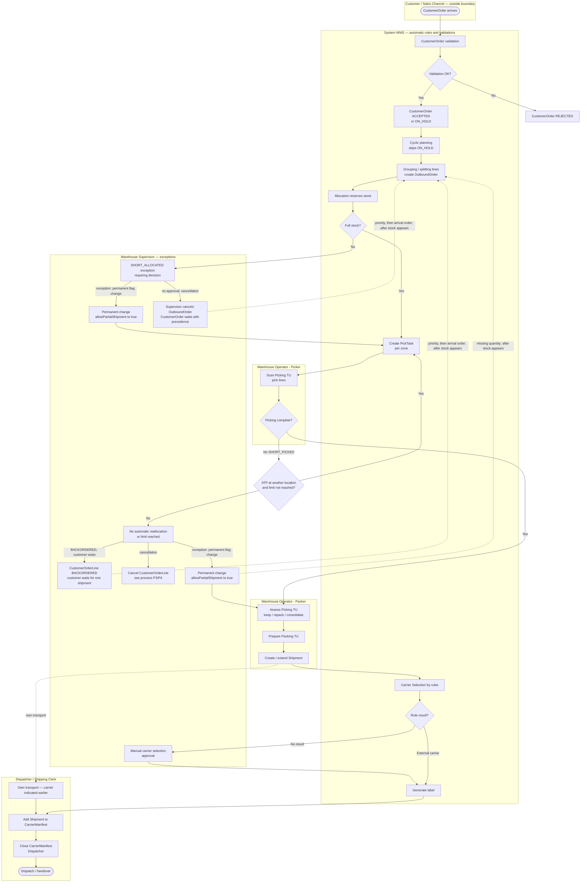
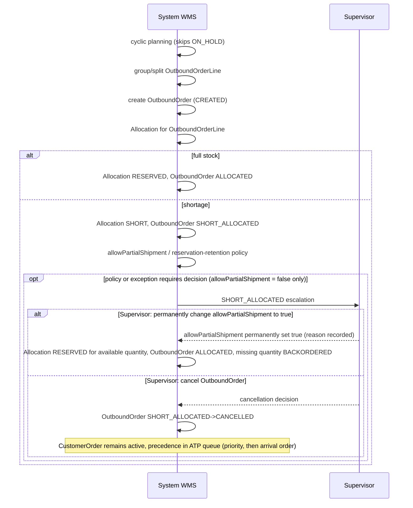
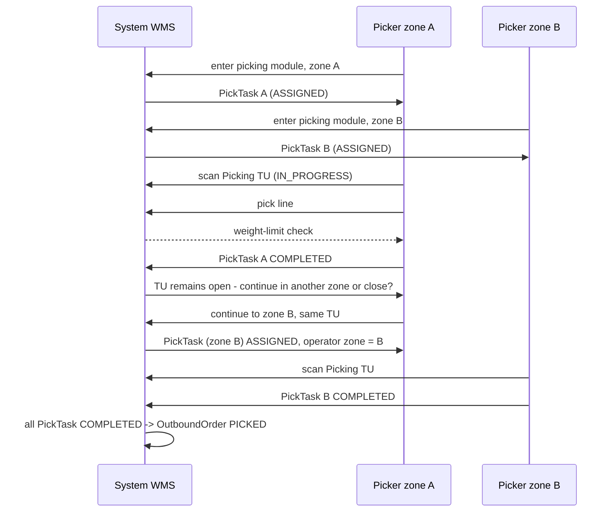
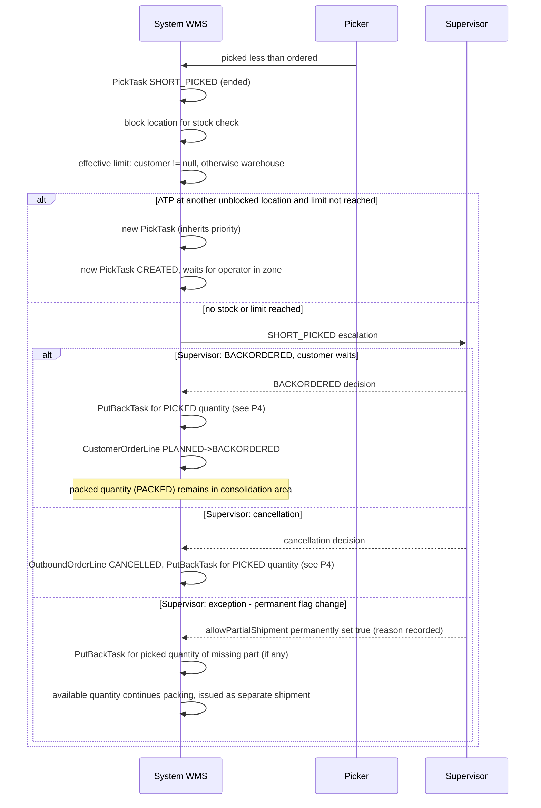
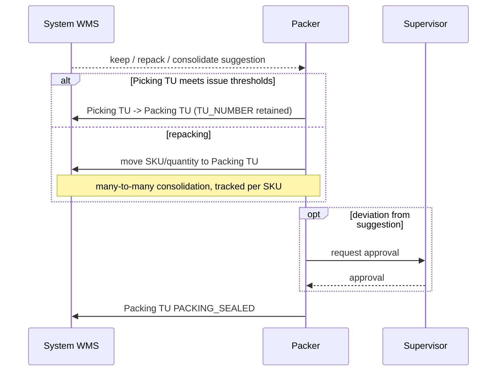
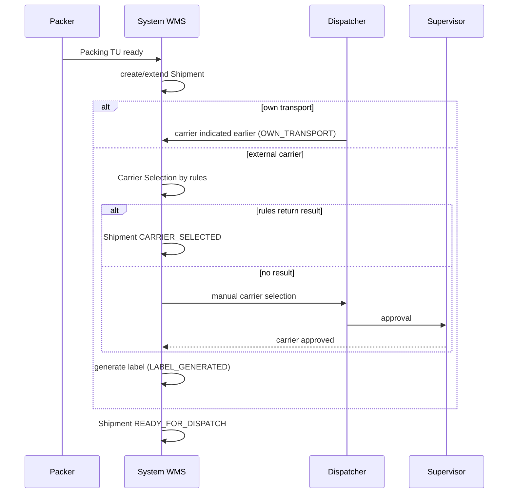
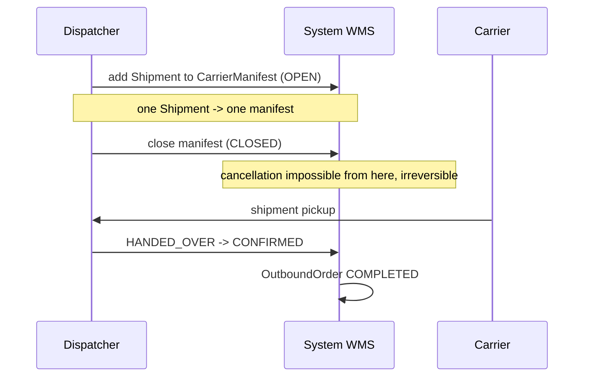

# PROCESS 1: STANDARD_FULFILLMENT

**Project:** WMSAI Outbound  
**Version:** 1.20 | **Date:** 2026-08-28 | **Author:** Business Analyst  
**Origin:** this document was created by expanding archived `propozycja_procesow_outbound.md` v1.29 §3.1 (Standard Outbound) and §3.5 (Cross-cutting exception handling, P1 part) into the step-by-step format compliant with `SZABLON_PROCESU.md`. The archived document is historical material, not a source of truth — this file is the source of truth (`DEC-A14`).  
**Previous process:** external OMS/ERP system (outside WMS) — arrival of `CustomerOrder`  
**Next process:** none within WMS — physical pickup by carrier/own transport, outside the system boundary. Outbound Crossdock (PROCESS 2) is an alternative source of Outbound `TU` for the same `Shipment`/`CarrierManifest` (step 9 onward is shared).  
**Document scope:** business-process description of standard customer-order fulfillment, from validation through physical dispatch. The catalog of states, transitions and domain events is maintained in `model_stanow_outbound.md` (source of truth for status names) — this document describes behavior and does not define new states.

---

## Process objective

Fulfill a `CustomerOrder` from receipt and validation, through soft and hard stock reservation, picking, packing, carrier selection and ERP posting, up to carrier-manifest closure and physical dispatch. The process covers the standard fulfillment path from stored stock (unlike Outbound Crossdock, PROCESS 2, where goods do not enter storage) and — according to **R16**–**R17** — an alternative shortened packing path performed directly by the Picker during picking.

## Main-flow diagram

The diagram shows the main standard Outbound flow. Actor responsibility is represented in subgraphs (logical swimlanes). Exception branches lead to handling described in the “Exceptions and alternative paths” section of this file. The diagram does not represent full BPMN semantics (gateways, intermediate events) — it is completed by the description below and the sequences in section 6.

**Actor responsibility under the diagram:**

- Validation, cyclic planning, `OutboundOrder` creation, `Allocation`, `PickTask` creation, `TU` weight-limit control, rule-based Carrier Selection and label generation — **System WMS** (automatically).
- Picking `TU` scan and picking — **Picker**.
- Picking `TU` assessment, packing/consolidation, creation/extension of `Shipment` — **Packer**.
- `CarrierManifest` (adding `Shipment`, closing, dispatch), own-transport handling — **Dispatcher**.
- `SHORT_ALLOCATED` and `SHORT_PICKED` are handled automatically first. **Warehouse Supervisor** resolves only a configured policy branch, inability to reallocate automatically, reaching the limit, and decisions affecting the customer.

The Supervisor’s decision after SHORT_ALLOCATED (permanent allowPartialShipment change / cancel OutboundOrder while preserving CustomerOrder precedence) and after SHORT_PICKED (BACKORDERED / cancellation / permanent allowPartialShipment change) is described in detail in the “Exceptions and alternative paths” section of this file (**R42**–**R43** for `SHORT_ALLOCATED`, **R44**–**R47** for `SHORT_PICKED`) and in sequence diagrams §6.1 and §6.3. Access order to future stock for waiting CustomerOrder: priority, then arrival order on tie (mechanism under development, see BACKLOG B3a).

The “own transport” stage (A17) bypasses Carrier Selection — the carrier is indicated earlier (**STEP 10**). Outbound Crossdock (P2) connects into the flow at `CrossDockPickTask` and `OutboundOrderLine` generation; Outbound `TU` is created on the first `SKU` placement during sorting (`model_stanow_outbound.md` §7; `proces_2_outbound_crossdock.md` **STEP 2**, `P2 R7`), then enters `Shipment`; full description is in `proces_2_outbound_crossdock.md`.

---

## Participants

- **Picker (Warehouse Operator)** — picks goods into Picking `TU` (step 6), optionally declares direct picking into Outbound `TU` (step 6a).
- **Packer (Warehouse Operator)** — assesses and prepares Packing `TU` (steps 7–8) when the direct path from step 6a/7 did not apply; groups `TU` into `Shipment` (step 9).
- **Dispatcher** — indicates own transport (step 10 variant), opens and closes `CarrierManifest` (step 12), physically hands over the shipment (step 13).
- **Warehouse Supervisor** — escalation decisions: hold/release `CustomerOrder` (step 1), manual carrier selection when rules return no result (step 10), approval of deviations from Packer suggestion (step 7), resolution of `SHORT_ALLOCATED`/`SHORT_PICKED`/cancellation exceptions (“Exceptions and alternative paths”), retry or abandonment after `POSTING_ERROR` (step 11a).
- **System WMS** — automation: validation, soft and hard reservation, creation of `OutboundOrder`/`PickTask`, assessment of Picking `TU` issue thresholds (including automatic direct path, **R17**), carrier selection according to `CarrierSetup`, label generation, ERP-posting gate, aggregation of statuses.
- **Customer, Carrier** — outside WMS boundary (order source and shipment recipient).

## Start event

Arrival of `CustomerOrder` from an external system (OMS/ERP).

## Process flow

---

### STEP 1 — Validate `CustomerOrder`
**[System WMS]**

- `CustomerOrder` arrives from an external system with lines; header receives `RECEIVED`, each line receives `CustomerOrderLine` in `OPEN`.
- System WMS validates the header.

◇ **Did validation finish successfully?**

**Path A — YES → [System WMS]**
- `CustomerOrder` transitions `RECEIVED → VALIDATED`, then `VALIDATED → ACCEPTED`, provided the order is not held (Path C) → continue to **STEP 1A**.

**Path B — NO (negative validation) → [System WMS]**
- `CustomerOrder` transitions `RECEIVED → REJECTED` — terminal state, process ends for this order.

**Path C — order has a hold → [System WMS / Warehouse Supervisor]**
- After `ACCEPTED`, `CustomerOrder` transitions `ACCEPTED → ON_HOLD`; it is skipped in cyclic planning (**STEP 2**) until `Warehouse Supervisor` or System WMS releases the hold (`ON_HOLD → ACCEPTED`), after which the order returns to the planning queue.

---

### STEP 1A — Soft `ATPReservation`
**[System WMS]**

- When `CustomerOrder` reaches `ACCEPTED`, each `CustomerOrderLine` receives `ATPReservation` — quantity calculated from `Inventory.AVAILABLE` (stock flagged `ATP`) minus the sum of already-active `ATPReservation` on that SKU, without subtracting `Allocation` again (its effect is already reflected in `AVAILABLE`).
- If availability is 0, the line receives `ATPReservation = 0` and waits in queue; `CustomerOrderLine` transitions `OPEN → BACKORDERED` (**R1**).
- Assignment order for waiting lines on the same SKU is a warehouse parameter: by default arrival order only; variants using `priority`/`slaDeadline` as tie-breaks are configurable exceptions (**R2**).
- The queue is recalculated whenever an Inbound `TU` containing the SKU is posted (all variants) and — only for variants using `priority`/`slaDeadline` — whenever a new `CustomerOrder ACCEPTED` appears; it never disturbs an existing `Allocation RESERVED` (**R3**).
- “Inbound `TU` posted” here specifically means an ERP-confirmed event (`POST` on ASN), not merely physical receipt of goods in the warehouse (**R4**).

---

### STEP 2 — Cyclic fulfillment planning
**[System WMS]**

- System WMS cyclically scans `CustomerOrder ACCEPTED` for further fulfillment.
- It skips `CustomerOrder.ON_HOLD` (**R5**). After hold release, the order returns to the planning queue.
- Continue to **STEP 2A**.

---

### STEP 2A — Condition for `allowPartialShipment = false`
**[System WMS]**

◇ **Is every `CustomerOrderLine` of this `CustomerOrder` fully covered — its `ATPReservation` plus quantity already packed in any channel (**R6**)?** — this condition applies only to `allowPartialShipment = false`.

**Path A — YES (or `allowPartialShipment = true`) → [System WMS]**
- For `allowPartialShipment = true`, the condition does not apply — planning proceeds normally, with partial reservation where necessary (see **STEP 4**).
- Continue to **STEP 3**.

**Path B — NO (`allowPartialShipment = false`, no full reservation) → [System WMS]**
- `CustomerOrder` remains `ACCEPTED`; System WMS sets `WARNING` (description: “waiting for full ATP reservation”).
- `WARNING` disappears in two cases: manually, when `Warehouse Supervisor` sets the flag to `false`, or automatically, when the cause actually ceases. Manually clearing the flag does not change business behavior — if the cause still exists, the next cyclic-planning pass sets `WARNING` again (**R61**).
- No standard `OutboundOrder` is created in this pass (**R6**). Only when all lines together reach full coverage does the next cyclic-planning pass create an `OutboundOrder` for uncovered quantity; if cross-dock covers everything, none is created.

---

### STEP 3 — Create `OutboundOrder`
**[System WMS]**

- System WMS creates `OutboundOrder` by grouping or splitting `OutboundOrderLine`, before `Allocation`; `CustomerOrderLine` transitions `OPEN → PLANNED`. One `CustomerOrderLine` may be split across multiple `OutboundOrderLine` (**R59**).
- Grouping is allowed when customer, delivery address and priority match, `slaDeadline` lies within per-warehouse tolerance, and no `allowPartialShipment = false` is present (**R7**).
- For `allowPartialShipment = false`, exactly one `OutboundOrder` is created, without aggregation of other `CustomerOrder` (**R8**).
- `OutboundOrder` is created in `CREATED`, `fulfillmentChannel = STANDARD` (immutable from creation), with `priority`/`slaDeadline` calculated as the most urgent aggregate among aggregated `CustomerOrder` (**R9**).
- Once `OutboundOrder` exists (and for `allowPartialShipment = false`, only after **STEP 2A** is satisfied), `CustomerOrder` transitions `ACCEPTED → IN_FULFILLMENT`.

---

### STEP 4 — `Allocation`
**[System WMS]**

- System WMS starts `OutboundOrder CREATED → ALLOCATION_IN_PROGRESS` and creates `Allocation` (`PENDING`) for every `OutboundOrderLine`, reserving only eligible `ATP` stock.
- Priority applies only to unreserved stock (**R10**).
- As actual `Allocation RESERVED` is created, the corresponding quantity is subtracted from `ATPReservation` of that `CustomerOrderLine` (soft-to-hard reservation conversion, retained through `PICKING`/`PICKED`/`PACKED` until `SHIPPED`) (**R11**).
- `Warehouse Supervisor` may manually reduce or remove `ATPReservation` without changing `CustomerOrder` status and without giving a reason (**R12**).

◇ **Does `Allocation` cover the full required quantity of `OutboundOrderLine`?**

**Path A — YES → [System WMS]**
- `Allocation PENDING → RESERVED`, `OutboundOrderLine CREATED → ALLOCATED`.
- When all lines of `OutboundOrder` reach `ALLOCATED`: `OutboundOrder ALLOCATION_IN_PROGRESS → ALLOCATED` → continue to **STEP 5**.

**Path B — NO (incomplete reservation) → [System WMS]**
- `Allocation PENDING → SHORT`, `OutboundOrderLine CREATED → SHORT_ALLOCATED`, `OutboundOrder ALLOCATION_IN_PROGRESS → SHORT_ALLOCATED`.
- `Allocation.reservedQty` takes the quantity actually reserved: full `requiredQty` in `RESERVED`, less in `SHORT`. Only `SHORT`, `RESERVED` and `CONFIRMED` block stock (**R71**).
- Automatic path according to `allowPartialShipment` and warehouse policy — see **“Exceptions and alternative paths” → `SHORT_ALLOCATED`**.

---

### STEP 5 — Create `PickTask`
**[System WMS]**

- For `OutboundOrder ALLOCATED`, System WMS creates `PickTask` in `CREATED`, separately for every zone covered by the order (**R13**); `OutboundOrderLine ALLOCATED → PICKING`, `OutboundOrder ALLOCATED → PICKING_IN_PROGRESS`.
- `PickTask` waits in `CREATED` — it is not assigned when created. Assignment happens only when an eligible operator presents themselves (**R54**).
- Ordering of multiple `PickTask` for a `Warehouse Operator` is a warehouse parameter: by default `slaDeadline` → `priority` as tie-break; alternatively `priority` → `slaDeadline` as tie-break; a tie on both is resolved by `PickTask` arrival order (**R14**).

---

### STEP 6 — Picking
**[Picker]**

- Picker scans Picking `TU` before placing goods (`PickTask ASSIGNED → IN_PROGRESS`; if `TU` did not yet exist it is created in `CREATED`, then `CREATED → IN_PICKING`).
- `TU_NUMBER` assigned when an Outbound `TU` is created is required and unique per warehouse among active nonterminal Outbound `TU`; `SSCC` is optional and need not equal `TU_NUMBER` (**R53**).
- System WMS blocks exceeding the `TU` weight limit: current mass calculated from contents (**R63**) versus `TUSetup.maxWeight` — when the limit is reached `TU IN_PICKING → PICK_FULL` (**R15**). Current contents volume is calculated according to **R63**, but is used only for issue-threshold assessment (**R64**); it is not a fill-block condition (**R15**) or repacking limit (**R20**), and carrier selection receives `TUSetup.maxVolume` as carrier/package volume (**R30**).
- 🔁 When a Picking `TU` reaches `PICK_FULL` and quantity still remains in `PickTask`, Picker closes the full `TU` (`PICK_FULL → READY_TO_PACK`) and scans another Picking `TU`. System WMS creates it in `CREATED`, binds it to the same `PickTask` on first scan, and performs `CREATED → IN_PICKING`; `PickTask` retains identity and remains `IN_PROGRESS`. The next `TU` inherits `directPackDeclared` from the previous `TU` of the same `PickTask`, without asking again, according to **R16**. This is a normal process step, not escalation, `SHORT_PICKED`, or task completion (**R67**).
- Picking `TU` assignment strategy is a configurable warehouse parameter with two variants: separate Picking `TU` for each task or zone, or one shared Picking `TU` moving through successive tasks of the same `OutboundOrder` (**R62**).

◇ **Was the full ordered quantity picked?**

**Path A — YES → [Picker / System WMS]**
- `PickTask IN_PROGRESS → COMPLETED`; `OutboundOrderLine PICKING → PICKED`; `Allocation RESERVED → CONFIRMED` (pick confirmation: `TU` and quantity scan).
- Completing `PickTask` does not close Picking `TU` — `TU` remains `IN_PICKING` until operator decision (**R55**) or until weight limit is reached (`PICK_FULL`, **R15**). Only then `TU IN_PICKING`/`PICK_FULL → READY_TO_PACK`.
- When all `PickTask` of `OutboundOrder` are `COMPLETED`: `OutboundOrder PICKING_IN_PROGRESS → PICKED`.
- Continue to **STEP 6A**.

**Path B — NO (less picked) → [Picker]**
- `PickTask IN_PROGRESS → SHORT_PICKED`; `OutboundOrderLine PICKING → SHORT_PICKED`.
- Continue according to **“Exceptions and alternative paths” → `SHORT_PICKED`**.

---

### STEP 6A — Picking-mode declaration
**[Picker]**

- On the first Picking `TU` scan for a given `PickTask` (`TU CREATED → IN_PICKING`, **STEP 6**), Picker may optionally declare direct picking into Outbound `TU` — `TU.directPackDeclared = true` (`model_stanow_outbound.md` §7) — instead of default mode (`directPackDeclared = false`).
- The declaration is binding for the entire task and **irreversible** after picking starts (**R16**).
- The declaration does not change **STEP 6** — it affects only who and when performs the assessment in **STEP 7**.
- Continue to **STEP 7**.

---

### STEP 7 — Assess Picking `TU`
**[System WMS / Packer]**

◇ **Is `TU.directPackDeclared = true`?**

**Path A — YES, and after picking the `TU` meets issue thresholds → [System WMS]**
- System WMS automatically closes the `PackUnit` role: `TU READY_TO_PACK → PACK_QUALIFIED → PACKING_SEALED`.
- Related `OutboundOrderLine PICKED → PACKED` — without Packer involvement (**R17**).
- Continue to **STEP 9** (Packing `TU` ready — **STEP 8** skipped for this `TU`).

**Path B — YES, but `TU` **does not** meet issue thresholds → [System WMS]**
- System WMS routes `TU` to standard Packer assessment — exactly as for a `TU` without the declaration (Path C).
- Continue to **STEP 8**.

**Path C — `directPackDeclared = false` (default mode) → [Packer]**
- System WMS suggests an assessment based on issue-threshold fulfillment; Packer decides: keep / repack / consolidate.
- Deviation from System WMS suggestion requires `Warehouse Supervisor` approval (**R18**).
- If `TU` meets issue thresholds and Packer chooses “keep”: `TU READY_TO_PACK → PACK_QUALIFIED → PACKING_SEALED`, `OutboundOrderLine PICKED → PACKED` — continue to **STEP 9**.
- If Packer chooses repack/consolidate: `TU READY_TO_PACK → REPACKED` (terminal for this `TU` as `PickContainer`) — continue to **STEP 8**.
- **Forced issuability.** For a `TU` on any type other than the external-carrier role type (**R68**), `Warehouse Operator` may close a `TU` that has not reached the lower weight or volume thresholds and issue it without repacking only when its type has `TUSetup.externalIssuable = true` and at least one of two conditions holds: the `TU` is the last for its `OutboundOrder`, or `slaDeadline` is approaching. The decision belongs to the operator and requires recording a reason. The override removes only lower thresholds; with `TUSetup.externalIssuable = false`, sealing and issuing are blocked and the only path is repacking to an issuable type according to **R66**. This is particularly relevant for `directPackDeclared = true`, where Packer does not participate in assessment (**R65**). For a `TU` on the external type, forcing is unnecessary because issuability follows from the first branch of **R64**.

---

### STEP 8 — Prepare Packing `TU`
**[Packer]**

- If Picking `TU` meets issue thresholds (**STEP 7**, Path C “keep”) — it serves as Packing `TU` and retains `TU_NUMBER` (**R19**).
- Otherwise, repack into one or more Packing `TU`; many-to-many consolidation is tracked per SKU/quantity. Version 1 imposes no goods-compatibility restrictions on such combinations (category, temperature, etc.) — arbitrary SKU may be packed together provided the `TUSetup.maxWeight` limit is respected (**R20**).
- One Packing `TU` may contain lines from multiple `OutboundOrder` only when their source `CustomerOrder` have the same customer, same delivery address, compatible priority and compatible delivery deadline; all lines in one Packing `TU` must belong to one `Shipment`. This condition is checked during repacking, not only during grouping of Packing `TU` into `Shipment` (**R60**).
- The target repacking carrier must be an externally issuable type (`TUSetup.externalIssuable`); a Packing `TU` repacked to a non-issuable type cannot be sealed (**R66**).
- Two repacking modes, configurable per warehouse (administrator may disable one for the whole warehouse, forcing the other, or let Packer choose per `TU`):

◇ **Repacking mode?**

**Path A — “repack all” → [Packer]**
- No quantity control; Packer moves contents without scanning/counting individual SKU; discrepancy risk is consciously accepted (as with “keep”, **STEP 7**).

**Path B — “repack by SKU” → [Packer]**
- Quantity control per SKU (described below).
- Packer independently decides which SKU from the source Picking `TU` to repack and in what order — System WMS does not direct or indicate a specific SKU to take at this stage (version 1) (**R21**).
- For every SKU Packer chooses to repack: scan code + enter quantity; System WMS compares it with `pickedQty` of that line (recorded by original `PickTask`).

  ◇ **Quantity comparison result?**

  **Quantity matches** — line goes to Packing `TU`.

  **Quantity lower than `pickedQty` (possible missing quantity during count)** — System WMS does not register a shortage automatically; Packer chooses:
  - **Defer decision** — leave the line unsettled, continue to next SKU; may return later (before repacking the `TU` is completed) and count/repack remaining quantity if found.
  - **Report shortage** — only after (1) rechecking `TU` contents for that SKU and (2) explicit confirmation by Packer. Only that confirmation triggers the mechanism: System WMS corrects `pickedQty` to the actually confirmed quantity, `OutboundOrderLine PICKED → SHORT_PICKED` for the missing part, then automatic reallocation/escalation as for `SHORT_PICKED` during picking (see **“Exceptions and alternative paths” → `SHORT_PICKED`**), without blocking the source location (**R22**).

  **Damaged goods** — cannot be repacked into Packing `TU`. Packer reports SKU as `DAMAGED`; System WMS instructs placement in designated `QC` (Quality Control). Exactly the same mechanism as for a shortage found during counting applies to that quantity (`OutboundOrderLine PICKED → SHORT_PICKED`, reallocation/escalation, no source-location block); additionally the event is marked `DAMAGED` (not generic shortage) in the discrepancy register for investigation (**R23**).

  **Unexpected SKU in this `TU`** (quantity surplus over WMS-recorded contents or completely different/unassigned code — handled identically) — System WMS informs Packer that the item does not belong to this `TU`; Packer puts it in `QC`, to be investigated in future Inventory Management processes. This does not trigger the shortage mechanism (**R24**).

- **Completing repacking of source `TU`.** Packer initiates completion. System WMS checks whether all system-expected SKU of this `TU` (according to `pickedQty`) have been settled — moved to Packing `TU`, moved to `QC`, or already reported missing.

  ◇ **Have all expected SKU been settled?**

  **YES → [System WMS]** — continue to **STEP 9**.

  **NO → [Packer]** — choose:
  - **Continue** — return to repacking source `TU` (completion attempted too early).
  - **Report shortage** — only after (1) rechecking `TU` contents and (2) explicit shortage confirmation, Packer reports remaining unsettled quantity as missing (shortage found at completion); same `SHORT_PICKED` mechanism as above (**R25**).

---

### STEP 9 — Create/extend `Shipment`
**[Packer / System WMS]**

- `Shipment` is created after the first Packing `TU` is prepared (`Shipment CREATED`); subsequent ready Packing `TU` are grouped when customer, delivery address, priority and **identical** `slaDeadline` match (no tolerance — unlike `CustomerOrder → OutboundOrder` grouping in **STEP 3**, where per-warehouse tolerance is allowed) (**R26**).
- One Packing `TU` belongs to exactly one `Shipment`.
- `allowPartialShipment = false` on `CustomerOrder` means the whole order is dispatched in one complete `Shipment`; absence of even one required line blocks dispatch of the whole order. One `Shipment` may contain many Packing `TU` for that order. The promise applies regardless of how many `OutboundOrder` or channels fulfilled the order (**R57**).
- A Packing `TU` of an order with `allowPartialShipment = false` is not attached to any `Shipment` until every `CustomerOrderLine` of that `CustomerOrder` satisfies exactly one of two disjoint conditions: (A) **INACTIVE LINE** — successfully cancelled or corrected by `Warehouse Supervisor` according to **R46** and no longer part of required quantity; it does not block the guard and is not subject to (B); or (B) **ACTIVE LINE** — sum of `requiredQty` of its `OutboundOrderLine` that have reached `PACKED` or beyond and are not `CANCELLED` equals `CustomerOrderLine.Quantity` effective after any correction, regardless of channel. Line status alone is insufficient: `PLANNED` arises on assignment to `OutboundOrderLine` (`model_stanow_outbound.md` §2), and `P2 R6` calculates `crossDockEligibleQty` as min(`sourceEligibleQty`, `demandEligibleQty`), so a line can be `PLANNED` with partial coverage. Until the condition is satisfied, `TU` remains `PACKING_SEALED`. Automatic `Shipment` closure after `slaDeadline` does not apply to such `TU`, because they do not yet belong to any `Shipment`. After `CarrierManifest.CLOSED` there is no return (**R58**).
- `TU PACKING_SEALED → IN_SHIPMENT` (attach to `Shipment`).
- `OutboundOrder` reaches `PACKED` when all its `OutboundOrderLine` and all their `TU` are packed (full aggregate, analogous to `PICKED` in **STEP 6**); from `PACKED` it immediately transitions to `READY_FOR_DISPATCH` — signal for `Shipment` (**R27**).
- `Shipment` closes `TU` grouping and reaches `READY_FOR_DISPATCH` (`Shipment CREATED → READY_FOR_DISPATCH`):
  - (a) when all contributing `OutboundOrder` have reached their own `READY_FOR_DISPATCH`, or
  - (b) automatically after the common `slaDeadline` of those `OutboundOrder` passes, regardless of whether all were packed in time (**R28**).
- Packing `TU` not ready before (b) do not enter that `Shipment` — when ready, they create a new `Shipment` under the same grouping rule. `TU` already attached stay in the closing `Shipment`, so an `OutboundOrder` with some `TU` ready before deadline and some after contributes to two `Shipment` (**R29**, **R70**).

---

### STEP 10 — Carrier Selection
**[System WMS / Warehouse Supervisor / Dispatcher]**

- Carrier Selection starts only after `Shipment` reaches `READY_FOR_DISPATCH` (**STEP 9**) — only then is the Packing `TU` set closed, and matching uses the highest current mass among Packing `TU`, calculated from contents according to **R63**, plus the highest `TUSetup.maxVolume` among their types as carrier/package volume (**R30**).
- External-carrier selection is automatic according to `CarrierSetup` configuration — not hard-coded rules. Each `CarrierSetup` links `Carrier`, `Region` (delivery area, freely defined per warehouse — postal code, range, group of provinces; independent of warehouse `Zone`) and weight interval (`minWeight`–`maxWeight`) and volume interval (`minVolume`–`maxVolume`); one `Carrier` may have many `CarrierSetup` (**R31**).
- System WMS determines the highest current mass among all Shipment Packing `TU` (**R63**) and the highest `TUSetup.maxVolume` among their types, then finds `CarrierSetup` whose `Region` matches delivery address, weight interval includes the mass, and volume interval includes the type volume.

◇ **`CarrierSetup` matching result?**

**Path A — exactly one matching `CarrierSetup` → [System WMS]**
- `Shipment READY_FOR_DISPATCH → CARRIER_SELECTED`.

**Path B — more than one matching `CarrierSetup` for the same `Region` → [System WMS]**
- Resolve in order: narrowest volume interval, then narrowest weight interval, then `Carrier.priority` (unique value in carrier dictionary — always resolves uniquely) (**R32**).
- `Shipment READY_FOR_DISPATCH → CARRIER_SELECTED`.

**Path C — no match → [System WMS / Warehouse Supervisor]**
- `Shipment READY_FOR_DISPATCH → CARRIER_PENDING`.
- Manual `Warehouse Supervisor` selection: `Shipment CARRIER_PENDING → CARRIER_SELECTED`.

**Path D — own transport, indicated earlier → [Dispatcher]**
- `Shipment READY_FOR_DISPATCH → OWN_TRANSPORT`; this variant skips further carrier-selection substeps.

- Regardless of path: `Warehouse Supervisor` may always change the result (automatic or manual) without giving a reason (**R33**).

---

### STEP 11 — Generate label
**[System WMS]**

- After carrier approval (`Shipment CARRIER_SELECTED`) System WMS generates the label: `Shipment CARRIER_SELECTED → LABEL_GENERATED`.
- Printed from data already held (Packing `TU` data, `Carrier` description, delivery address), with no external carrier API call and no confirmation/approval step by the carrier; version 1 has no technical label-generation failure mode and no electronic carrier rejection (**R34**).
- Loading problem discovered before `CarrierManifest.CLOSED` → `Warehouse Supervisor` manually changes `Carrier`, without reprinting the label; after `CarrierManifest.CLOSED`, changing `Carrier` is impossible (**R35**).
- Own transport (`OWN_TRANSPORT`) skips this step.

---

### STEP 11A — Report dispatch readiness to ERP
**[System WMS / ERP / Warehouse Supervisor]**

- Every `Shipment` — regardless of whether it contains originally ordered quantity or corrected quantity (see **“Exceptions and alternative paths”**, “cancel” result for `SHORT_PICKED`) — must be reported to ERP as ready for dispatch before it is added to `CarrierManifest` (**R36**).
- `Shipment LABEL_GENERATED`/`OWN_TRANSPORT → POSTING_PENDING`.

◇ **ERP response?**

**Path A — confirmation (`POST`) → [System WMS / ERP]**
- `Shipment POSTING_PENDING → POSTED`. Only now may `Shipment` be added to a manifest (**STEP 12**).

**Path B — explicit rejection → [System WMS / ERP]**
- `Shipment POSTING_PENDING → POSTING_ERROR`. Escalate to `Warehouse Supervisor`.
- ERP returns a structured rejection reason allowing System WMS to distinguish a technical communication failure from content inconsistency. For content inconsistency, the cause is on one of two sides:
  - (a) ERP side (for example missing item price, `ATP` discrepancy between WMS and ERP) — retry with unchanged content succeeds after ERP repair, without any WMS-side data change;
  - (b) WMS side (incorrect data on `CustomerOrder`/`Shipment`) — correction required before retry: `Warehouse Supervisor` corrects manually, or correction arrives from OMS/ERP via webservice.
- In both cases retry is a separate manual `Warehouse Supervisor` decision (`Shipment POSTING_ERROR → POSTING_PENDING`, **R37**); successful repair ends with ERP confirmation `POSTED`.
- Physical contents of packed `TU` and `OutboundOrderLine PACKED` are not changed in either variant.
- `Warehouse Supervisor` may also abandon: `Shipment POSTING_ERROR → CANCELLED`.
- No response (timeout) is a technical incident outside this process, with no defined path in this document.

**Why the gate is placed here, before adding to manifest rather than later:** ERP is the principal, WMS the executor — if `Shipment` could enter a manifest and be dispatched before ERP posted it, WMS would ship something absent from ERP books, appearing in the ERP↔WMS relationship as a WMS-side shortage/discrepancy. From entry into `POSTING_PENDING`, WMS cancellation of `Shipment` is no longer possible (**R38**); any correction after that point is an ordinary return of goods (Return Receipt, outside this document).

---

### STEP 12 — `CarrierManifest`
**[Dispatcher]**

- Dispatcher opens `CarrierManifest` (`OPEN`) and adds `Shipment POSTED`: `Shipment POSTED → IN_MANIFEST`.
- One `Shipment` in one manifest (**R39**).
- Dispatcher closes manifest: `CarrierManifest OPEN → CLOSED` — irreversible closure, boundary for cancellation and `Carrier` change (**R40**).

---

### STEP 13 — Dispatch
**[Dispatcher / Carrier]**

- Physical handover to carrier or own transport: `CarrierManifest CLOSED → HANDED_OVER`; `Shipment IN_MANIFEST → HANDED_TO_CARRIER`; `TU IN_SHIPMENT → DISPATCHED`; `OutboundOrder READY_FOR_DISPATCH → DISPATCHED`.
- Dispatcher confirms warehouse dispatch: `CarrierManifest HANDED_OVER → CONFIRMED`.
- Manifest confirmation settles `Inventory PICKED → SHIPPED` for quantity in Outbound `TU` of that manifest and reduces `Allocation.reservedQty` by that quantity (**R72**).
- `OutboundOrderLine PACKED → SHIPPED` and `Allocation CONFIRMED → CONSUMED` occur only when every Outbound `TU` contributing quantity to that line belongs to a `Shipment` whose manifest is `CONFIRMED`; earlier manifests leave the line in `PACKED` and the allocation in `CONFIRMED` (**R72**).
- `OutboundOrder DISPATCHED → COMPLETED` only when every `Shipment` containing at least one Outbound `TU` of this order belongs to a `CarrierManifest` in `CONFIRMED`; confirmation of only some leaves the order in `DISPATCHED` (**R70**).
- `CustomerOrderLine` aggregation: `PLANNED`/`PARTIALLY_FULFILLED → PARTIALLY_FULFILLED`/`FULFILLED` depending on whether the full line quantity has been dispatched.
- `CustomerOrder` aggregation — see **Continuous Function F1**.
- Continue to **STEP 13A**.

---

### STEP 13A — Settle `CustomerOrder`
**[System WMS]**

- Calculated automatically, analogous to `OutboundOrder.COMPLETED` dependence on `CarrierManifest.HANDED_OVER → CONFIRMED` (**STEP 13**): once `CustomerOrder` reaches `SHIPPED` (Continuous Function F1) and every `OutboundOrder` that contributed at least one dispatched `OutboundOrderLine` to that `CustomerOrder` reaches `COMPLETED`, header transitions `SHIPPED → CLOSED` (**R41**).
- `CLOSED` is terminal for `CustomerOrder` — no further effects.

---

## End event

`CarrierManifest` closed/settled (`CONFIRMED`) and shipment physically handed to carrier or own transport; `OutboundOrder → COMPLETED`; `OutboundOrderLine → SHIPPED`; `CustomerOrderLine → FULFILLED`/`PARTIALLY_FULFILLED`; `CustomerOrder → SHIPPED`, ultimately `CLOSED` after settlement of all contributing `OutboundOrder` (**STEP 13A**).

---

## Sequence diagrams

### 6.1 Cyclic planning, grouping and allocation

### 6.2 Multi-zone picking (multiple `PickTask` and Picking `TU`)

### 6.3 `SHORT_PICKED`, location block, reallocation

### 6.4 Packing and many-to-many consolidation

### 6.5 Create `Shipment`, Carrier Selection and label

### 6.6 `CarrierManifest` — creation, closure, dispatch

## Data objects

| Object | Key fields | Status(es) |
|---|---|---|
| `CustomerOrder` | `priority`, `slaDeadline`, `allowPartialShipment`, `WARNING` | `RECEIVED → VALIDATED → ACCEPTED` (⇄ `ON_HOLD`) `→ IN_FULFILLMENT` (⇄ `BACKORDERED`) `→ PARTIALLY_SHIPPED → SHIPPED → CLOSED`; alternative terminal: `REJECTED`, `CANCELLED` |
| `CustomerOrderLine` | `Quantity`, `ATPReservation`, `crossDockEligibleQty` | `OPEN` (⇄ `BACKORDERED`) `→ PLANNED → PARTIALLY_FULFILLED → FULFILLED`; alternative terminal: `CANCELLED` |
| `OutboundOrder` | `fulfillmentChannel`, `priority`, `slaDeadline` (aggregate) | `CREATED → ALLOCATION_IN_PROGRESS` (⇄ `SHORT_ALLOCATED`) `→ ALLOCATED → PICKING_IN_PROGRESS → PICKED → PACKING_IN_PROGRESS → PACKED → READY_FOR_DISPATCH → DISPATCHED → COMPLETED`; alternative terminal: `CANCELLED` |
| `OutboundOrderLine` | `pickedQty`, `requiredQty` | `CREATED` (⇄ `SHORT_ALLOCATED`) `→ ALLOCATED → PICKING` (⇄ `SHORT_PICKED`) `→ PICKED → PACKED → SHIPPED`; alternative terminal: `CANCELLED` |
| `Allocation` | reference `OutboundOrderLine`/`Inventory`, `reservedQty` | `PENDING` (⇄ `SHORT`) `→ RESERVED → CONFIRMED → CONSUMED`; alternative terminal: `RELEASED` |
| `PickTask` | `priority` (inherited), `zone` | `CREATED → ASSIGNED → IN_PROGRESS → COMPLETED`; alternative terminal: `SHORT_PICKED`, `CANCELLED` |
| Outbound `TU` (`PickContainer`/`PackUnit`) | `TU_NUMBER`, `SSCC`, `tuSetupCode`, `directPackDeclared` | `CREATED → IN_PICKING → PICK_FULL → READY_TO_PACK → PACK_QUALIFIED → PACKING_SEALED → IN_SHIPMENT → DISPATCHED`; alternative terminal: `REPACKED`, `CANCELLED`, `VOIDED` |
| `Shipment` | `selectedCarrier` | `CREATED → READY_FOR_DISPATCH → CARRIER_SELECTED`/`OWN_TRANSPORT`/`CARRIER_PENDING → LABEL_GENERATED → POSTING_PENDING → POSTED → IN_MANIFEST → HANDED_TO_CARRIER`; alternative terminal: `CANCELLED`; informational outside WMS: `IN_TRANSIT`, `DELIVERED` |
| `CarrierManifest` | references to `Shipment` | `OPEN → CLOSED → HANDED_OVER → CONFIRMED` |
| `Inventory` (Outbound scope) | — | `AVAILABLE → RESERVED → PICKED → SHIPPED`; alternatively `PICKED → AVAILABLE` (physical put-back, PROCESS 4) |
| `TUSetup` | `maxWeight`, `maxVolume`, `externalIssuable`, `processUsage` | no state lifecycle — configuration dictionary |
| `CarrierSetup` | `Region`, `minWeight`–`maxWeight`, `minVolume`–`maxVolume` | no state lifecycle — configuration dictionary |
| `Carrier` | `priority` | no state lifecycle — dictionary |

---

## Exceptions and alternative paths (PROCESS 5 — Cross-cutting exception handling)

This section implements PROCESS 5 — cross-cutting exceptions shared by Outbound processes, without its own process file — `SHORT_ALLOCATED`, `SHORT_PICKED`, `ON_HOLD`, cancellation, waiting for complete order, no Carrier Selection result, label error; see also `proces_2_outbound_crossdock.md` for the remainder.

| Condition | Behavior | Effect |
|---|---|---|
| `SHORT_ALLOCATED` — shortage during allocation (**STEP 4**), `allowPartialShipment = false` | Rare case: priority queue took part of the soft reservation between reaching full `ATPReservation` and creating actual `Allocation`. Escalation to `Warehouse Supervisor`: (1) permanent change of `allowPartialShipment` to `true` — available quantity `ALLOCATED`, missing `BACKORDERED`, process continues; (2) cancel `OutboundOrder → CANCELLED`, each covered `Allocation → RELEASED`, quantity returns to `ATPReservation` of relevant `CustomerOrderLine` | Line that lost reservation race `→ BACKORDERED`; remaining lines of same `OutboundOrder` (without own issue) `→ OPEN`; `CustomerOrder` returns `IN_FULFILLMENT → ACCEPTED` with `WARNING`, waits as a whole for full reservation (**R42**) |
| `SHORT_ALLOCATED`, `allowPartialShipment = true` | Full-reservation condition does not apply: existing `OutboundOrder` covers quantity that can be fulfilled | Missing quantity remains `BACKORDERED`; next `OutboundOrder` is created only after stock appears (**R43**) |
| `SHORT_PICKED` — shortage during picking (**STEP 6**) | `PickTask` ends in `SHORT_PICKED` and blocks the location. System WMS determines effective `maxAutomaticShortPickReallocations` (customer value when ≠ `null`; otherwise warehouse value, default `1`) and automatically creates a new `PickTask` when eligible `ATP` exists at an unblocked location and the limit has not been reached. Counter applies to `OutboundOrderLine` + missing quantity. No stock, reached limit, or customer-impacting decision → escalate to `Warehouse Supervisor` | Until resolution, `OutboundOrder` does not proceed to packing (**R44**) |
| `SHORT_PICKED`, `allowPartialShipment = false`, “wait” (`BACKORDERED`) result | `Warehouse Supervisor` decides to keep the customer’s original request. `OutboundOrderLine` of the short-picked line `→ CANCELLED`; `Allocation → RELEASED`; `ATPReservation` receives the `Allocation` quantity less confirmed missing quantity. All other lines of the same `CustomerOrder` in `ALLOCATED`/`PICKED` (not `PACKED`) are automatically rolled back by the same path — `OutboundOrderLine → CANCELLED`, `Allocation → RELEASED`, full `ATPReservation` return, `PutBackTask` for picked goods (PROCESS 4); those lines `→ OPEN`. Lines already `PACKED` are untouched, remain in consolidation area, `CustomerOrderLine` remains `PLANNED` | Short-picked line `→ BACKORDERED`; `CustomerOrder` returns `IN_FULFILLMENT → ACCEPTED` with `WARNING` **only** if no `OutboundOrderLine` of this order remains `PACKED` — otherwise it stays `IN_FULFILLMENT` with `WARNING`. If after rollback no `OutboundOrderLine` of the `OutboundOrder` remains `PACKED`, the `OutboundOrder → CANCELLED`; if at least one remains `PACKED`, `OutboundOrder` continues only for that portion (**R45**) |
| `SHORT_PICKED`, `allowPartialShipment = false`, “cancel” result | Cancelling `OutboundOrderLine` alone is insufficient — `allowPartialShipment = false` lives on `CustomerOrderLine`/`CustomerOrder`. The only effective solution is editing quantity on `CustomerOrderLine` by `Warehouse Supervisor`: full original quantity cancelled (`OutboundOrderLine → CANCELLED`, `Allocation → RELEASED`, `ATPReservation → 0`, `PutBackTask` for picked) or correction to actually picked quantity (no `PutBackTask`, order fulfilled in reduced form) | Distinction from sales correction is resolved by ERP posting gate (**STEP 11A**) (**R46**) |
| `SHORT_PICKED`, `allowPartialShipment = false`, “permanent change `allowPartialShipment` to `true`” result | `Warehouse Supervisor` has agreed partial fulfillment with the customer. `OutboundOrderLine` for missing part `→ CANCELLED`, available quantity continues as a separate shipment | From then on every future shortage on this `CustomerOrder` is handled automatically as for `allowPartialShipment = true`, without involving Supervisor again (**R47**) |
| Missing/damaged goods detected during packing (**STEP 8**, “repack by SKU”) | Same mechanism as `SHORT_PICKED` during picking, triggered during SKU counting or source-`TU` completion | Without source-location block — see `SHORT_PICKED` rows above (**R48**) |
| `CustomerOrder.ON_HOLD` (**STEP 1**, Path C) | Skipped in cyclic planning (**STEP 2**) | After release returns to planning queue (**R49**) |
| General cancellation (unrelated to shortage) — cancellation request for `CustomerOrder`/`CustomerOrderLine`, submitted by OMS/ERP (webservice) or manually by `Warehouse Supervisor` | Whole `CustomerOrder` may be cancelled only if each `CustomerOrderLine` satisfies the condition below; if any does not, System WMS rejects the whole-order request and identifies blocking lines. For one line, according to linked `OutboundOrderLine` status: (1) `CREATED`/`ALLOCATED`/`SHORT_ALLOCATED` — `→ CANCELLED`, `Allocation → RELEASED`, `Inventory → AVAILABLE`, `ATPReservation → 0`; (2) `PICKING` — cancel `PickTask`, possible return to source location (without formal `PutBackTask`), `OutboundOrderLine → CANCELLED`, `Allocation → RELEASED`, `ATPReservation` fully returned; (3) `PICKED`/`SHORT_PICKED` — stop packing, `PutBackTask` (PROCESS 4), `OutboundOrderLine → CANCELLED`, `Allocation → RELEASED` immediately (independent of `PutBackTask` completion), `ATPReservation` returned for full picked quantity; (4) `PACKED` — allowed only before `Shipment POSTING_PENDING`, requires `Warehouse Supervisor` approval: remove from `Shipment`, `OutboundOrderLine → CANCELLED`, `Allocation → RELEASED`, `PutBackTask`, `ATPReservation` returned | `CustomerOrderLine → CANCELLED`; general boundary: after `CarrierManifest.CLOSED` none of the above is possible (**R50**) |
| No Carrier Selection result (**STEP 10**) | `Warehouse Supervisor` decision; for `TU` on external-carrier role type (**R68**) whose `TUSetup.maxVolume` has no value, manual `Dispatcher` selection + `Warehouse Supervisor` approval | Label only after carrier approval (**STEP 11**) (**R51**) |
| Label error / carrier rejection | **Not applicable in version 1** — label is a WMS printout without external API and carrier approval step; no failure mode or electronic rejection. Real counterpart: loading problem before `CarrierManifest.CLOSED` → manual `Carrier` change by `Warehouse Supervisor`, without reprinting label | — (**R35**, see **STEP 11**) |
| `allowPartialShipment = false`, part of a `CustomerOrderLine` in the order satisfies neither (A) nor (B) of `R58`, while other lines of the same `CustomerOrder` already have `OutboundOrderLine` in `PACKED` | Packing `TU` of packed lines remain `PACKING_SEALED` in consolidation area and do not enter any `Shipment`; `OutboundOrder` is not cancelled for this reason; System WMS does not automatically release remaining lines for separate fulfillment. Waiting ends only through completion of the order or existing `Warehouse Supervisor` path (**R46**, **R47**). Unlike P5 E12/E13, which describe shortage and `DAMAGED` under `allowPartialShipment`, this exception describes a completed fragment waiting before `Shipment` creation, not a shortage. | Order waits as a whole; `TU` are not moved; boundary: after `CarrierManifest.CLOSED` there is no return (**R58**) |

---

## Business rules

- **R1** — When `ATP` availability for a `CustomerOrderLine` is 0 at `ACCEPTED`, the line receives `ATPReservation = 0` and transitions to `BACKORDERED`, waiting in queue.
- **R2** — `ATPReservation` assignment order for waiting lines on the same SKU is a warehouse parameter: arrival order by default; variants using `priority`/`slaDeadline` as tie-breaks are configurable exceptions.
- **R3** — `ATPReservation` queue is recalculated whenever an Inbound `TU` of the SKU is posted and — only in priority variants — whenever a new `CustomerOrder ACCEPTED` appears; it never disturbs an existing `Allocation RESERVED`.
- **R4** — “Inbound `TU` posted” means an ERP-confirmed event (`POST` on ASN), not physical receipt.
- **R5** — Cyclic fulfillment planning skips `CustomerOrder.ON_HOLD`.
- **R6** — For `allowPartialShipment = false`, a standard `OutboundOrder` is not created until every `CustomerOrderLine` of that `CustomerOrder` is fully covered. Line coverage = its `ATPReservation` plus the sum of `requiredQty` of its `OutboundOrderLine` that reached `PACKED` or beyond and are not `CANCELLED`, regardless of channel — the same measure as **R58**. Standard `OutboundOrder` covers only uncovered quantity; with full cross-dock coverage none is created. Until full coverage, `CustomerOrder` remains `ACCEPTED` with `WARNING`.
- **R7** — Grouping `CustomerOrderLine` into one `OutboundOrder` is allowed for matching customer, delivery address, priority, `slaDeadline` within per-warehouse tolerance, and absence of `allowPartialShipment = false`.
- **R8** — For `allowPartialShipment = false`, exactly one `OutboundOrder` is created, without aggregation of other `CustomerOrder`.
- **R9** — `OutboundOrder.priority`/`slaDeadline` are the most urgent aggregate among grouped `CustomerOrder`; `fulfillmentChannel` is set at creation and immutable.
- **R10** — Priority during `Allocation` applies only to stock not yet reserved. After `PickTask` is created, reallocation does not occur.
- **R11** — As `Allocation RESERVED` is created, corresponding quantity is subtracted from `ATPReservation` of that `CustomerOrderLine`; hard reservation is retained through `PICKING`/`PICKED`/`PACKED` until `SHIPPED`.
- **R12** — `Warehouse Supervisor` may manually reduce or remove `ATPReservation` without changing `CustomerOrder` status and without giving a reason.
- **R13** — One `OutboundOrder` may produce multiple `PickTask` for different zones; each `PickTask` concerns exactly one zone (`zone`) and is performed by one operator.
- **R14** — Ordering of multiple `PickTask` for an operator is a warehouse parameter (`slaDeadline`→`priority` or reverse, as tie-break); final tie is resolved by `PickTask` arrival order.
- **R15** — System WMS blocks exceeding Picking `TU` weight limit — current mass (**R63**) versus `TUSetup.maxWeight`; when reached, `TU → PICK_FULL`. Volume is not a condition of this block; the operator decides volumetric fullness by closing `TU`.
- **R16** — Declaration `directPackDeclared = true` at first Picking `TU` scan is binding for that entire `TU` and irreversible after picking begins; it also applies when the `TU` collects goods across successive `PickTask` in other zones. The operator is not asked again. A subsequent Picking `TU` of the same `PickTask`, created after `PICK_FULL` (**R67**), inherits `directPackDeclared` from the prior `TU`; the operator is not asked again for it either.
- **R17** — When `directPackDeclared = true` and after picking `TU` meets issue thresholds, System WMS automatically performs `TU READY_TO_PACK → PACK_QUALIFIED → PACKING_SEALED` and `OutboundOrderLine PICKED → PACKED`, without Packer involvement.
- **R18** — Deviation from System WMS suggestion when Packer assesses Picking `TU` requires `Warehouse Supervisor` approval.
- **R19** — Picking `TU` meeting issue thresholds serves as Packing `TU` and retains `TU_NUMBER`.
- **R20** — Consolidating multiple SKU in one Packing `TU` (repacking/“repack all”/“repack by SKU”) has no goods-compatibility restrictions in version 1 (category, temperature), provided `TUSetup` limits are respected.
- **R21** — In “repack by SKU”, Packer independently decides which SKU to repack and in what order; System WMS does not indicate a particular SKU.
- **R22** — Quantity lower than `pickedQty` detected during repacking requires (1) rechecking `TU` contents and (2) explicit shortage confirmation by Packer before `SHORT_PICKED` mechanism starts.
- **R23** — Damaged goods during repacking are routed to `QC` and marked `DAMAGED` in discrepancy register, using the same `SHORT_PICKED` mechanism as shortage.
- **R24** — Unexpected SKU in `TU` (surplus or foreign code) goes to `QC` for investigation; it does not trigger shortage mechanism.
- **R25** — Completing `TU` repacking requires settlement of all system-expected SKU (Packing `TU`, `QC`, or reported shortage); incomplete settlement returns to continuation or shortage reporting.
- **R26** — Grouping Packing `TU` into `Shipment` requires matching customer, delivery address, priority and **identical** `slaDeadline` (no tolerance, unlike `OutboundOrder` grouping).
- **R27** — `OutboundOrder` reaches `PACKED` when all its `OutboundOrderLine` and all their `TU` are packed (full aggregate); it immediately proceeds to `READY_FOR_DISPATCH`.
- **R28** — `Shipment` reaches `READY_FOR_DISPATCH` when all contributing `OutboundOrder` reached their own `READY_FOR_DISPATCH`, or automatically after common `slaDeadline`, regardless of packing completeness.
- **R29** — Packing `TU` not ready before `Shipment` grouping closes by `slaDeadline` do not enter that `Shipment`; when ready, they create a new `Shipment` under the same grouping rule. `TU` attached before closure stay — there is no `IN_SHIPMENT → PACKING_SEALED` return. An `OutboundOrder` whose some Packing `TU` were ready before closure and some later therefore contributes to more than one `Shipment` (**R70**).
- **R30** — Carrier Selection starts only after `Shipment READY_FOR_DISPATCH`, when Packing `TU` set is closed. Matching uses the highest current mass among Shipment Packing `TU` (**R63**) and the highest `TUSetup.maxVolume` among their types.
- **R31** — Each `CarrierSetup` links `Carrier`, `Region` and weight/volume intervals; one `Carrier` may have many `CarrierSetup`.
- **R32** — When more than one `CarrierSetup` matches the same `Region`, resolve in order: narrowest volume interval, then narrowest weight interval, then unique `Carrier.priority`.
- **R33** — `Warehouse Supervisor` may always change Carrier Selection result (automatic or manual) without giving a reason.
- **R34** — Label is a WMS printout without an external carrier API call or carrier-approval step; version 1 has no technical failure mode and no electronic rejection.
- **R35** — Loading problem discovered before `CarrierManifest.CLOSED` results in manual `Carrier` change by `Warehouse Supervisor` without label reprint; after `CLOSED`, changing `Carrier` is impossible.
- **R36** — Every `Shipment` must be reported to ERP as ready for dispatch (`POSTING_PENDING → POSTED`) before being added to `CarrierManifest`.
- **R37** — Retrying ERP posting after `POSTING_ERROR` is a separate manual `Warehouse Supervisor` decision.
- **R38** — From the moment `Shipment` enters `POSTING_PENDING`, WMS cancellation is no longer possible; correction after that point is Return Receipt, not reversal of posting.
- **R39** — One `Shipment` goes to exactly one `CarrierManifest`.
- **R40** — `Dispatcher` closure of `CarrierManifest` (`CLOSED`) is irreversible and is the boundary for cancellation and `Carrier` change.
- **R41** — `CustomerOrder` transitions `SHIPPED → CLOSED` when it is `SHIPPED` and every `OutboundOrder` that contributed at least one dispatched `OutboundOrderLine` reaches `COMPLETED`.
- **R42** — For `SHORT_ALLOCATED` and `allowPartialShipment = false`, Supervisor “cancel” returns `Allocation` to `ATPReservation`, with the losing line in `BACKORDERED` and remaining lines of that `OutboundOrder` in `OPEN`.
- **R43** — For `SHORT_ALLOCATED` and `allowPartialShipment = true`, full-reservation condition does not apply; shortage remains `BACKORDERED` until stock appears.
- **R44** — For `SHORT_PICKED`, System WMS automatically creates a new `PickTask` until effective reallocation limit (`maxAutomaticShortPickReallocations`, per customer or warehouse) is exhausted; no stock or exceeded limit escalates to `Warehouse Supervisor`.
- **R45** — “Wait” result for `SHORT_PICKED` (`allowPartialShipment = false`) automatically rolls back all lines of the same `CustomerOrder` in `ALLOCATED`/`PICKED` (not `PACKED`) through the same path as the shortage line; `PACKED` lines are untouched.
- **R46** — “Cancel” result for `SHORT_PICKED` (`allowPartialShipment = false`) requires editing `CustomerOrderLine.Quantity` by `Warehouse Supervisor` — cancelling `OutboundOrderLine` alone does not change `CustomerOrderLine.Quantity`. Correction to actually picked quantity changes `requiredQty` of that `OutboundOrderLine` together with `CustomerOrderLine.Quantity`, according to **R69**.
- **R47** — “Permanent change `allowPartialShipment` to `true`” after `SHORT_PICKED` means every future shortage on this `CustomerOrder` is handled automatically, without Supervisor involvement again. Permanent change requires a reason from `Warehouse Supervisor` and affects no other current or future `CustomerOrder` for this customer and no warehouse parameters.
- **R48** — Missing/damaged goods detected during packing (**STEP 8**) uses the same `SHORT_PICKED` mechanism as picking, without source-location block.
- **R49** — `CustomerOrder.ON_HOLD` is skipped in cyclic planning; after release it returns to queue.
- **R50** — General cancellation (unrelated to shortage) of whole `CustomerOrder` requires every `CustomerOrderLine` to satisfy cancellation conditions for its status; general boundary — after `CarrierManifest.CLOSED` no cancellation is possible.
- **R51** — No Carrier Selection result escalates to `Warehouse Supervisor`; for `TU` on external-carrier role type (**R68**) whose `TUSetup.maxVolume` has no value, manual `Dispatcher` selection and Supervisor approval are required.
- **R52** — `Allocation` may reserve only stock flagged `ATP`; non-ATP stock is not allocatable or reservable by Outbound.
- **R53** — `TU_NUMBER` of Outbound `TU` is required and unique per warehouse among active (nonterminal) Outbound `TU`; `SSCC` is optional and `TU_NUMBER` need not equal `SSCC`. `TU_NUMBER` is retained across `PickContainer → PackUnit`. A `TU_NUMBER` that is not `SSCC` contains only alphanumeric characters without special characters, has maximum 20 characters and is encoded in Code 128 symbology.
- **R54** — `Warehouse Operator` selects picking module on RF terminal and indicates one zone in which they intend to work. System WMS assigns (`PickTask CREATED → ASSIGNED`) the next `PickTask` in that zone according to **R14** when the operator has no active warehouse task of any type. Assignment requires no configuration or `Warehouse Supervisor` involvement.
- **R55** — After completing `PickTask`, RF terminal presents the operator a choice: close Picking `TU` and take the next task in current zone, or continue the same `OutboundOrder` in another zone while picking into the still-open `TU`. Continuing assigns the indicated `PickTask` of that `OutboundOrder` regardless of **R14** order and regardless of operator’s current zone; operator zone becomes that task’s zone.
- **R56** — Operator cannot leave the work module with an active task — must finish it. System WMS does not assign a task to an operator who already has an active warehouse task of any type.
- **R57** — `allowPartialShipment = false` means the entire `CustomerOrder` is dispatched in one complete `Shipment`; absence of even one required line blocks whole dispatch. One `Shipment` may contain many Packing `TU` of the order. The promise applies regardless of number of `OutboundOrder` and channels used.
- **R58** — A Packing `TU` of an order with `allowPartialShipment = false` is not attached to any `Shipment` until every `CustomerOrderLine` of that `CustomerOrder` satisfies one of two disjoint conditions: (A) **INACTIVE LINE** — successfully cancelled or corrected by `Warehouse Supervisor` according to **R46** and no longer part of required quantity; it does not block the guard and is not subject to (B); or (B) **ACTIVE LINE** — sum of `requiredQty` of its `OutboundOrderLine` that reached `PACKED` or beyond and are not `CANCELLED` equals `CustomerOrderLine.Quantity` effective after any correction, regardless of channel. Line status alone is insufficient: `PLANNED` arises when assigned to `OutboundOrderLine` (`model_stanow_outbound.md` §2), and `P2 R6` calculates `crossDockEligibleQty` as min(`sourceEligibleQty`, `demandEligibleQty`), so a line may be `PLANNED` with partial coverage. Until this condition is met, `TU` stays `PACKING_SEALED`. Automatic `Shipment` closure after `slaDeadline` does not apply because those `TU` do not yet belong to any `Shipment`. After `CarrierManifest.CLOSED` there is no return.
- **R59** — One `CustomerOrderLine` may be split across multiple `OutboundOrderLine`.
- **R60** — One Packing `TU` may contain lines from multiple `OutboundOrder` only for the same customer, same delivery address, compatible priority and compatible delivery deadline of source `CustomerOrder`; all lines in one Packing `TU` must belong to one `Shipment`. Condition is checked during repacking, not during `Shipment` grouping.
- **R61** — `WARNING` on `CustomerOrder` disappears manually (`Warehouse Supervisor` decision) or automatically when cause ceases. Manual removal does not change business behavior: if cause persists, next cyclic-planning pass sets it again.
- **R62** — Picking `TU` assignment strategy is a configurable warehouse parameter with two variants: separate Picking `TU` per task or zone, or a shared Picking `TU` moving through successive tasks of the same `OutboundOrder`.
- **R63** — Current `TU` mass is calculated as the sum over all `SKU` in the `TU` of unit weight × item count. Current contents volume is calculated analogously using unit `SKU` volume and is used only for issue-threshold assessment (**R64**). Unit weight and volume come from warehouse item master data outside Outbound-process scope. Contents volume is not a fill-block condition (**R15**) or repacking limit (**R20**), and carrier selection uses `TUSetup.maxVolume` as carrier volume (**R30**).
- **R64** — System WMS assesses issue thresholds in this order: (1) a `TU` on external-carrier role type (**R68**) meets issue thresholds by definition; lower thresholds are not evaluated for it, and `TUSetup.minIssueWeight` and `TUSetup.minIssueVolume` are not read for that type. (2) For other types: `TU` meets issue thresholds when its type is marked externally issuable (`TUSetup.externalIssuable = true`) and at least one lower threshold is reached: current mass reaches `TUSetup.minIssueWeight` or current contents volume (**R63**) reaches `TUSetup.minIssueVolume`.
- **R65** — `Warehouse Operator` may close a `TU` whose type has `TUSetup.externalIssuable = true` but has not reached lower weight or volume thresholds and force its issuability without repacking when it is the last `TU` for its `OutboundOrder` or `slaDeadline` is approaching. Override is operator’s own decision, requires recording a reason, and removes only lower `TUSetup.minIssueWeight` and `TUSetup.minIssueVolume` thresholds; it does not remove `TUSetup.externalIssuable = true`. A `TU` on a type with `TUSetup.externalIssuable = false` cannot be sealed or issued through this path either — the only exit is repacking to an issuable type according to **R66**. The rule particularly applies to `TU` with `directPackDeclared = true`, where Packer does not participate. The rule applies only to types other than the external-carrier role type (**R68**); for external type it is unnecessary because issuability follows from first branch of **R64**.
- **R66** — A Packing `TU` created by repacking may be sealed only when its type is externally issuable (`TUSetup.externalIssuable`). This condition is independent of issue thresholds (**R64**), which apply to `TU` retained without repacking — repacking to the proper type replaces threshold assessment.
- **R67** — When Picking `TU` reaches `PICK_FULL` before full `PickTask` quantity is picked, Picker closes it (`PICK_FULL → READY_TO_PACK`) and scans the next Picking `TU`; System WMS creates the next `TU` in `CREATED`, binds it to the same `PickTask` on first scan, and performs `CREATED → IN_PICKING`. The same `PickTask` retains identity and stays `IN_PROGRESS` until full quantity is picked. The next `TU` inherits `directPackDeclared` from the previous `TU` of the same `PickTask`, without asking again (**R16**). This is a normal process step, not escalation, `SHORT_PICKED`, or task completion.
- **R68** — Outbound `TU` of external origin is a `TU` on a type with external-carrier role (`TUSetup.processUsage = EXTERNAL`). System WMS identifies external origin only by `processUsage` of the type referenced by `TU.tuSetupCode`, never by `TU_NUMBER` or an additional flag. Warehouse configures exactly one such `TUSetup`. For this type `TUSetup.externalIssuable = true`.
- **R69** — `OutboundOrderLine.requiredQty` is set when the line is created as current target quantity: in `STANDARD` during `OutboundOrder` planning (**STEP 3**), in `CROSSDOCK` when generating `CrossDockPickTask` (`P2 R30`). `requiredQty` changes only together with correction of `CustomerOrderLine.Quantity` in **R46** and the correction branch of `P2 R15`. No other path changes it; no automatic update exists.
- **R70** — `OutboundOrder` transitions `DISPATCHED → COMPLETED` only when every `Shipment` containing at least one Outbound `TU` of that `OutboundOrder` belongs to a `CarrierManifest` in `CONFIRMED`. Confirmation of a manifest covering only some of those `Shipment` moves/keeps the order in `DISPATCHED`; manifest-confirmation order is irrelevant. The order may have Packing `TU` in more than one `Shipment` when some were sealed after automatic grouping closure by `slaDeadline` (**R28**, **R29**).
- **R71** — `Allocation` has its own `reservedQty` attribute — quantity actually blocked. It starts as `0` in `PENDING`; on `PENDING → SHORT` it takes actually reserved quantity, lower than `OutboundOrderLine.requiredQty`; on transition to `RESERVED` it equals full `requiredQty` and does not change on `RESERVED → CONFIRMED`. On `→ RELEASED` and `→ CONSUMED` it returns to `0`. Stock is occupied by allocation if and only if allocation is `SHORT`, `RESERVED` or `CONFIRMED`, in amount `reservedQty`; `PENDING`, `RELEASED`, `CONSUMED` contribute nothing. With partial dispatch `reservedQty` decreases by dispatched quantity before allocation reaches `CONSUMED` (**R72**).
- **R72** — `OutboundOrderLine` transitions `PACKED → SHIPPED` only when every Outbound `TU` contributing quantity to that line belongs to a `Shipment` whose `CarrierManifest` reaches `CONFIRMED`. Confirmation of a manifest covering only some of those `TU` settles `Inventory PICKED → SHIPPED` only for quantity in `TU` of that manifest and reduces `Allocation.reservedQty` by it, leaving line in `PACKED` and allocation in `CONFIRMED`. `Allocation CONFIRMED → CONSUMED` occurs together with its `OutboundOrderLine` reaching `SHIPPED`, when `reservedQty` reaches `0`. Manifest-confirmation order is irrelevant. A line may have Outbound `TU` in more than one `Shipment` for the same reason as the order in **R70** — some `TU` were sealed after automatic grouping closure by `slaDeadline` (**R28**, **R29**).

## Continuous functions (cross-cutting)

### CONTINUOUS FUNCTION F1 — Aggregate line→header status (`CustomerOrder`)
**[System WMS]**

Throughout **STEP 3–13**, `CustomerOrder` header status is continuously calculated from its `CustomerOrderLine` statuses, not set as a separate sequential step: header = status of least-advanced active line, with two exceptions.

- When at least one line reaches `SHIPPED` (**STEP 13**), header transitions to `PARTIALLY_SHIPPED`, regardless of remaining line states.
- Header transitions to `BACKORDERED` only when **all** active lines are `BACKORDERED` — for a single short line while others are in progress, header stays in its current fulfillment status with `WARNING` set instead of becoming `BACKORDERED`.

This particularly applies to `allowPartialShipment = true`, where subsequent `OutboundOrder`/`Shipment` may be created in separate passes (**STEP 3**) — every pass recalculates the header by the same rule.

`OutboundOrder` does not need this function: its aggregation is fully covered by its own state-machine transitions (`model_stanow_outbound.md` §3) — it has neither `BACKORDERED` nor an intermediate “partially dispatched” state.

## Relationship to adjacent processes

- **Preceding:** external OMS/ERP system — passes `CustomerOrder` with lines (outside WMS boundary, no formal state before `RECEIVED`).
- **Following:** no direct following WMS process — physical pickup by carrier/own transport is outside system boundary. Outbound Crossdock (PROCESS 2) is an alternative parallel source of Outbound `TU` feeding the same `Shipment`/`CarrierManifest` from **STEP 9** onward; Reservation release before picking (PROCESS 3) and Physical put-back (PROCESS 4) handle cancellation respectively before and after physical picking in this process.

## Change history

- **1.20 (2026-08-28)** — Closed `BACKLOG.md` B21 and B23. **R6**: **STEP 2A** gate asks about full line coverage, not `ATPReservation` alone — a line covered by cross-dock no longer blocks, and standard `OutboundOrder` covers only uncovered quantity. **R16**, **R67** and **STEP 6** prose: next Picking `TU` of same `PickTask` inherits `directPackDeclared` instead of asking the operator again mid-task. No rule added.
- **1.19 (2026-08-28)** — New **R72** closes multi-stage line settlement: `OutboundOrderLine` and its `Allocation` remain nonterminal until all Outbound `TU` contributing line quantity are dispatched. `Inventory` still settles quantitatively at each manifest. **STEP 13** split; **R71** supplemented with partial `reservedQty` reduction. **R70** unchanged.
- **1.18 (2026-08-28)** — Closed `BACKLOG.md` B20 for `Allocation`: new **R71** introduces `reservedQty` and resolves contribution of all six allocation states to occupied quantity. **STEP 4** and “Data objects” updated. `P2 R6` formula unchanged — its correction belongs to B22.
- **1.17 (2026-08-28)** — Edited **R29** and matching **STEP 9** point: subject is Packing `TU`, not `OutboundOrder`. Previous wording (“`OutboundOrder`… do not enter this `Shipment`”) implied order-level exclusion impossible when attaching `TU` individually and with no `IN_SHIPMENT → PACKING_SEALED` edge. No behavior change — rule now describes mechanism already assumed by **R70**.
- **1.16 (2026-08-28)** — Restored invariant lost during B16 migration (archived `SP4`): new **R70** requires confirmation of all order `Shipment` before `OutboundOrder` reaches `COMPLETED`. **STEP 13** split into two points and `OutboundOrderLine`/`Allocation`/`Inventory` settlement narrowed to lines dispatched by the given manifest. One-`Shipment` behavior unchanged.
- **1.15 (2026-08-28)** — WP-09: **R58** guard moved from `OutboundOrder` level to `CustomerOrder` level, with disjoint (A) inactive-line and (B) active-line conditions and equality comparison of summed `OutboundOrderLine.requiredQty` to `CustomerOrderLine.Quantity`, regardless of channel. **R57** supplemented with independence from number of `OutboundOrder` and channels. Added one P5 E17 exception row and complete-order waiting to section introduction. Guard blocks dispatching order in parts but does not release remaining lines for separate fulfillment — `allowPartialShipment = false` order with a partially covered line waits. Consistent with archived SP11/R5 and safer than prior state, but a real operational behavior change.
- **1.14 (2026-08-27)** — New **R69** defines `OutboundOrderLine.requiredQty` lifecycle: set at line creation, changed only together with supervised `CustomerOrderLine.Quantity` correction in **R46** or `P2 R15`, and no automatic update. “Data objects” updated; **R27** and **R59** unchanged because they do not reference this attribute.
- **1.13 (2026-08-27)** — Defined external-carrier type through `TUSetup.processUsage = EXTERNAL` (new **R68**), added precedence branch in **R64**, excluded this path from manual forcing **R65**, and linked manual carrier selection in **R51** to absent `TUSetup.maxVolume`. Archived **R28** clause concerning mass and dimensions declared in ASN was deliberately replaced; `DEC-Q4` does not restore it.
- **1.12 (2026-08-27)** — Restored part of archived R14 lost in migration: new **R67** and loop in **STEP 6** allow continuing same `PickTask` into another Picking `TU` after `PICK_FULL`; first `TU` goes to `READY_TO_PACK`, next is created and bound to ongoing task on first scan. Scope of **R16** remains unchanged — every subsequent `TU` receives its own `directPackDeclared` declaration.
- **1.11 (2026-08-27)** — STEP 10 aligned with **R30** and **R63**: Carrier Selection uses highest current Packing `TU` mass calculated from contents and highest carrier volume derived from `TU` type; removed incorrect statement that both were calculated from the complete set. No rules added, removed or renumbered.
- **1.10 (2026-08-27)** — **R64** change: lower volume-utilization threshold replaced by absolute contents-volume threshold `TUSetup.minIssueVolume`; dependency on `TUSetup.maxVolume` removed and attribute `TUSetup.minIssueVolumeUtilization` replaced. **R65** and STEP 7 change: operator forcing removes only lower weight and volume thresholds; `TUSetup.externalIssuable = false` remains absolute block and only path is repacking to issuable type under **R66**. No new, removed or renumbered rules.
- **1.9 (2026-08-27)** — Completed propagation of contents-volume handling: corrected contradictory sentence in **STEP 6**, System WMS responsibility description and sequence-diagram §6.2 text. Contents volume is calculated under **R63** and used only for issue thresholds (**R64**); `PICK_FULL` remains weight-only (**R15**), volume is not repacking limit (**R20**), Carrier Selection uses `TUSetup.maxVolume` as carrier volume (**R30**). No rules added, removed or renumbered.
- **1.8 (2026-08-24)** — New **R66**: target repacking carrier must be externally issuable, otherwise Packing `TU` cannot be sealed. This was second clause of original Packing-`TU` closure consistency rule beside issue thresholds and was not migrated, so repacking to a non-issuable type had been unblocked. Issue thresholds (**R64**) remain unchanged and apply to `TU` retained without repacking; **R66** is an alternative, not an additional condition.
- **1.7 (2026-08-24)** — Definition of issue thresholds, previously absent despite many references. New **R64**: `TU` meets issue thresholds when type is externally issuable and lower weight threshold or lower volume-utilization threshold is reached. New **R65**: operator may close/issue `TU` below thresholds without repacking when last for order or deadline approaches — reason recorded, especially relevant to direct path without Packer. **R63** extended with current contents-volume calculation used only for threshold assessment; fill block, repacking limits and carrier selection unchanged. Naming standardized from “issue conditions” to “issue thresholds”.
- **1.6 (2026-08-24)** — Method of calculating `TU` mass and consequences for two conditions that had treated mass and volume alike. New **R63** says current `TU` mass is sum of unit SKU weight × item count, unit weight from warehouse item master data outside Outbound; contents volume was not calculated. Consequently **R15** and **R20** lose volume condition — operator decides volumetric fullness by closing `TU` — and **R30** matches carrier to mass calculated from contents instead of packaging-type capacity. `TUSetup.maxWeight` retains one meaning: boundary above which packing is forbidden.
- **1.5 (2026-08-24)** — Added process prose for behaviors that after migration existed only in decision register, plus owner-resolved guard. Six new local rules. Five move binding content from decision register into normative layer: splitting customer-order line across order lines, condition for common packing of lines from different orders, full warning-flag lifecycle, two Picking-`TU` assignment strategies, and whole-order dispatch in one complete `Shipment`. Sixth introduces owner resolution from 2026-08-24: packing unit of order without partial-shipment consent does not enter `Shipment` before full order packing, preventing automatic deadline closure from dispatching such order in parts. Deadline closure unchanged for other orders.
- **1.4 (2026-08-23)** — Warehouse-task take-up rules after withdrawal of operator-pool concept (product-owner decision, `BACKLOG.md` B10): `PickTask` is created `CREATED` and waits for operator instead of being born assigned (**STEP 5**); operator selects picking module and zone on RF, System WMS assigns next task (new **R54**); operator with active task of any type cannot leave module (new **R56**). Picking `TU` no longer tied to one `PickTask` — task completion does not automatically close it, operator chooses continuation in another zone into same `TU` or closure (**STEP 6**, new **R55**); `directPackDeclared` (**R16**) moved from `PickTask` to `TU`, applies across all its tasks. **R13** clarified with `zone` attribute. Diagrams A8, §6.2, §6.3 updated. Full rationale in `decyzje_outbound_wms.md` `DEC-L42`/`DEC-L43`.
- **1.3 (2026-08-22)** — Fixed migration completeness gap (not consistency gap): global `R82` from `propozycja_procesow_outbound.md` §7 was never moved to any process file — `TU_NUMBER` format (Code 128, alphanumeric, max 20 characters) added to existing **R53** (same concept — `TU_NUMBER` identity — not new rule).
- **No version change (2026-08-22)** — batch 3/5 closing V3-CD audit, reference cleanup without substantive changes: metric header “Source” reworded “Origin” (archived document as historical material, not source of truth, `DEC-A14`); two dead `R86` → **R16**–**R17** and **R17** (local numbering of this file ended at `R53`); “section 3.5” references → this file’s “Exceptions and alternative paths”; three wrong rule numbers under diagram (`R6`, `R39`, `R40` — locally existing but about other things) → **R42**–**R43** and **R44**–**R47**; `D-7.2` → **STEP 10**; “section 3.2” → `proces_2_outbound_crossdock.md`; `§4.3 model_stanow_outbound.md` → `model_stanow_outbound.md` §3; cross-dock Outbound `TU` creation step corrected from `P2 step 1` to `P2 STEP 2` (`P2 R7`), consistent with batch 2.
- **1.2 (2026-08-22)** — New `R53`: identity and uniqueness of Outbound `TU` `TU_NUMBER` among active units — no equivalent existed in any process file. Corrected two references to `model_stanow_outbound.md` (§4.7 to §7).
- **No version change (2026-08-22)** — editorial consolidation of P5 into “Exceptions and alternative paths (PROCESS 5 — Cross-cutting exception handling)”, without separate file and without changing `Rn` numbering.
- **1.1 (2026-08-22)** — completed R47/R10, new R52; closed SP12/SP13/SP15 gaps during archival of `propozycja_procesow_outbound.md` (B16). Main-flow diagram (§2) and sequence diagrams §6.1–§6.6 moved from `propozycja_procesow_outbound.md` (B16).
- **1.0 (2026-08-18)** — Baseline version. Expanded `propozycja_procesow_outbound.md` v1.29 §3.1 (steps 1–13a) and P1 part of §3.5 into step-by-step format compliant with `SZABLON_PROCESU.md`, with local numbering `R1`–`R51`. Implementation of `BACKLOG.md` B5.
