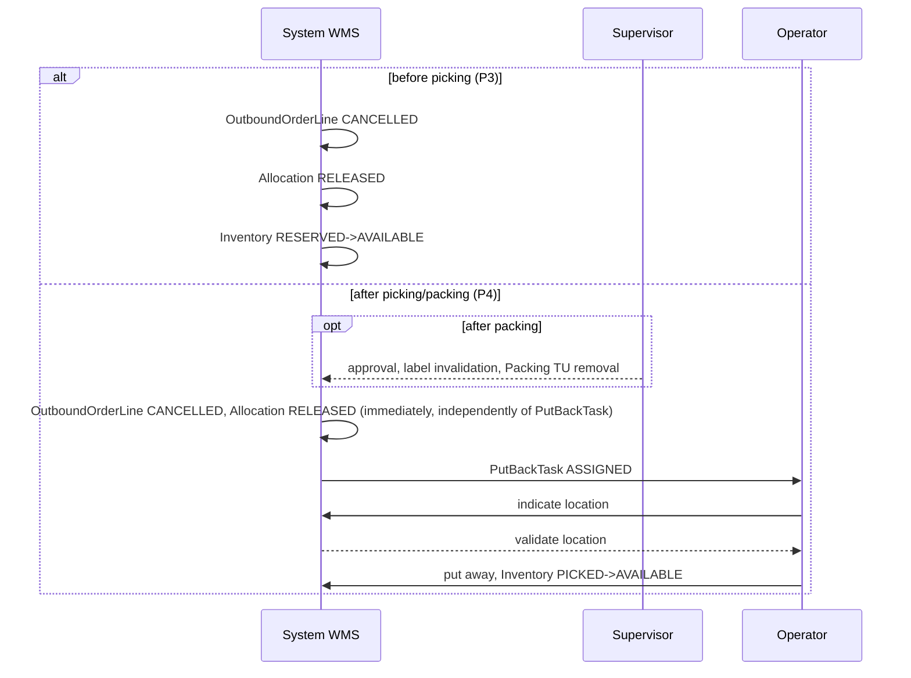

# PROCESS 3: RESERVATION_RELEASE

**Project:** WMSAI Outbound  
**Version:** 1.2 | **Date:** 2026-08-24 | **Author:** Business Analyst  
**Origin:** this document was created by expanding archived `propozycja_procesow_outbound.md` v1.30 §3.3 (Reservation release before physical picking) into the step-by-step format compliant with `SZABLON_PROCESU.md`. The archived document is historical material, not a source of truth — this file is the source of truth (`DEC-A14`).  
**Previous process:** PROCESS 1 (Standard Fulfillment) — cancellation request before physical picking starts, or automatic release according to the reservation-retention policy.  
**Next process:** none — the end event closes the cancellation path without physical work. Physical put-back (PROCESS 4) takes over only the already-picked portion in the exception described below (**STEP 2**, Path B).  
**Document scope:** business-process description of canceling fulfillment when goods were reserved but not picked — without any physical operator work. The catalog of states, transitions and domain events is maintained in `model_stanow_outbound.md` — this document describes behavior and does not define new states.

---

## Process objective

Cancel fulfillment of an `OutboundOrder`/`OutboundOrderLine` when goods were reserved (`Allocation RESERVED`) but physical picking has not yet started — the least expensive cancellation variant, without any warehouse-operator involvement. The process also covers automatic reservation release resulting from warehouse policy (for example expiration of the reservation-retention priority), not only explicit requests.

## Participants

- **System WMS** — verification that physical picking has not occurred, release of `Allocation`, status updates, automatic release according to policy.
- **Warehouse Supervisor** — participates only if required by warehouse policy (for example approval of an external cancellation request); not required for automatic release.

## Start event

Cancellation request for an `OutboundOrder`/`OutboundOrderLine` before physical picking, or automatic release according to the reservation-retention policy.

## Process flow

---

### STEP 1 — Verify that physical picking has not occurred
**[System WMS]**

- System WMS checks whether physical picking has already started for the given `OutboundOrderLine` — meaning whether a pick into a Picking `TU` has been confirmed (scan of `TU` and quantity, PROCESS 1 **STEP 6**).

◇ **Has physical picking already started?**

**Path A — NO (goods only reserved, `Allocation RESERVED`, no pick) → [System WMS]**
- Continue to **STEP 2**.

**Path B — YES, but within the window between physical removal and its confirmation → [System WMS]**
- See **“Exceptions and alternative paths” → “physical removal started before release”**.

**Path C — YES, picking formally confirmed (`OutboundOrderLine PICKING`/`SHORT_PICKED`/`PICKED`/`PACKED`) → [System WMS]**
- This process does not apply — cancellation of this line proceeds to Physical put-back (PROCESS 4).

---

### STEP 2 — Release `Allocation`
**[System WMS]**

- `Allocation RESERVED → RELEASED` (**R1**).
- Stock returns `Inventory RESERVED → AVAILABLE` (**R2**).

---

### STEP 3 — Update `OutboundOrderLine`/`OutboundOrder` statuses
**[System WMS]**

- `OutboundOrderLine` (`CREATED`/`SHORT_ALLOCATED`/`ALLOCATED`) transitions to `CANCELLED` (**R3**).
- The quantity covered by the released `Allocation` returns to `ATPReservation` of the relevant `CustomerOrderLine`.

◇ **What is the reason for cancellation?**

**Path A — shortage (`SHORT_ALLOCATED`, Supervisor decision “wait”/escalation) → [System WMS]**
- The unfulfilled portion transitions `CustomerOrderLine → BACKORDERED` — see PROCESS 1 “Exceptions and alternative paths” (**R4**).

**Path B — general cancellation (unrelated to shortage) → [System WMS]**
- `CustomerOrderLine → CANCELLED` — see PROCESS 1 “Exceptions and alternative paths”, “General cancellation” (**R5**).

---

### STEP 4 — Automatic release according to policy
**[System WMS]**

- When release results from the warehouse’s automatic reservation-retention policy (not from an explicit cancellation request), System WMS performs **STEP 1**–**STEP 3** without involving `Warehouse Supervisor` — notification is not required (**R6**).
- The partial-reservation retention policy is a configurable warehouse parameter with three variants: retain the reservation, release automatically after a specified time, or route the case for a `Warehouse Supervisor` decision (**R9**).
- The partial-reservation retention time does not depend on `priority` or `slaDeadline` of the `CustomerOrder` (**R10**).

---

## End event

No active `Allocation` for the given line; stock is `AVAILABLE` again; no physical operator work of any kind.

---

## Sequence diagram

> diagram shared with `proces_4_physical_putback.md`.

### 6.7 Reservation release and physical put-back

## Data objects

| Object | Key fields | Status(es) |
|---|---|---|
| `Allocation` | reference to `OutboundOrderLine`/`Inventory` | `RESERVED → RELEASED` |
| `Inventory` (Outbound scope) | — | `RESERVED → AVAILABLE` |
| `OutboundOrderLine` | `pickedQty` (remains `0`) | `CREATED`/`SHORT_ALLOCATED`/`ALLOCATED → CANCELLED` |
| `CustomerOrderLine` | `ATPReservation` | recovered quantity; `→ BACKORDERED` (shortage) or `→ CANCELLED` (general cancellation) |
| `PickTask` | — | `ASSIGNED`/`IN_PROGRESS → CANCELLED` — only in the “physical removal started before release” exception |

---

## Exceptions and alternative paths

| Condition | Behavior | Effect |
|---|---|---|
| Physical removal started before release — between confirmation of removal from the location (address and `SKU` scan) and confirmation of placement into the Picking `TU` (`TU` and quantity scan), `Allocation` remains `RESERVED` — the operator may already have physically removed goods from the location before the system recorded it | If `Allocation` is released in this window (`RESERVED → RELEASED`): (1) System WMS cancels the related `PickTask` (`ASSIGNED`/`IN_PROGRESS → CANCELLED`); (2) sends an RF instruction to the operator to return the picked `SKU` to the source location if the `SKU` has already physically reached the Picking `TU` before quantity confirmation | This is **not** a formal `PutBackTask` (PROCESS 4) — goods return exactly to the location from which they were taken, without selecting or validating a new location (**R7**) |
| Part of the `OutboundOrderLine` has already been formally picked (picking confirmed) | This process does not cover the picked part | Cancellation of the picked part proceeds to Physical put-back (PROCESS 4) — see **STEP 1**, Path C (**R8**) |

---

## Business rules

- **R1** — Releasing a reservation before physical picking transitions `Allocation RESERVED → RELEASED`.
- **R2** — Releasing `Allocation` returns the related stock `Inventory RESERVED → AVAILABLE`.
- **R3** — An `OutboundOrderLine` in `CREATED`/`SHORT_ALLOCATED`/`ALLOCATED` transitions to `CANCELLED` when the reservation is released before picking.
- **R4** — When the reason is a shortage (`SHORT_ALLOCATED`), the unfulfilled portion of `CustomerOrderLine` transitions to `BACKORDERED`.
- **R5** — When the reason is general cancellation (unrelated to shortage), `CustomerOrderLine` transitions to `CANCELLED`.
- **R6** — Automatic reservation release according to warehouse policy does not require notifying `Warehouse Supervisor`.
- **R7** — If `Allocation` is released in the window between physical removal from the location and its confirmation in the system, System WMS cancels `PickTask` and instructs the operator to return the goods to the source location — without a formal `PutBackTask`.
- **R8** — This process does not cover lines with formally confirmed picking (`PICKING`/`SHORT_PICKED`/`PICKED`/`PACKED`) — Physical put-back (PROCESS 4) applies to them.
- **R9** — The partial-reservation retention policy is a configurable warehouse parameter with three variants: retain the reservation, release automatically after a specified time, or route the case for a `Warehouse Supervisor` decision.
- **R10** — The partial-reservation retention time does not depend on `priority` or `slaDeadline` of the `CustomerOrder`.

## Relationship to adjacent processes

- **Preceding:** PROCESS 1 (Standard Fulfillment) — cancellation request before physical picking begins, passed in any `OutboundOrderLine` status before `PICKING` (`CREATED`/`SHORT_ALLOCATED`/`ALLOCATED`).
- **Following:** none for the quantity covered by this process (stock returns to `AVAILABLE`, available for any future fulfillment — PROCESS 1 **STEP 1A**/**STEP 4**). Physical put-back (PROCESS 4) takes over only quantity already physically removed in the “physical removal started before release” exception.

## Change history

- **1.2 (2026-08-24)** — Moved the full partial-reservation retention policy into the normative layer; after migration it existed only in the decision register: three configurable variants and retention-time independence from priority and fulfillment deadline. The existing rule that Supervisor notification is not required remains unchanged.
- **No version change (2026-08-22)** — batch 3/5 closing the V3-CD audit: metric-header label “Source” reworded to “Origin” (archived `propozycja_procesow_outbound.md` as historical material, not source of truth, `DEC-A14`). No substantive changes.
- **1.1 (2026-08-22)** — Sequence diagram §6.7 shared with `proces_4_physical_putback.md` moved from `propozycja_procesow_outbound.md` during B16 archival.
- **1.0 (2026-08-18)** — Baseline version. Expanded `propozycja_procesow_outbound.md` v1.30 §3.3 (steps 1–4 and exception) into the step-by-step format compliant with `SZABLON_PROCESU.md`, with local numbering `R1`–`R8`. Completion of `BACKLOG.md` B5 at Darek’s request (P3 receives its own file, unlike the originally narrowed scope limited to P1/P2/P4).
