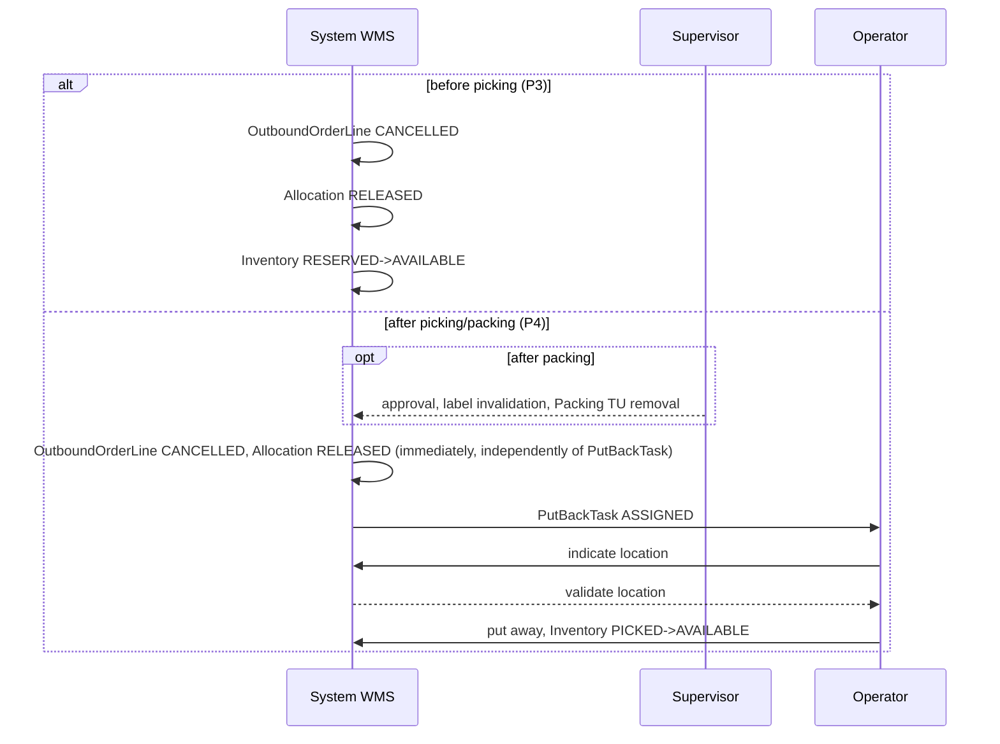

# PROCESS 4: PHYSICAL_PUTBACK

**Project:** WMSAI Outbound  
**Version:** 1.2 | **Date:** 2026-08-23 | **Author:** Business Analyst  
**Origin:** this document was created by expanding archived `propozycja_procesow_outbound.md` v1.29 §3.4 (Physical put-back after picking or packing) and §3.5 (the part concerning P4/cancellation) into the step-by-step format compliant with `SZABLON_PROCESU.md`. The archived document is historical material, not a source of truth — this file is the source of truth (`DEC-A14`).  
**Previous process:** PROCESS 1 (Standard Fulfillment) — cancellation after physical picking into a Picking `TU` or after packing into a Packing `TU`; Outbound Crossdock (PROCESS 2) — cancellation of a cross-dock `OutboundOrderLine` after `PACKED`. Reservation release before picking (PROCESS 3) precedes this process when cancellation occurs **before** physical picking (then PROCESS 4 is not triggered).  
**Next process:** none — this process’s end event closes the cancellation path; goods return to standard stock (`Inventory AVAILABLE`), available for any future fulfillment.  
**Document scope:** business-process description of the physical return of picked or packed goods to available stock after approved cancellation. The catalog of states, transitions and domain events is maintained in `model_stanow_outbound.md` — this document describes behavior and does not define new states.

---

## Process objective

Physically return picked or packed goods to available stock after approved cancellation of a `CustomerOrderLine`/`OutboundOrderLine` — regardless of whether cancellation results from a shortage (`SHORT_ALLOCATED`/`SHORT_PICKED`) or from general cancellation. The process separates the immediate logical effect of cancellation (status changes, reservation return) from its physical completion (the operator actually puts the goods away), which may occur later.

## Participants

- **Warehouse Operator** — enters the returns module on the RF terminal and receives a task (step 3, **R9**); physically puts goods away at the indicated or proposed location (steps 3–4).
- **Warehouse Supervisor** — approves cancellation after packing (step 1, when applicable); this may include label invalidation and removing the Packing `TU` from the `Shipment`.
- **System WMS** — immediate logical-status update (step 2), creates `PutBackTask` (step 3), proposes/validates the target location (step 4), updates `Inventory` after completion (step 5).

## Start event

Approved cancellation of a `CustomerOrderLine`/`OutboundOrderLine` when goods have already been physically picked into a Picking `TU` (`PICKING`/`SHORT_PICKED`/`PICKED`) or packed into a Packing `TU` (`PACKED`) — regardless of whether the reason was `SHORT_ALLOCATED`/`SHORT_PICKED` (PROCESS 1 “Exceptions and alternative paths”), general cancellation (same section), or cancellation of a cross-dock `OutboundOrderLine` after `PACKED` (PROCESS 2 “Exceptions and alternative paths”).

## Process flow

---

### STEP 1 — Approval of cancellation after packing
**[Warehouse Supervisor]**

◇ **Does the cancellation concern an `OutboundOrderLine` already in `PACKED`?**

**Path A — YES → [Warehouse Supervisor]**
- `Warehouse Supervisor` approval is required (**R1**); it may include label invalidation and removing the Packing `TU` from the `Shipment`.
- Allowed only while the related `Shipment` has not entered `POSTING_PENDING` — from that moment this cancellation path is closed; handling is only as a return of goods after dispatch (Return Receipt, outside the scope of this document) (**R2**).
- Continue to **STEP 2**.

**Path B — NO (`PICKING`/`SHORT_PICKED`/`PICKED`, not `PACKED`) → [System WMS]**
- No Supervisor approval requirement — continue directly to **STEP 2**.

---

### STEP 2 — Immediate logical-status update
**[System WMS]**

- Immediately after approval of cancellation of the related `CustomerOrderLine` (which itself transitions to `CANCELLED`): `OutboundOrderLine → CANCELLED`, `Allocation CONFIRMED → RELEASED` (for cross-docking: no `Allocation`, this step is skipped — see `proces_2_outbound_crossdock.md` **R19**), and the quantity covered by that `Allocation` returns to `ATPReservation` of that `CustomerOrderLine` (**R3**).
- These transitions **do not wait** for physical put-away (**R4**) — the logical cancellation effect is immediate; physical completion occurs in **STEP 3**–**STEP 5**.
- If cancellation concerned `PACKED` (**STEP 1**, Path A): after approval, System WMS removes the Packing `TU` from the `Shipment` (when applicable).
- Continue to **STEP 3**.

---

### STEP 3 — Create `PutBackTask`
**[System WMS]**

◇ **Is `pickedQty > 0`?**

**Path A — YES → [System WMS]**
- System WMS creates a separate physical put-back task for the operator for the picked quantity: `PutBackTask CREATED` (**R5**); the task waits for an operator and is assigned according to **R9**.
- Continue to **STEP 4**.

**Path B — NO (`pickedQty = 0`) → [System WMS]**
- There is no physical quantity to return — for this line the process ends at **STEP 2**; no `PutBackTask` is created.

---

### STEP 4 — Indicate and validate target location
**[Warehouse Operator / System WMS]**

- The operator starts put-back: `PutBackTask ASSIGNED → IN_PROGRESS`.
- The target location is proposed by System WMS or indicated by the operator: `PutBackTask IN_PROGRESS → LOCATION_VALIDATION` — and must pass WMS validation (**R6**).

◇ **Did the indicated location pass validation?**

**Path A — YES → [System WMS]**
- Continue to **STEP 5**.

**Path B — NO (location rejected) → [System WMS]**
- `PutBackTask LOCATION_VALIDATION → IN_PROGRESS` — return to location selection; the operator indicates another location or uses the system recommendation.
- 🔁 The `IN_PROGRESS ↔ LOCATION_VALIDATION` loop has **no attempt limit and no automatic escalation** (**R7**); the System WMS recommendation remains continuously available to the operator.

---

### STEP 5 — Physical put-away
**[Warehouse Operator]**

- After the location is validated, the operator physically puts the goods away: `PutBackTask LOCATION_VALIDATION → COMPLETED` (terminal `PutBackTask` state).
- `Inventory PICKED → AVAILABLE` (**R8**) — goods return to standard available stock (`ATP`), on the same basis as any other stock at that location.

---

## End event

Two end events exist for this process, occurring at different times:

- **(a) Immediately after cancellation approval (STEP 2):** `OutboundOrderLine → CANCELLED`, `Allocation → RELEASED`, `ATPReservation` returned.
- **(b) After `PutBackTask` completion (STEP 5):** goods physically at the validated location, `Inventory → AVAILABLE`.

Quantity available from (b) is ordinary `AVAILABLE` stock — it never returns to Inbound statuses (`IN_PUTAWAY`, etc.), regardless of whether it originally came from standard fulfillment or cross-docking.

---

## Sequence diagram

> diagram shared with `proces_3_reservation_release.md`.

### 6.7 Reservation release and physical put-back

## Data objects

| Object | Key fields | Status(es) |
|---|---|---|
| `PutBackTask` | reference to cancelled line | `CREATED → ASSIGNED → IN_PROGRESS → LOCATION_VALIDATION → COMPLETED`; `IN_PROGRESS ↔ LOCATION_VALIDATION` loop without limit |
| `OutboundOrderLine` | `pickedQty` | `PICKING`/`SHORT_PICKED`/`PICKED`/`PACKED → CANCELLED` (immediately, **STEP 2**) |
| `CustomerOrderLine` | `ATPReservation` | `→ CANCELLED`; `ATPReservation` recovered for the full picked quantity |
| `Allocation` | — | `CONFIRMED → RELEASED` (immediately, **STEP 2**); not applicable to cross-docking (`Allocation` does not exist) |
| `Inventory` (Outbound scope) | — | `PICKED → AVAILABLE` (**STEP 5**, after `PutBackTask` completion) |
| Outbound `TU` (`PackUnit`) | `TU_NUMBER` | Removal from `Shipment` when cancellation concerns `PACKED` (**STEP 1**, Path A) — outside the formal `TU` state cycle (operation on the relationship with `Shipment`, not on `TU` status) |

---

## Exceptions and alternative paths

| Condition | Behavior | Effect |
|---|---|---|
| Cancellation of `OutboundOrderLine PACKED` after the related `Shipment` enters `POSTING_PENDING` | **Not allowed** within this process | Only path: return of goods after dispatch (Return Receipt), outside the scope of this document (**R2**) |
| No validated location during put-away (**STEP 4**) | `IN_PROGRESS → LOCATION_VALIDATION → IN_PROGRESS` loop, with no attempt limit or automatic escalation; System WMS recommendation continuously available | Operator continues indicating locations until successful (**R7**) |
| `pickedQty = 0` at cancellation time (**STEP 3**, Path B) | No `PutBackTask` is created — there is nothing to return physically | Process ends with logical-status update (**STEP 2**) |
| General boundary — after `CarrierManifest` closure | Cancellation and put-back are impossible | According to the boundary described in PROCESS 1 “Exceptions and alternative paths” (general cancellation) |

---

## Business rules

- **R1** — Cancelling an `OutboundOrderLine` already in `PACKED` requires `Warehouse Supervisor` approval; it may include label invalidation and removal of the Packing `TU` from the `Shipment`.
- **R2** — Cancellation after packing is allowed only while the related `Shipment` has not entered `POSTING_PENDING`; from that moment the only path is a return of goods after dispatch (Return Receipt), outside the scope of this process.
- **R3** — Approval of cancellation of a `CustomerOrderLine` immediately transitions `OutboundOrderLine → CANCELLED` and `Allocation → RELEASED`, returning the quantity to `ATPReservation` of that `CustomerOrderLine`.
- **R4** — The logical cancellation-status update (**STEP 2**) does not wait for physical put-away — the two effects are separated in time.
- **R5** — When `pickedQty > 0`, System WMS creates a separate `PutBackTask` for the operator for the picked quantity.
- **R6** — The target put-back location is proposed by System WMS or indicated by the operator and must pass WMS validation before put-away.
- **R7** — The `IN_PROGRESS ↔ LOCATION_VALIDATION` loop after location rejection has no attempt limit or automatic escalation; the System WMS recommendation remains continuously available to the operator.
- **R8** — After `PutBackTask` completion (physical put-away), `Inventory` transitions `PICKED → AVAILABLE`, becoming ordinary available stock.
- **R9** — `Warehouse Operator` selects the returns module on the RF terminal. System WMS assigns the next `PutBackTask` in task-arrival order when the operator has no active warehouse task of any type. The module has no zone selection, and `PutBackTask` carries neither `priority` nor `slaDeadline` — the line it concerns is already cancelled.

## Relationship to adjacent processes

- **Preceding:** PROCESS 1 (Standard Fulfillment) — cancellation after picking into a Picking `TU` or after packing into a Packing `TU` (see PROCESS 1 “Exceptions and alternative paths”); Outbound Crossdock (PROCESS 2) — cancellation of a cross-dock `OutboundOrderLine` after `PACKED`. Reservation release before picking (PROCESS 3) handles cancellation **before** physical picking — in that variant PROCESS 4 is not triggered.
- **Following:** none — goods return to `Inventory AVAILABLE`, available for any future fulfillment (PROCESS 1 **STEP 1A**/**STEP 4** or Outbound Crossdock **STEP 1**).

## Change history

- **1.2 (2026-08-23)** — Warehouse-task take-up rules (`BACKLOG.md` B10): new **R9** — operator selects the returns module on the RF terminal, System WMS assigns the next `PutBackTask` in task-arrival order, without zone selection. Updated “Participants” section and **STEP 3**. Full rationale in `decyzje_outbound_wms.md` `DEC-L45`.
- **No version change (2026-08-22)** — batch 3/5 closing the V3-CD audit: metric-header label “Source” reworded to “Origin” (archived `propozycja_procesow_outbound.md` as historical material, not source of truth, `DEC-A14`). No substantive changes.
- **1.1 (2026-08-22)** — Sequence diagram §6.7 shared with `proces_3_reservation_release.md` moved from `propozycja_procesow_outbound.md` during B16 archival.
- **1.0 (2026-08-18)** — Baseline version. Expanded `propozycja_procesow_outbound.md` v1.29 §3.4 (steps 1–5) and the P4/cancellation part of §3.5 into the step-by-step format compliant with `SZABLON_PROCESU.md`, with local numbering `R1`–`R8`. Implementation of `BACKLOG.md` B5.
