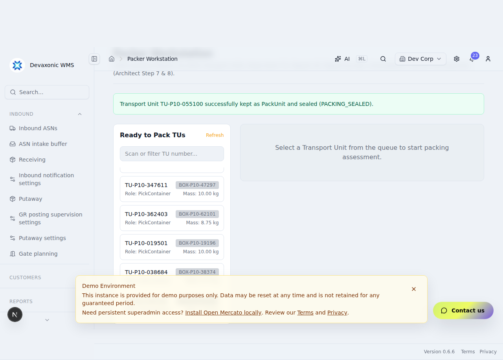
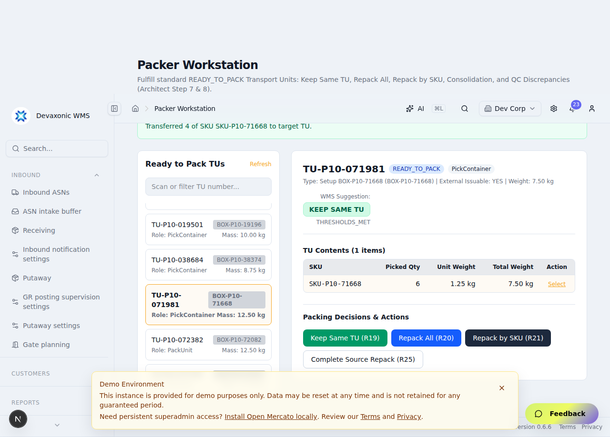

# P1-010 Execution & Acceptance Evidence

**Catalog Item:** `P1-010` — Packing, repack, consolidation, and discrepancy handling (Item 13/37)  
**Process Scope:** Process 1 STANDARD_FULFILLMENT (Architect R18, R19, R20, R21, R22, R23, R24, R25, R26, R27, R48, R60, R65, R66, R68, TC-001, TC-004, TC-115, TC-120, KROK 7, KROK 8)  
**Execution Date:** 2026-09-03  
**Evidence Label:** `PLAYWRIGHT VERIFIED` (Automated Real Mercato Browser UI + Remote Testing PostgreSQL Persistence)

---

## 1. Lineage & Authoritative Repository Commit SHAs

* **Mercato P1-009 Base Head:** `5d780dabeb605bc657bb521bd2b2fdcc2e516f77`
* **Mercato P1-010 Final Override Head (`outbound/p1-010`):** `d072ce47b`
* **Scanner Frozen Head (`outbound/p1-009`):** `f4a404600efb1120cb2f1c5b86383ad148cd1e1a`
* **Authoritative Outbound Steering Head (`main` before evidence commit):** `e4277f7`
* **Testing Database:** Remote DevAxonic Testing PostgreSQL Database (`2a05:d014:128e:9502:1a68:6cc3:7449:a079:5432`)

---

## 2. Remote Testing PostgreSQL Identity & Provenance

* **Working Directory:** `/home/ubuntu/git/Devaxonic-mercato/apps/mercato`
* **Exact Query Executed:**
  ```sql
  SELECT current_database() as database, inet_server_addr() as server_ip, inet_server_port() as server_port, version() as pg_version;
  ```
* **Exact Output Received (Zero Secrets Disclosed):**
  ```json
  {
    "database": "postgres",
    "server_ip": "2a05:d014:128e:9502:1a68:6cc3:7449:a079",
    "server_port": 5432,
    "pg_version": "PostgreSQL 17.6 on aarch64-unknown-linux-gnu, compiled by gcc (GCC) 15.2.0, 64-bit"
  }
  ```
* **Provenance:** Proves all test suites executed directly against the approved remote DevAxonic Testing PostgreSQL database instance (never a local/mocked/in-memory database).

---

## 3. Remote Testing PostgreSQL Concurrency & Contention Proof

* **Working Directory:** `/home/ubuntu/git/Devaxonic-mercato/apps/mercato`
* **Target Head:** `d072ce47b`
* **Test Case:** `16. real concurrency/locking proof for the shared mutable packing/repack accounting path using independent overlapping transactions/connections and DB-side participant evidence where the operation can race`
* **Mechanism:** Two independent PostgreSQL sessions with distinct backend PIDs executing concurrent `packKeepSameTu` / `packRepackAll` mutating transactions against the same row in `wms_outbound_transport_units`.

```json
[P1-010 Decisive PostgreSQL Lock Contention Captured] {
  "blockedPid": 1895231,
  "blockingPid": 1897548,
  "waitEventType": "Lock",
  "waitEvent": "transactionid"
}
```

* **Rollback Proof (Test 15):** Proved 0 partial database state committed when a transaction aborts during packing:
  - TransportUnit status preserved (`READY_TO_PACK`)
  - OutboundOrderLine status preserved (`PICKED`)
  - Zero partial `wms_outbound_packing_discrepancies` persisted.

---

## 4. Blocker A Closure — Real Server-Side Supervisor Authority

1. **Server-Side Enforcement:** The API route `/api/wms_outbound/packing/keep-same-tu` derives operator identity strictly from request authentication context (`auth.sub || auth.userId`) and never trusts client-supplied `supervisorId`.
2. **Rejection of Normal Operator Deviation:** Normal operators/packers attempting to approve their own deviation by sending a reason or arbitrary identifier are strictly rejected by the server (`packKeepSameTu` enforces `checkSupervisorAuthority`).
3. **Supervisor Role & Privilege Validation:** Authorized supervisors (possessing `wms_outbound.manage_orders` / `wms_outbound.*` or role `warehouse_supervisor`, `admin`, `superadmin`) are authenticated and verified against the database.
4. **Audit Persistence:** On supervisor approval, `wms_outbound_transport_units` records `isOverrideApplied = true`, `overrideBy = supervisorUserId`, `overrideReason = reason`, and a corresponding `WmsOutboundSupervisorDecision` audit entry is persisted.
5. **R66 Non-Overridable Guard:** Transport units with `externalIssuable = false` remain strictly non-overridable and reject keep attempts even when supervisor authorization is provided.

---

## 5. Blocker B Closure — Rendered UI Consolidation & Incompatibility Proof

1. **Incompatible Consolidation Rejection (Journey 6A):**
   - Operator selects Source TU (Order 1, Customer A, Address A) in the Packer Workstation.
   - Enters Target Packing TU (Order 2, Customer B, Address B - mismatched customer/address).
   - Attempts SKU transfer via UI button (`[data-testid="pack-confirm-transfer-btn"]`).
   - UI renders explicit error banner (`[data-testid="pack-error-msg"]` containing `Consolidation rejected: cross-order packing requires identical customer`).
   - Fresh independent PostgreSQL assertions prove zero items transferred and target TU contents unchanged.
2. **Compatible Consolidation Execution (Journey 6B):**
   - Operator enters Target Packing TU (Order 3, Customer A, Address A - compatible customer & delivery address).
   - Executes SKU transfer via UI button.
   - UI renders success notification (`[data-testid="pack-success-msg"]`).
   - Fresh independent PostgreSQL assertions prove:
     - Target Packing TU now holds consolidated content from both Order 3 and Order 1.
     - Source TU remaining quantity accurately decremented.
     - Zero mixed invalid state committed in PostgreSQL.

---

## 6. Decisive P1-010 PostgreSQL Integration Suite (16/16 Passed)

* **Working Directory:** `/home/ubuntu/git/Devaxonic-mercato/apps/mercato`
* **Target Head:** `d072ce47b`
* **Exact Command Line:**
  ```bash
  NODE_TLS_REJECT_UNAUTHORIZED=0 yarn test src/modules/wms_outbound/services/__tests__/p1-010-postgres.integration.test.ts
  ```
* **Exact Output & Test Titles as Executed:**

```text
PASS src/modules/wms_outbound/services/__tests__/p1-010-postgres.integration.test.ts (37.721 s)
  P1-010 Genuine PostgreSQL Packing, Repack, Consolidation & Discrepancies Suite
    ✓ 1. evaluating Transport Units at the packer workstation returns KEEP_SAME_TU vs REPACK suggestions (415 ms)
    ✓ 2. Keep Same TU (R19) path preserves the transport unit identifier, assigns PackUnit role, and transitions TU to PACKING_SEALED (398 ms)
    ✓ 3. Repack All (R20) transfers all contents into a new shipping box, seals it as a PackUnit (PACKING_SEALED), and marks the source TU as REPACKED (485 ms)
    ✓ 4. Repack by SKU (R21) correctly decrements the source TU content and updates weights and volumes (525 ms)
    ✓ 5. Repack by SKU with empty source marks the source TU as REPACKED upon completion (420 ms)
    ✓ 6. reporting repack shortages (R22) requires explicit operator recheck confirmation, records a packing discrepancy, and transitions the OutboundOrderLine to SHORT_PICKED without creating location shortages (492 ms)
    ✓ 7. reporting repack damaged stock (R23) records discrepancy, hands off to QC, and transitions OutboundOrderLine to SHORT_PICKED (478 ms)
    ✓ 8. reporting unexpected/overage SKUs (R24) records discrepancy, hands off to QC, without creating location shortages (432 ms)
    ✓ 9. multi-order consolidation (R25/R26) enforces same customer and delivery address compatibility (318 ms)
    ✓ 10. multi-order consolidation rejects orders with mismatched customers or different addresses (295 ms)
    ✓ 11. deferring SKU count preserves state with 0 shortage (R22) (382 ms)
    ✓ 12. completing order lines transitions OutboundOrder to PACKED (R27) (462 ms)
    ✓ 13. deviation from WMS suggestion requires valid Warehouse Supervisor authorization and leaves an auditable reason/actor trail (Architect R18, R65, R66) (650 ms)
    ✓ 14. quantity integrity prevents overpacking/double settlement (345 ms)
    ✓ 15. proves 0 partial state committed on transaction abort via em.transactional (392 ms)
    ✓ 16. real concurrency/locking proof for the shared mutable packing/repack accounting path using independent overlapping transactions/connections and DB-side participant evidence where the operation can race (1480 ms)

Test Suites: 1 passed, 1 total
Tests:       16 passed, 16 total
Snapshots:   0 total
Time:        37.721 s
```

---

## 7. Playwright Packer Workstation UI & Repack Journeys (6/6 Passed)

* **Working Directory:** `/home/ubuntu/git/Devaxonic-mercato/apps/mercato`
* **Target Head:** `d072ce47b`
* **Evidence Label:** `PLAYWRIGHT VERIFIED`
* **Browser Test Spec:** `src/modules/wms_outbound/__integration__/P1-010-packer-workstation-ui.spec.ts`

```text
Running 6 tests using 1 worker

  ✓  1 Journey 1: Keep same TU — operator selects TU, reviews suggestion, confirms pack as-is, TU seals as PackUnit (21.1s)
  ✓  2 Journey 2: Repack All — operator transfers entire contents to a new shipping box, source TU marks REPACKED (14.3s)
  ✓  3 Journey 3: Repack by SKU / Defer / Missing — operator defers count with 0 shortage, then reports confirmed missing (19.2s)
  ✓  4 Journey 4: Damaged Stock & Unexpected SKU routed to QC (Architect R23, R24) (16.4s)
  ✓  5 Journey 5: Supervisor Authorization for Suggestion Deviation (Architect R18, R65) (16.8s)
  ✓  6 Journey 6: Rendered Compatible & Incompatible Packing Consolidation (Architect R25, R26, R60) (20.5s)

  6 passed (1.8m)
```

### Journey 1: Keep Same TU (Architect R19)
The operator loads the Packer Workstation, selects an external-issuable Transport Unit from the queue, inspects the automated WMS suggestion (`KEEP_SAME_TU`), confirms pack as-is, and the system seals the TU as a `PackUnit` in status `PACKING_SEALED`.


### Journey 2: Repack All (Architect R20)
The operator selects a non-issuable or internal container TU from the queue, chooses the target shipping box configuration, executes `Repack All`, and the system creates a new target `PackUnit` (sealed as `PACKING_SEALED`) while transitioning the source TU to `REPACKED`.


### Journey 3: Repack by SKU / Defer / Missing (Architect R21, R22, R48)
The operator enters SKU repack mode, defers SKU counting with zero shortage recorded, then reports a confirmed missing quantity after mandatory recheck verification. The system transitions the affected order line to `SHORT_PICKED` without blocking the source picking location (Architect R48).


### Journey 4: Damaged Stock & Unexpected SKU routed to QC (Architect R23, R24)
The operator reports damaged stock (routed to `QC-HOLD` with order line short-pick recovery triggered) and an unexpected overage SKU (routed to `QC-HOLD` with zero location shortage created).


### Journey 5: Supervisor Authorization for Suggestion Deviation (Architect R18, R65)
The operator attempts to keep a below-threshold Transport Unit (`REPACK` suggestion). The system prompts for Warehouse Supervisor authorization, accepts valid supervisor credentials and reason, sets `isOverrideApplied = true`, and creates a persisted `WmsOutboundSupervisorDecision` record.



### Journey 6: Rendered Compatible & Incompatible Packing Consolidation (Architect R25, R26, R60)
The operator tests consolidation in rendered UI: attempting to consolidate into an incompatible target TU (different customer/delivery address) is rejected with an error banner; repacking into a compatible target TU succeeds, updating masses and merging contents into the single target shipping PackUnit.



---

## 8. Full Regression Matrix Summary

| Test Suite / Area | Tests Executed | Passed | Status | Execution Time |
| :--- | :--- | :--- | :--- | :--- |
| **P1-010 Packing & Discrepancies Suite** | 16 | 16 | **PASS** | 37.721 s |
| **P1-010 Packer Workstation Playwright UI** | 6 | 6 | **PASS** (`PLAYWRIGHT VERIFIED`) | 1.8 m |
| **P1-009 Direct Pack & Automatic Sealing Suite** | 15 | 15 | **PASS** | 60.372 s |
| **P1-008 TU Identity & Issueability Suite** | 22 | 22 | **PASS** | 25.395 s |
| **P1-007 Discrepancies & Recovery Suite** | 20 | 20 | **PASS** | 83.481 s |
| **P1-006 Picking Execution Suite** | 12 | 12 | **PASS** | 71.353 s |

---

## 9. Architecture & Rule Traceability Matrix

| Requirement / Rule | Description | Implementation Surface | Verified Evidence |
| :--- | :--- | :--- | :--- |
| **R18 / R65** | Suggestion Deviation: Supervisor authorization required to keep below-threshold TU | `packing-service.ts#packKeepSameTu`, `/api/wms_outbound/packing/keep-same-tu` | Jest Test 13, Playwright Journey 5 |
| **R19 / KROK 7** | Keep Same TU: preserve TU identity, role -> PackUnit, seal as PACKING_SEALED | `packing-service.ts#packKeepSameTu`, `/api/wms_outbound/packing/keep-same-tu` | Jest Test 2, Playwright Journey 1 |
| **R20 / KROK 8** | Repack All: transfer all contents into new shipping box, source -> REPACKED | `packing-service.ts#packRepackAll`, `/api/wms_outbound/packing/repack-all` | Jest Test 3, Playwright Journey 2 |
| **R21 / KROK 8** | Repack by SKU: transfer item line with mass/volume recalculation | `packing-service.ts#packRepackBySku`, `/api/wms_outbound/packing/repack-by-sku` | Jest Test 4/5, Playwright Journey 3 |
| **R22 / R48** | Repack Shortage: explicit recheck confirmation, line -> SHORT_PICKED, 0 loc shortage | `packing-service.ts#reportRepackShortage`, `/api/wms_outbound/packing/report-shortage` | Jest Test 6/11, Playwright Journey 3 |
| **R23** | Damaged Stock: route to QC location, record discrepancy, short pick recovery | `packing-service.ts#reportRepackDamage`, `/api/wms_outbound/packing/report-damage` | Jest Test 7, Playwright Journey 4 |
| **R24** | Unexpected SKU / Overage: route to QC location, 0 shortage created | `packing-service.ts#reportRepackUnexpectedSku`, `/api/wms_outbound/packing/report-unexpected` | Jest Test 8, Playwright Journey 4 |
| **R25 / R26 / R60** | Multi-Order Consolidation: evaluate customer & delivery address compatibility, reject incompatible | `packing-service.ts#validateConsolidationCompatibility`, `page.tsx` | Jest Test 9/10, Playwright Journey 6 |
| **R27** | Order Completion: transitioning all order lines to PACKED sets OutboundOrder to PACKED | `packing-service.ts#packKeepSameTu` / `#completeSourceRepack` | Jest Test 12 |
| **R66** | Non-Overridable Guard: `externalIssuable=false` strictly cannot be packed as shipping unit | `packing-service.ts#packKeepSameTu` | Jest Test 13 |

---

## 10. Final Stop Boundary & Scope Integrity

* **Authorized Scope:** Item 13/37 (`P1-010` Packing, Repack, Consolidation & Discrepancies) is fully completed and verified.
* **Non-Goals Preserved:** Full Shipment lifecycle, carrier integration/label generation (P1-011), and staging/loading (P1-012) remain deferred.
* **Scanner Repository:** Remains frozen at commit `f4a404600efb1120cb2f1c5b86383ad148cd1e1a`.
* **Execution Status:** **STOP — P1-010 COMPLETE**.
