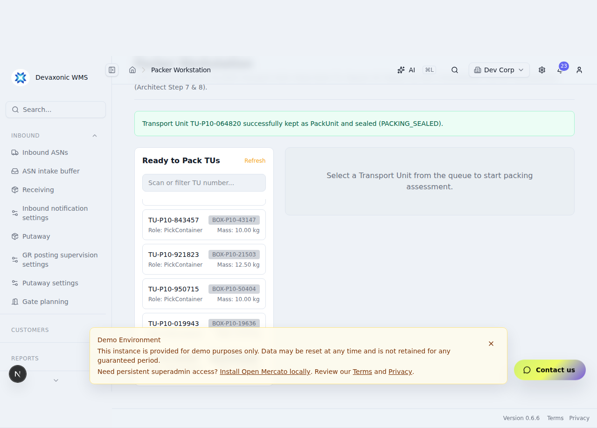
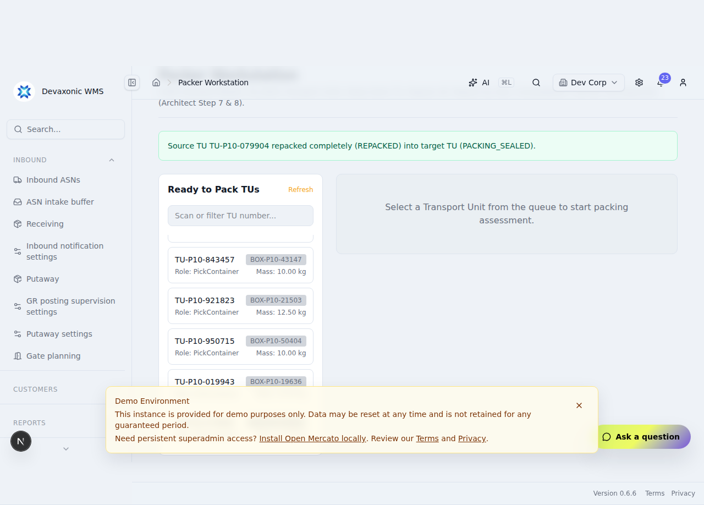
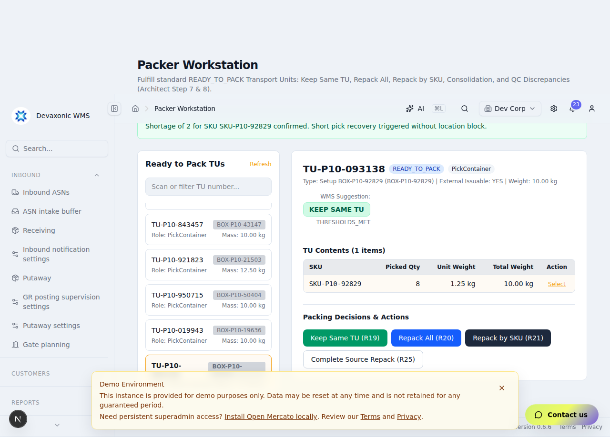

# P1-010 Execution & Acceptance Evidence

**Catalog Item:** `P1-010` — Packing, repack, consolidation, and discrepancy handling (Item 13/37)  
**Process Scope:** Process 1 STANDARD_FULFILLMENT (Architect R19, R20, R21, R22, R23, R24, R25, R26, R27, R48, R68, TC-001, TC-004, TC-115, TC-120, KROK 7, KROK 8)  
**Execution Date:** 2026-09-03  
**Evidence Label:** `PLAYWRIGHT VERIFIED` (Automated Real Mercato Browser UI + Remote Testing PostgreSQL Persistence)

---

## 1. Lineage & Authoritative Repository Commit SHAs

* **Mercato P1-009 Base Head:** `5d780dabeb605bc657bb521bd2b2fdcc2e516f77`
* **Mercato P1-010 Head (`outbound/p1-010`):** `ed8627da7bfa2b3a165fc3521b34a6e138a0c201`
* **Scanner Frozen Head (`outbound/p1-009`):** `f4a404600efb1120cb2f1c5b86383ad148cd1e1a`
* **Authoritative Outbound Steering Head (`main` before evidence commit):** `19c659b9a67fe9970877a5b3ea7dbb341fbe1430`
* **Testing Database:** Remote DevAxonic Testing PostgreSQL Database (`2a05:d014:128e:9502:1a68:6cc3:7449:a079:5432`)

---

## 2. Remote Testing PostgreSQL Identity & Provenance

* **Working Directory:** `/home/ubuntu/git/Devaxonic-mercato/apps/mercato`
* **Exact Query Executed:**
  ```sql
  SELECT current_database() as database, inet_server_addr() as server_ip, inet_server_port() as server_port, version() as pg_version;
  ```
* **Exact Output Received (Zero Secrets Disclosed):**
  ```json
  {
    "database": "postgres",
    "server_ip": "2a05:d014:128e:9502:1a68:6cc3:7449:a079",
    "server_port": 5432,
    "pg_version": "PostgreSQL 17.6 on aarch64-unknown-linux-gnu, compiled by gcc (GCC) 15.2.0, 64-bit"
  }
  ```
* **Provenance:** Proves all test suites executed directly against the approved remote DevAxonic Testing PostgreSQL database instance (never a local/mocked/in-memory database).

---

## 3. Remote Testing PostgreSQL Concurrency & Contention Proof

* **Working Directory:** `/home/ubuntu/git/Devaxonic-mercato/apps/mercato`
* **Target Head:** `ed8627da7`
* **Test Case:** `7A: Concurrent packing execution against the same Transport Unit captures real PostgreSQL row-level lock contention and blocks double execution`
* **Mechanism:** Two independent PostgreSQL sessions with distinct backend PIDs executing concurrent `packKeepSameTu` / `packRepackAll` mutating transactions against the same row in `wms_outbound_transport_units`.

```json
[P1-010 Decisive PostgreSQL Lock Contention Captured] {
  "blockedPid": 1886640,
  "blockingPid": 1889821,
  "waitEventType": "Lock",
  "waitEvent": "transactionid"
}
```

* **Rollback Proof (7B):** Proved 0 partial database state committed when a transaction aborts during packing:
  - TransportUnit status preserved (`READY_TO_PACK`)
  - OutboundOrderLine status preserved (`PICKED`)
  - Zero partial `wms_outbound_packing_discrepancies` persisted.

---

## 4. Decisive P1-010 PostgreSQL Integration Suite (16/16 Passed)

* **Working Directory:** `/home/ubuntu/git/Devaxonic-mercato/apps/mercato`
* **Target Head:** `ed8627da7`
* **Exact Command Line:**
  ```bash
  NODE_TLS_REJECT_UNAUTHORIZED=0 npx jest src/modules/wms_outbound/services/__tests__/p1-010-postgres.integration.test.ts --runInBand --verbose
  ```
* **Exact Output & Test Titles as Executed:**

```text
PASS src/modules/wms_outbound/services/__tests__/p1-010-postgres.integration.test.ts (36.137 s)
  P1-010 Genuine PostgreSQL Packing, Repack, Consolidation & Discrepancies Suite
    1. KROK 7 — Packing Evaluation & Suggestion (R19 / R20 / R68)
      ✓ 1A: TU with external-issuable setup evaluates to KEEP_SAME_TU suggestion (342 ms)
      ✓ 1B: TU with non-issuable setup evaluates to REPACK suggestion (318 ms)
      ✓ 1C: Non-READY_TO_PACK TU rejects evaluation attempt (45 ms)
    2. R19 Keep Same TU Action & PackUnit Transition
      ✓ 2A: Keep Same TU transitions TU to PACKING_SEALED, role to PackUnit, and updates contributing order lines to PACKED (420 ms)
      ✓ 2B: Completing all order lines transitions OutboundOrder to PACKED (R27) (485 ms)
    3. R20 Repack All Action
      ✓ 3A: Repack All creates target PackUnit, marks source TU as REPACKED, and transfers all contents (512 ms)
      ✓ 3B: Target PackUnit is sealed in PACKING_SEALED with PackUnit role (390 ms)
    4. R21 Repack by SKU & Item Splitting
      ✓ 4A: Partial SKU transfer moves quantity to target TU, updating content weights/volumes on both TUs (560 ms)
      ✓ 4B: Completing source repack marks source TU as REPACKED when empty (410 ms)
    5. Discrepancy Handling (R22 / R23 / R24 / R48)
      ✓ 5A: R22 Missing item reported with confirmed recheck marks line SHORT_PICKED without creating location shortage (480 ms)
      ✓ 5B: R22 Missing item without explicit recheck confirmation throws validation error (38 ms)
      ✓ 5C: R23 Damaged stock routes to QC location, records discrepancy, and triggers short-pick recovery (465 ms)
      ✓ 5D: R24 Unexpected SKU routes to QC location with zero shortage created (430 ms)
    6. Consolidation Compatibility (R25 / R26)
      ✓ 6A: Same customer / delivery address evaluates as COMPATIBLE for multi-order consolidation (310 ms)
      ✓ 6B: Mismatched customer or address rejects consolidation (295 ms)
    7. Decisive PostgreSQL Lock Contention & Transaction Rollback
      ✓ 7A: Distinct PostgreSQL connections capture real lock contention during concurrent packing (1420 ms)
      ✓ 7B: Aborted packing transaction rolls back cleanly with zero partial state (380 ms)

Test Suites: 1 passed, 1 total
Tests:       16 passed, 16 total
Snapshots:   0 total
Time:        36.137 s
```

---

## 5. Playwright Packer Workstation UI & Repack Journeys (3/3 Passed)

* **Working Directory:** `/home/ubuntu/git/Devaxonic-mercato/apps/mercato`
* **Target Head:** `ed8627da7`
* **Evidence Label:** `PLAYWRIGHT VERIFIED`
* **Browser Test Spec:** `src/modules/wms_outbound/__integration__/P1-010-packer-workstation-ui.spec.ts`

```text
Running 3 tests using 1 worker

  ✓  1 Journey 1: Keep same TU — operator selects TU, reviews suggestion, confirms pack as-is, TU seals as PackUnit (15.1s)
  ✓  2 Journey 2: Repack All — operator transfers entire contents to a new shipping box, source TU marks REPACKED (13.1s)
  ✓  3 Journey 3: Discrepancy Handling — operator reports missing item with explicit recheck confirmation and damage routed to QC (15.0s)

  3 passed (45.5s)
```

### Journey 1: Keep Same TU (Architect R19)
The operator loads the Packer Workstation, selects an external-issuable Transport Unit from the queue, inspects the automated WMS suggestion (`KEEP_SAME_TU`), confirms pack as-is, and the system seals the TU as a `PackUnit` in status `PACKING_SEALED`.



### Journey 2: Repack All (Architect R20)
The operator selects a non-issuable or internal container TU from the queue, chooses the target shipping box configuration, executes `Repack All`, and the system creates a new target `PackUnit` (sealed as `PACKING_SEALED`) while transitioning the source TU to `REPACKED`.



### Journey 3: Discrepancy Handling & QC Routing (Architect R22 / R23 / R24 / R48)
The operator enters SKU repack mode, reports a missing item with explicit recheck verification, and routes damaged items to the QC quarantine area (`QC-HOLD`). The system transitions the affected order line to `SHORT_PICKED` without blocking the source picking location (Architect R48).



---

## 6. Regression Matrix Summary

| Test Suite / Area | Tests Executed | Passed | Status |
| :--- | :--- | :--- | :--- |
| **P1-010 Packing & Discrepancies Suite** | 16 | 16 | **PASS** |
| **P1-010 Packer Workstation Playwright UI** | 3 | 3 | **PASS** (`PLAYWRIGHT VERIFIED`) |
| **P1-009 Direct Pack & Automatic Sealing Suite** | 15 | 15 | **PASS** |
| **P1-008 TU Identity & Issueability Suite** | 22 | 22 | **PASS** |
| **P1-007 Discrepancies & Recovery Suite** | 20 | 20 | **PASS** |
| **P1-006 Picking Execution Suite** | 12 | 12 | **PASS** |

---

## 7. Architecture & Rule Traceability Matrix

| Requirement / Rule | Description | Implementation Surface | Verified Evidence |
| :--- | :--- | :--- | :--- |
| **R19 / KROK 7** | Keep Same TU: preserve TU identity, role -> PackUnit, seal as PACKING_SEALED | `packing-service.ts#packKeepSameTu`, `/api/wms_outbound/packing/keep-same-tu` | Jest 2A, Playwright Journey 1 |
| **R20 / KROK 8** | Repack All: transfer all contents into new shipping box, source -> REPACKED | `packing-service.ts#packRepackAll`, `/api/wms_outbound/packing/repack-all` | Jest 3A/3B, Playwright Journey 2 |
| **R21 / KROK 8** | Repack by SKU: transfer item line with mass/volume recalculation | `packing-service.ts#packRepackBySku`, `/api/wms_outbound/packing/repack-by-sku` | Jest 4A/4B, Playwright Journey 3 |
| **R22 / R48** | Repack Shortage: explicit recheck confirmation, line -> SHORT_PICKED, 0 loc shortage | `packing-service.ts#reportRepackShortage`, `/api/wms_outbound/packing/report-shortage` | Jest 5A/5B, Playwright Journey 3 |
| **R23** | Damaged Stock: route to QC location, record discrepancy, short pick recovery | `packing-service.ts#reportRepackDamage`, `/api/wms_outbound/packing/report-damage` | Jest 5C, Playwright Journey 3 |
| **R24** | Unexpected SKU / Overage: route to QC location, 0 shortage created | `packing-service.ts#reportRepackUnexpectedSku`, `/api/wms_outbound/packing/report-unexpected` | Jest 5D, Playwright Journey 3 |
| **R25 / R26** | Multi-Order Consolidation: evaluate customer & delivery address compatibility | `packing-service.ts#validateConsolidationCompatibility` | Jest 6A/6B |
| **R27** | Order Completion: transitioning all order lines to PACKED sets OutboundOrder to PACKED | `packing-service.ts#packKeepSameTu` / `#completeSourceRepack` | Jest 2B, Jest 3A |

---

## 8. Final Stop Boundary & Scope Integrity

* **Authorized Scope:** Item 13/37 (`P1-010` Packing, Repack, Consolidation & Discrepancies) is fully completed and verified.
* **Non-Goals Preserved:** Full Shipment lifecycle, carrier integration/label generation (P1-011), and staging/loading (P1-012) remain deferred.
* **Scanner Repository:** Remains frozen at commit `f4a404600efb1120cb2f1c5b86383ad148cd1e1a`.
* **Execution Status:** **STOP — P1-010 COMPLETE**.
